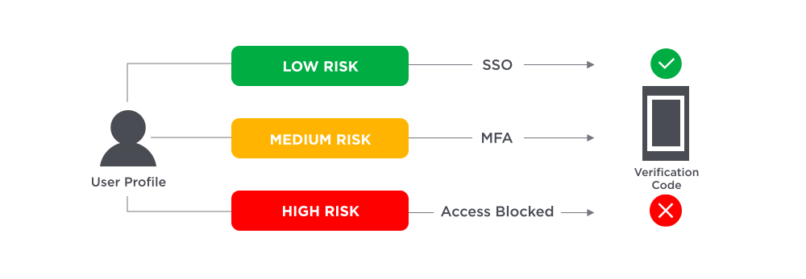

# 安全理念和方法论

[TOC]

## 概述

什么是安全？没有绝对的安全，那我们为什么要做安全？有句话说的很好：

> 业内曾说，安全的本质上是信任问题，你总得信任点什么。而 Google 用自己的做法告诉大家，它可以不信任到什么程度。

## 纵深防御

什么是纵深防御？纵深防御是指使用多种产品和实践来保护网络的网络安全策略。

> “纵深防御” (DiD) 是一种网络安全策略，它使用多种安全产品和实践来保护组织的网络、Web 资产和资源。它有时与“分层安全”一词互换使用，因为它依赖于多个控制层（物理、技术和管理）的安全解决方案，来防止攻击者访问受保护的网络或本地资源。

为什么要采用纵深防御策略？

纵深防御策略的指导原则是，单一安全产品无法完全保护网络免受可能面临的每一次攻击：

> 实施多种安全产品和实践可以帮助检测和预防出现的攻击，使组织能够有效地缓解各种威胁。

安全冗余：

> 如果外部攻击者破坏了一道防线或内部威胁危及组织网络的一部分，则其他安全措施可以帮助限制和减轻对整个网络的损害。相比之下，仅使用一种安全产品会产生单点故障；如果它受到损害，整个网络或系统可能因此遭到破坏或损坏。

## 多因子认证

首先，需要明确，这是一种认证技术，也就是让系统知道：“你是谁”。

MFA 是一种系统对用户身份进行认证的方法论，要求用户提供两个及其以上的安全因子进行认证：

> MFA is an electronic authentication method in which a user is granted access to a website or application only after successfully presenting two or more pieces of evidence (or factors) to an authentication mechanism.

### 安全因子

为什么要多因子？由于破解多个认证因子比单独破解密码需要花费更多的精力，并且破解其他类型的因子比窃取或伪造密码更难，因此与单因子认证相比，MFA 可以更好地保护组织免受未经授权的访问。

> 一个因子再怎么加强安全性，也没有两个因子更为安全。

> Authentication methods that depend on more than one factor are more difficult to compromise than single-factor methods.

我们对一个安全因子有以下要求；

- 一个因子应该是安全的，否则它无法成 MFA 中的因子。在很多地方，MFA 中的因子又称为 `安全因子`。
- 一个因子应该是孤立的，两两因子之间毫无关系，无法相互推到。

从安全因子类型上来区分，目前主要有以下类型：

类型 | 中文名 | 含义 | 示例
-|-|-|-
Knowledge | 知识因子 | 仅用户知道的东西 | 例如：账号密码，PIN 码等。
Possession | 占有因子 | 仅用户拥有的东西 | 通常是物理媒介，例如：usbkey、银行卡、钥匙、加密机等。
Inherent | 固有因子 | 仅用户固有的特征 | 通常是生物特征，例如：指纹、虹膜、语音。
Location | 位置因子 | 仅用户位置的特征 | 通常是地理位置信息，或是网络信息，例如：IP 地址范围、用户常登录地点。

### 基于风险的身份验证

MFA 的一个子集是基于风险的身份验证，这种验证方式，本质上是通过一些验证因子，判断风险性，若风险过高，则使用 MFA，否则使用更加简单的认证方式。

对于风险级别的判断，可以考虑以下问题：

- 用户来自哪里？
- 用户使用什么设备，和昨天一样么？
- 通过私有网络还是公共网络？
- 用户访问的时间是否和以前大致相同？例如用户通常上班时间访问，而不会在深夜访问。

## 附录：参考文献

1. [什么是纵深防御？](https://www.cloudflare.com/zh-cn/learning/security/glossary/what-is-defense-in-depth/)
1. [Multi-Factor Authentication (MFA)](https://auth0.com/docs/secure/multi-factor-authentication)
1. [Multi-factor authentication](https://en.wikipedia.org/wiki/Multi-factor_authentication)
1. [什么是多因子认证](https://www.ibm.com/cn-zh/topics/multi-factor-authentication)
1. [Software token](https://en.wikipedia.org/wiki/Software_token)
1. [Multi-Factor Authentication (MFA) Solution Requirements](https://www.onelogin.com/learn/mfa-checklist)
1. [What is Multi-Factor Authentication (MFA)?](https://www.onelogin.com/learn/what-is-mfa)
1. [网络安全分层与分域控制理论初探](https://searchsecurity.techtarget.com.cn/11-18783/)
1. [人社个人信息怎么保护？赶紧来学习！](http://rsj.gz.gov.cn/ywzt/shbz/gzdt/content/post_2409800.html)
1. [从 Google 白皮书看企业安全最佳实践](https://tech.meituan.com/2017/04/07/google-security-ayazero.html)
1. [Google 基础设施安全设计概述翻译和导读](https://security.tencent.com/index.php/blog/msg/114)
