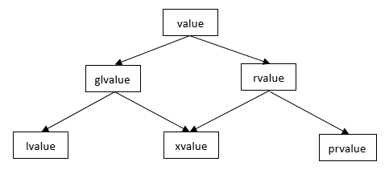

# Talk C++

<!-- TOC -->

- [Talk C++](#talk-c)
    - [Overview](#overview)
    - [Language Usability Enhancements](#language-usability-enhancements)
        - [Variable Length Array](#variable-length-array)
        - [Constexpr](#constexpr)
        - [If/Switch Define Var](#ifswitch-define-var)
        - [Initializer List](#initializer-list)
        - [Aggregate initialization](#aggregate-initialization)
        - [Structured bindings](#structured-bindings)
        - [Type Inference](#type-inference)
    - [Language Runtime Enhancements](#language-runtime-enhancements)
        - [Lambda Expression](#lambda-expression)
        - [Function Object Wrapper](#function-object-wrapper)
    - [Memory Management](#memory-management)
        - [std::shared_ptr](#stdshared_ptr)
        - [std::unique_ptr](#stdunique_ptr)
        - [std::weak_ptr](#stdweak_ptr)
    - [Class Constructor](#class-constructor)
        - [Synthesized Constructor](#synthesized-constructor)
        - [Default Constructor](#default-constructor)
        - [Converting Constructor](#converting-constructor)
        - [Delete Constructor](#delete-constructor)
        - [Const Overload](#const-overload)
    - [Left/Right Value](#leftright-value)
        - [Rvalue Reference & Lvalue Reference](#rvalue-reference--lvalue-reference)
        - [Move semantics](#move-semantics)
        - [Perfect forwarding](#perfect-forwarding)
    - [Template](#template)
    - [References](#references)

<!-- /TOC -->

## Overview

作为一名长期 C With Class 的程序员，很惭愧没有深入学习过 C++ 的特性，几乎是会涉及到什么特性才会去看某个特性。

为了便于本人回顾翻阅，本文不定期更新，记录 C++ 中或常见，或生涩的特性。

## Language Usability Enhancements

C++ 11/14 关于编译时行为的一些强化在本章展示，本节源于 [现代 C++ 教程](https://changkun.de/modern-cpp/zh-cn/00-preface/) 的第 2 章，但在此基础上做了很多补充。

### Variable Length Array

C++ 的数组似乎是一个简单的问题，毕竟在 C 语言中就存在，一直沿用至今。这是一个数组定义的 Demo：

```cpp
int main() {
  int nums[10];
  return 0;
}
```

上述 Demo 定义了一个数组，数组有 10 个元素。定义数组时，我们通常要求数组的长度在编译期已知，即是一个常量表达式。在 ISO C++ 中要求：

> ISO C++ 不允许变长数组。

下面是一个不合法的定义：

```cpp
int main() {
  int size = 10;
  // size 是变量，编译期不可知，所以是错误的
  int nums[size];
  return 0;
}
```

有意思的问题来了：`用 g++ 编译上面的代码是没有问题的`。

这在 Stackoverflow 中也有相关讨论：[C++ declare an array based on a non-constant variable?](https://stackoverflow.com/questions/19473638/c-declare-an-array-based-on-a-non-constant-variable)。

这其实是由编译器进行的非标准 C++ 扩展，但若我们在 g++ 编译时，强制使用 ISO C++ 标准，编译器仍然是会报错的：

```sh
g++ main.cc -pedantic-errors -std=c++1y
main.cc: 在函数‘int main()’中:
main.cc:4:16: 错误：ISO C++ 不允许变长数组‘nums’ [-Wvla]
   int nums[size];
```

这个扩展其实来自于对 C99 的变长数组（Variable Length Array - VLA）支持。关于变长数组的更多信息可以参考：[C 语言中的变长数组与零长数组](https://xhy3054.github.io/c-ArrayOfVariableLength/) 和 [6.20 Arrays of Variable Length](https://gcc.gnu.org/onlinedocs/gcc/Variable-Length.html)。

### Constexpr

`constexpr` 是 C++ 11 引入的关键字，可以用于修饰变量和函数，指出这是一个常量表达式。

我们先看一下什么是常量表达式，这在 C++ Primer 中如此提到：

> 常量表达式是指值不会改变，并且编译过程就能得到计算结果的表达式。

#### Constexpr Var

字面量都属于常量表达式，对于非字面量，一个常量表达式由数据类型和初始值共同决定：

- 数据类型是只读类型，即 `const`（也可以是经由 `constexpr` 修饰的类型），例如：

  ```cpp
  const int a = 0;
  constexpr int b = 1;
  ```

- 初始值必须是常量表达式，例如：

  ```cpp
  const int b = 5;      // b 是常量表达式，字面量是常量表达式。
  const int c = b;      // c 是常量表达式，因为初始值 b 是个常量表达式

  int n = 10;
  const int a = n;      // a 不是常量表达式，因为初始值不是常量表达式
  ```

很明显，判断常量表达式是比较麻烦，从数据类型修饰上我们并不能判断是否为常量表达式。那我们如何保证一个变量是常量表达式呢？constexpr 就该出场了：

- constexpr 修饰的变量，编译器会在编译期判断是否为常量表达式，如果不是常量表达式，就不能编译通过。

通过 `constexpr` 修饰变量，可以由编译器保证这是常量表达式，这是一个错误的 Demo：

```cpp
int main() {
  int n = 10;
  constexpr int a = n;
  return 0;
}
```

编译后会有错误提示：

```sh
$ g++ test.cc
test.cc: In function ‘int main()’:
test.cc:3:21: error: the value of ‘n’ is not usable in a constant expression
   constexpr int a = n;
                     ^
test.cc:2:7: note: ‘int n’ is not const
   int n = 10;
```

#### Constexpr Function

上面是 constexpr 对变量的修饰，那么当 constexpr 对函数修饰时，是什么含义呢？

C++ Primer 指出：

> constexpr 函数是指能用于常量表达式的函数。

constexpr function 返回值也是常量表达式，因此 constexpr function 可以在编译期间就能计算出函数结果，而不用在运行时计算。

不过需要指出的是，C++ 11 和 C++ 14 对 constexpr function 的约束是非常不同的。

先看 C++ 11 对 constexpr function 的约束：

- 函数的返回类型，所有参数类型，都必须是常量表达式。
- 函数体必须只有一条 return 语句。

因此，在 C++ 11 中，这样定义 constexpr function 是有效的：

```cpp
constexpr int fun(int n) {
  return n;
}

int main() {
  constexpr int a = fun(10);
  return 0;
}
```

但是下面的搞法在 C++ 11 中都是无效的：

```cpp
constexpr int fun(int n) {
  if (n < 0) {
    return 0;
  }
  return n;
}

int main() {
  constexpr int a = fun(10);
  return 0;
}
```

可以看到编译错误：

```sh
# 需要指定 C++ 11 编译
$ g++ test.cc -std=c++11
test.cc: In function ‘constexpr int fun(int)’:
test.cc:6:1: error: body of ‘constexpr’ function ‘constexpr int fun(int)’ not a return-statement
 }
 ^
test.cc: In function ‘int main()’:
test.cc:9:24: error: ‘constexpr int fun(int)’ called in a constant expression
   constexpr int a = fun(10);
```

但是 C++ 14 中 constexpr function 的条件更加宽松，并且是否真的作为编译期运行也将视其使用环境而定。

C++ 14 中 constexpr function 中可以编写复杂的逻辑语句，包括条件判断，函数调用，循环等等。并当 constexpr function 不满足编译期运行条件时，会在运行时执行。

例如这是一个 constexpr function 在编译期间运行的例子：

```cpp
constexpr int fun(int n) {
  for (int i = 0; i < 1000; ++i) {
    for (int j = 0; j < 100; ++j) {
      for (int k = 0; k < 50; ++k) {}
    }
  }
  return n;
}

int main() {
  const int n = 10;
  int a = fun(n);
  return 0;
}
```

当执行 `g++ test.cc -std=c++14` 时，可以明显感受到编译变慢，这是因为 constexpr function 满足编译期间执行的条件，而它在其中进行了延时。

但若如下编码：

```cpp
constexpr int fun(int n) {
  for (int i = 0; i < 1000; ++i) {
    for (int j = 0; j < 100; ++j) {
      for (int k = 0; k < 50; ++k) {}
    }
  }
  return n;
}

int main() {
  int n = 10;
  int a = fun(n);
  // constexpr int b = fun(n);  // 错误，因为 fun(n) 返回的已经不再是常量表达式了。
  return 0;
}
```

执行 `g++ test.cc -std=c++14` 并不会感受到编译变慢，而是在运行时感受到变慢，这是因为 constexpr function 不满足编译时运行的条件，因此在编译期间不运行。当这种情况时，constexpr function 返回的已不再是 constexpr 了，因此若使用 `constexpr int b = fun(n)` 会编译错误。

更多 C++ 11/14 在 constexpr 相关的限制，可以参考 [constexpr](https://zh.wikipedia.org/wiki/Constexpr)。

#### Constexpr If

在 C++ 17 开始，可以为 if 语句使用 constexpr，以提前计算出常量表达式会使用的分支，具体请看：[if statement](https://en.cppreference.com/w/cpp/language/if)。

Constexpr If 要求 if 的 condition express 是一个常量表达式：

```cpp
#include <iostream>
  
int main() {
  constexpr int a = 10;
  if constexpr (a) {
    std::cout << "if" << std::endl;
  } else {
    std::cout << "else" << std::endl;
  }
  return 0;
}
```

要求使用 C++ 17 进行编译：`g++ test.cc -std=c++17`。

### If/Switch Define Var

我们在 for 循环语句中非常容易定义一个仅在 for 语句块内使用的变量：

```cpp
for (int i = 0; i < 10; ++i) {}
```

但是在以前，并不能定义仅 if/switch 语句块内使用的变量。

在 C++ 17 对仅用作 if/switch 语句块的变量做了支持，可以参考 [selection statements with initializer](http://www.open-std.org/jtc1/sc22/wg21/docs/papers/2016/p0305r1.html)。

```cpp
int main() {
  if (int number = 10; number < 10) {
    return 0;
  } else {
    return number;
  }
}
```

switch 语句也是类似的。

### Initializer List

在 C++ 11 中开始提供了 Initializer List，详情可以参考 [std::initializer_list](https://en.cppreference.com/w/cpp/utility/initializer_list)。

这个命名其实不是太好，容易和类成员函数的初始化列表搞混淆，因此一定要注意区分。在 cppreference.com 中提到：

> not to be confused with member initializer list.

```cpp
template < class T >
class initializer_list;
```

`std::initializer_list` 是一个容器，里面引用了多个 T 类型的对象，并提供了对 `const T` 的访问。

我们开发 C++ 代码通常不会主动去构造 initializer_list，而是由 C++ 自动进行 initializer_list 的构造，因此我们需要看 C++ 有些自动构造 initializer_list 的场景：

- 通过花括号初始化列表，进行列表初始化一个对象时，相应的构造函数会接收一个 `std::initializer_list` 对象：

  ```cpp
  class MagicFoo {
   public:
    MagicFoo(std::initializer_list<int> list) {}
  };

  int main() {
    // 列表初始化
    MagicFoo a = {1, 2, 3, 4, 5};
    MagicFoo b{1, 2, 3, 4, 5};
  }
  ```

- 花括号初始化列表作为赋值运算符右值时，或者作为函数参数调用时，相应函数会接收一个 `std::initializer_list` 对象。

  ```cpp
  class MagicFoo {
   public:
    test(std::initializer_list<int> list) {}
    MagicFoo& operator=(std::initializer_list<int> list) { returh *this; }
  };

  int main() {
    // 列表初始化
    MagicFoo a;
    a.test({1, 2, 3, 4, 5});
    a = {1, 2}
  }
  ```

- a braced-init-list is bound to auto, including in a ranged for loop.

  ```cpp
  auto al = {10, 11, 12};             // al 是 std::initializer_list

  for (int x : {-1, -2, -3}) {        // {-1, -2, -3} 这个临时变量是 std::initializer_list
    std::cout << x << std::endl;
  }
  ```

### Aggregate initialization

聚合初始化，是在 [Initializer List](#initializer-list) 基础上的延申，可以参考 [Aggregate initialization](https://en.cppreference.com/w/cpp/language/aggregate_initialization)。

虽然在 [Initializer List](#initializer-list) 中，`{}` 中的所有元素类型必须相同，但是在 `Aggregate initialization` 场景下，`{}` 的每个元素类型不必相同。

[Aggregate initialization](https://en.cppreference.com/w/cpp/language/aggregate_initialization) 列出了满足聚合的条件，我们直接看聚合初始化的效果：

```cpp
// demo 1
struct A { int x; int y; int z; };
A a{.y = 2, .x = 1}; // error; designator order does not match declaration order
A b{.x = 1, .z = 2}; // ok, b.y initialized to 0


// demo 2
union u { int a; const char* b; };
u f = { .b = "asdf" };         // OK, active member of the union is b
u g = { .a = 1, .b = "asdf" }; // Error, only one initializer may be provided

// demo 3
struct A {
  string str;
  int n = 42;
  int m = -1;
};
A{.m=21}  // Initializes str with {}, which calls the default constructor
          // then initializes n with = 42
          // then initializes m with = 21
```


### Structured bindings

Structured bindings 是类似于其他脚本语言将一个集合拆成多个变量的技术，例如在 python 中，可以把一个二维数组进行拆分：

```python
a = [1, 2]
x, y = a
# x == 1
# y == 2
```

C++ 17 支持类似的语法，这在 C++ 中叫做结构化绑定，可以参考 [Structured binding declaration](https://en.cppreference.com/w/cpp/language/structured_binding)。

结构化绑定支持三种类型：

- 绑定一个数组：

  ```cpp
  int a[2] = {1,2};
 
  auto [x,y] = a;       // creates e[2], copies a into e, then x refers to e[0], y refers to e[1]
  auto& [xr, yr] = a;   // xr refers to a[0], yr refers to a[1]
  ```

- 绑定一个 tuple-like 类型:

  ```cpp
  std::tuple<int, double, bool> tup(10, 5.3, true);
  const auto& [a,b,c] = tup;
  ```

- 绑定一个 Class Member

  ```cpp
  class A {
   public:
    int a = 10;
    bool b = true;
  };

  A a;
  auto [x, y] = a;
  ```


### Type Inference

通过 `auto` 关键词作为变量的类型说明符，可以让编译器分析表达式推导出变量类型。

auto 让编译器通过初始值来推算变量类型，也因此，auto 的变量必须要由初始值：

```cpp
auto i = 10;

std::vector<int> vect; 
for(auto it = vect.begin(); it != vect.end(); ++it) {
  std::cin >> *it;
}

auto ptr = [](double x){return x*x;};

template <class T, class U>
void Multiply(T t, U u) {
  auto v = t * u;
  std::cout << v;
}

// C++ 14 支持返回值是 auto 类型
auto add(int x, int y) {
  return x + y;
}
```

auto 的推到规则并非表面那么简单，尤其是在考虑复合类型时，例如 const，指针，引用等场景，可以参考：[auto(C++)](https://zh.wikipedia.org/wiki/Auto_(C%2B%2B))。

简单来说，auto 作为类型推导时，会施加以下规则：

1. 如果初始化表达式是引用，首先去除引用；
1. 如果剩下的初始化表达式有顶层的 const 且/或 volatile 限定符，去除掉。

```cpp
const int v1 = 101;
auto v2 = v1;           // v2 类型是 int，脱去初始化表达式的顶层 const

int v3 = 10;
int& v4 = v3;
auto v5 = v4;           // v5 类型是 int，去除掉引用
```

**注意：**

- 顶层 const，表示任意对象是个常量。
- 底层 const，表示指针或引用指向的对象是个常量。
- 对于指针可以简单的记作，靠右的 const 是顶层 const，靠左的 const 是底层 const。

如果要保留顶层 const，可以为 auto 添加 const 限定符：

```cpp
const int v1 = 101;
const auto v2 = v1;       // v2 是 const int 类型
```

如果要使用引用，也需要明确指定，并且如果使用了引用，顶层 const 不会被剔除：

```cpp
int v1 = 101;
auto& v2 = v1;

const int v3 = 10;
auto& v4 = v3;      // v4 是 const int&
```

auto 的使用也有一些限制：

- auto 不能用于函数传参，这种情况应该使用模板。
- auto 还不能用于推导数组类型。

C++ 11 还提供了 `decltype` 关键词，它可以根据表达式推导变量类型，又不需要像 auto 那样必须要提供初始值：

```cpp
int fun() {
  return 10;
}

int main(void) {
  decltype(fun()) a;      // a 是 int 类型
  decltype(10 + 20) b;    // b 是 int 类型
  return 0;
}
```

decltype 进行推导时，并不会进行实际的表达式运算，只会根据表达式的类型去分析。

decltype 的推导规则和 auto 稍有不同，这里不详细列出，具体可参考 [decltype specifier](https://en.cppreference.com/w/cpp/language/decltype)。

decltype 比较常见的场景是为模板函数的返回值进行类型推导，因为在 C++ 14 前，我们不能定义 auto 类型的返回值，因此为了让模板函数可以自行推导返回值，我们使用 decltype:

```cpp
template<typename T, typename U>
auto add2(T x, U y) -> decltype(x+y) {
    return x + y;
}
```

所幸的是，这在 C++ 14 中得到了解决，C++ 14 中可以直接使用 auto 进行返回了，这更方便：

```cpp
template<typename T, typename U>
auto add2(T x, U y) {
    return x + y;
}
```

## Language Runtime Enhancements

语言运行期的强化，主要参考了 [现代 C++ 教程](https://changkun.de/modern-cpp/zh-cn/03-runtime/index.html) 的第 3 章，并在此基础上做了很多补充。

### Lambda Expression

Lambda 是 C++ 中的匿名函数，Lambda 的详细信息可以参考 [Lambda expressions](https://en.cppreference.com/w/cpp/language/lambda)。

Lambda 表达式格式有多种，完整的 Lambda 表示是比较复杂的，我们一般常用的格式如下：

```text
[ captures ] ( params ) <mutable> { body }
```

Lambda 表达式的返回值类型是由其中的 return 语句进行推导的，因此要求 return 都返回相同的类型。

为了在 Lambda 表达式的函数体中使用 Lambda 表达式外的变量，需要通过捕获列表将上下文中的变量捕获，以传入 Lambda 表达式。

有四种捕获方式：

- 值捕获：

  ```cpp
  int value = 1;
  auto fun = [value] { return value; };
  auto r = fun();
  ```

- 引用捕获：

  ```cpp
  std::string value = "12345ABCDE";
  auto fun = [&value] { return value; };
  auto r = fun();
  ```

- 手动写捕获哪些变量可能是比较麻烦的，可以通过直接使用 `[=]` 或 `[&]` 捕获 Lambda 外层上下文中所有的变量。

  ```cpp
  std::string value = "12345ABCDE";
  auto fun1 = [&] { return value; };
  auto r1 = fun1();

  auto fun2 = [=] { return value; };
  auto r2 = fun2();
  ```

- 表达式捕获，即可以通过 `value = express` 进行捕获，这种方式对于捕获右值或右值引用更加方便：

  ```cpp
  std::string value = "12345ABCDE";
  auto fun = [value = std::move(value)] { return value; };
  auto r = fun();
  ```

**注意：**

- 捕获的参数默认是不可更改的，除非使用了 mutable 修饰 Lambda 表达式。

除此外，还有一种范型 Lambda，顾名思义，就是 Lambda 对模版的支持。在 C++ 14 后，可以通过 auto 参数来支持：

```cpp
auto add = [](auto x, auto y) {
    return x+y;
};

add(1, 2);
add(1.1, 2.2);
```

**注意：**

- auto 参数，只允许在 Lambda 表达式中使用，其他函数不能使用，必须用模版。

有意思的事情来了，Lambda 表达式返回的类型到底是什么呢？我们通常使用 auto 变量去接住 Lambda 表达式的返回值，但是这在向函数传递该变量的时候是不方便的，因为声明函数的时候就需要指定接收的 Lambda 表达式类型。

很多同学都知道，Lambda 函数的变量，在 C++ 中通常使用 `std::function<>` 类型，例如：

```cpp
#include <functional>

std::function<void(void)> fun = [](){};
```

那么 Lambda 表达式的类型就是 `std::function<>` ？

其实并不是的，`std::function<>` 是对真正类型进行的包装。参考 [Type of a lambda function, using auto](https://stackoverflow.com/questions/41121441/type-of-a-lambda-function-using-auto) 和 [What is the type of lambda when deduced with “auto” in C++11?](https://stackoverflow.com/questions/7951377/what-is-the-type-of-lambda-when-deduced-with-auto-in-c11) 这两篇讨论，Lambda 表达式的类型属于特殊的未命名类型：

> The type of a lambda expression is unspecified.

Lambda 表达式实际上是一种语法糖，对于这样的一个 Lambda 表达式：

```cpp
int a  = 10;
auto fun = [](int a) { return 10; }
```

会被 C++ 编译器进行如下转换：

```cpp
int a = 10;

struct /* unnamed */ {

    // function body
    auto operator()(int a) const {
        return a;
    }

} fun; // <- instance name
```

综上，Lambda 表达式类型属于未命名类型，又因为实现了 `operator()`，因此 Lambda 表达式可调用，`std::function<>` 只是可调用对象的包装器。

### Function Object Wrapper

一个函数，甚至一个 Lambda 匿名函数，我们如何将其作为参数进行传递和使用呢？

主要由两种方法：

- 使用函数指针。

  ```cpp
  // Funpointer1 和 Funpointer2 都是对函数指针的定义
  // Funpointer1 使用老式的 typedef 方式
  // Funpointer2 使用 C++ 11 的 using 定义方式
  typedef int (*Funpointer1)(void);
  using Funpointer2 = int(*)(void);

  int fun() {
    return 10;
  }

  Funpointer1 p1 = fun;
  Funpointer2 p2 = fun;

  // typedef ori new 是 typedef 的典型用法，但是 typdef 定义函数指针时却打破了这一规则，增加了理解的复杂度
  // using 方式更加简单直观，现在一般推荐使用过 using 方式
  ```

- 使用 `std::function`。

  ```cpp
  #include <functional>

  int fun() {
    return 10;
  }

  std::function<int(void)> f = fun;
  ```

后者更加通用，直观，因此 C++ 11 后，通常使用 `std::function<>`，并且要使用该对类，需要引入头文件：`#include <functional>`。

在某些场景下，我们需要特化函数中的某些值，可以使用 `std::bind()`，将函数的某些参数和具体的值绑定在一起，具体可以参考 [std::bind](https://en.cppreference.com/w/cpp/utility/functional/bind)。

用一个 Demo 快速阐述 bind 的作用：

```cpp
int add(int a, int b, int c) {
  return a + b + c;
}

// std::function<int(int, int)> newadd = std::bind(add, std::placeholders::_1, 2, std::placeholders::_2);
auto newadd = std::bind(add, std::placeholders::_1, 2, std::placeholders::_2);
std::cout << newadd(10, 20) << std::endl;
```

`std::placeholders::_x`，代表该位置的参数不需要特例化，由函数调用时传入。

**注意：**

- 和 Lambda 函数一样，`std::bind()` 返回的函数类型属于 `unspecified`，但是因为属于可调用对象，所以可以被 `std::function<>` 包装。
- 如果我们要将对象的方法像函数一样传递，可以使用 `std::bind`：

  ```cpp
  class A {
   public:
    A(const std::string& name): name_(name) {}
    std::string Hello() { return "hello " + name_; }

   private:
    std::string name_;
  };

  int main() {
    A a("arthur");
    std::function<std::string(void)> fun = std::bind(&A::Hello, &a);
    std::cout << fun() << std::endl;
    return 0;
  }
  ```

## Memory Management

C++ 中可以通过智能指针进行内存管理，这避免我们手动去使用 new/delete 创建对象和释放对象。

在 C++ 中，存在多种智能指针，不同的智能指针对于对象的所有权是不同的：

- shared_ptr，拥有对象的共享所有权，并且会使用引用计数判断对象是否被引用，若引用技术为 0 将会释放对象。
- unique_ptr，拥有对象的唯一所有权，其他智能指针不能拥有该对象的所有权。可以通过 `std::move()` 转移所有权。
- weak_ptr，和 shared_ptr 类似，但是该引用不会增加引用计数。可以通过 `expired()` 方法判断对象是否已经被释放。

### std::shared_ptr

`std::shared_ptr` 它能够记录多少个 shared_ptr 共同指向一个对象，当引用计数变为零的时候就会将对象自动删除，从而消除显式的调用 delete。

```cpp
#include <memory>
#include <iostream>
#include <string>

int main() {
  std::shared_ptr<std::string> p1(new std::string("hello world"));
  std::cout << "p1.use_count(): " << p1.use_count() << std::endl;
  auto p2 = p1;
  std::cout << "p1.use_count(): " << p1.use_count() << std::endl;
  std::cout << "p2.use_count(): " << p2.use_count() << std::endl;
}
```

为了避免显示的调用 new 来创建对象，可以使用 `std::make_shared<T>(args)` 来创建对象，这会隐式的触发 `new T(args)`。

```cpp
std::shared_ptr<std::string> p1 = std::make_shared<std::string>("hello world");
auto p2 = p1;
```

除此外，也可以通过 `get()` 获得原始对象：

```cpp
std::shared_ptr<std::string> p1 = std::make_shared<std::string>("hello world");
std::string* p = p1.get();
```

### std::unique_ptr

`std::unique_ptr` 是一种独占的智能指针，它禁止其他智能指针与其共享同一个对象，从而保证代码的安全，智能通过 `std::move()` 来转移所有权：

```cpp
std::unique_ptr<std::string> p1(new std::string("hello world"));
std::unique_ptr<std::string> p2 = std::move(p1);
std::unique_ptr<std::string> p3 = p1;     // 非法
```

通过 `std::move()` 转移所有权，p1 将不再引用对象，而是由 p2 引用对象，依然是一个智能指针独占对象，保证安全。

unique_ptr 统一可以使用 `std::make_shared<T>()` 隐式创建对象，以及使用 `get()` 获得原始对象：

```cpp
std::unique_ptr<std::string> p1 = std::make_shared<std::string>("hello world");
std::string* p = p1.get();
```

在早期 C++ 中还不存在 `std::unique_ptr`，类似的需求会使用另一种智能指针，即 `std::auto_ptr`，它也具有对象的唯一所有权，并在拷贝时会进行所有权的转移：

```cpp
std::auto_ptr<std::string> s1(new std::string("abcd"));
std::auto_ptr<std::string> s1 = s2;     // s2 指向的资源转交给了 s1, s2 不可以再使用

std::cout << s1.get() << std::endl;     // nullptr
```

auto_ptr 存在以下问题：

- auto_ptr 不能指向数组，因为 auto_ptr 在释放资源时使用 delete object，而不会使用 delete [] objects。
- 资源转移不够安全，在 unique_ptr 中通过显式的 std::move() 进行资源转移。
- 由于 auto_ptr 的赋值导致的资源转移，使其不适合在 STL 容器中进行使用。

因为 auto_ptr 的种种缺点，在 C++ 11 后，auto_ptr 被 unique_ptr 取代（但仍然可用），知道 C++ 17 中已经不再存在 auto_ptr 了。

### std::weak_ptr

## Class Constructor

### Synthesized Constructor

### Default Constructor

参考 C++ Primer 中对默认构造函数的定义：

> 没有提供任何实参时使用的构造函数。

很明显，根据这个定义，无论是编译器自动生成的还是我们自己实现的，只要构造函数没有任何参数，就是默认构造函数，例如：

```cpp
// 编译器自动生成默认构造函数
class A {
};

// 编译器自动生成默认构造函数
class B {
 public:
  B() = default;
}

// 自己实现的默认构造函数
class C {
 public:
  C() {}
};
```

我们在看代码和写代码时，往往涉及到 `= defualt`，什么时候使用它呢？

默认构造函数会有编译器自动生成，但是当编译器中定义构造函数后，编译器就不会自动生成默认构造函数了：

```cpp
// 生成默认构造函数
class A {
};

// 不生成默认构造函数
class B {
 public:
  B(int num) {}
};

int main() {
  A a;            // 编译正确
  B b(10);        // 编译正确
  B b;            // 编译错误，因为不具备 B 的默认构造函数
}
```

但是我们实际上可能需要编译器自动生成的默认构造函数，为了维持编译器自动生成这一行为，就可以使用 `= default`：

```cpp
class C {
 public:
  C() = default;
  C(int num) {}
};

int main() {
  C b(10);        // 编译正确
  C b;            // 编译正确
}
```

那么编译器自动生成的默认构造函数具备哪些行为呢？其实编译器自动生成的默认构造函数，就是调用父类的默认构造函数，并初始化每个成员变量。为了更形象的说明，以下 A、B、C 类的默认构造函数行为其实是一样的：

```cpp
// 编译器自动生成默认构造函数
class A {
};

// 编译器自动生成默认构造函数
class B {
 public:
  B() = default;
}

// A 和 B 的默认构造函数其实和这个一样
class C {
 public:
  C() {}
};
```

既然如此，为什么当我们需要定义默认构造函数时，会选择使用 `ClassName() = default` 不直接使用 `ClassName() {}` 呢？

其实是为了区别于 `编译器实现` 和 `用户实现`，前者是编译器实现，后者是用户实现。使用 `ClassName() = default` 会更加规范和统一，并为阅读者强调，这是编译器实现的默认构造函数，而不是用户实现的。

对于这个问题，更多信息可以参考 [The new syntax “= default” in C++11](https://stackoverflow.com/questions/20828907/the-new-syntax-default-in-c11) 和 [How is “=default” different from “{}” for default constructor and destructor?](https://stackoverflow.com/questions/13576055/how-is-default-different-from-for-default-constructor-and-destructor) 的讨论。

C++ Primer 中提到的最佳实践：

> 在实际中，如果定义了其他构造函数，那么最好也提供一个默认构造函数。

### Converting Constructor

转换构造函数在 C++ Primer 中的定义：

> 可以用一个实参调用的非显示构造函数。这样的函数隐式地将参数类型转换为类类型。

其本质上就是有单个参数的构造函数，这类构造函数都属于一个 Converting Consructor。这在函数传值，以及赋值时往往可以看到：

```cpp
class A {
 public:
  A(int num) : num_(num) {}
  int num() { return num_; }

 private:
  int num_;
};

void fun(A a) {
}

int main() {
  // 触发 Converting Constructor
  A a1(30);

  // 触发 Converting Constructor
  A a2 = 30;

  // 触发 Converting Constructor
  fun(30);
}
```

多数情况，都不希望进行隐式的类型转换，此时可以定义 `explicit` 关键字：

```cpp
class A {
 public:
  explicit A(int num) : num_(num) {}
  int num() { return num_; }

 private:
  int num_;
};

void fun(A a) {
}

int main() {
  A a1(30);     // 正常
  fun(A(30));   // 正常，触发单参数构造函数（等价于 A a = A(30)）

  A a2 = 30;    // 失败，不能进行隐式转换
  fun(30);      // 失败，不能进行隐式转换
}
```

Google C++ Code Style 会建议我们：

> 不要定义隐式类型转换. 对于转换运算符和单参数构造函数, 请使用 explicit 关键字.

### Delete Constructor

### Const Overload

## Left/Right Value

C++ 11 中通过引入右值引用的概念，支持了移动语义和完美转发。

首先我们需要弄懂，到底什么是左值，什么是右值。一个最简单，且在 C++ 11 前一直沿用的一种粗糙理解是：

```text
可以在赋值符号左边的，就是左值。
只能在赋值符号右边的，就是右值。
```

当然， 这种理解是非常粗糙的，要理解这个概念，我们先说说表达式，参考 [Value categories](https://en.cppreference.com/w/cpp/language/value_category) 中对表达式的阐述：

> Each C++ expression (an operator with its operands, a literal, a variable name, etc.) is characterized by two independent properties: a type and a value category.

即每个表达式都由运算符（operator）和运算对象（operands）构成，其中字面值和变量，是最简单的表达式。

表达式一定会得到一个结果，即表达式是可求值的，表达式的结果右两种属性：

1. 值类型(type)。
1. 值类别(value categories)。

我们说的左值右值，其实就是指的值类别，完整的说法是 `左值表达式` 和 `右值表达式`。

值类别有以下几种：

- 左值：lvalue。
- 纯右值：pralue。
- 将亡值：xvalue。

**注意：**

- lvalue 和 xvalue 合称：泛左值。
- prvalue 和 xvalue 合称：右值。

下图可以较为直观的看出其中的关系：



当给出一个表达式时，我们怎么快速判断其值类别呢？事实上，这并没有一个事实的标准，但是有常用的方式：

- 左值
  - 描述：能够用 & 取地址的表达式是左值表达式。
  - 示例：

    ```cpp
    int a = 42;       // a 是左值
    int b = a;        // b 是左值
    &("abc");         // 字面量 "abc" 是左值
    ```

- 纯右值
  - 满足下列条件之一：
    1. 本身就是赤裸裸的、纯粹的字面值，如 3、false；
    1. 求值结果相当于字面值或是一个不具名的临时对象。
  - C++ 11 前的右值就是指的纯右值。
  - 示例：

    ```cpp
    42;           // 字面量 42 是右值
    a + 32;       // 表达式 a + 32 是右值
    foobar();     // 函数调用返回的是临时对象，所以是右值
    ```

- 将亡值
  - “将亡值”概念的产生，是由右值引用的产生而引起的，将亡值与右值引用息息相关。所谓的将亡值表达式，就是下列表达式：
    1. 返回右值引用的函数的调用表达式
    1. 转换为右值引用的转换函数的调用表达式
  - 示例：

    ```cpp
    int a = 10;
    std::move(a);         // 将亡值表达式
    std::move(a + 20);    // 将亡值表达式
    ```

### Rvalue Reference & Lvalue Reference

在理解了左值和右值后，我们可以看下左值引用和右值引用。

其实故名思意，左值引用就是对左值的引用，用 `T&` 表示，右值引用就是对右值的引用，用 `T&&` 表示，其中 T 代表被引用的数据类型。

```cpp
int main()
{
    std::string lv1 = "string,";            // lv1 是一个左值
    std::string&& r1 = lv1;                 // 非法, 右值引用不能引用左值
    std::string&& rv1 = std::move(lv1);     // 合法, std::move 可以将左值转移为右值

    const std::string& lv2 = lv1 + lv1;     // 合法, 常量左值引用能够延长临时变量的生命周期
    lv2 += "Test";                          // 非法, 常量引用无法被修改

    std::string&& rv2 = lv1 + lv2;          // 合法, 右值引用延长临时对象生命周期
    rv2 += "Test";                          // 合法, 非常量引用能够修改临时变量

    return 0;
}
```

左值引用在 C++ 11 前就已经被广泛使用，较容易理解，而右值引用，有两个作用：

- 引用临时变量，延长临时变量的生命周期，避免进行拷贝。

  ```cpp
  std::vector<int>& fun() {
    static std::vector<int> v {1, 2, 3, 4, 5};
    return v;
  }

  int main() {
    std::vector<int> v1 = fun();          // 触发拷贝构造函数
    std::vector<int>& v2 = fun();         // 非法
    const std::vector<int>& v3 = fun();   // 不会触发构造函数，只是一个引用
    std::vector<int>&& v4 = fun();        // 不会触发构造函数，只是一个引用
  }
  ```

- 触发右值引用为参数的函数，例如移动构造函数，移动赋值构造函数，对于这一部分，在 [Move semantics](#move-semantics) 中再详细阐述。

  ```cpp
  class A {
   public:
    A() = default;
    A(const A& a) {}
    A(A&& a) {}
  };

  int main() {
    A a;                  // 默认构造函数
    A b = a;              // 拷贝构造函数
    A c = std::move(a)    // 移动拷贝构造函数
  }
  ```

一个左值是不能直接（隐式）被右值引用的，若一个左值需要使用右值引用，需要通过 `std::move()` 强制将其转为右值，在上述的例子中已经看到了。

需要注意的是：

- 虽然右值临时变量会很快释放，但当被右值引用所指向时，临时变量生命周期会延长，直至右值引用生命周期结束。
- 右值引用的变量名是一个左值，它所代表的是个右值。

### Move semantics

理解了左值和右值后，可以看下移动语义了。移动的意义是什么：

- 语义上，目的是为了将一个对象的资源转移到另外一个对象。
- 语法上，目的是为了触发移动构造函数或者移动赋值函数。

我们常见的对象拷贝，通常是触发`拷贝构造函数`和`拷贝赋值函数`：

```cpp
std::vector<int> a {1, 2, 3, 4, 5};
std::vector<int> b = a;     // 拷贝构造函数
b = a;                      // 拷贝赋值函数
```

这两个拷贝函数，在语义是执行`深拷贝`，即将数据完全拷贝一份。很明显，这种方式在进行传递传递，和函数返回时，因为涉及到数据的反复拷贝，所以性能很差。为了解决这个问题，我们通常会使用引用或指针，但是这种方式降低代码的可读性，例如两个字符串的拼接：

```cpp
void Join(const std::string& s1, const std::string& s2, std::string* out) {
  *out = s1 + s2;
}

std::string out;
Join("123", "456", &out);
```

C++ 11 开始，新增了移动语义，这种方式并不会去进行深拷贝，而是将掌握的资源转给新的对象，自己不再拥有资源。

```cpp
std::vector<int> a {1, 2, 3, 4, 5};
std::vector<int> b = std::move(a);

std::cout << a.size() << std::endl;     // 0, 数据被转移走了
std::cout << b.size() << std::endl;     // 5
```

转移的实现根本在于对象的 `移动构造函数` 和 `移动赋值函数` 的实现，例如这是一种可能的实现：

```cpp
public:
  A() {
    m_ = new std::string("hello");
  }
  ~A() {
    if (m_ != nullptr) {
      delete m_;
    }
  }

  A(A&& rhs) {
    m_ = rhs.m_;
    rhs.m_ = nullptr;
  }

  A& operator=(A&& rhs) {
    delete m_;
    m_ = rhs.m_;
    rhs.m_ = nullptr;
    return *this;
  }

 public:
  std::string* m_ = nullptr;
};

int main() {
  A a;
  std::cout << a.m_ << std::endl;

  A b = std::move(a);
  std::cout << a.m_ << std::endl;
  std::cout << b.m_ << std::endl;

  A c;
  c = std::move(b);
  std::cout << b.m_ << std::endl;
  std::cout << c.m_ << std::endl;
}
```

C++ 11 标准中的对象，都实现了移动语义转移资源，对于 std::string, std::vector 等容器类的使用变得方便起来，例如之前的 Join 可以改写为：

```cpp
std::string Join(const std::string& s1, const std::string& s2) {
  std::string out = s1 + s2;
  return std::move(out);
}

std::string out = Join("123", "456");
```

这种方式更加易读。需要注意的是，C++ 11 对返回值经过了编译器优化，会在返回的地方直接构造值，因此其实这样才是最高效和简单的：

```cpp
std::string Join(const std::string& s1, const std::string& s2) {
  return s1 + s2;
}

std::string out = Join("123", "456");
```

另外一方面，在参数传递或 lambda 捕获的时候也可以使用 move，这是一个 lambda 捕获时的例子：

```cpp
std::string Join(const std::string& s1, const std::string& s2) {
  return s1 + s2;
}

std::string s1 = "123";
std::string s2 = "456";
auto fun = [s1 = std::move(s1), s2 = std::move(s2)]() {
  std::string out = Join(s1, s2);
}

fun();
```

捕获时使用 std::move 传递，是因为：

- 值捕获，因为使用深拷贝，所以效率低。
- 引用捕获，在使用 lambda 的时候可能引用已经不再可用了。

当然，捕获后，被 std::move 的原本的值，都不再可用了。

虽然 C++ 的类都实现了 move 语义，那我们实现的类如何快速支持 move 语义呢？答案是，自定义类原本就支持。

自定义类，会生成默认的移动构造函数和移动赋值函数，也被称为`合成移动构造函数`和`合成移动赋值函数`，其效果是将所有的成员变量做 `std::move`，例如：

```cpp
struct A {
  int a;
  int b;
  std::string c;
  std::vector<int> d;
};
```

其生成的默认移动构造函数和移动赋值函数是：

```cpp
struct A {
  int a;
  int b;
  std::string c;
  std::vector<int> d;

  A(A&& rhs) {
    a = std::move(rhs.a);
    b = std::move(rhs.b);
    c = std::move(rhs.c);
    d = std::move(rhs.d);
  }

  A& operator=(A&& rhs) {
    a = std::move(rhs.a);
    b = std::move(rhs.b);
    c = std::move(rhs.c);
    d = std::move(rhs.d);
    return *this;
  }
};
```

当然，生成合成版本的移动函数是有条件的，C++ Primer 指出：

> 只有当一个类没有定义任何版本的拷贝函数，且所有非 static 的数据都能移动构造，或移动赋值时，编译器才会生成合成移动构造函数和合成移动赋值函数。

C++ 中的基本类型，`int a = std::move(b)` 等价于赋值 `int a = b`。

### Perfect forwarding

完美转发主要是用于在模版中使用右值引用，所引发的问题：

```cpp
void reference(int& v) {
  std::cout << "左值" << std::endl;
}

void reference(int&& v) {
  std::cout << "右值" << std::endl;
}

template <typename T>
void pass(T&& v) {
  std::cout << "普通传参:";
  reference(v); // 始终调用 reference(int&)
}

int main() {
  std::cout << "传递右值:" << std::endl;
  pass(1);        // 1 是右值, 输出左值

  std::cout << "传递左值:" << std::endl;
  int m = 1;
  pass(m);        // l 是左值, 输出左值

  return 0;
}
```

因为右值引用其变量也是左值，所以即便传入了右值 `1`，最终还是触发了 `reference(int& v)`。

为了保持模版中的变量引用类型和传入时的一致，引入了 `std::forward()` 完美转发：

```cpp
void reference(int& v) {
  std::cout << "左值" << std::endl;
}

void reference(int&& v) {
  std::cout << "右值" << std::endl;
}

template <typename T>
void pass(T&& v) {
  std::cout << "普通传参:";
  reference(std::forward<T>(v));
}

int main() {
  std::cout << "传递右值:" << std::endl;
  pass(1);        // 1 是右值, 输出右值

  std::cout << "传递左值:" << std::endl;
  int m = 1;
  pass(m);        // l 是左值, 输出左值

  return 0;
}
```

## Template

## References

1. [现代 C++ 教程](https://changkun.de/modern-cpp/zh-cn/00-preface/)
1. [Google C++ 风格指南](https://zh-google-styleguide.readthedocs.io/en/latest/google-cpp-styleguide/contents/)
1. [C++ 11 智能指针的简单对比](https://simonfang1.github.io/blog/2018/08/23/smart-pointer/)
1. [C 语言中的变长数组与零长数组](https://xhy3054.github.io/c-ArrayOfVariableLength/)
1. [6.20 Arrays of Variable Length](https://gcc.gnu.org/onlinedocs/gcc/Variable-Length.html)
1. [Selection statements with initializer](http://www.open-std.org/jtc1/sc22/wg21/docs/papers/2016/p0305r1.html)
1. [Structured binding declaration](https://en.cppreference.com/w/cpp/language/structured_binding)
1. [话说 C++ 中的左值、纯右值、将亡值](https://www.cnblogs.com/zpcdbky/p/5275959.html)
1. [C++ Rvalue References Explained](http://thbecker.net/articles/rvalue_references/section_01.html)
1. [C++ 11 移动构造函数详解](http://c.biancheng.net/view/7847.html)
