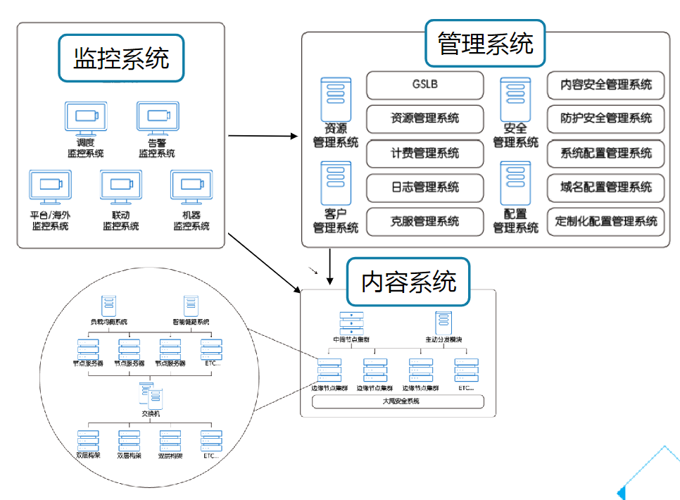

# CDN

## 概览

什么是 CDN？

> 内容分发网络（Content Delivery Network，CDN）是在现有 Internet 中增加的一层新的网络架构，由遍布全国的高性能加速节点构成。

高性能的CDN服务节点会按照一定的缓存策略存储客户的业务内容，当用户向某一业务内容发起请求时，请求会被调度至最接近用户的服务节点，直接由服务节点快速响应，有效降低用户访问延迟，提升可用性。

CDN 可以带来的优势：

- 提升客户体验
- 减少源站成本
- 网络安全防护

## CDN 实现原理

CDN全球调度体系（GSLB，Global Server Load Balance）：

- 作用是实现在广域网或互联网上不同地域的服务器间的流量调配。
- 保证使用最佳的服务器服务离自己最近的客户，从而确保访问质量。

一个 CDN 域名解析示例：

## CDN 架构

腾讯云 CDN 架构包括三个部分：

- 监控系统
- 管理系统
- 内容系统

对于内容系统：

- DiskTank3 存储引擎：针对不同的大小文件，腾讯云 CDN 节点配备了 SSD 和 SATA 不同的硬盘机型。在提供足够的加速性能的同时，保证 CDN 边缘节点的命中率。DiskTank3 是腾讯云自研的第三代存储引擎，目前部署于线上所有机器中。
- 双层缓存架构，在第一层缓存未命中的情况下，会优先向第二层缓存请求数据：
  - 第一层的缓存机器挂载全 SSD 硬盘，兼顾速度以及处理的准确性；
  - 第二层的缓存节点挂载海量机械硬盘，能够做到存储大量信息。
  - 在两层缓存均未命中的情况下，才会向中间节点请求数据。

## CDN 安全

腾讯云 CDN 提供如下安全能力：

- 域名防劫持：为了避免您的域名在解析过程中受到劫持，无法解析到最优接入节点，腾讯云 CDN 提供了HTTP DNS 直通车解决方案。使用该方案，您的域名将会通过公有 PUBLIC DNS 进行更加快速的解析，避免被恶意劫持。
- HTTPS 支持：腾讯云 CDN 支持全网所有节点 HTTPS 传输。如果您的业务有较高的安全需求，且已拥有证书，可直接上传至 CDN 节点进行部署，不论是用户请求至节点还是节点回源请求，都会进行
加密处理，保障数据安全。若您暂无证书，腾讯云为您提供了免费的第三方 DV 证书，一键部署，让连接更加安全。
- CDN 访问控制：通过过滤参数配置、防盗链配置、IP黑白名单、IP访问限频等功能实现访问控制，保障节点和内容安全。
- 攻击防护：：腾讯云 CDN 的每一个节点都拥有一定的 DDOS 防御能力，配合自主研发的恶意攻击过滤模块，能有效抵御 DDOS、CC 攻击，保障您的业务正常运行。可以开启 SCDN 进行防护增强。

移动解析 HttpDNS：

CDN 防攻击：

## CDN 产品

产品 | 描述 | 加速对象
-|-|-
CDN 静态加速（SCD） | 针对门户网站、电商、UGC 社区等场景，提供了强大的静态内容（如网页样式、图片、小文件）加速分发处理能力。 | HTML、FLASH 动画、CSS、Javascript 和各种文件类型的图像。
下载分发加速（DD）| 针对下载业务场景，提供稳定、优质的下载加速，具备突发性超大流量承载能力。利用多级缓存收敛及资源预热，缓解源站压力，让业务用户获得极速的下载体验。 需要主动推送资源至节点，利用防盗链防盗刷；热点资源访问较为集中。| 游戏安装包、手机ROM升级、应用程序包。
音视频点播加速（VCD）| | 音视频、直播
海外加速（GCD）| GCD 为您解决跨国访问问题，有效降低访问延迟，提升服务可用性，支持您的业务无缝出海。| 海外访问对象。
全站加速网络（ECDN）| 提供全新高性能的一站式加速服务体验，实现了动静态混合型资源快速稳定的高效传输。将静态边缘缓存与动态回源路径优化相融合，智能调度最优服务节点，自动识别动静态资源，结合腾讯自研最优链路算法及协议层优化技术进行全站加速。
全球应用加速（GAAP） | 依赖全球节点之间的高速通道、转发集群及智能路由技术，实现全球用户就近接入、直达源站访问。全球用户访问卡顿或者延迟过高问题。| 任何访问

SCD ：

DD：

VCD（Video Content Delivery）通用型场景，适用于一般视频网站：

ECDN：

GAAP：

## CDN 计费

CDN 提供了两种计费方式：

- 带宽计费
- 流量计费

均为后付费按日结算，前一天 00:00:00 - 23:59:59 产生的总消耗，会在第二天中午 12:00 进行计算扣费。