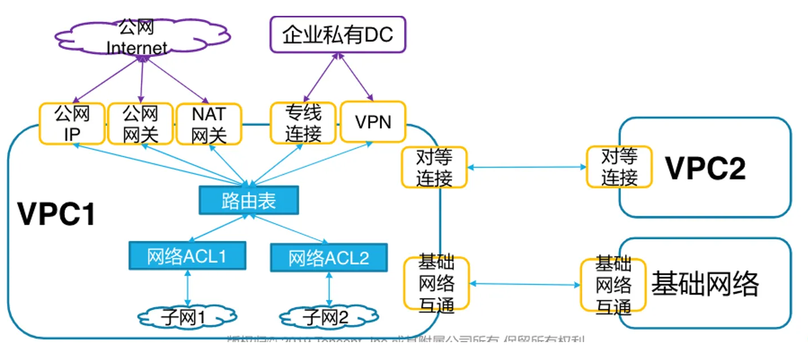

# 网络

[TOC]

## 概述

腾讯云网络概念：



### 基础

在大部分云上，都通过 CIDR 来表示网络的地址空间，那是么是 CIDR？

> CIDR（Classless Inter-Domain Routing）即无类别域间路由，由您指定的独立网络空间地址块，通过 IP 和掩码结合，实现对网络的整体划分。

以 10.1.0.0/16 为例：

- 其中 10.1.0.0 为网络块的 IP
- 16 为网络块的掩码，即 255.255.0.0
- 通过设定掩码的大小，可以调整网络块的大小设定

很明显，CIDR 的网络地址数为：

```txt
IP 数 = 2 ^( 32 - 掩码)
```

因此 10.1.0.0/16 网络块最多包含 65536 个 IP 地址。


### 概念


概念解释：

概念 | 描述
-|-
可用区 | 腾讯云在同一地域内电力和网络互相独立的物理数据中心。目标是能够保证可用区之间故障相互隔离，不出现故障扩散，使得用户的业务持续在线服务。
基础网络（Basic Network） | 腾讯云上所有用户的公共网络资源池，该资源池内云服务器内网 IP 地址由腾讯云统一分配，配置简单，使用方便，适合对操作易用性要求比较高、需要快速使用云服务器的用户，而私有网络更适合有网络管理能力和需求的用户。

**注意：**

- 这里存在一种特殊的设备：**公网网关**。这是一个云服务器，具备转发 Internet 和私有网络间流量的能力。对于没有外网 IP 但需要进行 Internet 访问的云服务器，可以路由给公网网关进行代理。
- NAT 网关和公网网关类似，但是是专门的云产品。

VPN 网关是什么？
VPN 连接和专线接入的区别？
ECDN 是什么？
SCD 和 CDN 的关系