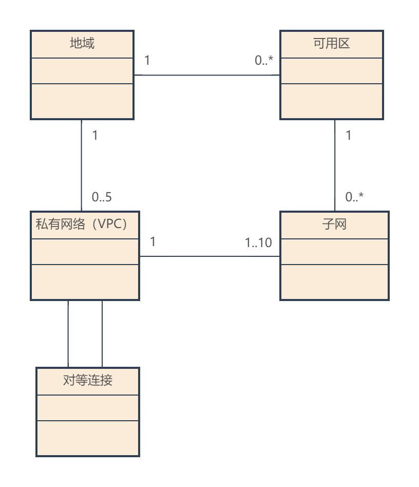

# 网络

[TOC]

## 概述

腾讯云网络概念：


### 基础

在大部分云上，都通过 CIDR 来表示网络的地址空间，那是么是 CIDR？

> CIDR（Classless Inter-Domain Routing）即无类别域间路由，由您指定的独立网络空间地址块，通过 IP 和掩码结合，实现对网络的整体划分。

以 10.1.0.0/16 为例：

- 其中 10.1.0.0 为网络块的 IP
- 16 为网络块的掩码，即 255.255.0.0
- 通过设定掩码的大小，可以调整网络块的大小设定

很明显，CIDR 的网络地址数为：

```txt
IP 数 = 2 ^( 32 - 掩码)
```

因此 10.1.0.0/16 网络块最多包含 65536 个 IP 地址。

### 概念



概念解释：

概念 | 描述
-|-
可用区 | 腾讯云在同一地域内电力和网络互相独立的物理数据中心。目标是能够保证可用区之间故障相互隔离，不出现故障扩散，使得用户的业务持续在线服务。
基础网络（Basic Network） | 腾讯云上所有用户的公共网络资源池，该资源池内云服务器内网 IP 地址由腾讯云统一分配，配置简单，使用方便，适合对操作易用性要求比较高、需要快速使用云服务器的用户，而私有网络更适合有网络管理能力和需求的用户。

**注意：**

- 这里存在一种特殊的设备：**公网网关**。这是一个云服务器，具备转发 Internet 和私有网络间流量的能力。对于没有外网 IP 但需要进行 Internet 访问的云服务器，可以路由给公网网关进行代理。
- NAT 网关和公网网关类似，但是是专门的云产品。

## 网络计费

网络产品 | 计费方式 | 免费条件
-|-|-
私有网络 | - | 产品完全免费
子网 | - | 产品完全免费
路由表 | - | 产品完全免费
安全组 | - | 产品完全免费
网络 ACL | - | 产品完全免费
弹性网卡 | - | 产品完全免费
弹性公网 IP（EIP） | 未绑定的 EIP（闲置的弹性网卡），费用精确到秒 | 绑定资源的 EIP（但在访问公网时，实际上是会收取公网网络费用的，但是这不算在 EIP 中）
公网网关 | 按 CVM 计费，包年包月/按量计费 | -
NAT 网关 | 网关租用费（按小时计费） + 外网流量费（按带宽计费/按流量计费） | -
对等连接 | 日峰值计费/月95计费 | 同地域使用
云联网 | 两两实例互通产生的跨地域互通流量费用之和 | 同地域使用
专线接入 | 物理专线费用 + 专线通道 | -
VPN | 按量后付费/按月预付费 | VPN 通道/对端网关，免费使用
CLB | CLB 实例租用费 + CVM 带宽流量费 | 内网型 CLB

## 参考文献

1. [腾讯云网络产品介绍](https://csig.lexiangla.com/teams/k100095/docs/f5108092afcc11ebafbb06f1df3d4034?company_from=csig)
