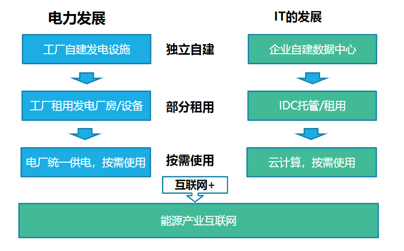
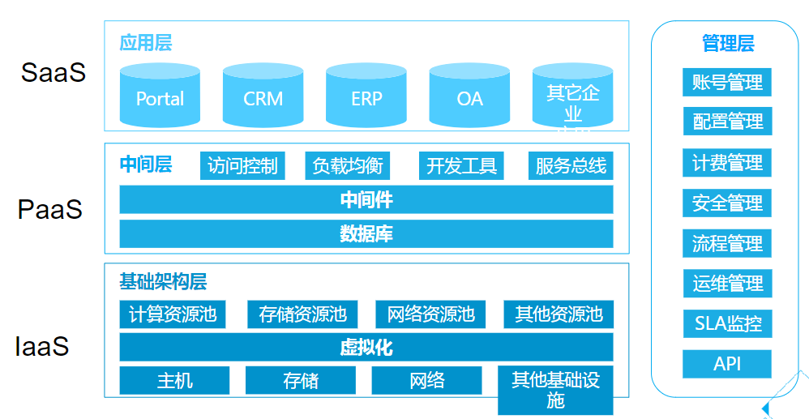
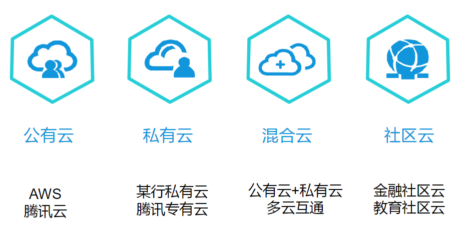
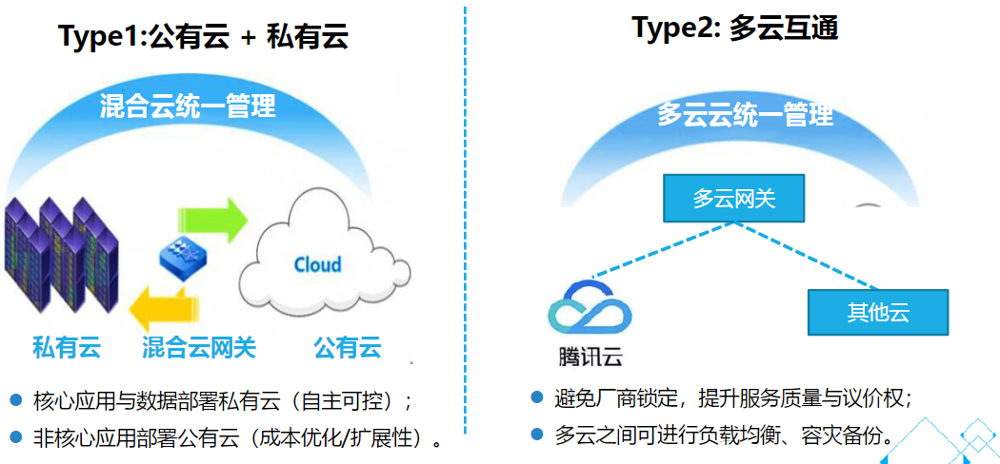
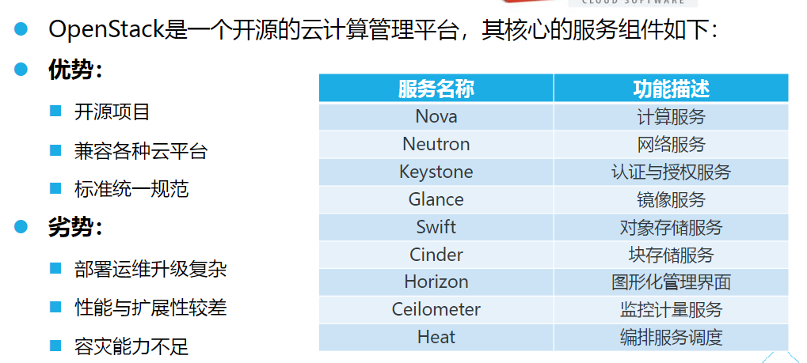
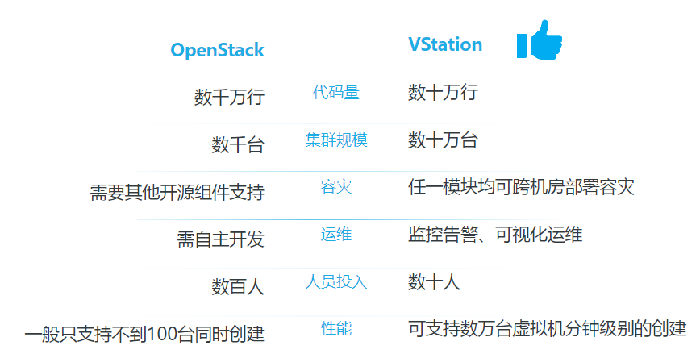
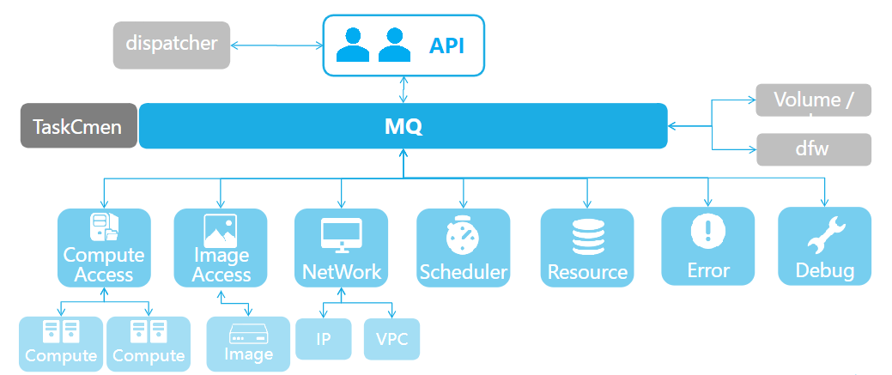

# 腾讯云

[TOC]

## 概览

什么是云计算？学术界对云计算尚无统一定义，权威机构对云计算的定义也不尽相同。

现阶段，广为接受的是 NIST（美国国家标准与技术研究院）对云计算的定义：

> 云计算是一种按使用量付费的模式，这种模式提供可用的、便捷的、按需的网络访问， 进入可配置的计算资源共享池（资源包括网络，服务器，存储，应用软件，服务），这些资源能够被快速提供，只需投入很少的管理工作，或与服务供应商进行很少的交互。

腾讯云的具体产品、概念和基本原理，按照以下章节进行阐述：

- [云服务器](server/readme.md)
- [网络](network/readme.md)
- [安全](secure/readme.md)

云计算的特征：

特征 | 描述
-|-
超大规模 |
高可靠性 |
多租户隔离 |
弹性扩展 |
按需服务 |
资源可监控计量 |
低成本 |

## 云计算发展

因为云计算对于业务而言，体现出来的按需使用的特性，这和电力发展很类似，因此可以进行类别：

## 云计算模式

### 云计算服务模式

云计算的服务模式主要分为三种：

服务模式 | 描述
-|-
SaaS（软件即服务）| 它是一种通过 Internet 提供软件的模式，用户无需购买软件，而是向提供商租用基于Web的软件，来管理企业经营活动。
PaaS（平台即服务）| 软件研发的平台作为一种服务，以 SaaS 的模式提交给用户，因此，PaaS 也是 SaaS 模式的一种应用。
IaaS（基础设施即服务）| 注重计算资源的共享，消费者通过 Internet 从资源池中获取 IT 相关基础设施资源。

整体架构：

### 云计算部署方式

云计算主要有四种部署方式（这四种方式来源于 NIST 的定义）：

分类 | 特点 | 描述 | 适合行业
-|-|-|-
公有云 | 规模化、运维可靠、弹性强 | 公有云是为大众建的，所有入驻用户都称租户，不仅同时有很多租户，而且一个租户离开，其资源可以马上释放给下一个租户。| 游戏、视频、教育等。
私有云 | 自主可控、数据私密性好。 | 基础基础设施被单个组织所独享的一种云。私有云可由组织自行管理，也可以委托给第三方管理。| 金融、医疗、政务等。
混合云 | 弹性、灵活，但是架构复杂。 | 混合云是以上几种的任意混合，这种混合可以是计算的、存储的，也可以两者兼而有之。在公有云尚不完全成熟、而私有云存在运维难、部署实践长、动态扩展难的现阶段，混合云是一种较为理想的平滑过渡方式。| 金融、医疗等。
社区云 |

对于混合云，主要有两种模式：

- 公有云 + 私有云：心应用与数据放在私有云（自主可控），非核心应用放公有云（成本优化）。当前挑战架构复杂，业务调度与互通技术复杂，平滑扩展尚有困难。
- 多云互通：业务部署多个云厂商，可负载均衡、容灾备份；有更高的采购议价权，避免厂商锁定。没有统一的标准，跨云互通与迁移比较困难。

## 虚拟化

## 云管理平台

对于云计算的管理，也有相应的管理控制面。早期使用较多的就是 OpenStack：

为了弥补 OpenStack 的各方面不足，腾讯云自演了 VStation 云计算管理平台：

VStation 的整体架构如下：

## 参考文献

1. [云计算基础介绍](https://csig.lexiangla.com/teams/k100095/docs/a49dab12afcc11eb93d0ea2ea5421c8a?company_from=csig)
