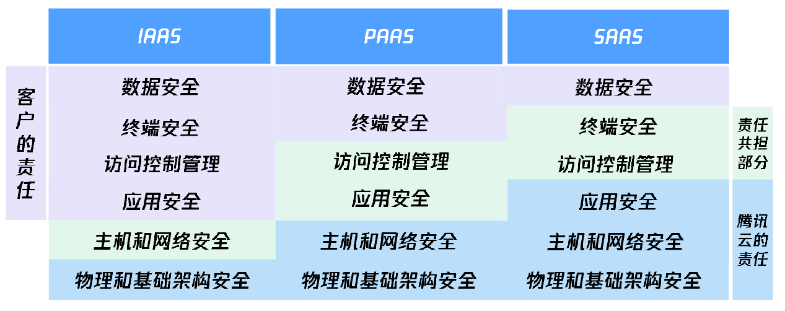
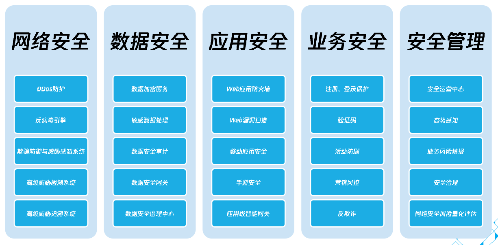
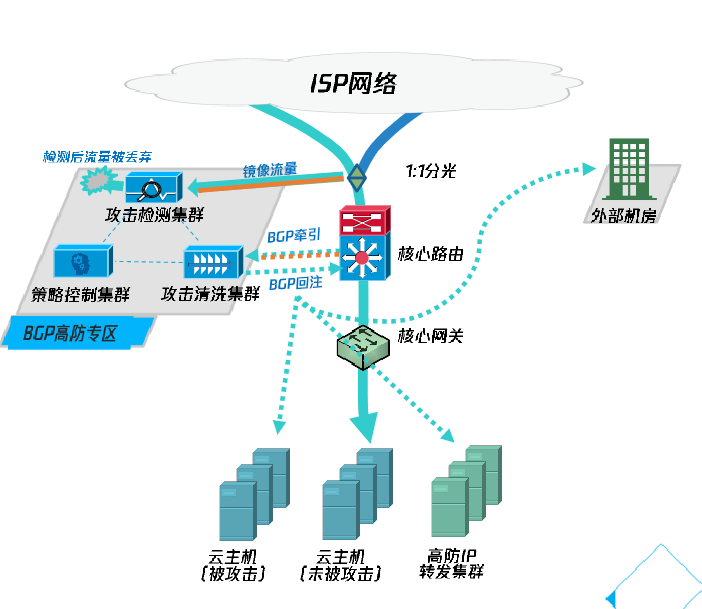
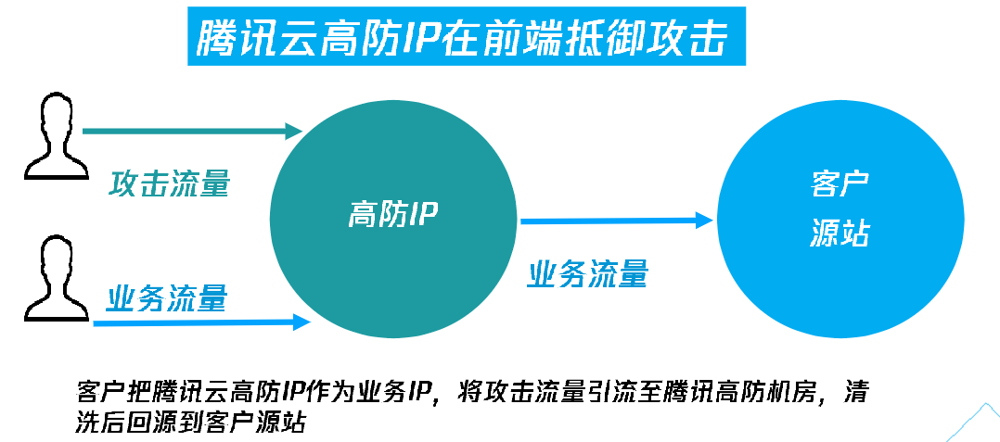

# 云安全

## 概述

腾讯云不同服务模式的责任模型：

上述安全概念包括：

概念 | 描述
-|-
数据安全 |
终端安全 |
访问控制管理 | 对资源和数据的访问权限管理，包括用户管理、权限管理、身份验证。
应用安全 | 云计算环境下，业务相关应用系统的安全管理，包括应用的设计、开发、发布、配置和使用等。
主机和网络安全 |
物理和基础架构安全 | 云计算环境下，对数据中心、物理设施、物理服务器和网络设备的管理。

腾讯云安全体系：

## 云安全理论

## 网络安全产品

DDos 攻击的检测和防护原理：

这里分为两步：

- 检测：
  - 1:1 分光，旁路检测镜像流量，不影响客户业务
  - 检测算法基于流量行为建模 + AI 智能引擎
- 清洗：
  - 旁路检测到攻击后，通过 BGP 路由牵引至清洗集群防护，清洗后的干净流量，回注核心路由，并路由给客户主机或客户机房。
  - 清洗算法不涉及、不查阅业务负载报文。

BGP 高防 IP：

## 主机安全产品

主机安全风险：

- 业务被中断
- 数据被窃取
- 被加密勒索
- 服务不稳定

使用腾讯云产品：云镜。

云镜核心功能：

- 

Web 应用防火墙：WAF

## 网站安全产品

## 业务安全产品

## 应用安全产品
