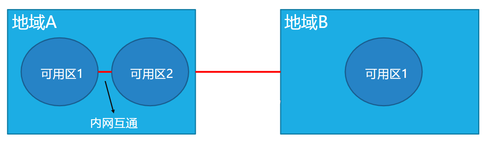
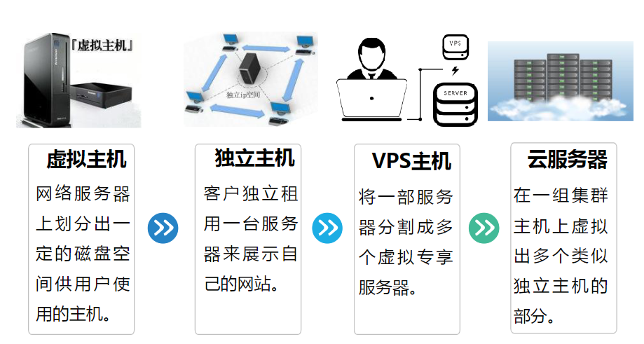
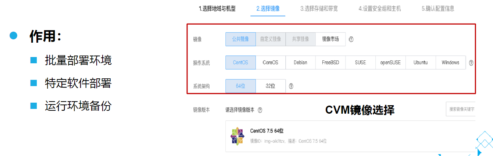
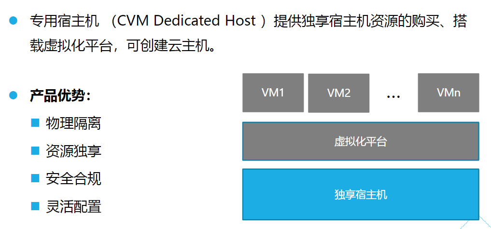

# 云服务器

[TOC]

## 概述

基本概念：

概念 | 描述 | 示例
-|-|-
地域（Region）| 一个独立的地理区域，命名【覆盖范围＋机房所在城市】。| 华南地区-广州
可用区（Zone） | 同一地域内，电力和网络互相独立的物理数据中心。命名【城市 + 编号】。 | 广州 3 区
实例 | 一台完整的云服务器(虚拟机)，包含CPU、内存、磁盘、网络、操作系统等组件。
镜像 | 创建云服务器的模板（装机盘），提供云服务器实例所需的操作系统与软件配置等信息。

可用区访问策略：

- 不同地域的可用区之间，默认不能通过内网通信。
- 同一地域的不同可用区之间，可以配置相同的 VPC 来进行内网访问（VPC 可以有多个子网，每个子网设置不同的可用区）。

## 云服务器发展

云服务器和 VPS 的区别在于：

- VPS 是在一个主机上划分出来多个虚拟的独立主机。
- 云服务器是在一个集群上划分出来多个虚拟的独立主机。相比于 VPS，可以对集群机器资源进行更充分的自动调配和利用。

## 云服务器类型

实例类型 | 特点 | 应用场景
-|-|-
标准型 | 基准性能，可实现计算、内存和网络资源的平衡。| 中小型Web应用、中小型数据库等。
高 IO 型 | 低延时 I/O | NoSQL 数据库、群集化数据库、 OLTP 系统。
内存型 | 大内存；最大 648GB 的内存实例 | 高性能数据库、分布式内存缓存等应用；hadoop 集群或 redis。
计算型 | CVM 中最高性能处理器和最高性价比 | 高流量 Web 服务器、MMO 游戏服务器、HPC。
GPU 型 | 搭载 GPU、FPGA 等异构硬件，具有实时高速的并行计算和浮点计算能力 | 深度学习、科学计算、视频编解码和图形工作站等高性能应用。
大数据型 | 搭载海量存储资源，具有高吞吐特点 | 海量日志处理、分布式文件系统和大型数据仓库等吞吐密集型应用。

## 云服务器镜像

镜像是创建云服务器的模板（装机盘），提供云服务器实例所需的操作系统与软件配置等信息。

镜像的作用：

- 批量部署软件环境：
  - 通过对已经部署好环境的云服务器实例制作镜像，然后在批量创建云服务器实例时使用该镜像作为操作系统。
  - 云服务器实例创建成功之后便具有和之前云服务器实例一致的软件环境，以此达到批量部署软件环境的目的。
- 部署特定软件环境：
  - 使用共享镜像、自定义镜像、服务市场镜像都能帮助快速搭建特定的软件环境，免去了自行配置环境、安装软件等繁琐且耗时的工作。
  - 能满足建站、应用开发、可视化管理等多种个性化需求，让云服务器“即开即用”，省时方便。
- 服务器运行环境备份：
  - 对一台云服务器实例制作镜像备份运行环境。
  - 若该云服务器实例使用过程中因软件环境被损坏而无法正常运行，则可以使用镜像恢复。

## 云服务器存储

云服务器的存储有多个维度的分类：

- 按存储介质分类：
  - 普通硬盘，存储介质为机械硬盘。特点是价格较低，且能表现较优的读写速度。
  - SSD 硬盘，存储介质采用固态硬盘(SSD)。特点是在 IOPS、读写速度上均表现优异，相较于普通硬盘最大能达到 20 倍的 IOPS 和 16 倍的吞吐量。在价格上比普通硬盘更高。
- 按使用场景分类：
  - 系统盘：用来存储控制、调度云服务器运行的系统集合，使用镜像来操作。
  - 数据盘：用来存储所有用户数据。
- 按架构模式分类：
  - 本地盘：本地盘来自 CVM 实例所在物理机的本地存储，是从 CVM 实例所在的物理机上划分的一块存储区域。数据访问可获得较低的时延，但存在数据单点故障的风险。
  - 云硬盘：云硬盘是一种弹性、高可用、高可靠、低成本、可定制化的网络块设备，可以作为云服务器的独立可扩展硬盘使用。它提供数据块级别的数据存储，采用三副本的分布式机制，为CVM 提供数据可靠性保证。
  - 对象存储：对象存储是位于 Internet 上的数据存储设备，支持从云服务器实例或 Internet 上的任何位置检索数据，从而精简存储成本。

## 云服务器产品介绍

### CDH

专用宿主机 CDH

## 云服务器计费模式

## 参考文献

1. [腾讯云服务器产品介绍](https://csig.lexiangla.com/teams/k100095/docs/d5cc9838afcc11ebbeb226ea867904d7?company_from=csig)
