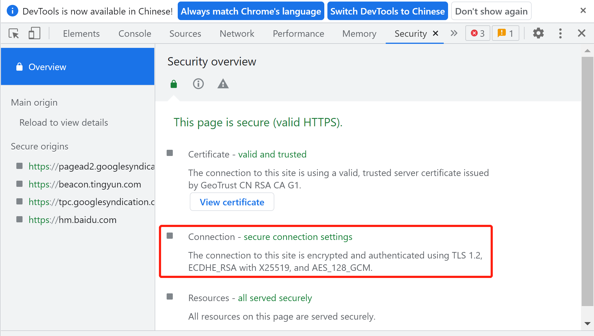

# TLS 1.2

[TOC]

## 开始

本文主要是对 [TLS 1.2 RFC](https://www.rfc-editor.org/rfc/rfc5246.html) 的一个学习记录。

TLS 1.2 RFC 为 [RFC5246](https://www.rfc-editor.org/rfc/rfc5246.html)。

这里可以简单看到 RFC5246 的形成过程，也是一个持久战：


虽然目前已经有更先进的 TLS 1.3 但是目前暂未普及，国内主流使用的仍然是 TLS 1.2。

通常使用 Chrome 浏览器的开发者工具可以看到连接使用的是什么 TLS 版本：



本文主要详细描述了 Transport Layer Security (TLS) 协议的版本 1.2。TLS 协议提供了互联网上的通信安全。

TLS 协议允许客户端/服务器应用程序以一种旨在防止窃听、篡改或消息伪造的方式进行通信（机密性、一致性）。

## 概览

TLS 协议的主要目标是提供两个通信应用之间的隐私性和数据一致性。

协议由两层组成：

1. TLS Record Protocol(记录协议)
1. TLS Handshake Protocol(握手协议)

TLS 1.2 协议是基于可靠的连接层协议（例如 TCP）来制定的。

在 TCP 这类可靠连接层协议之上，是 TLS Record Layer，TLS Record Layer 提供了两个基本的连接安全属性：

1. 连接是私有的。对称密钥用于数据加密，保障连接的私有。这种对称加密的密钥是为每个连接唯一生成的，并且是基于另一个协议（例如 TLS 握手协议）协商的。记录协议也可以在不加密的情况下使用。
1. 连接是可靠的。这里的 “可靠” 一词，主要指的是消息完整性。消息的传输会使用 MAC 完整性检查。

TLS 记录协议可以用于其他更高级别的协议，例如 TLS 握手协议。TLS 握手协议允许服务器和客户端在应用程序协议传输或接收其第一个数据字节之前相互验证并协商加密算法和加密密钥。

TLS 握手协议提供三个方面的连接安全性：

- 可以使用非对称公钥私钥技术，验证对等方的身份。此身份验证可以是可选的，但通常至少需要其中一个对等方。
- 对称密钥的协商是安全的。协商的密钥对窃听者是不可用的，并且对于任何经过身份验证的连接，即使可以将自己置于连接中间的攻击者也无法获得密钥。
- 协商是可靠的。任何攻击者都不能在不被通信各方检测到的情况下修改协商通信。

TLS 的一个优点是它独立于应用程序协议。 更高级别的协议可以透明地叠加在 TLS 协议之上。

## 目标

TLS 协议的目标如下（按优先级从高到低排序）：

1. 加密安全：TLS 需要能够建立两端的连接安全。
1. 互操作性：程序员能够开发利用 TLS 的应用程序，这些应用程序可以在不了解彼此代码的情况下成功交换密码参数。
1. 可扩展性：TLS 寻求提供一个框架，必要时可以将新的公钥和加密方法纳入其中。
1. 相对效率：加密操作往往是高度 CPU 密集型的，尤其是公钥操作。出于这个原因，TLS 协议包含了一个可选的会话缓存方案，以减少需要从头开始建立的连接数量。此外，尽可能的减少两端网络交互操作。

## 演示语言

为了方便表述 TLS 协议，本文将会使用以下非常基本且有些随意的表示语法。该语法类似 C 语言和 XDR。

这里有些基本的杂项：

- 注释使用 `/*` 和 `*/` 包起来。
- 可选的部分用 `[[]]` 抱起来。
- 未解释数据的单字节实体属于不透明类型（opaque）。这个意思就是该数据的类型是 opaque，例如 `opaque mandatory;` 这个 mandatory 就是一个不透明类型，数据不可解释。

### Basic Block Size

基本数据块大小为 1 个字节（即 8 位）。多字节数据项是字节的串联，从左到右，从上到下。

从字节流中，一个多字节项（示例中的数字）通过以下方式形成（使用 C 表示法）：

```txt
value = (byte[0] << 8*(n-1)) | (byte[1] << 8*(n-2)) |
              ... | byte[n-1];
```

这种多字节值的字节顺序是常见的`网络字节序`或`大端格式`。

### Vectors

一个 Vector 是同质数据元素的流。

在任何一种情况下，长度都声明了向量中的`字节数`，而`不是元素数`。

指定新类型 T' 的语法是 T 类型的固定长度向量：

```txt
T T'[n];        // 定义一个新类型 T'，该类型有 n 个字节的 T 元素。假设 T 类型大小为 x 字节，那么意味着有 n/x 个连续的 x 字节向量。
```

这里，T'在数据流中占据 n 个字节，其中 n 是 T 大小的倍数。向量的长度不包含在编码流中。

```txt
opaque Datum[3];      /* three uninterpreted bytes */
Datum Data[9];        /* 3 个连续的 3 字节向量 */
```

可变长度向量是通过指定合法长度的子范围来定义的，包括使用符号 `<floor..ceiling>`

```txt
T T'<floor..ceiling>;
```

需要注意的是，当这类可变长数据被编码时，还需要一个长度值，用于指定数据的长度。本文档规定长度值放在数据值之前，长度将采用数字形式，该数字消耗所需的字节数，以保持向量的指定最大（上限）长度。

在以下示例中，mandatory 是一个必须包含 300 到 400 个字节的不透明类型的向量。它永远不能是空的。实际长度字段占用两个字节，一个 uint16，足以表示值 400：

```txt
opaque mandatory<300..400>;     /* 长度字段为 2 字节（因为要存最大值为 400 的长度） */
uint16 longer<0..800>;          /* zero to 400 16-bit unsigned integers */
```

### Numbers

基本数值数据类型是无符号字节 (uint8)。 所有较大的数字数据类型都是由固定长度的字节序列组成。

以下数值类型是预定义的：

```txt
uint8 uint16[2];
uint8 uint24[3];
uint8 uint32[4];
uint8 uint64[8];
```

### Enumerateds

还有一种稀疏数据类型可用，称为`枚举`。

枚举类型的字段只能采用定义中声明的值。每个定义都是不同的类型，只能分配或比较相同类型的枚举。

必须为枚举的每个元素分配一个值，如下例所示。由于枚举的元素没有排序，因此可以以任何顺序为它们分配任何唯一值。

```txt
enum { e1(v1), e2(v2), ... , en(vn) [[, (n)]] } Te;
```

枚举在字节流中占用的空间与其定义的最大序数值一样多。以下定义将导致使用一个字节来承载 Color 类型的字段：

```txt
enum { red(3), blue(5), white(7) } Color;
```

可以选择指定一个没有关联枚举符号的值，以强制定义宽度而不定义多余的元素。

```txt
enum { sweet(1), sour(2), bitter(4), (32000) } Taste;
```

在以上示例中，Taste 将消耗数据流中的两个字节，但只能取值 1、2 或 4。

### 构造类型

为方便起见，可以从原始类型创建结构类型。

每个构造都声明了一个新的、唯一的类型。 定义的语法很像 C 的语法：

```txt
struct {
    T1 f1;
    T2 f2;
    ...
    Tn fn;
} [[T]];
```

可以使用类型名称进行限定，例如 `T.f2` 代表该类型的第二个 f2 字段（注，这里 `T.` 的意思就是类型名称进行限定，也就是缩小范围）。

### Variants

基于环境中可用的一些知识，定义的结构可能具有变体（Variants）。

```txt
struct {
    T1 f1;
    T2 f2;
    ....
    Tn fn;
    select (E) {
        case e1: Te1;
        case e2: Te2;
        case e3: case e4: Te3;
        ....
        case en: Ten;
    } [[fv]];
} [[Tv]];
```

例如：

```txt
enum { apple, orange, banana } VariantTag;

struct {
    uint16 number;
    opaque string<0..10>; /* variable length */
} V1;

struct {
    uint32 number;
    opaque string[10];    /* fixed length */
} V2;

struct {
    /* value of selector is implicit */
    select (VariantTag) {
        case apple:
            V1;         /* VariantBody, tag = apple */
        case orange:
        case banana:
            V2;         /* VariantBody, tag = orange or banana */
    } variant_body;     /* optional label on variant */
} VariantRecord;
```

### Cryptographic Attributes

五种加密操作：

- 数字签名，被指定为 digitally-signed
- 流密码加密，被指定为 stream-ciphered
- 分组密码加密，被指定为 block-ciphered
- 带有附加数据的认证加密 (AEAD) 加密，被指定为 aead-ciphered
- 公钥加密，被指定为 public-key-encrypted

字段的加密处理，是通过在字段的类型规范之前添加适当的关键字指定来指定的（当前会话状态隐含了加密密钥）。

一个数字签名（digitally-signed）元素，被编码为 DigitallySigned 结构体：

```txt
struct {
    SignatureAndHashAlgorithm algorithm;
    opaque signature<0..2^16-1>;
} DigitallySigned;
```

本文中涉及到的加密介绍：

- 在流密码加密中，明文与加密安全密钥伪随机数生成器生成的相同数量的输出进行异或。
- 在分组密码加密中，每个明文块都加密为一个密文块。所有分组密码加密都是在 CBC（密码块链接）模式下完成的，所有被分组加密的项目都将是密码块长度的精确倍数。
- 在 AEAD 加密中，明文同时被加密和完整性保护。输入可以是任意长度，加密输出通常大于输入，以适应完整性检查值。
- 在公钥加密中，使用公钥算法对数据进行加密，使其只能用匹配的私钥解密。公钥加密的元素被编码为不透明向量 <0..2^16-1>，其中长度由加密算法和密钥指定。
- RSA 加密是使用 PKCS1 中定义的 RSAES-PKCS1-v1_5 加密方案完成的。

### Constants

例如：

```txt
struct {
    uint8 f1;
    uint8 f2;
} Example1;

Example1 ex1 = {1, 4};  /* assigns f1 = 1, f2 = 4 */
```

## HMAC 和伪随机函数（Pseudorandom Function）

出于密钥生成或验证的目的，需要构建密钥数据块。需要一个伪随机函数 (PRF)，将秘密、种子和识别标签（label）作为输入，并产生任意长度的输出。

在本节中，我们基于 HMAC 定义一个 PRF。新密码规范必须明确指定 PRF，并且通常应该使用带有 SHA-256 或更强标准哈希函数的 TLS PRF。

首先，我们定义一个数据扩展函数 P_hash(secret, data)，它使用单个散列函数将秘密和种子扩展为任意数量的输出：

```txt
P_hash(secret, seed) = HMAC_hash(secret, A(1) + seed) +
                        HMAC_hash(secret, A(2) + seed) +
                        HMAC_hash(secret, A(3) + seed) + ...

/* + 代表拼接 */

/*******************************************
A() is defined as:

      A(0) = seed
      A(i) = HMAC_hash(secret, A(i-1))
*******************************************/
```

P_hash 可以获得所需要长度的数据，例如使用 P_SHA256 创建 80 字节的数据，则需要迭代 3，创建 96 字节的输出数据； 最后一次迭代的最后 16 个字节将被丢弃，留下 80 个字节的输出数据。

TLS 的 PRF（伪随机函数）使用了 P_hash：

```txt
PRF(secret, label, seed) = P_<hash>(secret, label + seed)

/* + 代表的是拼接 */
```

这里 label 是一个 ASCII 字符串。它应该包含在它给出的确切形式中，没有长度字节或尾随空字符。

例如，标签 `slithy toves` 将通过散列以下字节来处理：

```txt
73 6C 69 74 68 79 20 74 6F 76 65 73
```

## TLS Record Protocol

TLS 记录协议是一个分层协议。在每一层，消息可能包括长度、描述和内容字段。

记录协议接收要传输的消息，随后：

- 将数据分成可管理的块
- 可选择压缩数据
- 应用 MAC
- 加密并传输。

这其实就是 TLS Record Protocol 的分层：


接收到的数据经过解密、验证、解压缩、重组，然后交付给更高级别的客户端。

本文档描述了四种使用 Record Protocol 的协议：

- 握手协议（也就是 TLS Handshake Protocol）
- 警报协议
- 更改密码规范协议
- 应用程序数据协议


任何设计用于 TLS 的协议都必须经过精心设计，以应对所有可能的攻击。实际上，这意味着协议设计者必须了解 TLS 提供和不提供哪些安全属性，并且不能安全地依赖后者。

**注意：**

- 记录的类型和长度不受加密保护。如果此信息本身是敏感的，应用程序设计人员可能希望采取措施（填充、覆盖流量）以最大限度地减少信息泄漏。

### 连接状态

TLS 连接状态是 TLS Record Protocol 的运行环境，准确说是记录或使用读写的密码参数。

这些参数它包括了 Record Layer 的：

- 压缩算法
- 加密算法
- MAC 算法
- 以及这些算法的所有参数（MAC 密钥、加密密钥等）

从逻辑上讲，`始终`存在四连接状态：

- 当前的可读、可写状态（合称 Current State）。所有 Record 都在当前的读写状态下处理，包括 TLS 握手完成前。
- 挂起的读取和写入状态（合称 Pending State）。用来记录 TLS 握手之间协商的密码参数。

这四种状态在时刻上不是互斥的，也就是说每个时刻，这四个状态都同时存在。这里的状态本质上就是对密码参数的记录，其实更类似一种双 Buffer 机制，具体如下：


这也是为什么，在 ChangeCipherSpec 之前，所有的 TLS 握手消息都是明文处理的，没有安全性和完整性的保护：


一旦所有的加密参数都准备好，就会使用 ChangeCipherSpec 将 pending 中的参数复制给 current 进入到了可读可写状态以后就会开始加密和完整性保护了。

将未使用安全参数初始化的 pending 状态设为当前状态是非法的。此外，初始当前状态始终指定不使用加密、压缩或 MAC。

通过提供以下值来设置 TLS 连接读取和写入状态的安全参数：

- connection end（这个 end 是 endpoint 的意思）：此实体在此连接中被视为 “客户端” 还是 “服务器”。
- PRF algorithm：用于从主密钥生成密钥的算法。固定为 PRF_SHA256。
- bulk encryption algorithm：用于批量加密的算法。该参数包括该算法的密钥大小，无论是块、流还是 AEAD 密码、密码的块大小（如果合适），以及显式和隐式初始化向量（或随机数）的长度。
- MAC algorithm：用于消息认证的算法。该规范包括 MAC 算法返回的值的大小。
- compression algorithm：用于数据压缩的算法。该参数必须包括算法进行压缩所需的所有信息。
- master secret：一个 48 字节的对称密钥
- client random：客户端提供的 32 字节随机数。
- server random：服务器提供的 32 字节随机数。

这些参数通过表示语法可以定义为：

```txt
enum { server, client } ConnectionEnd;

enum { tls_prf_sha256 } PRFAlgorithm;

enum { null, rc4, 3des, aes } BulkCipherAlgorithm;

enum { stream, block, aead } CipherType;

enum { null, hmac_md5, hmac_sha1, hmac_sha256, hmac_sha384, hmac_sha512} MACAlgorithm;

enum { null(0), (255) } CompressionMethod;

struct {
    ConnectionEnd          entity;
    PRFAlgorithm           prf_algorithm;
    BulkCipherAlgorithm    bulk_cipher_algorithm;
    CipherType             cipher_type;
    uint8                  enc_key_length;
    uint8                  block_length;
    uint8                  fixed_iv_length;
    uint8                  record_iv_length;
    MACAlgorithm           mac_algorithm;
    uint8                  mac_length;
    uint8                  mac_key_length;
    CompressionMethod      compression_algorithm;
    opaque                 master_secret[48];
    opaque                 client_random[32];
    opaque                 server_random[32];
} SecurityParameters;
```

有了这些输入的安全参数后，记录层会生成以下六项：

- client write MAC key
- server write MAC key
- client write encryption key
- server write encryption key
- client write IV
- server write IV

一旦设置了安全参数并生成了密钥，就可以通过使它们成为当前状态来实例化连接状态。

连接状态包括以下元素：

- compression state：当前压缩算法的状态。
- cipher state：加密算法的当前状态。 这将包括该连接的预定密钥。 对于流密码，这还将包含允许流继续加密或解密数据所需的任何状态信息。
- MAC Key：当前连接使用的 MAC Key。
- sequence number：每个连接状态都包含一个序列号，该序列号为读取和写入状态分别维护。序列号是 uint64 类型，不能超过 2^64-1。

**注意：**

- 对于 sequence number，每当连接状态变为活动状态时，必须将序列号设置为零。在特定连接状态下传输的第一条记录必须使用序列号 0。

### Record 分层

TLS 记录层以任意大小的非空块从更高层接收不透明的数据。

#### Fragmentation

记录层将信息块分割成 TLSPlaintext 记录，以 2^14 字节或更小的块携带数据。

记录层中不保留客户端消息边界（即相同 ContentType 的多个客户端消息可以合并为单个 TLSPlaintext 记录，或者单个消息可以跨多个记录分段）。

**注意：**

- 这里说的 ContentType 不是指的 HTTP 的 Content-Type Header，这里指的是 Record 的上层协议枚举，例如 Handshake Protocol、Alert Protocol 这种。

其分割单元 TSLPlaintext 表示为：

```txt
struct {
    uint8 major;
    uint8 minor;
} ProtocolVersion;

enum {
    change_cipher_spec(20),
    alert(21),
    handshake(22),
    application_data(23),
    (255)
} ContentType;

struct {
    ContentType type;                                   /* 用于处理封闭片段的更高级别协议。 */
    ProtocolVersion version;                            /* 正在使用的协议版本。 本文档描述了使用版本 {3, 3} 的 TLS 版本 1.2。 */
    uint16 length;                                      /* TLSPlaintext.fragment 的长度（以字节为单位）。 长度不得超过 2^14。 */
    opaque fragment[TLSPlaintext.length];               /* 应用程序数据。此数据当前层不理解的，并被视为一个独立的块，由 type 字段指定的更高级别协议处理。 */
} TLSPlaintext;
```

**注意：**

- 实现时，对于 Handshake、Alert 或 ChangeCipherSpec 类型的零长度片段不能发送。可以发送 application_data 的零长度片段，因为它们可能用作流量分析对策。

#### Record Compression and Decompression

所有 Record 都使用当前会话状态中定义的压缩算法进行压缩。总是有一个主动压缩算法；但是，最初它被定义为 CompressionMethod.null。

压缩算法将 TLSPlaintext 结构转换为 TLSCompressed 结构。每当连接状态处于活动状态时，压缩函数都会使用默认状态信息进行初始化。

压缩必须是无损的，并且不能将内容长度增加超过 1024 字节。如果解压函数遇到一个 TLSCompressed.fragment 会解压到超过 2^14 字节的长度，它必须报告一个致命的解压失败错误（因为这已经超过了 TLSPlaintext.fragment 所允许的最大长度）。

```txt
struct {
    ContentType type;                               /* same as TLSPlaintext.type */
    ProtocolVersion version;                        /* same as TLSPlaintext.version */
    uint16 length;                                  /* TLSCompressed.fragment 的长度（以字节为单位）。 长度不得超过 2^14 + 1024。 */
    opaque fragment[TLSCompressed.length];          /* TLSPlaintext.fragment 压缩后的数据 */
} TLSCompressed;
```

**注意：**

- CompressionMethod.null 操作是恒等操作； 没有字段被改变，此时 `TLSCompressed` 和 `TLSPlaintext` 等价。

#### Record Payload Protection

加密和 MAC 函数将 TLSCompressed 结构转换为 TLSCiphertext。

解密函数反转该过程。

Record 的 MAC 还包括一个序列号，以便可以检测到丢失的、额外的或重复的消息。

```txt
struct {
    ContentType type;                                       /* same as TLSCompressed.type */
    ProtocolVersion version;                                /* same as TLSCompressed.version */
    uint16 length;                                          /* TLSCiphertext.fragment 的长度（以字节为单位）。 长度不得超过 2^14 + 2048。 */
    select (SecurityParameters.cipher_type) {
        case stream: GenericStreamCipher;
        case block:  GenericBlockCipher;
        case aead:   GenericAEADCipher;
    } fragment;                                             /* TLSCompressed.fragment 的加密形式，带有 MAC。 */
} TLSCiphertext;
```

##### Null or Standard Stream Cipher

流密码（包括 BulkCipherAlgorithm.null；）将 TLSCompressed.fragment 结构与流 TLSCiphertext.fragment 结构相互转换。

```txt
stream-ciphered struct {
    opaque content[TLSCompressed.length];               /* 将 TLSCompressed.fragment 加密得到，因为流加密本质就是做亦或，所以长度不变 */
    opaque MAC[SecurityParameters.mac_length];          /* 消息的 MAC 值 */
} GenericStreamCipher;
```

MAC 的生成按照如下公式：

```txt
/* SecurityParameters.mac_algorithm 指定的 MAC 算法。 */
MAC(MAC_write_key, seq_num +                            /* 该 Record 的 sequence number */
                    TLSCompressed.type +
                    TLSCompressed.version +
                    TLSCompressed.length +
                    TLSCompressed.fragment);

/* + 表示拼接 */
```

**注意：**

- MAC 是在加密之前，压缩之后计算的。
- 流密码加密整个块，包括 MAC。

##### CBC Block Cipher

对于块加密（例如 3DES 或 AES），加密和 MAC 函数将 TLSCompressed.fragment 结构与块 TLSCiphertext.fragment 结构相互转换。

```txt
struct {
    opaque IV[SecurityParameters.record_iv_length];
    block-ciphered struct {
        opaque content[TLSCompressed.length];
        opaque MAC[SecurityParameters.mac_length];
        uint8 padding[GenericBlockCipher.padding_length];
        uint8 padding_length;
    };
} GenericBlockCipher;
```

##### AEAD Ciphers

对于 AEAD 加密（例如 CCM 或 AES-GCM），AEAD 函数将 TLSCompressed.fragment 结构与 AEAD TLSCiphertext.fragment 结构相互转换。

```txt
struct {
    opaque nonce_explicit[SecurityParameters.record_iv_length];
    aead-ciphered struct {
        opaque content[TLSCompressed.length];
    };
} GenericAEADCipher;
```

### 密钥计算

Record Protocol 需要一种算法来根据握手协议提供的安全参数生成当前连接状态所需的密钥。

首先，我们会协商出一个主密钥，主密钥被扩展为一系列安全字节（通过 PRF 进行扩展），然后将其拆分为：

- 客户端写入 MAC 密钥
- 服务器写入 MAC 密钥
- 客户端写入加密密钥
- 服务器写入加密密钥

生成密钥和 MAC 密钥时，主密钥用作熵源。要生成密钥材料，请计算：

```txt
key_block = PRF(SecurityParameters.master_secret,
                "key expansion",
                SecurityParameters.server_random +
                SecurityParameters.client_random);
```

直到生成足够大的 key_block，然后从 key_block 中切分出各个密钥：

```txt
client_write_MAC_key[SecurityParameters.mac_key_length]
server_write_MAC_key[SecurityParameters.mac_key_length]
client_write_key[SecurityParameters.enc_key_length]
server_write_key[SecurityParameters.enc_key_length]
client_write_IV[SecurityParameters.fixed_iv_length]
server_write_IV[SecurityParameters.fixed_iv_length]
```

而 master secret 的获取则是基于 TLS Handshake Protocol。

## TLS Handshake Protocol

TLS 协商过程具有三个子协议：

- 握手协议
- 密码规范变更协议
- 警告协议

握手协议负责协商一个会话，该会话由以下组成：

- session identifier：服务器选择的任意字节序列，用于标识会话或可恢复会话状态（1-RTT）。
- peer certificate：对方的 X509v3 证书。可能为空（例如关闭对客户端的认证）。
- compression method：用于在加密之前压缩数据的算法。
- cipher spec：密码规范，指定用于生成密钥材料的伪随机函数 (PRF)、批量数据加密算法（如 null、AES 等）和 MAC 算法。它还定义了密码属性，例如 mac_length。
- master secret：客户端和服务器共享的 48 字节主密钥，是生成加密密钥、MAC 密钥的材料。
- is resumable：指示会话能否由新连接重用。

然后，这些项目用于创建安全参数，供记录层在保护应用程序数据时使用。

许多连接可以通过 TLS 握手协议的恢复功能使用相同的会话进行实例化。

对于密码规范变更协议和警告协议放在后面章节介绍，本文主要介绍握手协议。

### Handshake Overview

会话状态的加密参数由 TLS 握手协议生成，该协议在 TLS 记录层之上运行。

当 TLS 客户端和服务器第一次开始通信时，它们会就协议版本达成一致，选择加密算法，选择性地相互验证，并使用公钥加密技术来生成共享机密。

TLS 握手协议涉及以下步骤：

- 通过问候消息（Hello Message）以就算法达成一致，同时交换随机值，并检查会话恢复。
- 交换必要的密码参数以允许客户端和服务器就预主密钥（pre master secret）达成一致（若 RSA 作为交换算法， pre master secret 由 client 生成，并通过 server 的公钥加密交互）。
- 交换证书和加密信息以允许客户端和服务器进行身份验证。
- 从预主密钥生成主密钥并交换随机值。
- 为记录层提供安全参数。
- 允许客户端和服务器验证他们的对等方计算了相同的安全参数，并且握手发生时没有被攻击者篡改。

对于 Hello Message 的算法、随机数交互可以概括如下：

- 客户端发送一个ClientHello消息
- 服务器必须响应一个ServerHello消息，否则会发生致命错误，连接失败。
- ClientHello 和 ServerHello 用于在客户端和服务器之间建立安全增强能力。
- ClientHello 和 ServerHello 建立以下属性：协议版本、会话 ID、密码套件和压缩方法。
- 此外，还会生成和交换两个随机值：ClientHello.random 和 ServerHello.random。

一个完整的握手流程如下所示：

```txt
Client                                               Server

ClientHello                  -------->
                                                ServerHello             // Server: 建立协议版本、会话 ID、密码套件和压缩方法，并且交互随机值。
                                                Certificate*            // Server: 如果需要对服务器进行身份验证，服务器会发送其证书。
                                        ServerKeyExchange*
                                        CertificateRequest*             // Server: 服务器需要验证客户端证书则发送
                            <--------      ServerHelloDone              // Server: 表示握手的hello-message阶段已经完成。
Certificate*                                                            // Client: 如果 Server 发送了 CertificateRequest，则发送
ClientKeyExchange                                                       // Client: 该消息的内容取决于 Hello Message 选择的公钥算法
CertificateVerify*                                                      // Client: 如果客户端发送了证书，则发送私钥签名的内容，以明确验证证书中私钥的所有权
[ChangeCipherSpec]
Finished                     -------->
                                        [ChangeCipherSpec]
                            <--------             Finished
Application Data             <------->     Application Data
```

当客户端和服务器决定恢复先前的会话或复制现有会话（而不是协商新的安全参数）时，消息流如下：

1. 客户端使用要恢复的会话的会话 ID 发送 ClientHello。
1. 然后服务器检查其会话缓存是否匹配。如果找到匹配项，并且服务器愿意在指定的会话状态下重新建立连接，它将发送一个具有相同 Session ID 值的 ServerHello。
1. 此时，客户端和服务器都必须发送 ChangeCipherSpec 消息并直接处理 Finished 消息。
1. 一旦重建完成，客户端和服务器可以开始交换应用层数据。 （见下面的流程图。）

简短的握手消息流（会话恢复场景，需要 1-RTT 建立 TCP 连接，1-RTT TLS 握手）：

```txt
Client                                                Server

ClientHello                   -------->
                                                ServerHello
                                        [ChangeCipherSpec]
                            <--------             Finished
[ChangeCipherSpec]
Finished                      -------->
Application Data              <------->     Application Data
```

在该流程中，如果没有找到匹配的会话 ID，服务器会生成一个新的会话 ID，并且 TLS 客户端和服务器会执行一次完整的握手。

### Hello Message

Hello 阶段消息用于在客户端和服务器之间交换安全信息。 

当一个新会话开始时，记录层的连接状态加密、散列和压缩算法被初始化为空。当前连接状态用于重新协商消息。

### 消息：Hello Request

消息的发送时刻：

服务器可以随时都可以发送 HelloRequest 消息。

消息的含义：

HelloRequest 是一个简单的通知，通知客户端应该重新开始协商过程。作为响应，客户端应在方便时发送 ClientHello 消息。

**注意：**

- 如果服务器发送 HelloRequest 但没有收到 ClientHello 作为响应，它可能会关闭连接并发出致命警报。
- 发送 HelloRequest 后，服务器不应该重复请求，直到随后的握手协商完成。

消息的结构：

```txt
struct { } HelloRequest;
```

### 消息：Client Hello

消息的发送时刻：

- 当客户端第一次连接到服务器时，它需要发送 ClientHello 作为它的第一条消息。
- 客户端后续也可以主动发送 Client Hello，以便重新协商现有连接中的安全参数。
- 客户端可以在收到服务器的 Hello Request 消息后，回应 Client Hello，以便重新协商现有连接中的安全参数。

消息的结构：

```txt
struct {
    /* 客户端希望在此会话期间进行通信的 TLS 协议的版本。这应该是客户端支持的最新版本。TLS 1.2 这里的取值为 {3, 3} */
    ProtocolVersion client_version;

    /* 客户端生成的随机数 */
    Random random;

    /* 客户端希望用于此连接的会话 ID。如果没有可用的 session_id，或者客户端希望生成新的安全参数，则该字段为空。 */
    SessionID session_id;

    /* 这是客户端支持的加密选项的列表，其中客户端的首选优先。*/
    /* 如果 session_id 字段不为空（会话恢复请求），该向量必须至少包含来自该会话的 cipher_suite。 */
    /* 每个密码套件都定义了一个密钥交换算法、一个批量加密算法（包括密钥长度）、一个 MAC 算法和一个 PRF。 */
    /* 服务器将选择一个密码套件，或者，如果没有提供可接受的选择，则返回握手失败警报并关闭连接。 */
    CipherSuite cipher_suites<2..2^16-2>;

    /* 这是客户端支持的压缩方法列表，按客户端偏好排序。 */
    /* 如果 session_id 字段不为空（会话恢复请求），它必须包含来自该会话的压缩方法。 */
    CompressionMethod compression_methods<1..2^8-1>;

    /* 扩展列表 */
    /* 客户端可以通过在扩展字段中发送数据来向服务器请求扩展功能。 */
    select (extensions_present) {
        case false:
            struct {};
        case true:
            Extension extensions<0..2^16-1>;
    };
} ClientHello;

struct {
    uint8 major;
    uint8 minor;
} ProtocolVersion;

struct {
    uint32 gmt_unix_time;                       /* 采用标准 UNIX 32 位格式的当前时间和日期。采用发送方的内部时钟。该时间并不需要精确 */
    opaque random_bytes[28];                    /* 28 字节随机数 */
} Random;

opaque SessionID<0..32>;

uint8 CipherSuite[2];                           /* 加密套件选择器 */

enum { null(0), (255) } CompressionMethod;
```

在发送 ClientHello 后，客户端等待 ServerHello 消息。

### 消息：Server Hello

消息发送时机：

- 当服务器能够找到一组可接受的算法时，它将发送此消息以响应 ClientHello 消息。
- 如果找不到这样的匹配，它将以握手失败警报响应。

消息结构：

```txt
struct {
    ProtocolVersion server_version;
    Random random;
    SessionID session_id;
    CipherSuite cipher_suite;
    CompressionMethod compression_method;

    /* 扩展列表 */
    select (extensions_present) {
        case false:
            struct {};
        case true:
            Extension extensions<0..2^16-1>;
    };
} ServerHello;

struct {
    uint8 major;
    uint8 minor;
} ProtocolVersion;

struct {
    uint32 gmt_unix_time;                       /* 采用标准 UNIX 32 位格式的当前时间和日期。采用发送方的内部时钟。该时间并不需要精确 */
    opaque random_bytes[28];                    /* 28 字节随机数 */
} Random;

opaque SessionID<0..32>;

uint8 CipherSuite[2];                           /* 加密套件选择器 */

enum { null(0), (255) } CompressionMethod;
```

这里 Server 选择了密钥套件，即确定了使用的：

- 密钥交换算法
- Record Layer 的加密算法（以及长度）
- Record Layer 的 MAC 算法
- 推导相关密钥材料的 PRF

同时，Server 也选择了 compression_method，即确定了 Record Layer 会使用的压缩算法。

### 扩展结构：Hello Extension

Hello Message 中都有扩展 Extension 结构的列表，而单个扩展的形式为：

```txt
struct {
    /* 扩展项的类型 */
    ExtensionType extension_type;

    /* 针对 ExtensionType 的信息 */
    opaque extension_data<0..2^16-1>;
} Extension;

enum {
    signature_algorithms(13), (65535)
} ExtensionType;
```

ServerHello 需要和 ClientHello 中出现的扩展类型相对应，如果不对应则认为是错误：

- 除非相同的扩展类型出现在相应的 ClientHello 中，否则扩展类型不得出现在 ServerHello 中。
- 如果客户端在 ServerHello 中接收到它没有在关联的 ClientHello 中请求的扩展类型，它必须使用 unsupported_extension 致命警报中止握手。

> An extension type MUST NOT appear in the ServerHello unless the same extension type appeared in the corresponding ClientHello.  If a client receives an extension type in ServerHello that it did not request in the associated ClientHello, it MUST abort the handshake with an unsupported_extension fatal alert.

尽管如此，将来可能会在此框架内提供 “面向服务器” 的扩展：

- 这样的扩展（例如，类型 x）将要求客户端首先在 ClientHello 中发送类型 x 的扩展，其中 extension_data 为空，以表明它支持扩展类型。
- 在这种情况下，客户端提供了理解扩展类型的能力，而服务器正在接受客户端提供的服务。

ClientHello 或 ServerHello 中的扩展项顺序没有要求。同一类型的扩展不得超过一个。

通常，每种扩展类型的规范都需要描述：

- 扩展在完全握手
- 会话恢复期间的效果

大多数当前的 TLS 扩展仅在会话启动时出现，而在会话恢复流程中：

- Client Hello 不会再给出这些扩展，同时也不会将它们包含在 Server Hello 中。
- 但是，这些扩展可能会在会话恢复期间指定不同的行为。

当扩展更改握手阶段发送的消息的含义时，需要格外小心：

- 设计者和实现者应该意识到，在握手被验证之前，主动攻击者可以修改消息并插入、删除或替换扩展。

### 扩展：Signature Algorithms

客户端使用扩展： “signature_algorithms”，向服务器指示可以在数字签名中使用哪些签名/哈希算法对。

这个扩展的目的其实就是协商出如何用服务器的证书密钥（私钥）进行数字签名，以及客户端会如何验签。对签名校验的过程，也完成了对服务器是否持有私有的验证。

此扩展的 “extension_data” 字段包含 “supported_signature_algorithms” 值。

```txt
/* 每个 SignatureAndHashAlgorithm 值都列出了客户端愿意验证的单个哈希/签名对，最期望的放在最前面 */
SignatureAndHashAlgorithm supported_signature_algorithms<2..2^16-2>;

/* Hash 和 Signature 算法成对出现 */
struct {
    HashAlgorithm hash;                     /* 该字段表示可以使用的哈希算法。 */
    SignatureAlgorithm signature;           /* 该字段表示可以使用的签名算法。 */
} SignatureAndHashAlgorithm;

enum {
    none(0),
    md5(1),
    sha1(2),
    sha224(3),
    sha256(4),
    sha384(5),
    sha512(6), (255)
} HashAlgorithm;

enum {
    anonymous(0),
    rsa(1),
    dsa(2),
    ecdsa(3),
    (255)
} SignatureAlgorithm;
```

如果客户端仅支持默认的哈希和签名算法，它可以省略 signature_algorithms 扩展。

如果客户端不支持默认算法，或者支持其他哈希和签名算法（并且愿意使用它们来验证服务器发送的消息，即服务器证书和服务器密钥交换），它必须发送 signature_algorithms 扩展，列出它愿意接受的算法。

那么默认算法是怎么呢？如果客户端不发送 signature_algorithms 扩展，服务器必须执行以下操作：

- 如果协商的密钥交换算法是（RSA、DHE_RSA、DH_RSA、RSA_PSK、ECDH_RSA、ECDHE_RSA）之一，默认算法是 {sha1,rsa}（认为客户端发送了此扩展）。
- 如果协商的密钥交换算法是 (DHE_DSS, DH_DSS) 之一，默认算法是 {sha1,dsa}（认为客户端发送了此扩展）。
- 如果协商的密钥交换算法是 (ECDH_ECDSA, ECDHE_ECDSA) 之一，默认算法是 {sha1,ecdsa}（认为客户端发送了此扩展）。

执行会话恢复时，该扩展不包含在 Server Hello 中，服务器忽略 Client Hello 中的扩展（如果存在）。

### 消息：Server Certificate

消息发送时机：

- 此消息始终跟在 Server Hello 之后

消息的含义：

- 此消息将服务器的证书链传送给客户端进。方便客户端进行验证。
- 证书必须适用于协商密码套件的密钥交换算法和任何协商扩展。
- “server_name” 和 “trusted_ca_keys” 扩展用于指导证书选择。

消息的结构：

```txt
opaque ASN.1Cert<1..2^24-1>;

struct {
    /* 证书的序列（链） */
    /* 发件人的证书必须在列表中排在第一位。 后面的每个证书必须直接证明它前面的证书。 */
    /* 因为根证书是额外派发的（例如内置在系统、或者自己去信赖的），所以根证书不用包含在此 */
    ASN.1Cert certificate_list<0..2^24-1>;
} Certificate;
```

以下规则适用于服务器发送的证书：

- 证书类型必须是 X.509v3。
- 最终实体证书（也就是发件人直接用的证书，证书列表中的第一个）的公钥和相关限制，必须与所选的密钥交换算法兼容。

密钥交换方法 | 证书密钥类型
-|-
RSA<br>RSA_PSK | RSA公钥；证书必须允许密钥用于加密。
DHE_RSA<br>ECDHE_RSA | -
DHE_DSS | -
DH_DSS<br>DH_RSA | -
ECDH_ECDSA<br>ECDH_RSA | -
ECDHE_ECDSA | -

### 消息：Server Key Exchange Message

消息发送时机：

此消息将在消息 Server Certificate 之后立即发送（如果需要发送，例如对于 RSA 这类的密钥交互算法就不需要使用该消息）。

具体而言，仅当 Server Certificate 不包含足够的数据以允许客户端交换 pre master secret 时，服务器才会发送 ServerKeyExchange 消息。

这适用于以下密钥交换方法：

- DHE_DSS
- DHE_RSA
- DH_anon

对于以下密钥交换方法，发送 ServerKeyExchange 消息是非法的（也就是这些密钥交互方法不应该发送 Server Key Exchange Message）：

- RSA
- DH_DSS
- DH_RSA

其他密钥交换算法，必须指定是否发送 ServerKeyExchange 消息。

消息的含义：

此消息传递加密信息以允许客户端传达 pre master secret：Diffie-Hellman 公钥，客户端可以使用该公钥完成密钥交换（结果是预主密钥）或其他算法的公钥。

消息的结构：

```txt
enum {
    dhe_dss,
    dhe_rsa,
    dh_anon,
    rsa,
    dh_dss,
    dh_rsa
    /* may be extended, e.g., for ECDH -- see [TLSECC] */
} KeyExchangeAlgorithm;

/* 临时 DH 参数 */
struct {
    /* 用于 Diffie-Hellman 运算的素数模数。 */
    opaque dh_p<1..2^16-1>;

    /* 用于 Diffie-Hellman 操作的生成器。*/
    opaque dh_g<1..2^16-1>;

    /* 服务器的 Diffie-Hellman 公共值 (g^X mod p)。 */
    opaque dh_Ys<1..2^16-1>;
} ServerDHParams;

 struct {
    select (KeyExchangeAlgorithm) {
        case dh_anon:
            ServerDHParams params;                  /* 服务器的密钥交换参数，dh_anon 是属于匿名交互。 */
        case dhe_dss:
        case dhe_rsa:
            ServerDHParams params;                  /* 服务器的密钥交换参数。 */
            digitally-signed struct {               /* 对于非匿名密钥交换，对服务器密钥交换参数进行签名。 */
                opaque client_random[32];
                opaque server_random[32];
                ServerDHParams params;
            } signed_params;
        case rsa:
        case dh_dss:
        case dh_rsa:
            struct {} ;
            /* message is omitted for rsa, dh_dss, and dh_rsa */
        /* may be extended, e.g., for ECDH -- see [TLSECC] */
    };
} ServerKeyExchange;
```

Server Key Exchange 这里对于 dh 算法会使用服务器证书的私钥来进行签名，client 通过验证签名是可以验证 server 身份的，那么 rsa 的密钥交换算法不会签名，又怎么验证身份呢？

对于 rsa 的密钥交换算法，不会额外做签名来认证 server 身份了，而是直接由 client 用公钥加密 pre master secret，而 server 用私钥解密 pre master secret，再在 Finished 中使用协商好的密钥进行 Record Layer 的 MAC 和加密计算，如果 Client 对 Server 发出的 Finished 的信息无法验证 Record Layer 的 MAC 或解密，则意味着 server 没有得到对应的 key，以此来验证 server。

### 消息：Certificate Request

消息的发送时机：

- 非匿名服务器可以选择从客户端请求证书（服务器要求 Client 提供证书时才发送，很多时候我们会配置成服务器不需要 Client 提供证书）。
- 若有发送 ServerKeyExchange 消息，则 Certificate Request 跟随发送。
- 若没有发送 ServerKeyExchange 消息，则 Certificate Request 跟随 Server Certificates 消息发送。

消息的结构：

```txt
struct {
    /* 要求客户端可能提供的证书类型列表 */
    ClientCertificateType certificate_types<1..2^8-1>;

    /* 服务器能够验证的哈希/签名算法对列表，按优先级降序排列。 */
    /* 类似于 client hello 时的 signature_algorithms 扩展，用于协商客户端如何使用证书的 key 进行签名的 */
    SignatureAndHashAlgorithm supported_signature_algorithms<2^16-1>;

    /* 可接受的 CA 列表，若为空则客户端可以发送任何 CA 的证书 */
    DistinguishedName certificate_authorities<0..2^16-1>;
} CertificateRequest;

enum {
    rsa_sign(1),                                    /* 包含 RSA key 的证书 */
    dss_sign(2),                                    /* 包含 DSA key 的证书 */
    rsa_fixed_dh(3),                                /* 包含静态 DH Key 的证书 */
    dss_fixed_dh(4),                                /* 包含静态 DH Key 的证书 */
    rsa_ephemeral_dh_RESERVED(5),
    dss_ephemeral_dh_RESERVED(6),
    fortezza_dms_RESERVED(20), (255)
} ClientCertificateType;

opaque DistinguishedName<1..2^16-1>;
```

**注意：**

- 客户端提供的任何证书必须使用supported_signature_algorithms 中的哈希/签名算法对进行签名。
- 客户端提供的终端实体证书必须包含与 certificate_types 兼容的密钥。它必须可以与 supported_signature_algorithms 中的哈希/签名算法对一起使用。

### 消息：Server Hello Done

消息的发送时机：

- ServerHelloDone 消息由服务器发送以指示 ServerHello 和相关消息的结束。
- 发送此消息后，服务器将等待客户端响应。

消息的含义：

- 此消息意味着服务器已完成发送消息以支持密钥交换，并且客户端可以继续其密钥交换阶段。
- 对于客户端，收到 ServerHelloDone 消息后，如果需要，客户端应该验证服务器是否提供了有效的证书，并检查 Server Hello 提供的参数是否可以接受。

消息的结构：

```txt
struct { } ServerHelloDone;
```

### 消息：Client Certificate

消息的发送时机：

- 这是客户端在收到 ServerHelloDone 消息后可以发送的第一条消息，但仅当服务器请求证书（Server 发送了 Certificate Request）时才会发送此消息。
- 如果没有合适的证书可用，客户端必须发送不包含证书的证书消息。也就是说，certificate_list 结构的长度为零（也就是 Server 要求证书，即便没有合适的证书，也必须发送该消息）。
- 如果客户端没有发送任何证书，服务器可以自行决定是否继续握手而无需客户端身份验证，或者以致命的握手失败警报响应（Nginx 可以配置）。
- 如果证书链的某些方面是不可接受的（例如，它没有由已知的、受信任的 CA 签名），服务器可以自行决定继续握手（考虑到客户端未经身份验证）或发送致命警报。

消息的含义：

- 此消息将客户端的证书链传送到服务器；
- 服务器将在验证 CertificateVerify 消息（当客户端身份验证基于签名时）或计算预主密钥（对于非临时 Diffie-Hellman）时使用它；
- 证书必须适用于协商密码套件的密钥交换算法和任何协商扩展。

消息的结构和 Server Certificate 是基本一样的（准确说是直接复用了 Server Certificate 的结构体）：

```txt
opaque ASN.1Cert<1..2^24-1>;

struct {
    ASN.1Cert certificate_list<0..2^24-1>;
} Certificate;
```

**注意：**

- 证书类型必须是 X.509v3。
- 最终实体证书的公钥必须与 CertificateRequest 中列出的证书类型兼容。
- 如果 CertificateRequest 消息中的 certificate_authorities 列表非空，则证书链中的证书之一应该由列出的 CA 之一颁发。
- 证书必须使用可接受的哈希/签名算法对进行签名（即 CertificateRequest 中指出的可接受的哈希签名算法）。
- 与服务器证书一样，有些证书使用当前无法与 TLS 一起使用的算法/算法组合。

### 消息：Client Key Exchange Message

消息发送的时机：

- 此消息始终由客户端发送。
- 如果客户端发送消息 Client Certificate，则必须立即跟在客户端证书消息之后。
- 如果客户端没有发送 Client Certificate，则必须是客户端收到 ServerHelloDone 消息后发送的第一条消息。

消息的含义：

- 本质是让通信双方的 pre master secret 达成一致。而 pre master secret 达成一致后，双方就能推导出 master key，并进而推导出 MAC 密钥和加密解密密钥。
- 使用此消息，可以通过直接传输 RSA 加密的密钥或通过传输 Diffie-Hellman 参数来设置预主密钥。
- 当客户端使用临时 Diffie-Hellman 指数时，此消息包含客户端的 Diffie-Hellman 公共值。

消息的结构：

```txt
/* 不同的密钥交换算法，会使用不同的 Client Key Exchange 结构 */

struct {
    select (KeyExchangeAlgorithm) {
        case rsa:
            EncryptedPreMasterSecret;
        case dhe_dss:
        case dhe_rsa:
        case dh_dss:
        case dh_rsa:
        case dh_anon:
            ClientDiffieHellmanPublic;
    } exchange_keys;
} ClientKeyExchange;
```

#### 由 RSA 加密的 pre master secret

如果 RSA 用于密钥协商和身份验证，则客户端生成一个 48 字节的预主密钥，使用服务器证书中的公钥对其进行加密，并将结果以加密的预主密钥消息发送。 

结构：

```txt
struct {
    /* 此随机值由客户端生成，用于生成主密钥 */
    /* 该值在传输的前会使用服务器公钥进行 RSA 加密 */
    public-key-encrypted PreMasterSecret pre_master_secret;
} EncryptedPreMasterSecret;

struct {
    ProtocolVersion client_version;                     /* 客户端支持的最新 TLS 版本。 这用于检测版本回滚攻击。 */
    opaque random[46];                                  /* 客户端生成的 46 字节的随机数 */
} PreMasterSecret;
```

**注意：**

- PreMasterSecret 中的版本号是 ClientHello.client_version 中客户端提供的版本，而不是为连接协商的版本。此功能旨在防止回滚攻击。

#### 客户端 DH 交换

客户端通过该消息传递 Diffie-Hellman 的公共值 (Yc)。

如果客户端证书中包含了 DH 密钥，则这里发送的 Yc 是空的。

```txt
enum {
    implicit,                   /* 如果客户端发送的证书包含合适的 Diffie-Hellman 密钥，则 Yc 是隐式的，不需要再次发送。此时枚举为 implicit */
    explicit                    /* 客户端需要显式发送 Yc。此时枚举为 explicit */
} PublicValueEncoding;

struct {
    select (PublicValueEncoding) {
        case implicit: struct { };                      /* 隐式时，Yc 通过证书已经发送了，此时不必再发 */
        case explicit: opaque dh_Yc<1..2^16-1>;         /* 显式时，Yc 在这里发送 */
    } dh_public;
} ClientDiffieHellmanPublic;
```

### 消息：Certificate Verify

此消息用于提供对客户端证书的显式验证。 

消息发送时机：

- 此消息仅在具有签名能力的客户端证书之后发送（即，除了包含固定 Diffie-Hellman 参数的证书之外的所有证书）。
- 发送时，它必须立即跟随消息 Client Key Exchange Message。

消息的结构：

```txt
struct {
    digitally-signed struct {
        /* 这是迄今为止交换的所有握手结构的串联。 */
        opaque handshake_messages[handshake_messages_length];
    }
} CertificateVerify;
```

这里的 handshake_message 是从握手以来的，客户端发送和接收的所有消息。即从 ClientHello 开始，到现在的所有消息（不包括 Certificate Verify 消息自己）。

签名中使用的散列和签名算法必须是 CertificateRequest 消息的 supported_signature_algorithms 字段中存在的算法之一。

**注意：**

- Server 验证 Client，是需要 Client 专门发送 Certificate Verify 消息，该消息使用客户端证书私钥进行签名，Server 使用公钥验签，以此达到验证的目的。
- Client 验证 Server，可以发现并没有专门的 Verify 消息，这是为什么呢？
  - 首先，对于 RSA 交换密钥算法，server 可以使用私钥解出 Client 所提交的 pre master secret，同时在 Finished 阶段进行验证，Finished 验证通过，就说明 server 是有私钥的，以此验证 server 的身份。
  - 其次，对于非 RSA 交换密钥算法，例如 DH，因为 Client 这时不会用公钥加密，所以 server 是会发送一个 Server Key Exchange Message 消息，这个消息中会进行签名的，client 验证该签名，以达到验证 server 身份的目的。

### 消息：Finished

消息的发送时机：

- Finished 消息总是在更改密码规范消息之后立即发送，Finished 消息用以验证密钥交换和身份验证过程是否成功。
- 在握手消息和完成消息之间接收更改密码规范消息是必不可少的。

消息的含义：

- Finished 消息是第一个使用刚刚协商好的算法、密钥和秘密保护的消息。
- Finished 消息的接收者必须验证内容是否正确。
- 一旦一方发送了它的 Finished 消息并从其对等方接收并验证了 Finished 消息，它就可以开始通过连接发送和接收应用程序数据。

消息的结构：

```txt
struct {
    /* 由交换的 pre master secret 计算出 master secret 后，再通过 PRF 所得 */
    opaque verify_data[verify_data_length];             /* PRF(master_secret, finished_label, Hash(handshake_messages))[0..verify_data_length-1]; */
                                                        /* Client 发送的 Finished 消息，其中 finished_label 为 "client finished" */
                                                        /* Client 发送的 Finished 消息，其中 finished_label 为 "server finished" */
} Finished;
```

这里 PRF 计算中的 handshake_messages 包括从 ClientHello 开始的所有握手消息，但不包括此 Finished 消息。

很明显，这里的 handshake_message 与第 CertificateVerify 消息中的的 handshake_messages 不是同一个东西。

可以看出，主要就是验证 master secret 是不是一致了。

## 主密钥计算

对于所有密钥交换方法，使用相同的算法将 pre_master_secret 转换为 master_secret。

计算完 master_secret 后，应该从内存中删除 pre_master_secret。

```txt
master_secret = PRF(pre_master_secret, "master secret",
                    ClientHello.random + ServerHello.random)
                    [0..47];
```

master secret 的长度始终为 48 字节。 premaster secret 的长度将根据密钥交换方法而有所不同，生成方式也有所不同。

### RSA

当 RSA 用于服务器认证和密钥交换时，客户端生成一个 48 字节的 pre_master_secret，在服务器的公钥下加密，然后发送到服务器。

服务器使用其私钥解密 pre_master_secret。 

然后双方将 pre_master_secret 转换为 master_secret。

### Diffie-Hellman

执行传统的 Diffie-Hellman 计算。

协商密钥 (Z) 用作 pre_master_secret，并转换为 master_secret，如上所述。

协商密钥 (Z) 的包含全零位的前导字节在用作 pre_master_secret 之前被剥离。

注意：Diffie-Hellman 参数由服务器指定，可能是临时的，也可能包含在服务器的证书中。

## 强制密码套件

在没有另外指定的应用程序配置文件标准的情况下，符合 TLS 的应用程序必须实现密码套件 TLS_RSA_WITH_AES_128_CBC_SHA。

可以认为是所有 TLS 应用都至少需要该套件。

## 更改密码规范协议(Change Cipher Spec Protocol)

Change Cipher Spec Protocol 的存在是为了发出信号，并进行连接状态的转换，启用新的连接状态（目的是为了启用相关的密码参数）。

该协议由单个消息组成，该消息在当前（不是挂起的）连接状态下被加密和压缩。该消息由一个值 1 的字节组成。

```txt
struct {
    enum { change_cipher_spec(1), (255) } type;
} ChangeCipherSpec;
```

客户端和服务器都能发送 ChangeCipherSpec 消息，通知接收方后续记录将受到新协商的密钥规范和密钥（就是将已经设置好密码参数的 Pending 状态设置到 Current 状态）。

接收到该消息，接收器指示记录层立即将`挂起读取状态`复制到`当前读取状态`。

发送此消息后，发送者必须立即指示记录层将`挂起写入状态`设置为`当前可写状态`。

ChangeCipherSpec 消息在安全参数已被商定之后并且在发送验证 Finished 消息之前在握手期间发送。

## 应用数据协议

应用数据消息由记录层承载，并根据当前连接状态进行分片、压缩和加密。 消息被视为对记录层透明的数据。

## 扩展

扩展相关的内容是一个独立的 RFC: [Transport Layer Security (TLS) Extensions: Extension Definitions(RFC 6066)](https://www.rfc-editor.org/rfc/rfc6066)。

这里有一篇很好的博文 [HTTPS 温故知新（六） —— TLS 中的 Extensions](https://halfrost.com/https-extensions/)，本节主要参考该博文内容。

### Extensions: server_name

server_name 扩展比较简单，存储的就是 Server 的名字。

TLS 没有为 Client 提供一种机制来告诉 Server 它正在建立连接的 Server 的名称（虽然说 HTTP 有 Host 但这是应用层协议，TLS 1.2 并不理解）。

```txt
struct {
    NameType name_type;
    select (name_type) {
        case host_name: HostName;
    } name;
} ServerName;

enum {
    host_name(0), (255)
} NameType;

opaque HostName<1..2^16-1>;

struct {
    ServerName server_name_list<1..2^16-1>
} ServerNameList;
```

ServerHello 中需要响应该扩展：返回的是一个空的扩展即可。

### Extensions: extended_master_secret

标识 Client 和 Server 使用增强型主密钥计算方式（其实就是对 master secret 计算的一种增强）。

关于增强型主密钥的使用：

```txt
master_secret = PRF(pre_master_secret, "extended master secret",
                    session_hash)
                    [0..47];

/* 普通主密钥的计算 */
master_secret = PRF(pre_master_secret, "master secret",
                    ClientHello.random + ServerHello.random)
                    [0..47];
```

上面的计算方式和普通计算主密钥方式不同点在于：

- "extended master secret" 替代了 "master secret"。
- session_hash 替代了 ClientHello.random + ServerHello.random。session_hash 是一个更加安全的数据内容。

### Extensions: renegotiation_info

在安全性要求比较高的场景中，如果 Server 发现当前加密算法不够安全，或者需要校验 Client 证书的时候，需要建立一个新的连接，这个时候就需要用到重协商。

```txt
struct {
    opaque renegotiated_connection<0...255>;
}
```

### Extensions: supported_groups

这个扩展原名叫 "elliptic_curves"，后来更名成 "supported_groups"。从原名的意思就能看出来这个扩展的意义：

- 它标识了 Client 支持的椭圆曲线的种类。

```txt
enum {
    unallocated_RESERVED(0x0000),

    /* Elliptic Curve Groups (ECDHE) */
    obsolete_RESERVED(0x0001..0x0016),
    secp256r1(0x0017), secp384r1(0x0018), secp521r1(0x0019),
    obsolete_RESERVED(0x001A..0x001C),
    x25519(0x001D), x448(0x001E),

    /* Finite Field Groups (DHE) */
    ffdhe2048(0x0100), ffdhe3072(0x0101), ffdhe4096(0x0102),
    ffdhe6144(0x0103), ffdhe8192(0x0104),

    /* Reserved Code Points */
    ffdhe_private_use(0x01FC..0x01FF),
    ecdhe_private_use(0xFE00..0xFEFF),
    obsolete_RESERVED(0xFF01..0xFF02),
    (0xFFFF)
} NamedGroup;

struct {
    NamedGroup named_group_list<2..2^16-1>;
} NamedGroupList;
```

### Extensions: ec_point_formats

这个扩展标识了是否能对椭圆曲线参数进行压缩。一般不启用压缩(uncompressed)。

### Extensions: SessionTicket TLS

这个扩展表明了 Client 端是否有上次会话保存的 SessionTicket，如果有，则表明 Client 希望基于 SessionTicket 的方式进行会话恢复。

### Extensions: application_layer_protocol_negotiation

Application Layer Protocol Negotiation，ALPN 应用层协议扩展。

由于应用层协议存在多个版本，Client 在 TLS 握手的时候想知道应用层用的什么协议（TLS 操心应用层协议，有点反分层设计，但能带来更好的优化）。

### Extensions: signature_algorithms

Client 使用 "signature_algorithms" 扩展来向 Server 表明哪个签名/ hash 算法对会被用于数字签名。

## 密钥套件

密码套件（cipher suite）定义了 TLS 1.2 版支持的密码规范，密码套件在 Hello Message（Client Hello 和 Server Hello）中进行协商。

密码套件包含四个需要协商的内容：

- 握手期间的 pre master secret 交换算法
- Record Layer 计算 MAC 使用的算法
- Record Layer 进行加密使用的算法
- 推导相关密钥材料的 PRF 算法，这个在 TLS 1.2 中通常是固定的


```txt
/***************************************
【初始套件】
初始时，用的密钥套件是：`TLS_NULL_WITH_NULL_NULL`，是该通道上第一次握手期间 TLS 连接的初始状态。
不得在 Hello Message 中用该套件，因为它不提供安全连接的保护。
***************************************/
CipherSuite TLS_NULL_WITH_NULL_NULL               = { 0x00,0x00 };


/***************************************
【RSA 密钥交换的套件】
以下 CipherSuite 定义要求服务器提供可用于密钥交换的 RSA 证书。
同时，服务器可以在 Certificate Request 消息中请求 Client 提供任何具有签名能力的证书。
***************************************/
CipherSuite TLS_RSA_WITH_NULL_MD5                 = { 0x00,0x01 };
CipherSuite TLS_RSA_WITH_NULL_SHA                 = { 0x00,0x02 };
CipherSuite TLS_RSA_WITH_NULL_SHA256              = { 0x00,0x3B };
CipherSuite TLS_RSA_WITH_RC4_128_MD5              = { 0x00,0x04 };
CipherSuite TLS_RSA_WITH_RC4_128_SHA              = { 0x00,0x05 };
CipherSuite TLS_RSA_WITH_3DES_EDE_CBC_SHA         = { 0x00,0x0A };
CipherSuite TLS_RSA_WITH_AES_128_CBC_SHA          = { 0x00,0x2F };
CipherSuite TLS_RSA_WITH_AES_256_CBC_SHA          = { 0x00,0x35 };
CipherSuite TLS_RSA_WITH_AES_128_CBC_SHA256       = { 0x00,0x3C };
CipherSuite TLS_RSA_WITH_AES_256_CBC_SHA256       = { 0x00,0x3D };


/***************************************
【DH 密钥交换的套件】
以下密码套件定义用于服务器身份验证（以及可选的客户端身份验证）Diffie-Hellman。 
DH 表示密码套件，其中服务器的证书包含由证书颁发机构 (CA) 签名的 Diffie-Hellman 参数。 
DHE 表示临时 Diffie-Hellman，其中 Diffie-Hellman 参数由 CA 签署的具有签名能力的证书签名。
***************************************/
CipherSuite TLS_DH_DSS_WITH_3DES_EDE_CBC_SHA      = { 0x00,0x0D };
CipherSuite TLS_DH_RSA_WITH_3DES_EDE_CBC_SHA      = { 0x00,0x10 };
CipherSuite TLS_DHE_DSS_WITH_3DES_EDE_CBC_SHA     = { 0x00,0x13 };
CipherSuite TLS_DHE_RSA_WITH_3DES_EDE_CBC_SHA     = { 0x00,0x16 };
CipherSuite TLS_DH_DSS_WITH_AES_128_CBC_SHA       = { 0x00,0x30 };
CipherSuite TLS_DH_RSA_WITH_AES_128_CBC_SHA       = { 0x00,0x31 };
CipherSuite TLS_DHE_DSS_WITH_AES_128_CBC_SHA      = { 0x00,0x32 };
CipherSuite TLS_DHE_RSA_WITH_AES_128_CBC_SHA      = { 0x00,0x33 };
CipherSuite TLS_DH_DSS_WITH_AES_256_CBC_SHA       = { 0x00,0x36 };
CipherSuite TLS_DH_RSA_WITH_AES_256_CBC_SHA       = { 0x00,0x37 };
CipherSuite TLS_DHE_DSS_WITH_AES_256_CBC_SHA      = { 0x00,0x38 };
CipherSuite TLS_DHE_RSA_WITH_AES_256_CBC_SHA      = { 0x00,0x39 };
CipherSuite TLS_DH_DSS_WITH_AES_128_CBC_SHA256    = { 0x00,0x3E };
CipherSuite TLS_DH_RSA_WITH_AES_128_CBC_SHA256    = { 0x00,0x3F };
CipherSuite TLS_DHE_DSS_WITH_AES_128_CBC_SHA256   = { 0x00,0x40 };
CipherSuite TLS_DHE_RSA_WITH_AES_128_CBC_SHA256   = { 0x00,0x67 };
CipherSuite TLS_DH_DSS_WITH_AES_256_CBC_SHA256    = { 0x00,0x68 };
CipherSuite TLS_DH_RSA_WITH_AES_256_CBC_SHA256    = { 0x00,0x69 };
CipherSuite TLS_DHE_DSS_WITH_AES_256_CBC_SHA256   = { 0x00,0x6A };
CipherSuite TLS_DHE_RSA_WITH_AES_256_CBC_SHA256   = { 0x00,0x6B };


/***************************************
【匿名 DH 密钥交换的套件】
以下密码套件用于完全匿名的 Diffie-Hellman 通信，其中任何一方都未经身份验证。 请注意，此模式容易受到中间人攻击。
除非应用层明确要求允许匿名密钥交换，否则 TLS 1.2 实现不得使用这些密码套件。
***************************************/
CipherSuite TLS_DH_anon_WITH_RC4_128_MD5          = { 0x00,0x18 };
CipherSuite TLS_DH_anon_WITH_3DES_EDE_CBC_SHA     = { 0x00,0x1B };
CipherSuite TLS_DH_anon_WITH_AES_128_CBC_SHA      = { 0x00,0x34 };
CipherSuite TLS_DH_anon_WITH_AES_256_CBC_SHA      = { 0x00,0x3A };
CipherSuite TLS_DH_anon_WITH_AES_128_CBC_SHA256   = { 0x00,0x6C };
CipherSuite TLS_DH_anon_WITH_AES_256_CBC_SHA256   = { 0x00,0x6D };
```

## 附录：参考文献

1. [TLS 1.2(RFC5246)](https://www.rfc-editor.org/rfc/rfc5246.html)
1. [Transport Layer Security (TLS) Extensions: Extension Definitions(RFC 6066)](https://www.rfc-editor.org/rfc/rfc6066)
1. [HTTPS 温故知新（一） —— 开篇](https://halfrost.com/https-begin/)
1. [HTTPS 温故知新（二） —— TLS 记录层协议](https://halfrost.com/https_record_layer/)
1. [HTTPS 温故知新（三） —— 直观感受 TLS 握手流程(上)](https://halfrost.com/https_tls1-2_handshake/)
1. [HTTPS 温故知新（四） —— 直观感受 TLS 握手流程(下)](https://halfrost.com/https_tls1-3_handshake/)
1. [HTTPS 温故知新（五） —— TLS 中的密钥计算](https://halfrost.com/https-key-cipher/)
1. [HTTPS 温故知新（六） —— TLS 中的 Extensions](https://halfrost.com/https-extensions/)
1. [理解 Deffie-Hellman 密钥交换算法](http://wsfdl.com/algorithm/2016/02/04/%E7%90%86%E8%A7%A3Diffie-Hellman%E5%AF%86%E9%92%A5%E4%BA%A4%E6%8D%A2%E7%AE%97%E6%B3%95.html)

**注意：**

- HTTPS 温故知新系列中，其实个别细节说的有问题，怀疑作者对 tls1.2 RFC 的一些细节也没有理解太到位。
