# TLS 1.2 协议

[TOC]

## 概览

为了让 HTTP 能够实现传输层面的安全，引入了 HTTPS 并在业界获得极大的成功，让 HTTPS 成为标配。

能让 HTTPS 带来安全性的是其背后的 TLS 协议：

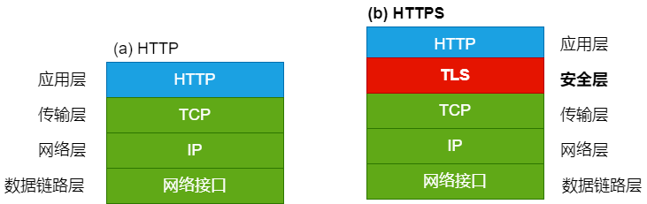

TLS 发展历程：

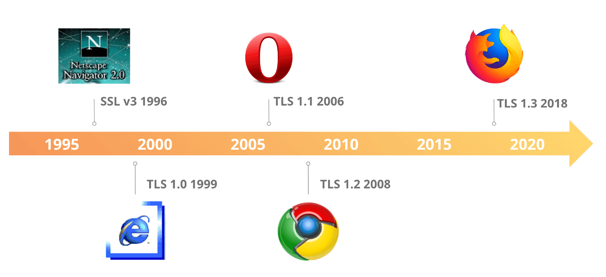

我们用 Chrome 浏览器打开一个网站时，通过开发者工具可以快速了解到使用的 TLS 协议以及相关安全参数：

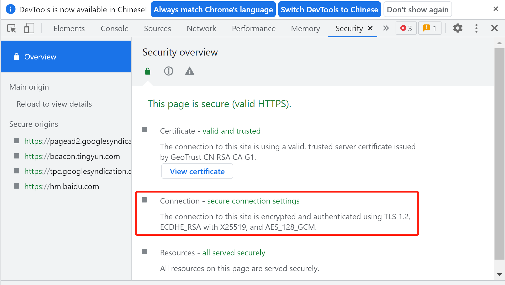

本文主要讨论 TLS 1.2 协议，为什么不是 TLS 1.1 或 TLS 1.3 呢？主要出于以下几个原因：

- TLS 1.2 非常普遍，基本每个网站都支持。根据 [ssllabs](https://www.ssllabs.com/ssl-pulse/) 的统计，99.8% 的网站支持 TLS 1.2。
- TLS 1.1 及其更早的版本存在安全性上的不足，已经很少使用，甚至已经逐步被启用:
  - [IETF 宣布正式弃用 TLS 1.0 和 TLS 1.1](https://www.cnbeta.com/articles/tech/1106281.htm)。
  - [Deprecating TLS 1.0 and TLS 1.1(RFC 8996)](https://www.rfc-editor.org/rfc/rfc8996.html)，于 2021 年形成正式 RFC。
- TLS 1.3 很好，很安全，更高效，它有着 0-RTT、握手中更少的信息泄露，支持它的 Web 站点越来越多，没有理由不学习它和讨论它。仅限于个人精力，未来有时间时进行学习总结。

从 TLS 1.2 的起草到形成最终 [RFC 5246](https://www.rfc-editor.org/rfc/rfc5246.html)，也是一个漫长的过程：

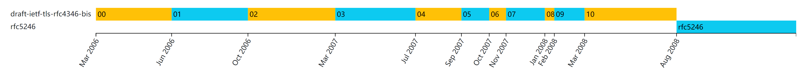

TLS 1.2 的目标：

1. 加密安全：TLS 需要能够建立两端的连接安全。
1. 互操作性：程序员能够开发利用 TLS 的应用程序，这些应用程序可以在不了解彼此代码的情况下成功交换密码参数。
1. 可扩展性：TLS 提供一个框架，必要时可以将新的加密方法纳入其中。
1. 相对效率：TLS 因包含高 CPU 的密码操作以及两端握手会降低性能。出于这个原因，TLS 协议包含了一个可选的会话缓存方案，提升效率。

TLS 1.2 协议所提供的安全层中，其实包含了多个子协议，同时子协议之间有的是并列，有的是分层：

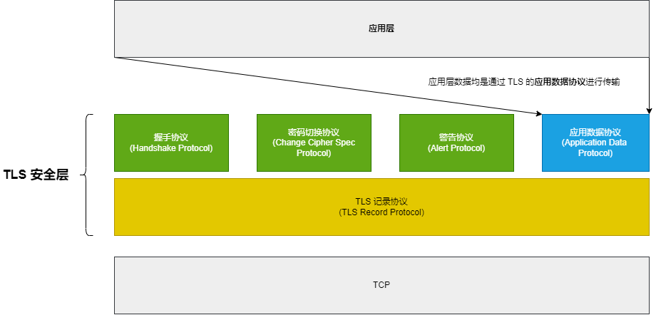

子协议 | 协议标识 | 描述
-|-|-
TLS 记录协议 | record | 作为单独的分层为其他子协议的通信基础。TLS 握手完成后，在该层进行数据的保护（MAC 和加密）。
握手协议 | handshake | 协商 record layer 所需要的加密参数，同时也会认证双端身份。
密码切换协议 | change_cipher_spec | 该协议发出的消息是加密通道启动的信号。换句话说，该协议是 record layer 是否对数据进行加解密的分界线。
警告协议 | alert | 传达警告或致命的信息。具有致命级别的警告消息息会导致连接立即终止。
应用数据协议 | application_data | 该协议本质上就是 TLS 上层应用数据，TLS 保护的就是这些数据。

## Record Protocol

记录协议，即 Record Protocol，它作为 TLS 中的一个单独分层为其他 TLS 子协议的传输提供一个规范，因此 Record Protocol 单独形成一个层即 Record Layer。

Record Layer 为上层数据传输提供了以下能力：

- 分段（Fragment）
- 压缩（Compress）
- 一致性
- 机要性

如下所示：

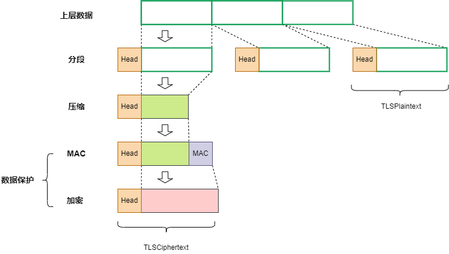

**注意：**

- 上图中的分段、压缩、MAC、加密的 HEAD 部分数据主要包括：
  - 上层协议的类型（例如指出是 handshake 或者是 alert）
  - TLS 协议版本
  - HEAD 后面跟着的数据长度
- 不同的 HEAD 可能不同，例如分段的 HEAD 和压缩的 HEAD 可能不同（因为压缩后，数据长度变了）。
- 有的数据保护可能没有显式的 MAC 添加，例如 AEAD 这类的加密算法，MAC 包含在加密算法中了。
- 有的数据保护中使用的加密算法可能还会添加额外的信息，例如 AES 还会添加 IV 等初始化向量数据。

### Record 安全参数

在 Record Layer 要对数据进行压缩、MAC、加密等，那以什么算法来执行，而密钥、长度等又是怎么确定的呢？

Record Layer 需要为上层提供了设置这些安全参数的接口，同时，上层需要为 Record Layer 提供这些安全参数：

安全参数 | 描述
-|-
connection end | 这个 end 是 endpoint 的含义。标识自己在此连接中被视为 “客户端” 还是 “服务器”。
master secret | 一个 48 字节的对称密钥，由 TLS 握手协议协商而得。
PRF algorithm | 指定伪随机函数算法。master secret 并不会直接用作与 MAC 和加密，而是需要从 master secret 派生出 MAC 和加密的密钥，PRF 就是指的派生算法。固定为 PRF_SHA256。
client random | 客户端提供的 32 字节随机数。用于结合 master secret 和 PRF 派生出 MAC 和加密密钥。
server random | 服务器提供的 32 字节随机数。用于结合 master secret 和 PRF 派生出 MAC 和加密密钥。
bulk encryption algorithm | 用于加密的算法。该参数包括该算法的密钥大小，密码的块大小，以及显式和隐式初始化向量（或随机数）的长度等等所有加密相关的参数（除了密钥，因为密钥是派生出来的）。
MAC algorithm | 用于消息认证的算法，包括 MAC 的所有参数（除了密钥，因为密钥是派生出来的）。
compression algorithm | 用于数据压缩的算法。该参数必须包括算法进行压缩所需的所有信息。

完整的 TLS 1.2 Record Protocol 安全参数如下所示：

```txt
struct {
    ConnectionEnd          entity;
    PRFAlgorithm           prf_algorithm;

    BulkCipherAlgorithm    bulk_cipher_algorithm;
    CipherType             cipher_type;
    uint8                  enc_key_length;
    uint8                  block_length;
    uint8                  fixed_iv_length;
    uint8                  record_iv_length;

    MACAlgorithm           mac_algorithm;
    uint8                  mac_length;
    uint8                  mac_key_length;

    CompressionMethod      compression_algorithm;

    opaque                 master_secret[48];

    opaque                 client_random[32];
    opaque                 server_random[32];
} SecurityParameters;

enum { server, client } ConnectionEnd;

enum { tls_prf_sha256 } PRFAlgorithm;

enum { null, rc4, 3des, aes } BulkCipherAlgorithm;

enum { stream, block, aead } CipherType;

enum { null, hmac_md5, hmac_sha1, hmac_sha256, hmac_sha384, hmac_sha512} MACAlgorithm;

enum { null(0), (255) } CompressionMethod;
```

**注意：**

- 上面这样的数据结构是比较容易理解的，类似于 C 语言，但并非 C 语言，而是 TLS 1.2 协议中专门定义的表述性语言。
- 这里对有些不太容易理解，或者容易误解的地方，的这里提一下：
  - `opaque` 代表不透明的二进制数据，意思是当前结构体或者层中，并不理解该数据的内部结构，只能从变量上来判断该数据的作用。
  - `opaque client_random[32];` 这个代表的是 32 字节数据。
  - `T t[32];` 这里 t 仍然代表 32 字节的数据。若假设一个 T 占 4 字节，则意味着一个 t 是 8 个连续 T 的数组，一共占 32 字节。

#### Record 密钥计算

上面提到协商出来的 master secret 不会直接用作与 MAC 和加密，而是用来派生真实密钥的，那么实际的密钥到底是怎么生成的呢？

这里做个简单的介绍，更详细的内容可以参考 [HMAC and the Pseudorandom Function](https://www.rfc-editor.org/rfc/rfc5246.html#section-5) 和 [Key Calculation](https://www.rfc-editor.org/rfc/rfc5246.html#section-6.3)：

首先，需要理解的是，PRF 可以将任何一个 secret，再加上一个 Label，派生出任意长度且完全随机的新 secret（其实就是将原 secret 给增长了，这种又叫 Expanded Secret，同时他们两者之间在统计学意义上认为是高熵的，即完全独立和无关的）：

```txt
expanded secret = PRF(origin secret, label, seed)
```

- 这里 origin secret 就是 master secret
- 这里 Label 代表用来干嘛。当然，PRF 本身并不理解用来干嘛，只是方便给不同的业务使用相同的 master secret 派生出不同且完全独立的 expanded secret。
- seed 是一个随机数种子，不同的随机数种子生成的 expanded secret 也是完全独立的。

可能有一个疑问，为什么 Label 不能作为 seed 用？其实是可以的，算法底层实现中，seed 和 label 就是拼接起来使用的。这里这是为了方便做区分：

```txt
/* P_<hash> 是 PRF 底层算法，可以不用纠结到底是怎么实现的，只是让大家知道 label 和 seed 其实对于底层算法是没有区分的 */

PRF(secret, label, seed) = P_<hash>(secret, label + seed)
```

通过 master secret 派生出一个非常长的 expanded secret，然后再把这个 expanded secret 切成不同的部分，就形成了用于 MAC、加密的密钥了：

```txt
key_block = PRF(master_secret,                            /* origin secret */
                "key expansion",                          /* label */
                server_random + client_random             /* seed */
                );

/* 将 key_block 按长度进行切割，得到 MAC 密钥、加密密钥、IV 等 */

client_write_MAC_key[mac_key_length]
server_write_MAC_key[mac_key_length]

client_write_key[enc_key_length]
server_write_key[enc_key_length]

client_write_IV[fixed_iv_length]
server_write_IV[fixed_iv_length]
```

**注意：**

- 这些 master_secret、server_random、client_random、各种 key_length 都是由 TLS 握手协商出来的，是上层来设置的安全参数。
- 上层设置安全参数后，TLS Record Layer 自己根据这些安全参数按上述算法生成出内部实际使用的密钥。

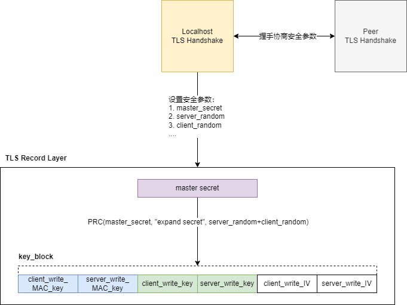

#### 启用 Record 安全参数和安全保护

我们再设置 Record Layer 安全参数后，什么时候 Record Layer 会使用这些安全参数对数据进行保护呢？又如何触发呢？

换句话说，TLS 1.2 协议是什么时候开始进行安全传输的？

连接建立后，无论是否进行了握手，是否协商了安全参数，或者协商过程中，连接但凡使用了 TLS 1.2 协议，那么它在任意时刻都有两个内存区：

- Current，又可以细分为两个内存区：
  - Current read
  - Current write
- Pending，又可以细分为两个内存区：
  - Pending read
  - Pending write

一共四个内存区，四个内存区各有自己一套安全参数，并且这些内存区之间是独立的。它们的作用如下：

内存区 | 作用
-|-
Current read | Record Layer 的任何数据读操作，都是用 Current read 的安全参数。
Current write | Record Layer 的任何数据写操作，都是用 Current write 的安全参数。
Pending read | 握手协商的安全参数缓存在该缓冲区。
Pending write | 握手协商的安全参数缓存在该缓冲区。

这里讨论 Record Layer 的三个阶段其不同缓冲区的安全参数，以及是如何使用的：

1. **第一个阶段**，即连接建立后，握手开始前：

在该阶段，Current 和 Pending 内存中的安全参数均为空。Current 为空的安全参数意味着 Record Layer 当前不会对数据做任何压缩和保护。

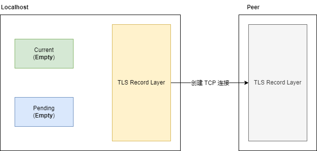

2. **第二个阶段**，即握手协商安全参数过程：

在该阶段，Record Layer 会想 Pending 内存区写入安全参数。当然此时 Current 的安全参数还是为空的。

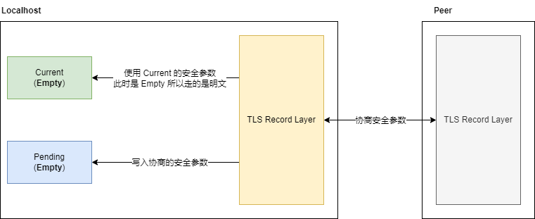

3. **第三个阶段**，握手协商安全参数完成：

在该阶段，Pending 内存区中的安全参数复制给了 Current 内存区，并且 Pending 内存区的安全参数被清零。

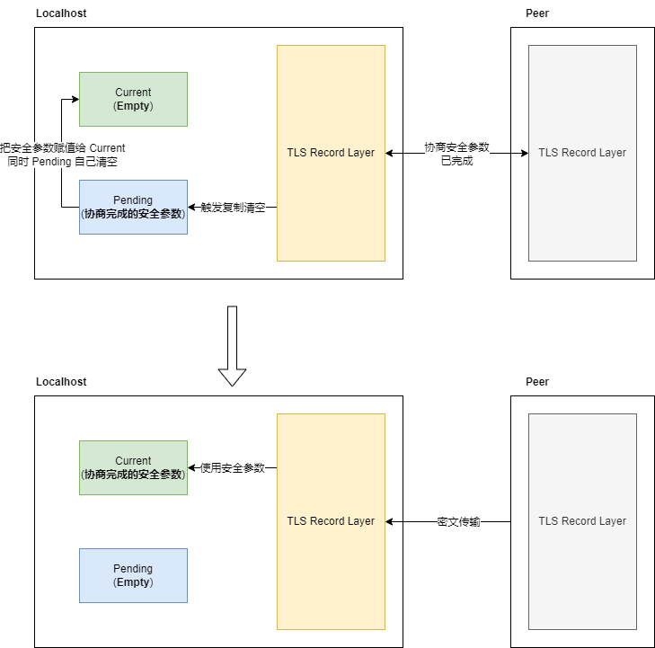

这里当握手协商完毕，会执行两个操作：

- Pending 内存区的安全参数会复制到 Current 内存区，并覆盖掉原 Current 内存的安全参数。
- Pending 内存区的安全会重置为无安全参数。

Pending 中协商好的安全参数复制给 Current，那么此时 Record Layer 的所有数据读写操作都变成加密的了。很明显，这其实本质上是一种双版本，或者双缓冲机制。

那什么时候认为握手协商完毕？在 TLS 1.2 协议中，Record Layer 收发 Change Cipher Spec 协议消息，就意味着协商完毕。

**注意：**

- Pending 复制给 Current 内存区并非是单个步骤的，因为其实一共又四个内存区： Current 的读写，以及 Pending 的读写。
- 发送 Change Cipher Spec，会触发 Pending write 复制给 Current write。
- 收到 Change Cipher Spec，会触发 Pending read 复制给 Current read。
- 在 TLS 1.2 协议中，更加官方的话术是称 Current write/read 和 Pending write/read 为四种连接状态，请参考 [Connection States](https://www.rfc-editor.org/rfc/rfc5246.html#section-6.1)（当然了，这些状态不是互斥的，这里指的是这些内存区的状态）：
  - Current write state
  - Current read state
  - Pending write state
  - Pending read state
- 这里仅仅认为使用内存区更直观的表述其含义，所以用的 “内存区” 这一术语。

TLS 1.2 协议中，连接状态本身的含义就是 Record Layer 的运行环境：

> A TLS connection state is the operating environment of the TLS Record Protocol.

在握手协议中，相关参数协商完成后，就会发送 Change Cipher Spec 消息，触发 Pending 到 Current 的复制：

```txt
 Client                                               Server

 ClientHello                  -------->
                                                 ServerHello
                                                 Certificate*
                                         ServerKeyExchange*
                                         CertificateRequest*
                             <--------      ServerHelloDone
 Certificate*
 ClientKeyExchange
 CertificateVerify*

+---------------------------------------------------------------------+
|                                                                     |
| [ChangeCipherSpec]                                                  |
| Finished                     -------->                              |
|                                        [ChangeCipherSpec]           |
|                             <--------            Finished           |
|                                                                     |
+---------------------------------------------------------------------+

 Application Data             <------->     Application Data
```

**注意：**

- Client 首先发送 ChangeCipherSpec，会让 Client 首先启用写的安全参数（更具体而言，是让 Client 端的 Pending write 复制到 Current write 内存区），随后 Finished 使用 Current write 的安全参数加密发送。
- Server 随后收到 ChangeCipherSpec，会让 Server 启用读的安全参数（更具体而言，是让 Server 端的 Pending read 复制到 Current read 内存区），Server 解密 Client 发送的 Finished 并验证 Finished 数据是否符合预期。
- Server 再接着发送 ChangeCipherSpec，会让 Server 启用写的安全参数（更具体而言，是让 Server 端的 Pending write 复制到 Current write 内存区），随后 Finished 使用 Current write 的安全参数加密发送。
- 最后 client 收到 ChangeCipherSpec，会让 Client 启用读安全参数（更具体而言，是让 Client 端的呢 Pending read 复制到 Current read 内存区），随后 Client 解密 Server 发送的 Finished 并验证数据是否符合预期。
- 上图安全参数协商部分的消息，会在握手协议部分做更详细的解释。

### Record 分段

Record Layer 的上层数据，在进入 Record Layer 的时候，做的第一个事情就是给数据包添加头部并分段，最终形成 `TLSPlaintext` 的如下数据结构：

```txt
struct {
    ContentType type;                         /* 指明上层协议的含义，是个枚举，有这些协议：change_cipher_spec、alert、handshake、application_data */
    ProtocolVersion version;                  /* 正在使用的协议版本。 {3, 3} 代表 TLS 版本 1.2 */
    uint16 length;                            /* 下面那个 fragment 的长度（以字节为单位），长度不得超过 2^14 */
    opaque fragment[TLSPlaintext.length];     /* 上层数据 */
} TLSPlaintext;

enum {
    change_cipher_spec(20),
    alert(21),
    handshake(22),
    application_data(23),
    (255)
} ContentType;

struct {
    uint8 major;
    uint8 minor;
} ProtocolVersion;
```

**注意：**

- 可以认为 type, version, length 是该段中传输分段的头部。
- 这里说的 ContentType 不是指的 HTTP 的 Content-Type Header，这里指的是 Record 的上层协议枚举，例如 Handshake Protocol、Alert Protocol 这种。

### Record 压缩

如果安全参数中已经确定并指定了压缩算法，则会对 `TLSPlaintext` 进行压缩，并转换成 `TLSCompressed`：

```txt
struct {
    ContentType type;                               /* 和 TLSPlaintext.type 相同 */
    ProtocolVersion version;                        /* 和 TLSPlaintext.version 相同*/
    uint16 length;                                  /* 下面 fragment 的长度（以字节为单位），长度不得超过 2^14 + 1024 */
    opaque fragment[TLSCompressed.length];          /* TLSPlaintext.fragment 压缩后的数据 */
} TLSCompressed;
```

**注意：**

- 如果没有指定压缩算法，则不会进行压缩，`TLSPlaintext` 和 `TLSCompressed` 两个结构体的数据是一致的。

### Record 保护

Record 的保护主要是两方面：

- 目标：数据完整性。手段：使用 MAC 对称密钥进行数字签名。
- 目标：数据机要性。手段：使用读写对称密钥进行负载加密。

```txt
struct {
    ContentType type;                                       /* 和 TLSCompressed.type 相同 */
    ProtocolVersion version;                                /* 和 TLSCompressed.version 相同 */
    uint16 length;                                          /* TLSCiphertext.fragment 的长度（以字节为单位），长度不得超过 2^14 + 2048 */

    /* 不同的加密类型，会使用不同的密文数据 */
    select (SecurityParameters.cipher_type) {
        case stream: GenericStreamCipher;
        case block:  GenericBlockCipher;
        case aead:   GenericAEADCipher;
    } fragment;                                             /* TLSCompressed.fragment 的加密形式，其中带有 MAC */
} TLSCiphertext;
```

**注意：**

- 这里也可以看出来，头部数据其实是没有加密的。 

来看一下三种不同加密类型的数据结构和算法：

- 流加密算法（Stream Cipher），例如异或加密、RC4：

  ```txt
  stream-ciphered struct {
      opaque content[TLSCompressed.length];               /* 将 TLSCompressed.fragment 加密得到 */
      opaque MAC[SecurityParameters.mac_length];          /* 消息的 MAC 值 */
  } GenericStreamCipher;

  /************** MAC 的计算 ******************
  MAC(MAC_write_key, seq_num +
                     TLSCompressed.type +
                     TLSCompressed.version +
                     TLSCompressed.length +
                     TLSCompressed.fragment);
  该 Record 的 sequence number，每次建立连接时都会搞一个，和连接状态绑定，不同连接状态直接独立。
  很明显，MAC 有对头部进行完整性保护。
  ********************************/
  ```

- 块加密（CBC Block Cipher），例如 AES 算法：

  ```txt
  struct {
      opaque IV[SecurityParameters.record_iv_length];

      block-ciphered struct {
          /* 密文和 MAC，并且对于 MAC 的计算方式和流加密的一致 */
          opaque content[TLSCompressed.length];
          opaque MAC[SecurityParameters.mac_length];

          /* 块加密需要是块的整数倍，所以会有填充部分，这里指出填充的内容和长度 */
          uint8 padding[GenericBlockCipher.padding_length];
          uint8 padding_length;
      };
  } GenericBlockCipher;
  ```

- aead 类的加密算法，例如 AES_GCM：

  ```txt
  /* 这类加密算法中本身已经包含了 MAC 的计算，所以在这里的结构体中不会包含 MAC */
  struct {
      opaque nonce_explicit[SecurityParameters.record_iv_length];
      aead-ciphered struct {
          opaque content[TLSCompressed.length];
      };
  } GenericAEADCipher;
  
  /*
  AEAD 算法一般如下所示：
  
  AEADEncrypted = AEAD-Encrypt(write_key, nonce, plaintext, additional_data)
  
  这里是需要一个附加数据的，这个附加数据就是用来构造 MAC 的（指出除了密文本身外，需要保护哪些数据的一致性）
  
  在 TLS Record Layer 中会进行如下运算：
  
  additional_data = seq_num +
                    TLSCompressed.type +
                    TLSCompressed.version +
                    TLSCompressed.length;
  
  其实基本和流加密的差不多，只是没加上 fragment，因为这是 AEAD 加密算法自己加的。
  */
  ```

## Handshake Protocol

完整的握手协议流程：

```txt
  Client                                               Server
  
  ClientHello                  -------->
                                                  ServerHello
                                                  Certificate*
                                            ServerKeyExchange*
                                           CertificateRequest*
                              <--------       ServerHelloDone
  Certificate*
  ClientKeyExchange
  CertificateVerify*
  [ChangeCipherSpec]
  Finished                     -------->
                                            [ChangeCipherSpec]
                               <--------             Finished
  Application Data             <------->     Application Data
```

消息介绍：

消息 | 发送方 | 必有 | 发送条件 | 描述
-|-|-|-|-
ClientHello | Client | Y | - | 用以告诉 Server 自己支持的所有密钥交换方法，所有安全参数，以及所有签名算法。
ServerHello | Server | Y | - | Server 将自己选择的密钥交换方法、安全参数和签名算法告诉客户端。
Certificate* | Server | Y | 密钥交换算法需要使用证书进行认证的，Server 就必须发送一个 Certificate | 发送 Server 的证书链（包括自己的证书，但不包括根证书）。
ServerKeyExchange* | Server | N | 如果密钥交换算法不是 RSA、DH_DSS、DH_RSA 则需要发送该消息 | 发送密钥交换算法中，Server 需要告诉客户端的消息。例如 DH 算法中，Server 要告诉客户端素数。
CertificateRequest* | Server | N | 如果 Server 希望验证 Client，那么会发送该消息 | 告诉客户端自己需要什么样的客户端证书，以及签名方式。
ServerHelloDone | Server | Y | - | 表明 Server 发送的消息结束，后续 Server 等待接收客户端信息。
Certificate* | Client | N | Server 发送了 CertificateRequest 后需要发送该消息 | 发送客户端证书。即便客户端没有符合条件的证书，也需要发送该消息，但证书数组为空。
ClientKeyExchange | Client | Y | - | 客户端发送密钥交换算法中客户端需要提供的信息。RSA 和 DH 算法发送的消息是不同的。例如 RSA 发送的是服务器证书公钥加密的随机数。
CertificateVerify* | Client | N | 客户端发送了 Certificate 消息，则还需要发送该验证消息 | 客户端自己私钥对一个数据的签名，该数据 Server 端也有。Server 会用客户端证书公钥验签。
Finished | Client & Server | Y | - | 客户端最后发送 Finished 消息，该消息已经被密钥加密通信。Server 端也会回一个。目的是确认双方的密钥真的达成一致了（能够解密对方的，就达成一致了，从 Record Layer 的密钥可以看出，两方加密使用的密钥是不一样的）。
Application Data | Client & Server | Y | - | 实际需要保护的应用层数据。

**注意：**

- ClientHello 和 ServerHello 中提到的签名算法，指的是握手过程中用证书私钥签名的算法，并非 Record Layer 用的。是用 Extensions 中的 signature_algorithm 扩展来支持的。
- 这里有一个用中括号 `[]` 包裹起来的 `[ChangeCipherSpec]`，这代表该消息并非是属于 Handshake Protocol，而是 ChangeCipherSpec Protocol。
- `[ChangeCipherSpec]` 该消息是必须发送的，只是穿插在了握手协议之间，用于在 Record Layer 中启动安全参数，后续的加解密就是受到加密和 MAC 保护的了。

这里，连接的 TLS 握手需要至少 2 个 RTT，再加上连接建立的握手，则至少需要 3 RTT 才能开始发送应用数据，效率会受到影响。

为了加快数据传输效率，可以采用会话恢复技术。在 TLS 握手完成后，是会建立会话的，并且 Server 会告诉 Client 一个会话 ID（SessionID），用以方便 Client 后续恢复会话。

Client 在下次建立连接的时候，带上之前的会话 ID，Server 会解开会话 ID，并获取之前协商好的参数（当然，这里其实要求客户端也缓存了之前协商好的安全参数），然后双方就可以重新恢复安全连接了。

会话恢复的握手协议流程：

```txt
  Client                                                Server
  
  ClientHello                   -------->
                                                  ServerHello
                                           [ChangeCipherSpec]
                               <--------             Finished
  [ChangeCipherSpec]
  Finished                      -------->
  Application Data              <------->     Application Data
```

这里，节约了一个 RTT，即 TLS 握手需要 1 个 RTT，同时因为 TCP 连接建立占一个 RTT，所以 TLS 1.2 的会话恢复技术需要 2 RTT 的时间。

**注意：**

- 客户端最后的 Finished 和 Application Data 是一起发送的。
- TLS 1.3 可以支持 0-RTT，简单来说，就是把会话 ID 交给 Server 的时候，把密文数据也一起丢给 Server 了。

### 消息详解

TLS 1.2 定义了握手阶段的各个消息所包含的内容和规范。

#### HelloRequest

可以在任意时间由 Server 发起，这在签名的握手流程中并未标出，因为这是一个特殊的消息。

HelloRequest 是一个简单的通知，告诉 Client 应该开始重协商流程，Client 应该在合适的时候发起 ClientHello，以重新开始协商。

该消息是一种信号，因此本身不需要传递任何负载信息。

```txt
struct { } HelloRequest;
```

**注意：**

- 如果 Server 发送了一个 HelloRequest 但没有收到一个 ClientHello 响应，它应该用一个致命错误 alert 消息关闭连接。
- 在发送一个 HelloRequest 之后，Server 不应该重复这个请求（直到握手协商完成）。

#### ClientHello

当一个 Client 第一次连接一个 Server 时，发送的第一条消息必须是 ClientHello。Client 也能发送一个 ClientHello 作为对 HelloRequest 的响应。

ClientHello 提供了客户端支持的安全参数，包括：

- 加密套件，包括：
  - 密钥交换算法
  - Record 的加密算法
  - Record 的 MAC 算法
- Client 的随机数
- 压缩算法

此外：

- 如果需要做会话恢复，Client 需要提供 Session ID。
- Client 需要通过 Extensions 给出自己支持和证书相关的公钥私钥签名算法。

具体结构为：

```txt
struct {
    ProtocolVersion client_version;                     /* 客户端希望在此会话期间进行通信的 TLS 协议的版本 */
                                                        /* 这应该是客户端支持的最新版本。TLS 1.2 这里的取值为 {3, 3} */
    Random random;                                      /* 客户端生成的随机数 */
    SessionID session_id;                               /* 客户端希望用于此连接的会话 ID
                                                        /* 如果没有可用的 session_id，或者客户端希望生成新的安全参数，则该字段为空。 */

    CipherSuite cipher_suites<2..2^16-2>;               /* 这是客户端支持的加密选项的列表，其中客户端的首选优先。*/
                                                        /* 如果 session_id 字段不为空（会话恢复请求），该向量必须至少包含来自该会话的 cipher_suite。 */
                                                        /* 每个密码套件都定义了一个密钥交换算法、一个加密算法（包括密钥长度）、一个 MAC 算法和一个 PRF。 */
                                                        /* 服务器将选择一个密码套件，或者，如果没有提供可接受的选择，则返回握手失败警报并关闭连接。 */

    CompressionMethod compression_methods<1..2^8-1>;    /* 这是客户端支持的压缩方法列表，按客户端偏好排序。 */
                                                        /* 如果 session_id 字段不为空（会话恢复请求），它必须包含来自该会话的压缩方法。 */

    select (extensions_present) {                       /* 扩展列表，客户端可以通过在扩展字段中发送数据来向服务器请求扩展功能。 */
        case false:
            struct {};
        case true:
            Extension extensions<0..2^16-1>;
    };
} ClientHello;

struct {
    uint8 major;
    uint8 minor;
} ProtocolVersion;

struct {
    uint32 gmt_unix_time;                       /* 采用标准 UNIX 32 位格式的当前时间和日期。采用发送方的内部时钟。该时间并不需要精确 */
    opaque random_bytes[28];                    /* 28 字节随机数 */
} Random;
```

TLS 1.2 协议中定义了如下密码套件：

```txt
/***************************************
【初始套件】
初始时，用的密钥套件是：`TLS_NULL_WITH_NULL_NULL`，是该通道上第一次握手期间 TLS 连接的初始状态。
不得在 Hello Message 中用该套件，因为它不提供安全连接的保护。
***************************************/
CipherSuite TLS_NULL_WITH_NULL_NULL               = { 0x00,0x00 };


/***************************************
【RSA 密钥交换的套件】
以下 CipherSuite 定义要求服务器提供可用于密钥交换的 RSA 证书。
同时，服务器可以在 Certificate Request 消息中请求 Client 提供任何具有签名能力的证书。
***************************************/
CipherSuite TLS_RSA_WITH_NULL_MD5                 = { 0x00,0x01 };
CipherSuite TLS_RSA_WITH_NULL_SHA                 = { 0x00,0x02 };
CipherSuite TLS_RSA_WITH_NULL_SHA256              = { 0x00,0x3B };
CipherSuite TLS_RSA_WITH_RC4_128_MD5              = { 0x00,0x04 };
CipherSuite TLS_RSA_WITH_RC4_128_SHA              = { 0x00,0x05 };
CipherSuite TLS_RSA_WITH_3DES_EDE_CBC_SHA         = { 0x00,0x0A };
CipherSuite TLS_RSA_WITH_AES_128_CBC_SHA          = { 0x00,0x2F };
CipherSuite TLS_RSA_WITH_AES_256_CBC_SHA          = { 0x00,0x35 };
CipherSuite TLS_RSA_WITH_AES_128_CBC_SHA256       = { 0x00,0x3C };
CipherSuite TLS_RSA_WITH_AES_256_CBC_SHA256       = { 0x00,0x3D };


/***************************************
【DH 密钥交换的套件】
以下密码套件定义用于服务器身份验证（以及可选的客户端身份验证）Diffie-Hellman。 
DH 表示密码套件，其中服务器的证书包含由证书颁发机构 (CA) 签名的 Diffie-Hellman 参数。 
DHE 表示临时 Diffie-Hellman，其中 Diffie-Hellman 参数由 CA 签署的具有签名能力的证书签名。
***************************************/
CipherSuite TLS_DH_DSS_WITH_3DES_EDE_CBC_SHA      = { 0x00,0x0D };
CipherSuite TLS_DH_RSA_WITH_3DES_EDE_CBC_SHA      = { 0x00,0x10 };
CipherSuite TLS_DHE_DSS_WITH_3DES_EDE_CBC_SHA     = { 0x00,0x13 };
CipherSuite TLS_DHE_RSA_WITH_3DES_EDE_CBC_SHA     = { 0x00,0x16 };
CipherSuite TLS_DH_DSS_WITH_AES_128_CBC_SHA       = { 0x00,0x30 };
CipherSuite TLS_DH_RSA_WITH_AES_128_CBC_SHA       = { 0x00,0x31 };
CipherSuite TLS_DHE_DSS_WITH_AES_128_CBC_SHA      = { 0x00,0x32 };
CipherSuite TLS_DHE_RSA_WITH_AES_128_CBC_SHA      = { 0x00,0x33 };
CipherSuite TLS_DH_DSS_WITH_AES_256_CBC_SHA       = { 0x00,0x36 };
CipherSuite TLS_DH_RSA_WITH_AES_256_CBC_SHA       = { 0x00,0x37 };
CipherSuite TLS_DHE_DSS_WITH_AES_256_CBC_SHA      = { 0x00,0x38 };
CipherSuite TLS_DHE_RSA_WITH_AES_256_CBC_SHA      = { 0x00,0x39 };
CipherSuite TLS_DH_DSS_WITH_AES_128_CBC_SHA256    = { 0x00,0x3E };
CipherSuite TLS_DH_RSA_WITH_AES_128_CBC_SHA256    = { 0x00,0x3F };
CipherSuite TLS_DHE_DSS_WITH_AES_128_CBC_SHA256   = { 0x00,0x40 };
CipherSuite TLS_DHE_RSA_WITH_AES_128_CBC_SHA256   = { 0x00,0x67 };
CipherSuite TLS_DH_DSS_WITH_AES_256_CBC_SHA256    = { 0x00,0x68 };
CipherSuite TLS_DH_RSA_WITH_AES_256_CBC_SHA256    = { 0x00,0x69 };
CipherSuite TLS_DHE_DSS_WITH_AES_256_CBC_SHA256   = { 0x00,0x6A };
CipherSuite TLS_DHE_RSA_WITH_AES_256_CBC_SHA256   = { 0x00,0x6B };


/***************************************
【匿名 DH 密钥交换的套件】
匿名交换，后续就不需要 Server 再发 Certificate 消息了。
以下密码套件用于完全匿名的 Diffie-Hellman 通信，其中任何一方都未经身份验证。 请注意，此模式容易受到中间人攻击。
除非应用层明确要求允许匿名密钥交换，否则 TLS 1.2 实现不得使用这些密码套件。
***************************************/
CipherSuite TLS_DH_anon_WITH_RC4_128_MD5          = { 0x00,0x18 };
CipherSuite TLS_DH_anon_WITH_3DES_EDE_CBC_SHA     = { 0x00,0x1B };
CipherSuite TLS_DH_anon_WITH_AES_128_CBC_SHA      = { 0x00,0x34 };
CipherSuite TLS_DH_anon_WITH_AES_256_CBC_SHA      = { 0x00,0x3A };
CipherSuite TLS_DH_anon_WITH_AES_128_CBC_SHA256   = { 0x00,0x6C };
CipherSuite TLS_DH_anon_WITH_AES_256_CBC_SHA256   = { 0x00,0x6D };
```

而对于 TLS 1.2 中的压缩算法：

```txt
enum { null(0), (255) } CompressionMethod;
```

看起来 TLS 1.2 握手的时候目前根本没有压缩算法。此外，TLS 1.2 协议中要求该字段是必填，同时客户端和服务器双方都必须支持 CompressionMethod.null 的压缩方法（即不压缩）。

> This vector MUST contain, and all implementations MUST support, CompressionMethod.null. Thus, a client and server will always be able to agree on a compression method.

有一些 RFC 中提出了新的 CompressionMethod，但是看起来用的并不广泛。随便抓一个包都可以看到未启动压缩：

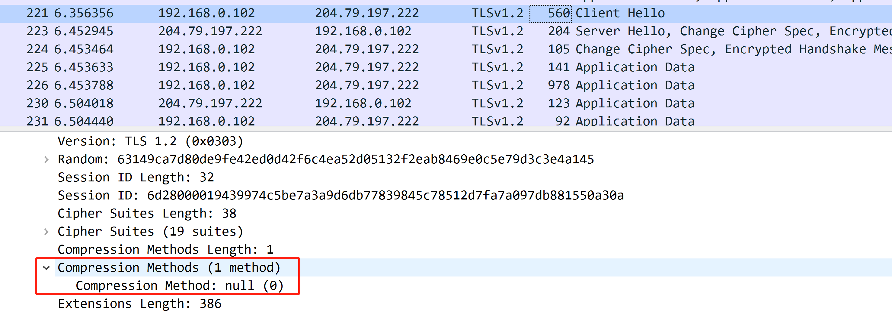

我个人也认为启动压缩意义不大，因为 HTTP 应用层经常会给 HTTP 消息压缩数据，所以到 TLS Record Layer 时，协议数据已经比较高熵了，不太容易能继续压小。

对于扩展，有一个 ClientHello 必须要传递的重要扩展：**signature_algorithms**，该扩展告诉 Server 自己可以能够支持哪些证书私钥签名的验证，Server 自己可以用其中的算法来作为签名。

```txt
struct {
    ExtensionType extension_type;           /* 扩展项的类型 */
    opaque extension_data<0..2^16-1>;       /* 针对 ExtensionType 的信息 */
} Extension;

enum {
    signature_algorithms(13), (65535)
} ExtensionType;


/* 这个是 signature_algorithms 的内容，列出了客户端愿意验证的单个哈希/签名对，最期望的放在最前面 */
SignatureAndHashAlgorithm supported_signature_algorithms<2..2^16-2>;

/* Hash 和 Signature 算法成对出现 */
struct {
    HashAlgorithm hash;                     /* 该字段表示可以使用的哈希算法。 */
    SignatureAlgorithm signature;           /* 该字段表示可以使用的签名算法。 */
} SignatureAndHashAlgorithm;

enum {
    none(0),
    md5(1),
    sha1(2),
    sha224(3),
    sha256(4),
    sha384(5),
    sha512(6), (255)
} HashAlgorithm;

enum {
    anonymous(0),
    rsa(1),
    dsa(2),
    ecdsa(3),
    (255)
} SignatureAlgorithm;
```

**注意：**

- Server 不能返回此扩展，只能被动接受 client 的该扩展。

抓包可以看到支持的签名算法扩展：

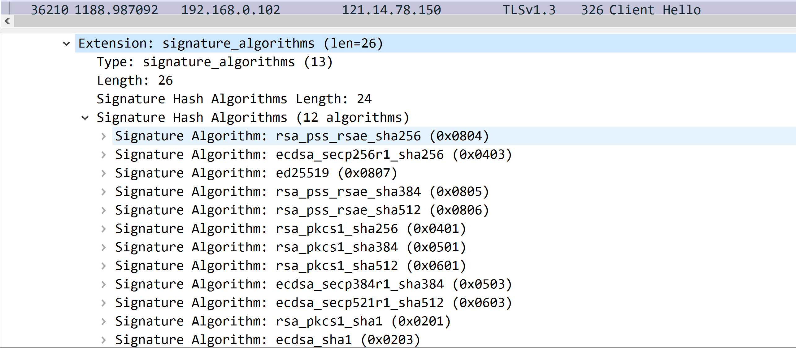

#### ServerHello

ClientHello 告诉了 Server 客户端可以支持的安全参数，那么 Server 找到一个可接受的算法集时，Server 发送 ServerHello 消息作为对 ClientHello 消息的响应。

除此外，Server 提供自己的随机数。

```txt
struct {
    ProtocolVersion server_version;                     /* 确定使用的 TLS 版本 */
    Random random;                                      /* Server 的随机数 */
    SessionID session_id;                               /* 如果为新会话，这里会生成一个新的，方便后续会话恢复。*/
                                                        /*如果是复用会话，这里保持和 ClientHello 的会话 ID 一致 */
    CipherSuite cipher_suite;                           /* Server 从 ClientHello 的密码套件中选择一个 */
    CompressionMethod compression_method;               /* Server 从 ClientHello 的压缩算法中选择一个 */

    select (extensions_present) {                       /* Server 发送的扩展，不需要发送对签名的选择 */
        case false:
            struct {};
        case true:
            Extension extensions<0..2^16-1>;
    };
} ServerHello;
```

这里需要注意的是，Server 不需要发送对 ClientHello 中签名选择的扩展。为什么呢？因为在所有的签名数据中，就会带上签名算法：

```txt
/* 所有需要签名的数据都满足如下格式 */
struct {
    SignatureAndHashAlgorithm algorithm;
    opaque signature<0..2^16-1>;
} DigitallySigned;

struct {
    HashAlgorithm hash;                     /* 该字段表示可以使用的哈希算法。 */
    SignatureAlgorithm signature;           /* 该字段表示可以使用的签名算法。 */
} SignatureAndHashAlgorithm;
```

一个简单的抓包：

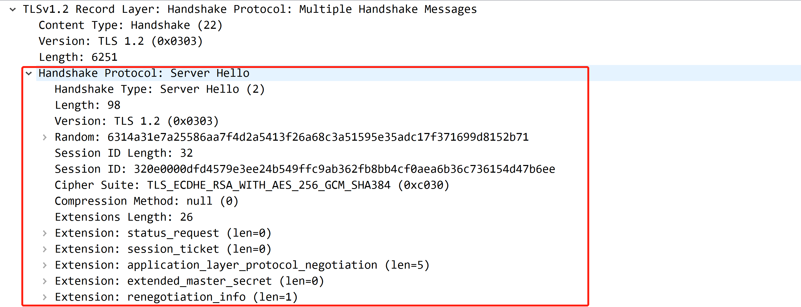

#### Certificate*

如果协商出的密码套件是 DH_anon，则 Server 不应该发送该消息，因为这种方法本身就是`匿名`的密钥交换算法，不需要对身份认证。

当然，选择这种 DH_anon 方式，跳过该消息的最大缺点是可能遭遇中间人攻击，因为没有对证书进行验证。

```txt
opaque ASN.1Cert<1..2^24-1>;

struct {
    ASN.1Cert certificate_list<0..2^24-1>;    /* 证书的序列（链） 发件人的证书必须在列表中排在第一位。*/
                                              /* 后面的每个证书必须直接证明它前面的证书。 */
                                              /* 因为根证书是额外派发的（例如内置在系统、或者自己去信赖的），所以根证书不用包含在此 */
} Certificate;
```

**注意：**

- 密钥交换算法的选择，会限制可以使用的证书类型，本文对此限制不做赘述，详细可以参考 [Server Certificate](https://www.rfc-editor.org/rfc/rfc5246.html#section-7.4.2)。

一个简单的抓包：

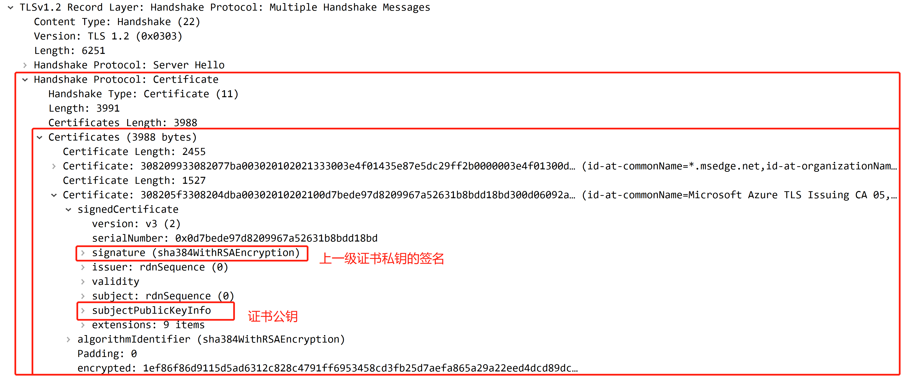

#### ServerKeyExchange*

Server 提供密钥交换算法所需要的更多信息，这些信息会被 Server 证书公钥签名，这也是一种 Client 对 Server 是否持有私钥的验证（认证 Server 身份）。因为不认证 Server 身份就接收 Server 提供的信息（如 DH 素数），容易受到攻击。

对于以下密钥交换算法是不用发送该消息的，因为不需要 Server 提供额外的信息：

- RSA：对于该交换算法，客户端使用公钥加密随机数即可交换对称密钥。
- DH_DSS：在证书中就会包含静态的 DH 信息，也就不需要额外再发送信息了。
- DH_RSA：原因同 DH_DSS。

该消息的结构如下：

```txt
enum {
    dhe_dss,
    dhe_rsa,
    dh_anon,
    rsa,
    dh_dss,
    dh_rsa
    /* may be extended, e.g., for ECDH -- see [TLSECC] */
} KeyExchangeAlgorithm;

/* 临时 DH 参数 */
struct {
    opaque dh_p<1..2^16-1>;     /* 用于 Diffie-Hellman 运算的素数模数。 */
    opaque dh_g<1..2^16-1>;     /* 用于 Diffie-Hellman 操作的生成器。*/
    opaque dh_Ys<1..2^16-1>;    /* 服务器的 Diffie-Hellman 公共值 (g^X mod p)。 */
} ServerDHParams;

 struct {
    select (KeyExchangeAlgorithm) {
        case dh_anon:
            ServerDHParams params;                  /* 服务器的密钥交换参数，dh_anon 是属于匿名交互。 */
        case dhe_dss:
        case dhe_rsa:
            ServerDHParams params;                  /* 服务器的密钥交换参数。 */
            digitally-signed struct {               /* 对于非匿名密钥交换，对服务器密钥交换参数进行签名。 */
                opaque client_random[32];
                opaque server_random[32];
                ServerDHParams params;
            } signed_params;
        case rsa:
        case dh_dss:
        case dh_rsa:
            struct {} ;                 /* message is omitted for rsa, dh_dss, and dh_rsa */
        /* may be extended, e.g., for ECDH -- see [TLSECC] */
    };
} ServerKeyExchange;
```

那可能有人就有疑问了，RSA 密钥交换算法使用证书公钥来加密密钥，为什么不认证 Server 的身份（是否持有私钥）呢？

其实，Server 的身份认证是推迟到了最后的 Finished 期间，因为 Server 需要用私钥才能解密出 Client 提供的对称密钥，进而派生出实际的加解密密钥，因此如果 Server 没有私钥，那么 Server 无法派生出正确的加密密钥和 MAC 密钥，进而 Client 是无法解密以及验证 Server 的 Finished 数据的。

#### CertificateRequest*

一个非匿名的 Server 可以选择性地请求一个 Client 发送的证书。

消息结构式：

```txt
struct {
    ClientCertificateType certificate_types<1..2^8-1>;        /* 要求客户端可能提供的证书类型列表 */

    SignatureAndHashAlgorithm
    supported_signature_algorithms<2^16-1>;   /* 服务器能够验证的哈希/签名算法对列表，按优先级降序排列 */
                                              /* 类似于 client hello 时的 signature_algorithms 扩展 */
                                              /* 用于协商客户端如何使用证书的 key 进行签名的 */

    DistinguishedName
    certificate_authorities<0..2^16-1>;       /* 可接受的 CA 列表，若为空则客户端可以发送任何 CA 的证书 */
} CertificateRequest;

enum {
    rsa_sign(1),                                    /* 包含 RSA key 的证书 */
    dss_sign(2),                                    /* 包含 DSA key 的证书 */
    rsa_fixed_dh(3),                                /* 包含静态 DH Key 的证书 */
    dss_fixed_dh(4),                                /* 包含静态 DH Key 的证书 */
    rsa_ephemeral_dh_RESERVED(5),
    dss_ephemeral_dh_RESERVED(6),
    fortezza_dms_RESERVED(20), (255)
} ClientCertificateType;

opaque DistinguishedName<1..2^16-1>;
```

#### ServerHelloDone

ServerHelloDone 消息已经被 Server 发送以表明 ServerHello 及其相关消息的结束。发送这个消息之后, Server 将会等待 Client 发过来的响应。

这个消息意味着 Server 发送完了所有支持密钥交换的消息，Client 能继续它的密钥协商，证书校验等步骤。

在收到 ServerHelloDone 消息之后，Client 应当验证 Server 提供的是否是有效的证书，如果有要求的话, 还需要进一步检查 Server hello 参数是否可以接受。

这仅是一个简单的信号，因此结构为空：

```txt
struct { } ServerHelloDone;
```

一个简单的抓包：

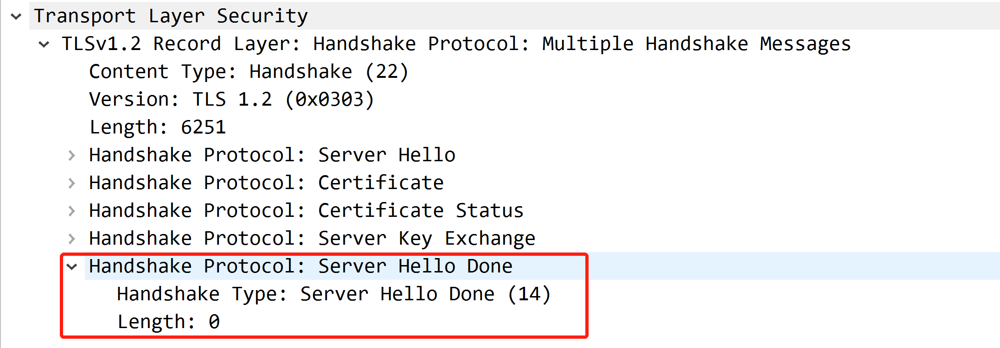

#### Client Certificate*

这个消息只能在 Server 请求客户端证书时发送（即 Server 发送 Certificate Request）。

如果没有合适的证书，Client 必须发送一个不带证书的 Client Certificate 消息。

该结构和 Server 的 Certificate 结构是相同的：

```txt
opaque ASN.1Cert<1..2^24-1>;

struct {
    ASN.1Cert certificate_list<0..2^24-1>;    /* 证书的序列（链） 发件人的证书必须在列表中排在第一位。*/
                                              /* 后面的每个证书必须直接证明它前面的证书。 */
                                              /* 因为根证书是额外派发的（例如内置在系统、或者自己去信赖的），所以根证书不用包含在此 */
} Certificate;
```

#### ClientKeyExchange

这个消息始终由 Client 发送，并且是首次握手必须发送的。该消息用于交换对称密钥。

**注意：**

- 这里交换的对称密钥其实是 pre master secret，而非在 Record Layer 的安全参数 master secret。
- master secret 是由 pre master secret 派生出来的。

master secret 的派生方法：

```txt
master_secret = PRF(pre_master_secret,
                    "master secret",
                    ClientHello.random + ServerHello.random)
                    [0..47];
```

双方对 pre_master_secret 达成一致后，就能各自计算出 master secret 了，进而可以在 Record Layer 推导出 MAC 和加密密钥。

ClientKeyExchange 的消息结构如下：

```txt
enum { implicit, explicit } PublicValueEncoding;

struct {
    select (PublicValueEncoding) {
        case implicit: struct { };
        case explicit: ECPoint ecdh_Yc;
    } ecdh_public;
} ClientECDiffieHellmanPublic;

struct {
  select (KeyExchangeAlgorithm) {
      case rsa:
          EncryptedPreMasterSecret;
      case dhe_dss:
      case dhe_rsa:
      case dh_dss:
      case dh_rsa:
      case dh_anon:
          ClientDiffieHellmanPublic;
      case ec_diffie_hellman: 
          ClientECDiffieHellmanPublic;
  } exchange_keys;
} ClientKeyExchange;
```

不同的密钥交换算法，最终的 ClientKeyExchange 消息结构是不同的。

对于 RSA 密钥交换算法：

```txt
struct {
    public-key-encrypted
    PreMasterSecret pre_master_secret;                  /* 此随机值由客户端生成，用于生成主密钥 */
                                                        /* 该值在传输的前会使用服务器公钥进行 RSA 加密 */
} EncryptedPreMasterSecret;

struct {
    ProtocolVersion client_version;                     /* 客户端支持的最新 TLS 版本。 这用于检测版本回滚攻击。 */
    opaque random[46];                                  /* 客户端生成的 46 字节的随机数 */
} PreMasterSecret;
```

对于 DH 交换算法：

```txt
enum {
    implicit,                                         /* 如果客户端发送的证书包含合适的 Diffie-Hellman 密钥 */
                                                      /* 则 Yc 是隐式的，不需要再次发送。此时枚举为 implicit */
    explicit                                          /* 客户端需要显式发送 Yc。此时枚举为 explicit */
} PublicValueEncoding;

struct {
    select (PublicValueEncoding) {
        case implicit: struct { };                      /* 隐式时，Yc 通过证书已经发送了，此时不必再发 */
        case explicit: opaque dh_Yc<1..2^16-1>;         /* 显式时，Yc 在这里发送 */
    } dh_public;
} ClientDiffieHellmanPublic;
```

一个简单的抓包：

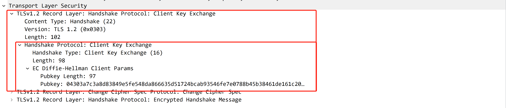

#### CertificateVerify*

这个消息用于对一个 Client 的证书进行显式验证。这个消息只能在 Client 发送了证书并且证书具有签名能力时才能发送。

消息结构为：

```txt
struct {
    digitally-signed struct {
        opaque handshake_messages[handshake_messages_length];
    }
} CertificateVerify;
```

这里的 handshake_message 包括了自握手以来的所有信息的拼接，即从 ClientHello 开始到本条信息（但是不包括本条信息）的所有信息。

在签名中使用的 hash 和签名算法必须是 Server 发送的 CertificateRequest 消息中 supported_signature_algorithms 字段所列出的算法中的一种。

**注意：**

- Server 如何知道 Client 用的是什么签名算法呢？前面也提到了，在 TLS 1.2 所有签名数据中，会包含使用的签名算法。

#### Finished

一个 Finished 消息一直会在一个 ChangeCipherSpec 消息后立即发送，以证明密钥交换和认证过程是成功的。

一个 ChangeCipherSpec 消息必须在其它握手消息和结束消息之间被接收。

Finished 的消息结构如下：

```txt
struct {
    opaque verify_data[verify_data_length];
} Finished;

verify_data =  PRF(master_secret, finished_label, Hash(handshake_messages))
               [0..verify_data_length-1];
```

finished_label 取值为：

- Client 发送的 Finished 消息，取值为 `client finished`
- Server 发送的 Finished 消息，取值为 `server finished`

handshake_messages 取值为：

- 所有在本次握手过程到但不包括本消息的消息中的数据。

一个简单的抓包，可以看出，Finished 是加密数据：

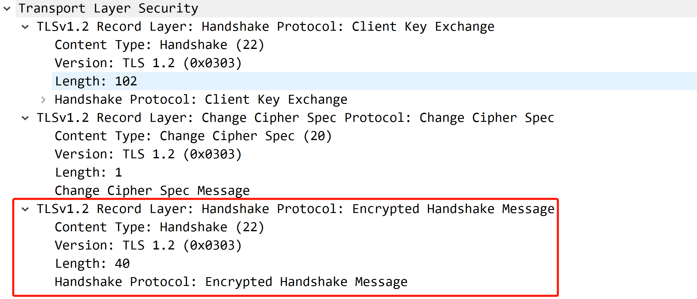

## Change Cipher Spec Protocol

Change Cipher Spec Protocol 的存在是为了发出信号，并进行连接状态的转换，启用新的连接状态（目的是为了启用相关的密码参数）。

该协议由单个消息组成，该消息在当前（不是挂起的）连接状态下被加密和压缩。该消息由一个值 1 的字节组成。

```txt
struct {
    enum { change_cipher_spec(1), (255) } type;
} ChangeCipherSpec;
```

客户端和服务器都能发送 ChangeCipherSpec 消息，通知接收方后续记录将受到新协商的密钥规范和密钥（就是将已经设置好密码参数的 Pending 状态设置到 Current 状态）。

接收到该消息，接收器指示记录层立即将 Pending read 复制到 Current read。

发送此消息后，发送者立即指示记录层将 Pending write 复制到 Current read。

ChangeCipherSpec 消息在安全参数已被商定之后并且在发送验证 Finished 消息之前在握手期间发送。

## Alert Protocol

 提供 alert 内容类型用来表示关闭信息和错误。与其他消息一样，alert 消息也会根据 Current 进行加密（当然，握手的时候 Current 一般是空，此时就没加密）。

协议消息数据结构：

```txt
enum { warning(1), fatal(2), (255) } AlertLevel;
      
struct {
    AlertLevel level;
    AlertDescription description;
} Alert;
```

TLS 1.2 的告警描述信息有：

```txt
enum {
    close_notify(0),
    unexpected_message(10),
    bad_record_mac(20),
    decryption_failed_RESERVED(21),
    record_overflow(22),
    decompression_failure(30),
    handshake_failure(40),
    no_certificate_RESERVED(41),
    bad_certificate(42),
    unsupported_certificate(43),
    certificate_revoked(44),
    certificate_expired(45),
    certificate_unknown(46),
    illegal_parameter(47),
    unknown_ca(48),
    access_denied(49),
    decode_error(50),
    decrypt_error(51),
    export_restriction_RESERVED(60),
    protocol_version(70),
    insufficient_security(71),
    internal_error(80),
    user_canceled(90),
    no_renegotiation(100),
    unsupported_extension(110),           /* new */
    (255)
} AlertDescription;
```

更多告警消息和错误处理相关内容，可以参考 [Alert Protocol](https://www.rfc-editor.org/rfc/rfc5246.html#section-7.2)。

## 安全

关于 TLS 1.2 协议中的安全部分，可以参考：

- [Implementation Notes](https://www.rfc-editor.org/rfc/rfc5246.html#appendix-D)
- [Backward Compatibility](https://www.rfc-editor.org/rfc/rfc5246.html#appendix-E)
- [Security Analysis](https://www.rfc-editor.org/rfc/rfc5246.html#appendix-F)

## 附录：参考文献

1. [TLS 1.2(RFC5246)](https://www.rfc-editor.org/rfc/rfc5246.html)
1. [Transport Layer Security (TLS) Extensions: Extension Definitions(RFC 6066)](https://www.rfc-editor.org/rfc/rfc6066)
1. [HTTPS 温故知新（一） —— 开篇](https://halfrost.com/https-begin/)
1. [HTTPS 温故知新（二） —— TLS 记录层协议](https://halfrost.com/https_record_layer/)
1. [HTTPS 温故知新（三） —— 直观感受 TLS 握手流程(上)](https://halfrost.com/https_tls1-2_handshake/)
1. [HTTPS 温故知新（四） —— 直观感受 TLS 握手流程(下)](https://halfrost.com/https_tls1-3_handshake/)
1. [HTTPS 温故知新（五） —— TLS 中的密钥计算](https://halfrost.com/https-key-cipher/)
1. [HTTPS 温故知新（六） —— TLS 中的 Extensions](https://halfrost.com/https-extensions/)
1. [理解 Deffie-Hellman 密钥交换算法](http://wsfdl.com/algorithm/2016/02/04/%E7%90%86%E8%A7%A3Diffie-Hellman%E5%AF%86%E9%92%A5%E4%BA%A4%E6%8D%A2%E7%AE%97%E6%B3%95.html)
1. [ssllabs](https://www.ssllabs.com/ssl-pulse/)
