# TSF4G TConnd

<!-- TOC -->

- [TSF4G TConnd](#tsf4g-tconnd)
    - [Overview](#overview)
    - [Work Mode](#work-mode)
        - [TDR Mode](#tdr-mode)
        - [QQ Mode](#qq-mode)
        - [GCP Mode](#gcp-mode)
    - [TConnd FRAME](#tconnd-frame)
    - [Connection](#connection)
        - [Connect](#connect)
        - [Close](#close)
        - [Relay](#relay)
        - [Route](#route)
        - [Queue](#queue)
    - [Application Message](#application-message)
    - [AuthN](#authn)
    - [Event Programe](#event-programe)
    - [Config](#config)
        - [Base Config](#base-config)
        - [TDR Config](#tdr-config)
        - [PDU Config](#pdu-config)
        - [Listener Config](#listener-config)
        - [Serializer Config](#serializer-config)
        - [NetTrans Config](#nettrans-config)
        - [Auth Config](#auth-config)
        - [Command Parameters](#command-parameters)
    - [Log](#log)
    - [References](#references)

<!-- /TOC -->

## Overview

什么是 TConnd？TConnd 是 Tsf4g 的组件中的一部分，用作于游戏接入层，全称为 `Tencent Connection Daemon`。

TConnd 在游戏架构中的定位下图一言以蔽之：

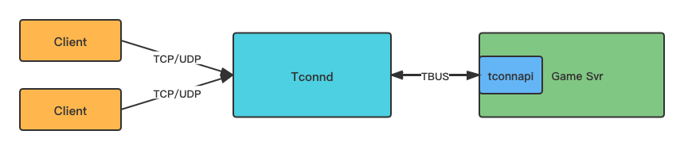

TConnd 为 Game Server 提供接入服务，使逻辑层不再关心网络层数据收发和连接管理。

## Work Mode

TConnd 有多种工作模式（例如 TDR Mode、QQ Mode、WEB Mode），现在主流采用的是 GCP 模式，不同的工作模式区别在于使用什么通信协议以及分别方式，请参考 [Work Mode](#work-mode)。

TConnd 支持的传输协议有：

- TCP
- UDP

TConnd 支持的分包方式有：

分包方式 | 描述
-|-
BY_TDR | 根据 TDR 元数据分包。
BY_CHAR | 根据字符分包，遇到指定的字符就认为是一个完整的包。
BY_STR | 根据字符串分包，遇到指定的字符串就认为是一个完整的包。
BY_QQ | 根据 TConnd 组件预定义的 TDR 元数据分包。
BY_GCP | 根据 TConnd 组件预定义的 TDR 元数据分包。
BY_WEB | 分为两种，一种是用 http 协议进行分包；一种是基于 TConnd 定义的 webpkg 协议分包。

这里介绍其中三个，并且 GCP Mode 是最主流的使用方式，会作为后续的主要内容。

### TDR Mode

TDR 指的是 TSF4G Data Represention，互娱研发部自研跨平台多语言数据表示组件，主要用于基于数据的序列化反序列化（支持二进制方式和 XML 文本方式）以及 ORM 数据存储。

TDR Mode 指的是通过 TDR 进行数据分包，并使用 TCP 协议进行数据透传。此时，TConnd Server 只是以纯粹的数据透传中间件的模式存在，通过 TDR 分包模式获取到一个完整的包后，即将报文转发给后端 SVR，不存在对连接的认证过程。

这种模式下，Game Client 使用 TCLAPI。

### QQ Mode

因为公司开发或者代理的游戏大多使用 QQ 账号进行登录，QQ Mode 实现了 QQ 登录验证，消息加解密，断线重连，跨服跳转等功能。

这种模式下，分包模式是 BY_QQ，并且 Game Client 使用 TQQAPI。

### GCP Mode

GCP 指的是 General Communication Protocol，通用通信协议，GCP Mode 即 Client 采用这种协议与 TConnd Server 进行数据交换。

QQ Mode 的缺点之一是只能使用 uint32_t 的 QQ 号，但是这已经不适合当前的游戏环境了，微信号等其他的登录方式也逐步崛起。

GCP Mode 使用 BY_GCP 的分包模式，并继承了 QQ Mode 的绝大部分能力，在此基础上提供了自定义认证的方式，能够进行 ID 映射等。

TConnd 在 GCP 模式中，可以在建立连接时校验 Client 的用户身份，如下图所示：

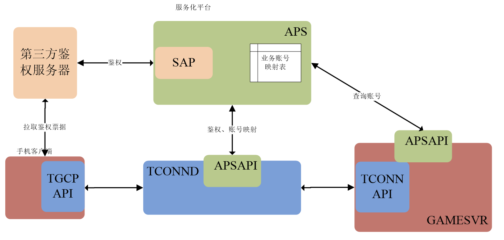

上图中，还存在一个特殊的 APS(AuthProxy Servic)，TConnd 通过 TCP 协议将 Client 凭证传递给 APS，由 APS 对凭证进行校验。

除此外，TConnd GCP 也具有加密通信的能力：通过 DH 协商机制，消息加密，消息压缩​。

## TConnd FRAME

TConnd Server 和 Game Client/Server 之间的通信方式：

- Game Client 和 TConnd 之间在 TCP/UDP 上，通过 TDR/QQ/GCP 等协议进行通信。
- TConnd 和 Game Server 之间在共享内存上，通过 FRAME 协议进行通信。


也就是说，FRAME 协议是由 TConnd 定义，用于 TConnd 进程与后台服务进程通信的消息格式。

frame 协议中，一个包有两部分组成：

- tframehead，协议头部
- message，应用层负载

对于协议头部，tframehead：

```cpp
struct tagtframehead {
  int8_t chVer;                   // 版本信息
  int8_t chCmd;                   // 消息命令，决定了消息 stCmdData 的格式
  int8_t chExtraType;             // 是否具有 stExtraInfo 信息
  int8_t chTimeStampType;         // 是否具有 stTimeStamp 信息
  int32_t iID;                    // 会话 ID，参考 Conneciont
  int32_t iConneIdx;              // 连接 ID，参考 Conneciont
  TFRAMEHEADDATA stExtraInfo;     // 主要包括连接 IP 信息
  TTIMESTAMPDATA stTimeStamp;     // 时间戳信息
  TFRAMECMDDATA stCmdData;        // 消息数据
};
```

tframehead 中有两个关键字段：

- chCmd，用于表示数据包的类型，决定了 `stCmdData` 中什么数据有效。
- stCmdData，是一个 union，根据不同的 chCmd，会使用其中的不结构数据：

  ```cpp
  union TFRAMECMDDATA {
    TFRAMECMDSTART stStart;
    TFRAMECMDSTOP stStop;
    TFRAMECMDINPROC stInproc;
    TFRAMECMDRELAY stRelay;
    TFRAMECMDNOTIFY stNotify;
    TFRAMECMDSETROUTING stSetRouting;
    TFRAMECMDSETROUTINGRSP stSetRoutingRsp;
    TFRAMECMDSETCONNLIMIT stSetConnLimit;
    TFRAMECMDSETCONNLIMITRSP stSetConnLimitRsp;
    TFRAMECMDEXGVER stExgVer;
    TFRAMECMDWAITNUMRSP stWaitNumRsp;
    TFRAMECMDSETWAITCTR stSetWaitCtr;
  };
  ```

对于应用层负载 message 而言：

- stCmdData 并不包含应用层负载，其仍然是属于头部信息
- 应用层负载紧跟 framehead 后，解包 framehead 数据后，包剩余的数据即应用层负载。

```cpp
int data_size;
char data[1024];
// 接收底层数据
tbus_recv(tbus_handle, TBUS_ADDR_ALL, tbus_addr, data, &data_size, 0);

// 解析出 tframehead
TFRAMEHEAD *tframe_head = nullptr;
int tframe_head_size = 0;
tconnapi_decode(data, data_size, &tframe_head, &tframe_head_size);

// 解析出应用层负载
int messag_size = data_size - tframe_head_size;
std::string message(data + tframe_head_size, messag_size);
```

## Connection

TConnd 进程使用连接池管理底层网络连接，每当 Game Client 和 TConnd 建立一个新的连接，TConnd Server 都会为其分配一个连接 ID，即 iConnIdx。

TConnd Server 向 Game Server 通知连接建立消息时（即 START 消息），会通过 tframehead 传递连接 ID：iConnIdx。

Game Server 中，一个连接通常对应了一个会话，需要在响应 START 消息时，通过 tframehead 传递会话 ID：iID。

在 TConnd 中，分为两种连接，长连接和短连接，这个长短并非针对于 TCP 连接而言，而是针对于 TConnd 而言，也就是说 TCP 连接始终是长连接。Game Server 在响应 START 消息时，需要指出使用长连接还是短连接：

- tframehead.iID == -1，使用短连接
- 其他情况，均为长连接。

TConnd 长连接和短连接的区别：

区别 | 长连接 | 短连接
-|-|-
上行消息 | 仅 START 消息中携带连接的源地址。 | 均携带连接的源地址。
连接关闭或异常断开 | 发送 STOP 消息。 | 不发送 STOP 消息。
iID 校验 | 检查是否一致，如果不一致则丢弃消息。 | 不检查 iID，而是检查 tframehead.IP/PORT，如果不一致则丢弃消息。

### Connect

这里提供 Game Client 连接建立流程，以及 Game Server 如何接受一个连接。

首先看一下 TDR Mode，这是一种简单的方式，这种方式没有鉴权，而且START 消息可以携带应用层数据（无论是 START 请求或是 START 响应）：
  
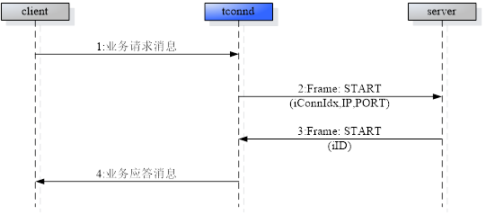

GCP Mode 是我们通常会选择的方式，在建立连接时，TConnd 会对用户身份进行鉴权，请参考 [AutnN](#authn)。

除此外，GCP Mode 下建立连接会对通信信道的加密，保证鉴权凭证，应用层数据等安全传输。这是一个基于 DH Key 交换的连接建立流程:

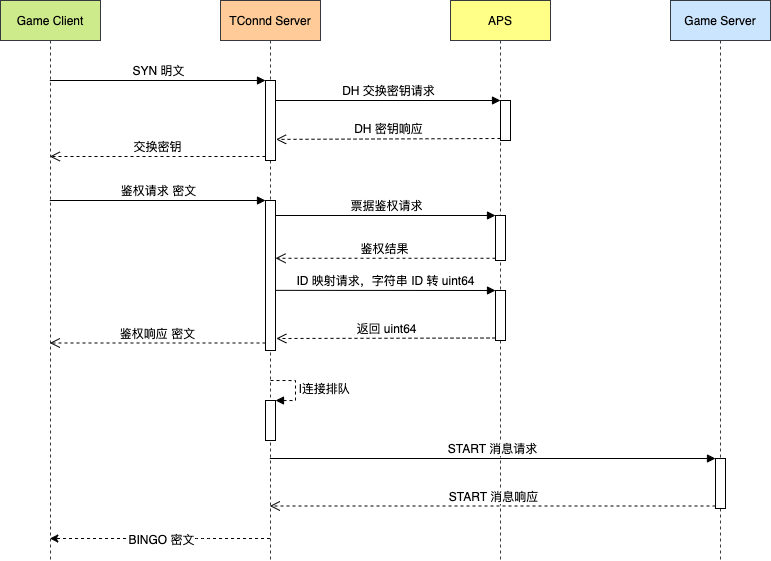

Game Client 连接建立的一个伪代码:

```cpp
int service_id = 2;
int platform = TGCP_ANDROID;
int auth_mode = TGCP_AUTH_NONE;
int encrypt_method = TGCP_ENCRYPT_METHOD_AES;
int key_making_method = TGCP_KEY_MAKING_INSVR;
int max_gamedata_len = 10240;
char* pszToken = "OezXcEiiBSKSxW0eoylIeKQ_2ms051l34J6BWkiyD....";
int timeout = 50000;  //50s

// 初始化连接的句柄
HTGCPAPI handle;
int rc = tgcpapi_create(&handle);

// 设置连接的通信方式，并初始化
rc = tgcpapi_init(handle, service_id, platform, auth_mode, encrypt_method,
                  key_making_method, max_gamedata_len);

// 设置连接的账号和凭证
TGCPACCOUNT account;
stAccount.uType = TGCP_ACCOUNT_TYPE_NONE;
stAccount.bFormat = TGCP_ACCOUNT_FORMAT_STRING;
strncpy(stAccount.stAccountValue.szID, "test account", sizeof(stAccount.stAccountValue.szID));
rc = tgcpapi_set_token(handle, pszToken, strlen(pszToken));
rc = tgcpapi_set_account(handle, &account);

// 建立连接，并等待直到超时
rc = tgcpapi_start_connection(handle, "127.0.0.1:8080", timeout);

// 连接正常，但是处于排队中
if (rc == TGCP_ERR_STAY_IN_QUEUE) {
  int iBingo = -1;
  QUEUENOTIFY stNotify;

  // 一直轮询直到成功
  while(iBingo <= 0) {
    tgcpapi_query_wait_notify(handle, &iBingo, &stNotify, timeout);
  }
}
```

除此外，也可以使用事件机制，异步建立连接，请参考 [Event Programe](#event-programe)。

### Close

连接断开有两种原因：

- 正常断开：
  - Game Client 主动断开，Game Client 主动发送 Socket Close 时会进行 Game Client 的主动断开。

    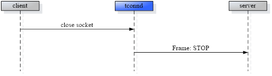

  - Game Server 主动断开，Game Server 主动发送 STOP 消息时，进行主动断开。

    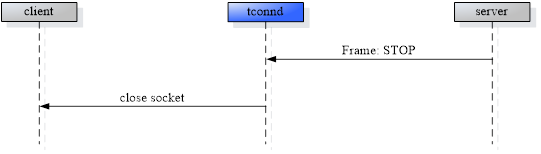

  - TConnd Server 主动断开，TConnd 检查到错误时或关闭时会进行主动断开。

    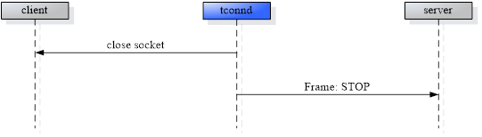

- 异常断开，客户端异常关闭 TCP 连接导致，通常对应的是 RST。

  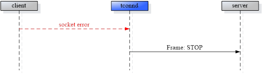

连接异常断开可以进行重连，甚至也可以配置为正常断开的情况下也能进行重连，关于连接重连的信息请参考 [Relay](#relay)。

Game Client 断开连接需要关闭 Socket，也需要释放连接句柄，伪代码：

```cpp
//close
tgcpapi_close_connection(pHandle);

//fini, 与 init 相对
tgcpapi_fini(pHandle);

//destroy, 与 create 相对，释放内存。
tgcpapi_destroy(&pHandle);
```

### Relay

通常有两种情况会使用断线重连：

- TCP 连接异常运行进行断线重连，这种方式默认就支持
- Game Client 正常连接关闭后，也能进行断线重连。要支持这种方式，需要在 TConnd Server 中配置：`EnlargeReconnScopeFlag`。

对于后者的支持，主要是为了满足移动端屏幕关闭的背景，因为移动端关闭屏幕时会自动发送连接关闭请求，为了对处理这类的重连，需要针对正常关闭也能进行重连。

如果满足上述条件的连接关闭，TConnd 不会立即关闭连接，而是等待一段时间（由 `ReconnValidSec` 决定等待时间，如果为 0 则不支持断线重连）。

在客户端，当客户端检测到连接异常断开后，可以发起断线重连请求，发起断线重连会带上 TCONND 下发的身份信息。

TConnd 在收到客户端的断线重连请求后，不会去做登录鉴权，而是直接验证身份信息是否合法，如果合法则认为连接重连成功，给后端 Game Server 发送 Relay 请求，而对于旧连接则直接释放，不再发 STOP 包。

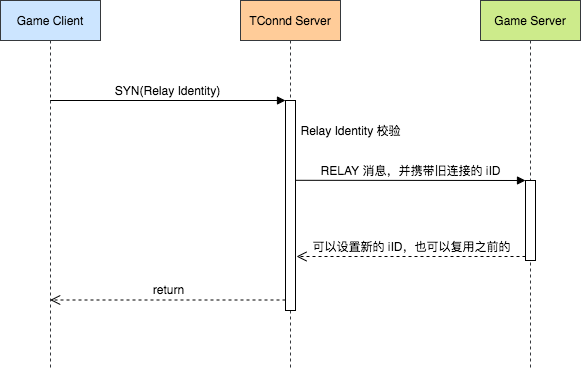

**注意：**

- TConnd Client 和 TConnd Server 连接建立时，TConnd Server 下发 BINGO 包，该包中有 Relay Identity，用于 TConnd Server 对重连的认证。
- Relay 完成后的 BINGO 包会含有新的 Relay Identity，TConnd Client 会持有新的 Relay Identity，并且旧的 Relay Identity 不可用，
- BINGO 中的 Relay Identity 是在 BODY 中，是密文；Relay 请求中的 Relay Identity 是在 HEAD 信息中，是明文，
- 建议当且仅当 tgcpapi_recv 或 tgcpapi_peek 返回 TGCP_ERR_NETWORK_EXCEPTION 时调用。

在 GCP 模式中客户端的断线重连请求除了身份信息外，还携带了鉴权数据。

当 TConnd 发现重连校验失败后，就会走新创建连接的流程，在鉴权通过后，给 Game Server 发送 START 消息，并将 START 消息中的 RelayFlag 置为 1，以此来提示 Game Server 这是一个断线重连失败的新建连接请求，Game Server 可以根据这个字段来做相应的处理。

Game Client 的重连伪代码:

```cpp
// 设置凭证，用于重连校验失败时，使用凭着建立新连接
rc = tgcpapi_set_token(handle, token, strlen(token));

// 重连请求
rc = tgcpapi_relay_connection(handle, "127.0.0.1:8080", timeout);
```

### Route

Game Server 负责处理游戏逻辑，其高负荷的 CPU 密集型处理可能会成为瓶颈，为了方便进行水平扩容，一个 TConnd 可以挂上多个 Game Server：

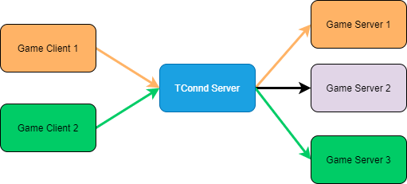

TConnd Server 的路由选择是在连接建立的时刻进行的，例如上图中，Game Client 1 建立连接时 TConnd Server 将其路由给 Game Server 1，后续在这个连接上， Game Client 1 的所有数据包都是发送给 Game Server 1。

### Queue

为了保护 Game Server，TConnd 提供了排队机制。

这个排队是针对连接建立而言的，在连接建立时，会做两个维度的限制：

1. 连接总数。通过配置 `Permit` 指定 TConnd 可以维持的总连接个数。当连接超过了这个个数，TConnd 会把连接进行排队，只有当之前有连接关闭时，才会激活排队中的连接。
1. 连接速度。通过配置 `Speed` 指定 TConnd 建立连接的速度，避免对 TConnd 瞬间带来太大压力。

## Application Message

无论什么方式，应用层消息传输方式几乎是统一的，通用方式如下图所示：

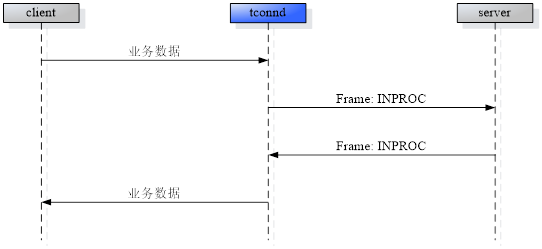

从图中可以看出，对于应用层数据，会通过 INPROC 消息发送给 Game Server。

## AuthN

使用 GCP 模式可以支持以下凭证：

- QQ 票据
- Wechat 授权码
- Wechat Refresh Token（免登录）
- JWT
- 其他

这里会针对微信鉴权方式进行讨论，其他鉴权方式是类似的。

除此外，GCP 也提供了无鉴权模式：

```xml
<LenParser type="PDULenPaser">
  <GCPParser type="PDULenGCPParser">
    <KeyMethod>SERVER</KeyMethod>
    <EncMethod>TCONN_SEC_AES</EncMethod>
    <EnableNoAuth>0x1</EnableNoAuth>
  </GCPParser>
</LenPaser>
```

EnableNoAuth 取值：

EnableNoAuth | Description
-|-
0 | 不允许客户端无鉴权。
1 | 表示以客户端的 AuthType 为准，客户端如果指定不鉴权则 TConnd 直接跳过鉴权，客户端如果指定鉴权，则走鉴权流程。
2 | 对所有连接均不鉴权。

## Event Programe

## Config

部署 TConnd 最重要的是 TConnd 的配置文件，TConnd 是通过 XML 文件进行配置的：

```xml
<!-- TConnd 是比较老的，那个年代流行 GBK -->
<?xml version="1.0" encoding="GBK" standalone="yes" ?>
<tconnd __version="13">

<!-- TConnd 配置项 -->

</tconnd>
```

TConnd 配置项主要分以下几个部分：

- 基本配置，是 TConnd 的基本配置，是进程和系统层面的，例如线程数，文件描述符限制等。
- TDR 配置项，指出 TDR 数据包结构，GCP 模式一般不需要该配置项。
- PDU（数据协议单元） 配置项，指出协议如何分包。
- Serializer 器配置项，指出如何向 Game Server 收发数据。
- Listener 配置项，负责监听、接收连接、收发数据等。
- NetTrans 配置项，负责将 PDU 配置项、Serializer 配置项、Listener 配置项关联起来，构建网络传输通道。
- Auth 配置项。

### Base Config

基本配置通过下述表格呈现：

Config | Default | Description
-|-|-
ConnLogFlag | 0 | 是否记录用户流水日志，0 表示不记录，1 表示记录。
ThreadNum | 0 | 指定运行的工作线程个数，0 表示单线程。
ThreadQueSize | 20480 | 工作线程队列大小，单位为 K。
EnableViewer | 0 | 是否运行胖了功能，0 表示关闭旁路侦听，否则开启。
MaxFD | 10240 | TConnd 进程运行的最大网络连接数。若该值大于系统所设置，则会去修改系统所设置的值。

Demo:

```xml
<?xml version="1.0" encoding="GBK" standalone="yes" ?>
<tconnd __version="13">

  <ThreadNum>0</ThreadNum>
  <EnableViewer>0</EnableViewer>
  <MaxFD>10240</MaxFD>

</tconnd>
```

### TDR Config

指出 TDR 数据包结构，因为 GCP 模式的 TDR 协议格式是特殊且规定好的，因此该模式不会有该配置项。

**注意：**

- 虽然 QQ 模式也有预定义的 TDR 通信协议，但应用仍然可以自定义业务协议。

TDR 配置项通过下述表格呈现：

Config | Default | Description
-|-|-
Count | 1 | TDR 数据结构个数。
Name | default | TDR 数据结构的名称，方便 TConnd 检索该数据结构。
Path | - | TDR 结构文件路径。

TDR 配置项被 TDRList 包住，并以 TDRs 列表形式给出。

Demo:

```xml
<?xml version="1.0" encoding="GBK" standalone="yes" ?>
<tconnd __version="13">

  <ThreadNum>0</ThreadNum>
  <EnableViewer>0</EnableViewer>
  <MaxFD>10240</MaxFD>

  <TDRList type="TDRList">
    <Count>1</Count>
    <TDRs type="TDR">
      <Name>default</Name>
      <Path>./sample.tdr</Name>
    </TDRs>
  </TDRList>

</tconnd>
```

### PDU Config

PDU 配置项是指出使用的分包方式，分包方式有多种，每种分包模式的 PDU 配置方式都不同。

PDU 的配置项包括：

Config | Default | Description
-|-|-
Count | 1 | PDU 单元的个数。
Name | default | PDU 的名称。
UpSize | 0 | 上行数据包最大字节数。
DownSize | 0 | 下行数据最大字节数。
LenParsertype | BY_TDR | PDU 进行数据分包的模式。
LenParser | - | PDU 分包的配置，不同的 LenParsertype 下，该配置是不同的。

上述 LenParser 针对不同的分包方式有所不同，我们这里并不列出所有的分包方式下的 PDU 配置，仅列出感兴趣的。

- BY_TDR，使用指定格式的 TDR 数据结构进行分包，其配置项如下：

Config | Default | Description
-|-|-
TDR | - | TDR 结构名称，在 TDR 配置项中定义。
Pkg | - | PDU 的名称， 方便检索。
PkgLen | - | 数据包总长度，若配置了该项，可以忽略下面的 HeadLen 和 BodyLen 配置。
HeadLen | - | Head 的长度信息，取自于 TDR。
BodyLen | - | Body 的长度信息，取自于 TDR。

Demo:

```xml
<?xml version="1.0" encoding="GBK" standalone="yes" ?>
<tconnd __version="13">

  <ThreadNum>0</ThreadNum>
  <EnableViewer>0</EnableViewer>
  <MaxFD>10240</MaxFD>

  <TDRList type="TDRList">
    <Count>1</Count>
    <TDRs type="TDR">
      <Count>1</Count>
      <Name>default</Name>
      <Path>./sample.tdr</Name>
    </TDRs>
  </TDRList>

  <PDUList type="PDUList">
    <Count>1</Count>
    <PDUs type="PDU">
      <Name>default</Name>
      <LenParsertype>PDULENPARSERID_BY_TDR</:enParsertype>
      <LenParser type="PDULenParser">
        <TDR>default</TDR>
        <Pkg>simplepdu</Pkg>
        <HeadLen>head.headlen</HeadLen>
        <BodyLen>head.bodylen</BodyLen>
      </LenParser>
    </PDUs>
  </PDUList>

</tconnd>
```

- BY_UDP

UDP 分包方式很简单，因为 UDP 本身就是分包的。

```xml
<?xml version="1.0" encoding="GBK" standalone="yes" ?>
<tconnd __version="13">

  <ThreadNum>0</ThreadNum>
  <EnableViewer>0</EnableViewer>
  <MaxFD>10240</MaxFD>

  <PDUList type="PDUList">
    <Count>1</Count>
    <PDUs type="PDU">
      <Name>default</Name>
      <LenParsertype>BY_UDP</LenParsertype>
    </PDUs>
  </PDUList>

</tconnd>
```

- BY_GCP

Config | Default | Description
-|-|-
KeyMethod | 2 | 客户端与 TConnd 协商密钥的方法。取值信息请参考后续表格。
EncMethod | 3 | 数据加密方法。取值信息请参考后续表格。
ReconnValidSec | 0 | 一个连接因为异常断开后，该连接在 TConnd 的连接池里存活的时间，在改时间内客户端都可以重连。0 表示不支持重连。
CheckSequence | 0 | 是否校验客户端包的 Sequence，正常情况下 Sequence 是累加的。
CloseAfterAuthRefreshFail | 0 | 表示鉴权续期失败或续期超时，是否断开连接。
IsAuthRefreshOn | 0 | 是否打开 TConnd 鉴权续期。只支持微信，用于通过 Refresh Token 得到新的 Access Token。<br>开启后，TConnd 在刷新完成时，会通过 AUTH_REFRESH_NOTIFY 发送给 Game Server。
EnableNoAuth | 0 | 表示是否运行客户端不鉴权进行连接。0 必须鉴权，1 由客户端决定，2 所有连接都不鉴权。
IsUseRandKeyOnDhFail | 1 | 如果 DH 协商密钥失败时，是否退化成简单的随机 Key。建议保持为 1。
IsSendAuthRefreshNotifyToClient | 0 | TConnd 续票完成后，是否通知客户端。
IsSendAuthRefreshNotifyToSvr | 0 | TConnd 续票完成后，是否通知 Game Server。
IsIDMappingOn | 0 | 是否打开 ID 映射功能。
UseCompress | 0 | 是否打开压缩功能。
CompressLimit | 0 | 开启压缩功能时，当数据超过该阈值才会进行压缩。
EnlargeReconnScopeFlag | 0 | 是否扩大重连允许行范围，若不开启则仅 Socket 异常才能重连，若开启，则 Client 的关闭 Socket 场景也能进行重连。
SvrConfirmTimeOut | 2 | 等待后端的 START/RELAY 响应包，当 TConnd 等待超过该时间则关闭连接。
CloseDelaySec | 0 | TConnd 主动关闭场景下，当最后一个包下发给 Client 后，等待超过该时间会主动关闭 Socket。0 代表不等待 Client，TConnd 直接关 Socket。

关于 KeyMethod 的取值：

KeyMethod | Enum | Description
-|-|-
0 | TGCP_KEY_MAKING_NONE | 不加密
1 | TGCP_KEY_MAKING_INAUTH | 使用认证信息携带的密钥，主要用于 QQ ST 票据
2 | TGCP_KEY_MAKING_INSVR | TConnd 直接下发密钥
3 | TGCP_KEY_MAKING_RAW_DH | DH 算法协商密钥

关于 EncMethod 的取值：

EncMethod | Enum | Description
-|-|-
0 | TGCP_ENCRYPT_METHOD_NONE ｜ 不加密
3 | TGCP_ENCRYPT_METHOD_AES | AES
4 | TGCP_ENCRYPT_METHOD_AES2 | AES2，相对于 AES 而言，其填充方式不同，建议选择 AES。

Demo:

```xml
<?xml version="1.0" encoding="GBK" standalone="yes" ?>
<tconnd __version="13">

  <ThreadNum>0</ThreadNum>
  <EnableViewer>0</EnableViewer>
  <MaxFD>10240</MaxFD>

  <PDUList type="PDUList">
    <Count>1</Count>
    <PDUs type="PDU">
      <Count>1</Count>
      <Name>default</Name>
      <LenParsertype>PDULENPARSERID_BY_GCP</LenParsertype>
      <LenParser type="PDULenParser">
        <GCPParser type="PDULenParser">
          <KeyMethod>2</KeyMethod>
          <EncMethod>3</EncMethod>
        </GCPParser>
      </LenParser>
    </PDUs>
  </PDUList>

</tconnd>
```

### Listener Config

LisntenerList 节点下配置 Listener，每个 Listener 有以下配置：

Config | Default | Description
-|-|-
Name | default | 监听器名称
Url | tcp://127.0.0.1:6666 | 监听 URL
SendBuff | 128K | 发送缓冲区大小
RecvBuff | 128K | 接收缓冲区大小
MaxIdle | 0 | 连接最大空闲时间，当这段时间内没有收到 Client 数据包，就主动断开客户端连接。0 代表不主动断开。
Backlog | 128 | 监听队列的大小，设置为 128。
NoDelay | 0 | 是否禁用 Nagle 算法，0 代表不禁用。

Demo:

```xml
<?xml version="1.0" encoding="GBK" standalone="yes" ?>
<tconnd __version="13">

  <ThreadNum>0</ThreadNum>
  <EnableViewer>0</EnableViewer>
  <MaxFD>10240</MaxFD>

  <PDUList type="PDUList">
    <Count>1</Count>
    <PDUs type="PDU">
      <Count>1</Count>
      <Name>default</Name>
      <LenParsertype>PDULENPARSERID_BY_GCP</LenParsertype>
      <LenParser type="PDULenParser">
        <GCPParser type="PDULenParser">
          <KeyMethod>2</KeyMethod>
          <EncMethod>3</EncMethod>
        </GCPParser>
      </LenParser>
    </PDUs>
  </PDUList>

  <ListenerList type="ListenerList">
    <Count>1</Count>
    <Listeners type="Listener">
      <Name>default</Name>
      <Url>tcp://127.0.0.1:6666</Url>
      <SendBuff>131072</SendBuff>
      <RecvBuff>131072</RecvBuff>
      <MaxIdle>0</MaxIdle>
      <Backlog>128</Backlog>
      <NoDelay>0</NoDelay>
    </Listeners>
  </ListenerList>

</tconnd>
```

### Serializer Config

Serializer 进行数据的串行化并放置 TBus 通道中，相关的配置位于 Serializers 节点下。

配置信息如下所示：

Config | Default | Description
-|-|-
HeartBeatInterval | 0 | 与 TConnd 后端的心跳间隔，单位秒，0 代表不主动发送心跳（但可以被动接受 Game Server 心跳并响应）。
Name | default | Serializer 的名字。
Url | - | TConnd 在 TBus 通道中的 Endpoint ID，即 TBus 通信地址。
APIVersion | 0 | Game Server 使用的 TCONNAPI 的版本。如果 Game Server 的 TCONNAPI 版本过低，小于 TConnd 使用的版本，则需要强制填入该版本，以兼容。

Demo:

```xml
<?xml version="1.0" encoding="GBK" standalone="yes" ?>
<tconnd __version="13">

  <ThreadNum>0</ThreadNum>
  <EnableViewer>0</EnableViewer>
  <MaxFD>10240</MaxFD>

  <PDUList type="PDUList">
    <Count>1</Count>
    <PDUs type="PDU">
      <Count>1</Count>
      <Name>default</Name>
      <LenParsertype>PDULENPARSERID_BY_GCP</LenParsertype>
      <LenParser type="PDULenParser">
        <GCPParser type="PDULenParser">
          <KeyMethod>2</KeyMethod>
          <EncMethod>3</EncMethod>
        </GCPParser>
      </LenParser>
    </PDUs>
  </PDUList>

  <ListenerList type="ListenerList">
    <Count>1</Count>
    <Listeners type="Listener">
      <Name>default</Name>
      <Url>tcp://127.0.0.1:6666</Url>
      <SendBuff>131072</SendBuff>
      <RecvBuff>131072</RecvBuff>
      <MaxIdle>0</MaxIdle>
      <Backlog>128</Backlog>
      <NoDelay>0</NoDelay>
    </Listeners>
  </ListenerList>

  <SerializerList type="SerializerList">
    <Count>2</Count>
    <Serializers type="Serializer">
      <Name>default</Name>
      <Url>10.1.2.1<Url>
    </Serializers>
    <Serializers type="Serializer">
      <Name>LisViewer</Name>
      <Url>10.1.2.2<Url>
    </Serializers>
  </SerializerList>

</tconnd>
```

### NetTrans Config

NetTrans 用已经配置好的 Serailizer、PDU、Lisntener 去构造一个网络传输通道，存在如下配置：

Config | Default | Description
-|-|-
Name | default | NetTrans 的实例名字。
UseTimeStamp | 0 | 发送到 Game Server 的数据是否带时间戳。0 不带时间戳，否则带。
UseWaitQueue | 0 | 客户端排队开关，0 表示不进行排队判断，否则判断是否需要排队。
PDU | default | 配置使用的 PDU，用于指明传输通道的分包方式。
Listener | default | 配置使用的 Listener，用于指明传输通道使用的监听器。
Serializer | default | 配置使用的 Serializer，用于指明传输通道使用的串行方式。
LisViewer | - | 上行消息旁路接收器。如果旁路配置打开，且配置了该项，则将消息抄送一份给 LisViewer，LisViewer 来自于 Serializer 的配置。
SerViewer | - | Serializer 旁路接收器名称。如果旁路配置打开，且配置了该项，则 TConnd 从 Serializer 中取出数据发送给客户端后，还会发一份给 SerVierer。
ConnLimit | - | 连接排队配置，是一个结构体，在后续表格给出。
TransLimit | - | 传输限制，是一个结构体，在后续表格给出。
SendMode | 0 | TConnd 到 Game Server 的发送方式。0 代表 TConnd 会向 Serializers 所有实例发送数据；1 会轮询给 Serializers 发数据，每次请求都会换一个 Serailizer。
CarryAccountFlag | 0 | TConnd 往后端 SVR 的 INPROC 包中是否携带 ACCOUNT 信息。0 表示不携带。
UseTcpSerializer | 0 | 是否使用 TCP 序列化器。
FixedExtend | 0 | 用于表示 TFRAME 协议中 FrameHead.Extend 的使用方法。<br>0，TConnd 发给 Game Server 上行包中的 Extend 字段为上一次 Game Server 发给 TConnd 中的值。<br>1， TConnd 发给 Game Server 上行包中的 Extend 来自于 START/RELAY 包中的 Extend，且后续都不会再改变。
PacketMergeConfig | - | 包合并的配置，在后续表格给出。
StopListenWhenSvrDown | 0 | 通过心跳，TConnd 定期检查 Game Server 状态，若 Game Server 无响应，则 TConnd 关闭对 Lisntener 的监听。0 不开启，否则开启。

ConnLimit 连接排队配置如下：

Config | Default | Description
-|-|-
Permit | 0 | 连接排队阈值，超过该值才会进行排队。
Speed | 0 | 每一秒从的队列放行的连接数。0 代表不限制。
QueueNotifyInterval | 0 | 排队通知时间间隔，0 代表不通知。
QueueUpdateInterval | 60 | 排队时间采样频率。
QueueSampleCount | 30 | 排队时间采用最大样本。

TransLimit 传输限制结构如下：

Config | Default | Description
-|-|-
PkgSpeed | 0 | 最大的收包速度。0 代表不限制。
ByteSpeed | 0 | 最大收字节流速度。0 代表不限制。
LimitAction | 1 | 超过客户端限速是否断开连接。PkgSpeed 和 ByteSpeed 速度不为 0 时有效。0，不断开连接只是丢包；1，断开连接。

PacketMergeConfig 结构如下：

Config | Default | Description
-|-|-
UsePacketMerge | 0 | 是否打开小包合并功能，默认为 0，不打开。
MergeSize | 2800 | 包合并的阀值，既合并的包达到这个长度后开始发送，单位字节。
MergeTimeout | 200 | 合包超时，单位毫秒，如果合包没达到 MergeSize，但是超时了，也会执行发送。

Demo:

```xml
<?xml version="1.0" encoding="GBK" standalone="yes" ?>
<tconnd __version="13">

  <ThreadNum>0</ThreadNum>
  <EnableViewer>0</EnableViewer>
  <MaxFD>10240</MaxFD>

  <PDUList type="PDUList">
    <Count>1</Count>
    <PDUs type="PDU">
      <Count>1</Count>
      <Name>default</Name>
      <LenParsertype>PDULENPARSERID_BY_GCP</LenParsertype>
      <LenParser type="PDULenParser">
        <GCPParser type="PDULenParser">
          <KeyMethod>2</KeyMethod>
          <EncMethod>3</EncMethod>
        </GCPParser>
      </LenParser>
    </PDUs>
  </PDUList>

  <ListenerList type="ListenerList">
    <Count>1</Count>
    <Listeners type="Listener">
      <Name>default</Name>
      <Url>tcp://127.0.0.1:6666</Url>
      <SendBuff>131072</SendBuff>
      <RecvBuff>131072</RecvBuff>
      <MaxIdle>0</MaxIdle>
      <Backlog>128</Backlog>
      <NoDelay>0</NoDelay>
    </Listeners>
  </ListenerList>

  <SerializerList type="SerializerList">
    <Count>2</Count>
    <Serializers type="Serializer">
      <Name>default</Name>
      <Url>10.1.2.1<Url>
    </Serializers>
    <Serializers type="Serializer">
      <Name>LisViewer</Name>
      <Url>10.1.2.2<Url>
    </Serializers>
  </SerializerList>

  <NetTrans type="NetTrans">
    <Name>default</Name>
    <UseTimeStamp>0</UseTimeStamp>
    <UseWaitQueue>1 </UseWaitQueue>
    <PDU>default</PDU>
    <Serializer>default</Serializer>
    <ConnLimit>
      <Permit>0</Permit>
      <Speed>1</Speed>
      <QueueNotifyInterval>1</QueueNotifyInterval>
      <QueueUpdateInterval>60</QueueUpdateInterval>
      <QueueSampleCount>30</QueueSampleCount>
    </ConnLimit>
    <TransLimit>
      <PkgSpeed>0</PkgSpeed>
      <ByteSpeed>0</ByteSpeed>
      <LimitAction>0</LimitAction>
    </TransLimit>
  </NetTrans>
</tconnd>
```

### Auth Config

TConnd 提供多种认证方式，例如 CTLogin、PTLogin、APS 等等，这里仅给出 APS 的认证方式，因为这是我们项目中会用到的，也是最灵活的方式。认证配置都是放在 `<tconnd>` 节点的 `<AuthInfo>` 节点中。

Config | Default | Description
-|-|-
ServiceMode | 0 | 表示 TConnd 是否接入服务化模式的 APS，非 0 表示接入，0 表示不接入。
BusinessID | 0 | TCONND 和 APS 通信的业务 ID，由 TSF4G 项目组分配。
ReconnectInterval | 0 | TConnd 和 ApsSvr 之间如果连接断开，发起重连的间隔，单位秒。
HeartBeatInterval | 5 | TConnd 和 ApsSvr 之间心跳间隔，单位秒。
TimeOut | 4 | 鉴权超时时间。
ReTryTimes | 0 | 鉴权超时后重试次数。
ApsSvrUrls | tcp://127.0.0.1:7777 | 鉴权服务器 URL。
ApsSvrCount | 0 | 鉴权服务器的个数。

Demo:

```xml
<?xml version="1.0" encoding="GBK" standalone="yes" ?>
<tconnd __version="13">

  <ThreadNum>0</ThreadNum>
  <EnableViewer>0</EnableViewer>
  <MaxFD>10240</MaxFD>

  <PDUList type="PDUList">
    <Count>1</Count>
    <PDUs type="PDU">
      <Count>1</Count>
      <Name>default</Name>
      <LenParsertype>PDULENPARSERID_BY_GCP</LenParsertype>
      <LenParser type="PDULenParser">
        <GCPParser type="PDULenParser">
          <KeyMethod>2</KeyMethod>
          <EncMethod>3</EncMethod>
        </GCPParser>
      </LenParser>
    </PDUs>
  </PDUList>

  <ListenerList type="ListenerList">
    <Count>1</Count>
    <Listeners type="Listener">
      <Name>default</Name>
      <Url>tcp://127.0.0.1:6666</Url>
      <SendBuff>131072</SendBuff>
      <RecvBuff>131072</RecvBuff>
      <MaxIdle>0</MaxIdle>
      <Backlog>128</Backlog>
      <NoDelay>0</NoDelay>
    </Listeners>
  </ListenerList>

  <SerializerList type="SerializerList">
    <Count>2</Count>
    <Serializers type="Serializer">
      <Name>default</Name>
      <Url>10.1.2.1<Url>
    </Serializers>
    <Serializers type="Serializer">
      <Name>LisViewer</Name>
      <Url>10.1.2.2<Url>
    </Serializers>
  </SerializerList>

  <NetTrans type="NetTrans">
    <Name>default</Name>
    <UseTimeStamp>0</UseTimeStamp>
    <UseWaitQueue>1 </UseWaitQueue>
    <PDU>default</PDU>
    <Serializer>default</Serializer>
    <ConnLimit>
      <Permit>0</Permit>
      <Speed>1</Speed>
      <QueueNotifyInterval>1</QueueNotifyInterval>
      <QueueUpdateInterval>60</QueueUpdateInterval>
      <QueueSampleCount>30</QueueSampleCount>
    </ConnLimit>
    <TransLimit>
      <PkgSpeed>0</PkgSpeed>
      <ByteSpeed>0</ByteSpeed>
      <LimitAction>0</LimitAction>
    </TransLimit>
  </NetTrans>

  <AuthInfo>
    <ApsAuthInfo>
      <ServiceMode>0</ServiceMode>
      <BusinessID>1005</BusinessID>
      <ApsSvrCount>1</ApsSvrCount>
      <ApsSvrUrls>tcp://127.0.0.1:8090</ApsSvrUrls>
    </ApsAuthInfo>
  </AuthInfo>
</tconnd>
```

### Command Parameters

在确认好 TConnd 的配置文件后，就可以使用命令启动 TConnd Server，启动命令涉及到的参数本质上也是对 TConnd Server 的配置：

Parameters | Required | Description
-|-|-
--id | Y | TConnd 进程 Entity ID，此 ID 将做为 TBUS 系统中 TCONND 的地址。 
--conf-file | Y | 进程的配置文件路径，可以使用相对路径。 
--bus-key | N | TBUS系统路由表存储共享内存 key，缺省值为 1688。
--daemon | N | 以 DAEMON 方式运行。 
--tlogconf | N | 进程日志配置文件路径。 

除了上市参数外，还需指定 TConnd 动作：

Action | Description
-|-
start | 启动进程。 
stop | 给已经启动的进程发送一个 SIGUSR1 信号，指示该进程停止运行。 
reload | 给已经启动的进程发送一个 SIGUSR2 信号，指示该进程重新加载配置文件。 

Demo:

```sh
./tconnd --id=9.9.1.1 --conf-file=../cfg/gameio.xml --tlogconf=../cfg/gameio_log.xml --bus-key=202103 --daemon start
```

## Log

TConnd 的启动命令行参数 tlogconf 指定日志配置文件得路径，而 TConnd 的日志文件分为几种类型：

运行日志 | 默认命名 | 描述
-|-|-
运行日志 | tconnd.log | TConnd 的运行过程中的日志，如果存在异常可以很明显从该文件中找到。<br>一般开发调试时设置为 DEBUG 级别，线上运行时设置为 ERROR 级别。
流水日志 | tconnd_conn.log | 记录了 TConnd 的每个连接创建，结束的时间，结束原因等。每个连接占用一行记录。
统计日志 | tconnd_rundata.log | 记录 TConnd 的内部统计信息，例如多少个客户端请求，多少连接异常断开等。

## References

1. TSF4G-TCONND-开发指导手册
1. TConnd TGCPAPI 手游开发指导手册
1. Apollo TCONND 接入指引
1. TSF4G TConnd 运维指导手册
