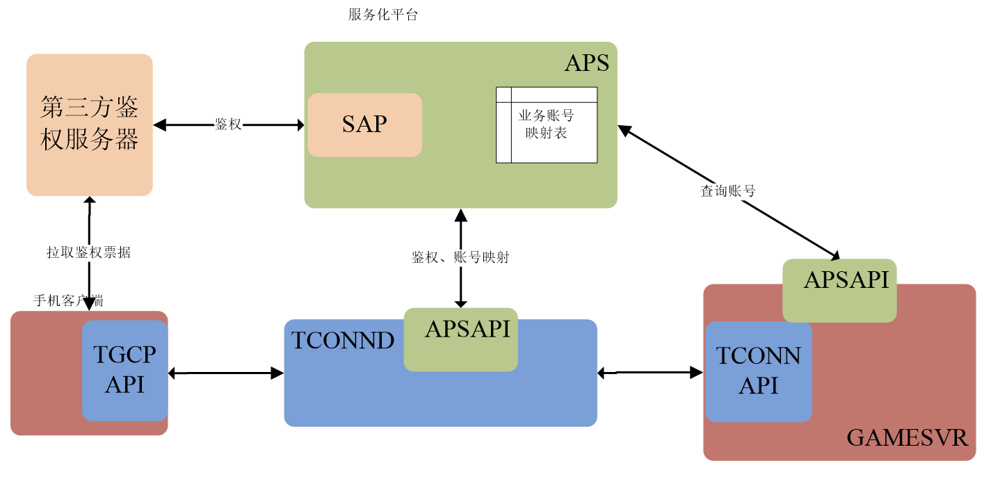
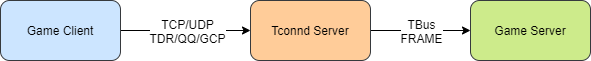

# TSF4G Tconnd

<!-- TOC -->

- [TSF4G Tconnd](#tsf4g-tconnd)
    - [Overview](#overview)
    - [Work Mode](#work-mode)
        - [TDR Mode](#tdr-mode)
        - [QQ Mode](#qq-mode)
        - [GCP Mode](#gcp-mode)
    - [Tconnd FRAME](#tconnd-frame)
    - [Connection](#connection)
        - [Connect](#connect)
        - [Relay](#relay)
        - [Queue](#queue)
    - [AuthN](#authn)
    - [References](#references)

<!-- /TOC -->

## Overview

什么是 Tconnd？Tconnd 是 Tsf4g 的组件中的一部分，用作于游戏接入层，全称为 `Tencent Connection Daemon`。

Tconnd 在游戏架构中的定位下图一言以蔽之：


Tconnd 为 Game Server 提供接入服务，使逻辑层不再关心网络层数据收发和连接管理。

## Work Mode

Tconnd 有多种工作模式（例如 TDR Mode、QQ Mode、WEB Mode），现在主流采用的是 GCP 模式，不同的工作模式区别在于使用什么通信协议以及分别方式，请参考 [Work Mode](#work-mode)。

Tconnd 支持的传输协议有：

- TCP
- UDP

Tconnd 支持的分包方式有：

分包方式 | 描述
-|-
BY_TDR | 根据 TDR 元数据分包。
BY_CHAR | 根据字符分包，遇到指定的字符就认为是一个完整的包。
BY_STR | 根据字符串分包，遇到指定的字符串就认为是一个完整的包。
BY_QQ | 根据 Tconnd 组件预定义的 TDR 元数据分包。
BY_GCP | 根据 Tconnd 组件预定义的 TDR 元数据分包。
BY_WEB | 分为两种，一种是用 http 协议进行分包；一种是基于 Tconnd 定义的 webpkg 协议分包。

这里介绍其中三个，并且 GCP Mode 是最主流的使用方式，会作为后续的主要内容。

### TDR Mode

TDR 指的是 TSF4G Data Represention，互娱研发部自研跨平台多语言数据表示组件，主要用于基于数据的序列化反序列化（支持二进制方式和 XML 文本方式）以及 ORM 数据存储。

TDR Mode 指的是通过 TDR 进行数据分包，并使用 TCP 协议进行数据透传。此时，Tconnd Server 只是以纯粹的数据透传中间件的模式存在，通过 TDR 分包模式获取到一个完整的包后，即将报文转发给后端 SVR，不存在对连接的认证过程。

这种模式下，Game Client 使用 TCLAPI。

### QQ Mode

因为公司开发或者代理的游戏大多使用 QQ 账号进行登录，QQ Mode 实现了 QQ 登录验证，消息加解密，断线重连，跨服跳转等功能。

这种模式下，分包模式是 BY_QQ，并且 Game Client 使用 TQQAPI。

### GCP Mode

GCP 指的是 General Communication Protocol，通用通信协议，GCP Mode 即 Client 采用这种协议与 Tconnd Server 进行数据交换。

QQ Mode 的缺点之一是只能使用 uint32_t 的 QQ 号，但是这已经不适合当前的游戏环境了，微信号等其他的登录方式也逐步崛起。

GCP Mode 使用 BY_GCP 的分包模式，并继承了 QQ Mode 的绝大部分能力，在此基础上提供了自定义认证的方式，能够进行 ID 映射等。

Tconnd 在 GCP 模式中，可以在建立连接时校验 Client 的用户身份，如下图所示：



上图中，还存在一个特殊的 APS(AuthProxy Servic)，Tconnd 通过 TCP 协议将 Client 凭证传递给 APS，由 APS 对凭证进行校验。

除此外，Tconnd GCP 也具有加密通信的能力：通过 DH 协商机制，消息加密，消息压缩​。

## Tconnd FRAME

Tconnd Server 和 Game Client/Server 之间的通信方式：

- Game Client 和 Tconnd 之间在 TCP/UDP 上，通过 TDR/QQ/GCP 等协议进行通信。
- Tconnd 和 Game Server 之间在共享内存上，通过 FRAME 协议进行通信。



也就是说，FRAME 协议是由 Tconnd 定义，用于 Tconnd 进程与后台服务进程通信的消息格式。

frame 协议中，一个包有两部分组成：

- tframehead，协议头部
- message，应用层负载

对于协议头部，tframehead：

```cpp
struct tagtframehead {
  int8_t chVer;                   // 版本信息
  int8_t chCmd;                   // 消息命令，决定了消息 stCmdData 的格式
  int8_t chExtraType;             // 是否具有 stExtraInfo 信息
  int8_t chTimeStampType;         // 是否具有 stTimeStamp 信息
  int32_t iID;                    // 会话 ID，参考 Conneciont
  int32_t iConneIdx;              // 连接 ID，参考 Conneciont
  TFRAMEHEADDATA stExtraInfo;     // 主要包括连接 IP 信息
  TTIMESTAMPDATA stTimeStamp;     // 时间戳信息
  TFRAMECMDDATA stCmdData;        // 消息数据
};
```

tframehead 中有两个关键字段：

- chCmd，用于表示数据包的类型，决定了 `stCmdData` 中什么数据有效。
- stCmdData，是一个 union，根据不同的 chCmd，会使用其中的不结构数据：

  ```cpp
  union TFRAMECMDDATA {
    TFRAMECMDSTART stStart;
    TFRAMECMDSTOP stStop;
    TFRAMECMDINPROC stInproc;
    TFRAMECMDRELAY stRelay;
    TFRAMECMDNOTIFY stNotify;
    TFRAMECMDSETROUTING stSetRouting;
    TFRAMECMDSETROUTINGRSP stSetRoutingRsp;
    TFRAMECMDSETCONNLIMIT stSetConnLimit;
    TFRAMECMDSETCONNLIMITRSP stSetConnLimitRsp;
    TFRAMECMDEXGVER stExgVer;
    TFRAMECMDWAITNUMRSP stWaitNumRsp;
    TFRAMECMDSETWAITCTR stSetWaitCtr;
  };
  ```

对于应用层负载 message 而言：

- stCmdData 并不包含应用层负载，其仍然是属于头部信息
- 应用层负载紧跟 framehead 后，解包 framehead 数据后，包剩余的数据即应用层负载。

```cpp
int data_size;
char data[1024];
// 接收底层数据
tbus_recv(tbus_handle, TBUS_ADDR_ALL, tbus_addr, data, &data_size, 0);

// 解析出 tframehead
TFRAMEHEAD *tframe_head = nullptr;
int tframe_head_size = 0;
tconnapi_decode(data, data_size, &tframe_head, &tframe_head_size);

// 解析出应用层负载
int messag_size = data_size - tframe_head_size;
std::string message(data + tframe_head_size, messag_size);
```

## Connection

Tconnd 进程使用连接池管理底层网络连接，每当 Game Client 和 Tconnd 建立一个新的连接，Tconnd Server 都会为其分配一个连接 ID，即 iConnIdx。

Tconnd Server 向 Game Server 通知连接建立消息时（即 START 消息），会通过 tframehead 传递连接 ID：iConnIdx。

Game Server 中，一个连接通常对应了一个会话，需要在响应 START 消息时，通过 tframehead 传递会话 ID：iID。

在 Tconnd 中，分为两种连接，长连接和短连接，这个长短并非针对于 TCP 连接而言，而是针对于 Tconnd 而言，也就是说 TCP 连接始终是长连接。Game Server 在响应 START 消息时，需要指出使用长连接还是短连接：

- tframehead.iID == -1，使用短连接
- 其他情况，均为长连接。

Tconnd 长连接和短连接的区别：

区别 | 长连接 | 短连接
-|-|-
上行消息 | 仅 START 消息中携带连接的源地址。 | 均携带连接的源地址。
连接关闭或异常断开 | 发送 STOP 消息。 | 不发送 STOP 消息。
iID 校验 | 检查是否一致，如果不一致则丢弃消息。 | 不检查 iID，而是检查 tframehead.IP/PORT，如果不一致则丢弃消息。

### Connect

这里提供 Game Client 连接建立流程，以及 Game Server 如何接受一个连接：

### Relay

### Queue

## AuthN

使用 GCP 模式可以支持以下凭证：

- QQ 票据
- Wechat 授权码
- Wechat Refresh Token（免登录）
- JWT
- 其他


## References

1. TSF4G-TCONND-开发指导手册
1. TConnd TGCPAPI 手游开发指导手册
1. Apollo TCONND 接入指引