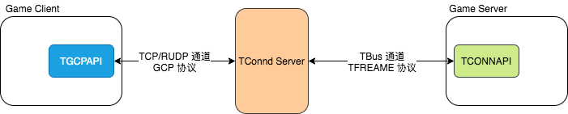
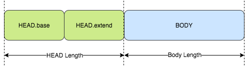
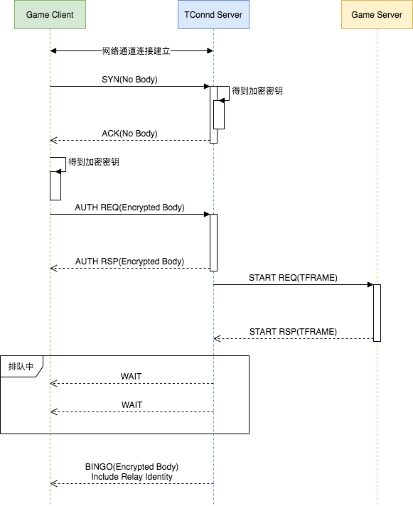
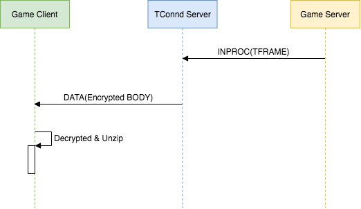
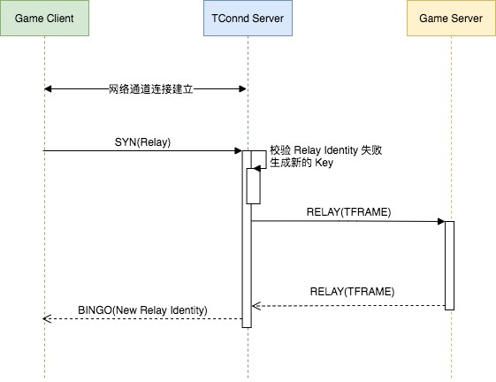
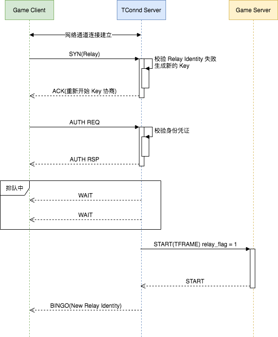

# TGCPAPI Impl

<!-- TOC -->

- [TGCPAPI Impl](#tgcpapi-impl)
    - [Overview](#overview)
    - [GCP Initial/Finalize](#gcp-initialfinalize)
    - [GCP Protocol](#gcp-protocol)
    - [Open Connection](#open-connection)
        - [SYN & ACK](#syn--ack)
        - [Auth Request & Response](#auth-request--response)
        - [Bingo & Wait](#bingo--wait)
    - [Send Message](#send-message)
    - [Receive Message](#receive-message)
        - [Receive AUTH REFRESH NOTIFY](#receive-auth-refresh-notify)
        - [Receive ROUTE CHANGE](#receive-route-change)
        - [Receive DATA](#receive-data)
        - [Receive SSTOP](#receive-sstop)
    - [Close Connection](#close-connection)
    - [Relay](#relay)
    - [Route](#route)

<!-- /TOC -->

## Overview

为了支持 Game Client 和 TConnd Server 之间通过 GCP 模式进行通信传输，TConnd SDK 为 Game Client 提供了 TGCPAPI，其定位如下：



对于 TConnd Server 和 GCP 模式的概述、配置、部署和特性请参考 [TConnd](../tconnd/readme.md)。

本篇主要是介绍 TGCPAPI 的接口实现细节和 GCP 通信协议。

## GCP Initial/Finalize

Game Client 要使用 GCP 模式和 TConnd Server 进行交互，首先需要进行 TGCPAPI 句柄初始化，本质上就是初始化相关的数据结构对象，TGCP 句柄就是对象的指针：

```cpp
typedef struct tagTGCPApiHandle* HTGCPAPI;
```

初始化的两个关键函数：

Function | Description
-|-
tgcpapi_create() | 分配 tgcpapi 句柄的内存空间。
tgcpapi_init() | 配置 tgcpapi 的认证方式、传输方式、应用层数据长度等。

这是一个初始化 Demo：

```cpp
HTGCPAPI handle;
int rc = 0;
rc = tgcpapi_create(&handle);
rc = tgcpapi_init(handle, service_id, platform, auth_mode, encrypt_method,
                  key_making_method, max_gamedata_len);
```

## GCP Protocol

TGCPAPI 初始化完成后，就可以利用其进行连接和通信了，在连接和通信前，我们可以先了解下 GCP 模式的通信协议。

首先，我们要认识到，底层传输的是 GCP 协议包，无论是上行或是下行都分为两个部分：HEAD 和 BODY，并且 HEAD 为明文，而 BODY 为密文。

我们从函数发送中可以观察到这一点：

```cpp
// a_pszBuffIn 序列化后的 Body
int tgcpapi_encrypt_and_send_pkg(HTGCPAPI a_pHandle,
                                const char* a_pszBuffIn, int a_iSize,
                                int a_iTimeout) {

  // 获得当前发送 Buffer 区域首地址
  char* pszBuff = a_pHandle->stSendNode.stBuff.pszBuff +
                  (a_pHandle->stSendNode.iOffset + a_pHandle->stSendNode.iData);

  // 获得发送 Buffer 区域的最大长度
  int iBuffLen = a_pHandle->stSendNode.stBuff.iSize -
                (a_pHandle->stSendNode.iOffset + a_pHandle->stSendNode.iData);

  // 计算 BODY 部分的长度
  a_pHandle->stHeadSent.stBase.dwBodyLen = tgcpapi_body_len(a_pHandle, a_iSize);

  // 将 HEAD 部分序列化至发送缓冲区，不会加密
  size_t iHeadUsed = 0;
  a_pHandle->stHeadSent.pack(pszBuff, iBuffLen, &iHeadUsed, a_pHandle->iGcpHeadVersion);

  pszBuff += iHeadUsed;
  iBuffLen -= iHeadUsed;

  // 发送缓冲区不足以放下头部信息时，pack打包时会报错
  // 发送缓冲区不足以放下加密数据时，返回错误
  if (iBuffLen < (int)a_pHandle->stHeadSent.stBase.dwBodyLen) {
    return TGCP_ERR_SHORT_BUF_FOR_WRITE;
  }

  // 将 BODY 加密
  size_t iBodyUsed
  tgcpapi_encrypt(a_pHandle, a_pszBuffIn, a_iSize, pszBuff, &iBodyUsed);

  // 更新 Buffer 偏移
  a_pHandle->stSendNode.iData += iHeadUsed;
  a_pHandle->stSendNode.iData += iBodyUsed;
  return tgcpapi_send_buffer(a_pHandle, a_iTimeout);
}
```

我们通过 Protobuf 的格式去描述 GCP HEAD：

```proto
message TGCPHEAD {
  TGCPBase base = 1;
  TGCPExtHead extend = 2;
}

message TGCPBase {
  uint16 magic = 1;
  uint16 head_version = 2;
  uint16 body_version = 3;
  Command command = 4;          // GCP 协议包类型
  bool encrypted = 5;           // 下行包是否加密
  uint32 sequence = 6;
  uint32 head_length = 7;
  uint32 body_length = 8;
}

// 根据不同类型的 GCP 协议包，会有不同的头部信息扩展
message TGCPExtHead {
  TGCPSynHead syn = 1;
  TGCPAckHead ack = 2;
  TGCPDataHead data = 3;
  TGCPTransDataHead trans_data = 4;
  TGCPHeartBeatHead heart_beat = 5;
}

enum Command {
  TGCP_CMD_SYN = 0x1001,          // 上行，握手
  TGCP_CMD_ACK = 0x1002,          // 下行，SYN 的响应
  TGCP_CMD_AUTH_REQ = 0x2001,
  TGCP_CMD_AUTH_RSP = 0x2002,
  TGCP_CMD_WAIT = 0x3002,                   // 下行，排队信息
  TGCP_CMD_DATA = 0x4013,                   // 双向，数据
  TGCP_CMD_TRANSMIT = 0x4023,               // 双向，第三方数据
  TGCP_CMD_CSTOP = 0x5001,                  // 上行，Game Client 发起断开
  TGCP_CMD_SSTOP = 0x5002,                  // 下行，TConnd Server 发起断开
  TGCP_CMD_BINGO = 0x6002,                  // 下行，通知客户端连接已建立
  TGCP_CMD_AUTH_REFRESH_REQ = 0x7001,       // 上行，鉴权刷新请求
  TGCP_CMD_AUTH_REFRESH_NOTIFY = 0x7002,    // 双向，鉴权刷新通知
  TGCP_CMD_ROUTE_CHANGE = 0x8002,           // 下行，TCONND发起路由切换的命令
  TGCP_CMD_HEART_BEAT = 0x9001,             // 双向，心跳探测
}
```

其中 syn 和 ack 的头部扩展是建立连接时用到的，可以参考 [Open Connection](#open-connection)。

我们通过 Protobuf 的格式去描述 GCP BODY：

```proto
// 根据不同类型的 GCP 包，使用的 BODY 结构是不同的
message TGCPBODY {
  TGCPAckBody ack = 1;
  TGCPAuthReqBody auth_req = 2;
  TGCPAuthRspBody auth_rsp = 3;
  TGCPAuthRefreshReq auth_refresh_req = 4;
  TGCPAuthRefreshNotifyBody auth_refresh_notify = 5;
  TGCPWaitBody wait = 6;
  TGCPCStopBody cstop = 7;
  TGCPSStopBody sstop = 8;
  TGCPRouteChangeBody route_change = 9;
  TGCPBingoBody bingo = 10;
}
```

不同的场景会用不同的 GCP BODY，在具体的场景中再展开对应场景的 BODY 细节。

综上，一个 GCP 包如下：



需要注意的是，HEAD 和 BODY 的长度是变长的，更具体来说：

- HEAD.base 是定长的
- HEAD.extend 是变长的，不同消息包结构不同
- BODY 是变长的，不同消息包结构不同

HEAD.base 中包含了一个 GCP 协议包的长度信息，接收方会依赖于该信息去获取一个完整的 GCP 协议包。

也因此，接收方会率先解析出 HEAD.base 部分，提取出 HEAD 总长度和 BODY 长度，再进一步分包。

## Open Connection

Game Client 和 TConnd Server 通信需要建立 GCP 连接，该连接建立过程除了网络通道的建立外，还包括了密钥交换，身份认证，排队，Relay 凭证下发等。

从 Game Client 角度来看，建立连接的时序如下所示：



### SYN & ACK

这里的 SYN 包用于和 TConnd Server 协商密钥，加密方法，压缩方法等，而 ACK 包则下发 TConnd Server 确定的加密方法，压缩方法，以及 Game Client 从 ACK 中提取出密钥。

SYN 包是没有 Body 的，因此 SYN 包是不会加密的，其 Protobuf 结构如下：

```proto
message TGCPSynHead {
  uint8 key_method = 1;                   // 密钥交换方法
  TGCPKeyReq key_info = 2;
  uint8 enc_method = 3;                   // 加密方法
  uint32 service_id = 4;                  // Game ID
  uint8 client_type = 5;                  // 终端类型
  TSF4GSmallAccount account = 6;          // 账号信息

  bool has_relay_info = 7;                // 是否为重连的 SYN 包
  TGCPRelayReqBody relay_req_info = 8;

  bool has_auth_info = 9;                 // 是否包含认证信息
  TGCPAuthReqContent auth_req_info = 10;

  uint8 route_flag = 11;
  TGCPRouteInfo route_info = 12;
}

message TGCPKeyReq {
  TSF4GRawDHReq req_by_raw_dh = 1;
  TSF4GEncDHInfo req_by_enc_dh = 2;
}
```

**注意：**

- 上述仅展示了核心结构，并非是 SYN HEAD 的所有字段。
- Game Client 重连也是复用的 SYN 包，因此 SYN 包中可能有 Relay 信息，对此请参考 [Relay](#relay)。
- Game Client 可以通过 route 选择连接的集群，因此 SYN 包中可能有 route 信息，对此参考 [Route](#route)。
- Game Client 如果使用 CTLogin 的凭证，由于历史原因，该凭证会放在 SYN 的 auth_req_info 中发送。不建议使用该方式，因为 SYN 包不加密，容易引起凭证泄漏。
- 使用 dh 密钥交换协议，会通过 key_info 向 TConnd Server 发送 dh 交换信息。

TConnd Server 通过 ACK 包对 SYN 进行响应，用于完成密钥的交换，以及确定压缩方式等。

ACK 包同样是没有 Body 的，因此 ACK 包不会加密，其 Protobuf 结构如下：

```proto
message TGCPAckHead {
  uint8 key_method = 1;
  TGCPKeyRsp key_info = 2;
  uint8 compress_method = 3;
  uint16 compress_limit = 4;
}

message TGCPKeyRsp {
  message TSF4GKey {
    uint8 length = 1;
    bytes value = 2;
  }

  TSF4GKey key = 1;                       // server 直接下发密钥方式
  TSF4GRawDHRsp rsp_by_raw_dh = 2;
  TSF4GEncDHInfo rsp_by_enc_dh = 3;
}
```

**注意：**

- 实际应用中建议使用 dh 密钥交换方式，否则通过 TConnd Server 明文下发密钥，容易导致泄漏。

### Auth Request & Response

在接收到 TConnd Server 的 ACK 后，即完成了密钥交换，此时 Game Client 会发出 Auth 包，用以提供用户的认证凭证，Auth 包不会有 HEAD.extend 的扩展头部信息（除非应用层进行扩展），用户凭证放在 Auth 包的 BODY 中，当然，BODY 部分会进行加密，以避免凭证泄漏。

Auth Req 包的 BODY 结构如下：

```proto
message TGCPAuthReqBody {
  TGCPAuthReqContent auth_content = 1;
  uint16 trans_data_len = 2;
  uint8 trans_data = 3;
}

message TGCPAuthReqContent {
  message TSF4GAuthData {
    uint16 size = 1;
    bytes auth_info = 2;            // 凭证数据
  }

  message TSF4GAuthAppID {
    uint16 size = 1;
    bytes appid = 2;
  }

  uint16 auth_type = 1;             // 认证类型
  TSF4GAuthAppID auth_app_id = 2;   // 鉴权业务 ID
  TSF4GAuthData auth_req_data = 3;  // 鉴权数据
}
```

TConnd 在鉴权完成后，会通过 Auth Rsp 包响应，如果使用微信授权码 / 刷新令牌作为凭证登录，则 TConnd Server 此时会返回访问令牌和新的 Refresh Token，除此外，也会返回 ID 映射后的内部账号 ID。

Auth Rsp 包中并没有 HEAD.extend 扩展头部，信息都是放在 BODY 中的，Protobuf 结构为：

```protobuf
message TGCPAuthRspBody {
  message TSF4GAccount {
    uint16 account_type = 1;      // 账号类型
    uint8 format = 2;             // 账号 ID 的格式
    TSF4GIDValue value = 3;       // 账号 ID（外部，映射前）
    uint64 id = 4;                // 账号 ID（内部，映射后）
  }

  TSF4GAccount account = 1;
  uint16 account_type = 2;

  // Access Token
  uint16 atk_length = 3;
  bytes atk = 4;
  uint32 atk_expire_in = 5;

  // Refresh Token
  uint16 rtk_length = 3;
  bytes rtk = 4;
  uint32 rtk_expire_in = 5;
}
```

### Bingo & Wait

TConnd Server 响应 Auth Rsp 包后并不意味着连接可用，Game Client 还需要等待 TConnd Server 发送 Bingo 包。Bingo 包不仅意味着连接可用，还包含了 Relay Identity，作为连接重连的凭证。

Bingo 包没有 HEAD.extend 的扩展头部，其 BODY 的 Protobuf 结构：

```proto
message TGCPBingoBody {
  TGCPRelay relay_info = 1;

  // 压缩相关信息其实在 ACK 包中就给出了，但是对 CTLogin 的方式没有 ACK 响应
  // 此时在 Bingo 包的响应中给出压缩方法
  uint8 compress_method = 2;
  uint16 compress_limit = 3;
}

message TGCPRelay {
  uint32 position = 1;    // 连接在 TConnd Server 的内存位置，便于重连时 TConnd Server 快速找到原来的连接
  uint8 identity = 2;     // 重连凭证
  uint64 server_id = 3;   // 登录到后端的路由信息
}
```

如果连接触发了 TConnd Server 的排队机制，则此时返回给 Game Client 的不是 Bingo 包，而是 Wait 包，告知 Game Client 等待并进行排队。Wait 包主要告诉 Game Client 排队的长度和当前位置。

Wait 包没有 HEAD.extend 的扩展头部，其 BODY 的 Protobuf 结构如下：

```proto
message TGCPWaitBody {
  uint32 position = 1;      // 排队的当前位置
  uint32 total = 2;         // 排队总长
  uint32 roughtime = 3;     // 大概时间
}
```

**注意：**

- 如果排队情况有更新，TConnd Server 会主动推送状态更新通知，不需要 Game Client 发请求来查，事实上也没有定义用于查询排队情况的请求。
- 应该一直等待 TConnd Server 通知 Bingo 为止，若等待时间过长，应该由应用层进行超时处理。

## Send Message

在连接建立后，就可以发送消息了，发送消息使用 `tgcpapi_send()` 或 `tgcpapi_send_with_route()` 接口。


发送消息其实就是发送一个 DATA 包，该包存在 HEAD.extend 扩展：

```proto
message TGCPDataHead {
  uint8 compress_flag = 1;
  bool allow_lost = 2;

  // 发送信息时的路由配置
  uint8 route_flag = 3;
  TGCPRouteInfo route_info = 4;
}
```

该包的 BODY 并非是某个数据结构，而是应用层传递的二进制数据，因此对于这类包并不存在 BODY 结构。

**注意：**

- 发送接口是非阻塞的。
- 无论是 tgcpapi_send 或 tgcpapi_send_with_route，返回值为 TGCP_ERR_SEND_UNCOMPLETE 时表示数据仍有部分保留在缓冲区，没有发送完：
  - 下次调用发送接口会重新发送。
  - 调用 tgcpapi_flush 去重新发送。
- tgcpapi_send 底层调用的是 tgcpapi_send_with_route。

## Receive Message

在连接建立后，可以接收消息了，接收消息使用 `tgcpapi_peek()` 或 `tgcpapi_recv()`。通常都会使用 `tgcpapi_peek()`。

在一个正常连接中，可能接收到的消息分为以下几种：

- AUTH REFRESH NOTIFY，用于通知 Game Client 刷新鉴权票据。
- ROUTE CHANGE，Game Server 主动发起路由变更。
- DATA，Game Server 应用层发送的二进制数据。
- TRANSMIT，第三方数据头部扩展。
- SSTOP，TConnd Server 关闭连接。

若接收到其他消息，都视作异常处理：

```cpp
tgcpapi_recv_and_decrypt_pkg(handle, &buff_length, timeout);

int cmd = a_pHandle->stHeadRecved.stBase.wCommand;

switch (cmd) {
  case TGCP_CMD_DATA: break;                      // 应用数据
  case TGCP_CMD_AUTH_REFRESH_NOTIFY: break;       // 鉴权刷新通知
  case TGCP_CMD_ROUTE_CHANGE: break;              // TConnd 发起路由切换的命令
  case TGCP_CMD_TRANSMIT: break;                  // 第三方数据头部扩展结构
  case TGCP_CMD_SSTOP: break;                     // TConnd 发起断开
  default: return TGCP_ERR_UNEXPECTED_COMMAND;
}
```

### Receive AUTH REFRESH NOTIFY

TConnd 收到 AUTH REFRESH NOTIFY 消息会去更新 Game Client 的鉴权票据，该票据只会是 WeChat 的 Access Token。

该消息没有 HEAD.extend 扩展头部，其 BODY 的 Protobuf 的格式为：

```proto
message TGCPAuthRefreshNotifyBody {
  // 认证类型
  uint16 auth_type = 1;

  // 鉴权票据
  uint16 atk_len = 2;
  bytes atk = 3;

  // 票据过期时间
  uint32 atk_expire_in = 4;
}
```

有两种方式将会让 TConnd Server 向 Game Client 发送 AUTH REFRESH NOTIFY 消息：

- TConnd Server 配置了自动刷新机制，此时 TConnd Server 会自动向刷新 Access Token，并通过 AUTH REFRESH NOTIFY 通知 Game Client。
- Game Client 发送了 AUTH REFRESH REQ 主动让 TConnd Server 刷新 Access Token，并通过 AUTH REFRESH NOTIFY 通知 Game Client。
  - 发送 AUTH REFRESH REQ 请求可以通过 `tgcpapi_refresh_acesstoken()` 接口。

### Receive ROUTE CHANGE

TConnd Server 后方的 Game Server 可能是一个集群，为了维持 TConnd 连接通常需要记录连接所对应的 Game Server 的信息，这就是路由信息。

连接建立后，路由信息并非固定，而是可能改变的，尤其是切换地图这样的操作。这将导致从一个 Game Server 切换到另一个 Game Server，为了不必重建连接，TConnd 会给 Game Client 发送路由变更消息。

ROUTE CHANGE 没有 HEAD.extend 扩展头部，其 BODY 的 Protobuf 格式为：

```proto
message TGCPRouteChangeBody {
  uint64 server_id = 1;         // 切换后的 server_id
}
```

Game Client 收到 ROUTE CHANGE 后并不会更新自己缓存的路由信息，而是将 server_id 记录在 Relay 时的路由信息中：

```cpp
//下次重连时到指定路由，并且后续消息包也发到新路由上
a_pHandle->stRelay.ullServerID = a_pHandle->stBodyRecved.stRouteChange.ullServerID;
```

很明显，需要 Game Client 进行一次 Relay 以实现完整的路由切换。

### Receive DATA

TConnd 收到 Game Server 应用层二进制数据后，通过 DATA 消息下发至 Game Client：



DATA 有 HEAD.extend 扩展头部，其 Protobuf 的格式为（其实和发送数据时的 DATA HEAD.extend 格式是一样的）：

```proto
message TGCPDataHead {
  uint8 compress_flag = 1;
  uint8 allow_lost = 2;
  uint8 route_flag = 3;
  TGCPRouteInfo route_info = 4;
}
```

DATA 消息的 BODY 部分没有协议结构，而是解密后的应用层二进制数据（有可能被压缩过）。在 TGCPAPI 接收到 DATA 消息时（已对 BODY 解密完成），会根据 DATA 消息的 HEAD.extend 中的压缩标识进行解压。

### Receive SSTOP

TConnd Server 通过 SSTOP 消息通知 Game Client 关闭连接。

SSTOP 没有 HEAD.extend 扩展头部，其 BODY 的 Protobuf 格式为：

```proto
message TGCPSStopBody {
  uint32 code = 1;            // 错误码，结束原因
  uint32 ex_error_code = 2;   // 额外错误原因，当 STOPREASON 为 8（鉴权失败时），可以用来判断是否是票据过期
  uint32 tconnd_ip = 3;       // tconnd 的网络字节序 ip 整数
  uint16 tconnd_port = 4;     // tconnd 的主机字节序 port 整数
  string tconnd_id = 5;       // tconnd 进程唯一 id
}
```

**注意：**

- 收到 SSTOP 后，TGCAPI 并不会关闭物理连接，也不会设置连接为关闭状态，只是通过 `tgcpapi_peek()` 的返回值告知应用层，应用层感知到 SSTOP 后应该主动关闭连接。

## Close Connection

Game Client 可以通过发送一个 CSTOP 的包来关闭连接，可以使用函数：`tgcpapi_close_connection()` 或 `tgcpapi_stop_session()`。

CSTOP 没有 HEAD.extend 的扩展头部，其 BODY 为：

```proto
message TGCPCStopBody {
  uint32 reversed = 1;        // 预留字段
}
```

CSTOP 是一个正常关闭，不会传递连接关闭原因或者错误码。

**注意：**

- tgcpapi_close_connection 底层是调用的 tgcpapi_stop_session 实现的
- tgcpapi_stop_session 只是发送了 CSTOP，并没有关闭物理连接
- tgcpapi_close_connection 出了发送 CSTOP 外，还会进行一次 tgcpapi_flush，并关闭物理连接。

## Relay

当 Game Client 和 TConnd Server 之间的 Socket 连接出现异常时，为了重建连接，但又期望避免走繁琐的 SYN/ACK，AUTH，ID MAPPER 等流程，可以使用 Relay 机制快速重连。

在使用 Relay 时，建议：当且仅当 tgcpapi_recv 或 tgcpapi_peek 返回 TGCP_ERR_NETWORK_EXCEPTION 时调用。在使用 peek/recv 时，会在 IO 线程中周期调用，也就达到了周期检查 Socket 连接是否异常的目的，若异常则交给应用层 Relay 重建连接。

Relay 重连有两种情况，首先最常见的是 Relay Identity 有效的情况：



还有一种情况是 Relay Identity 无效的情况，会重新走密钥交换、AUTH 等流程：



Relay 请求复用的是 SYN 包，并在其中带上了 Relay 信息，因此其 HEAD 部分为：

```proto
message TGCPSynHead {
  // ...
  bool has_relay_info = 7;                // 是否为重连的 SYN 包
  TGCPRelayReqBody relay_req_info = 8;
  // ...
}

message TGCPRelayReqBody {
  RelayType relay_type = 1;
  TGCPRelay relay_info = 2;
}

enum RelayType {
  TGCP_JUMP_SERVER_RELAY = 1,         // 跨服跳转
  TGCP_NETWORK_FAILURE_RELAY = 2,     // 断线重连
}

message TGCPRelay {
  uint32 position = 1;    // 连接在 TConnd Server 的内存位置，便于重连时 TConnd Server 快速找到原来的连接
  uint8 identity = 2;     // 重连凭证
  uint64 server_id = 3;   // 登录到后端的路由信息
}
```

Relay 请求使用 SYN 包，因此同样也没有 BODY。

## Route
