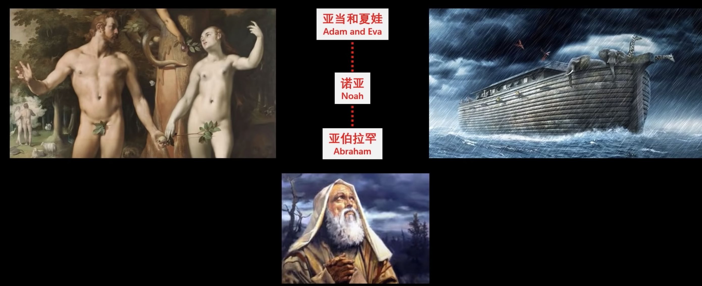
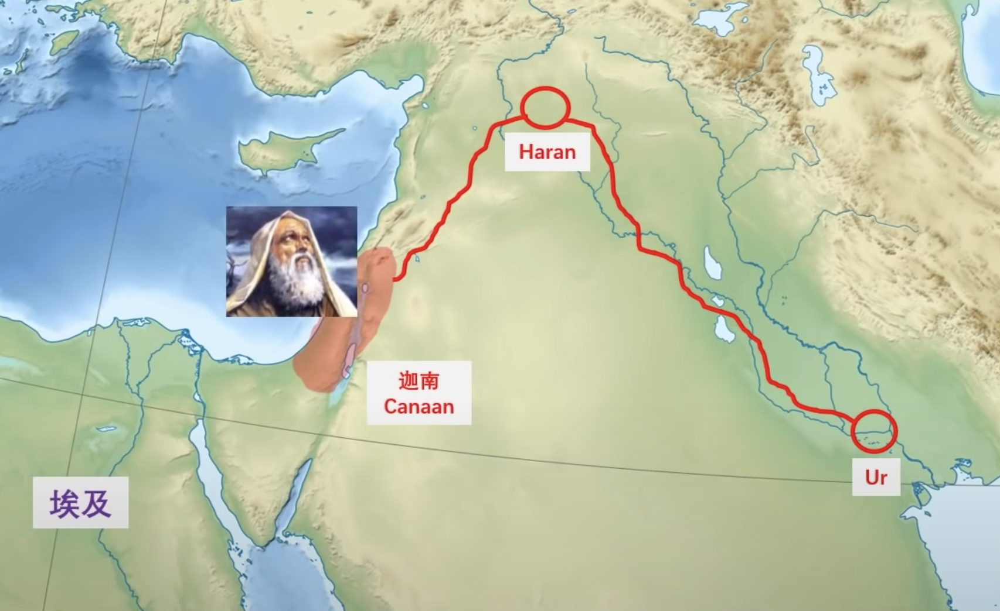
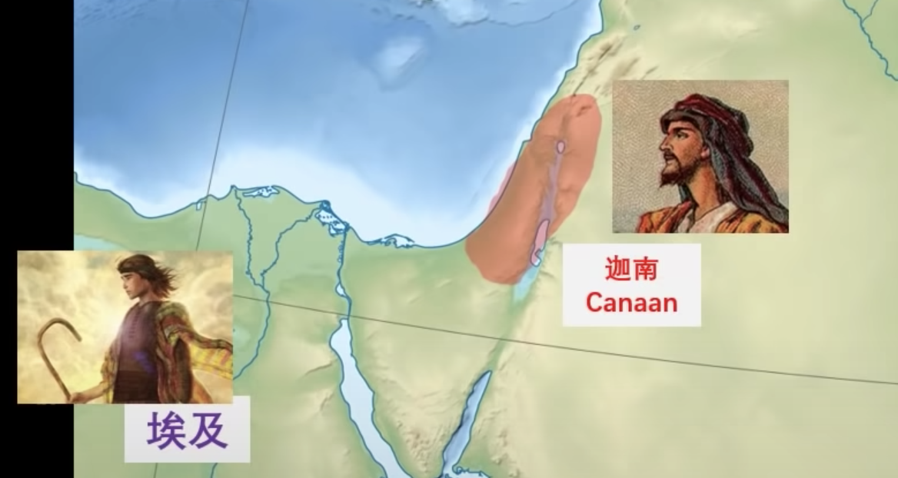
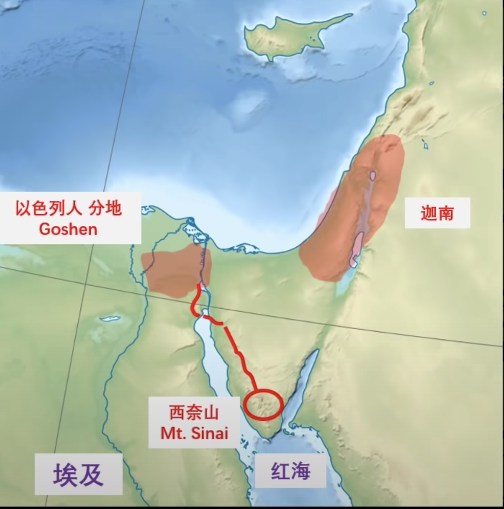
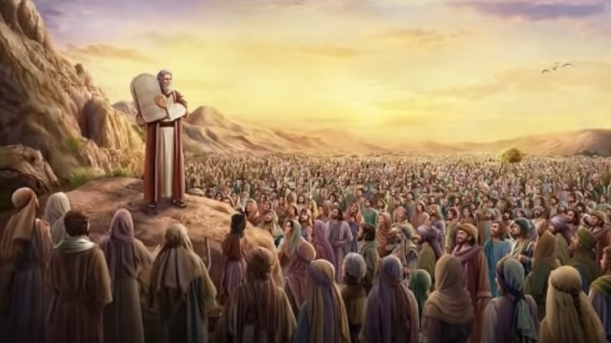
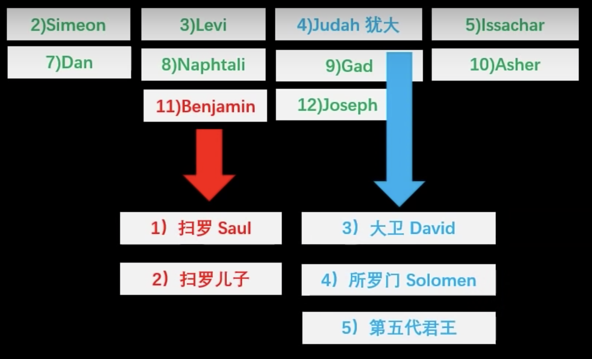
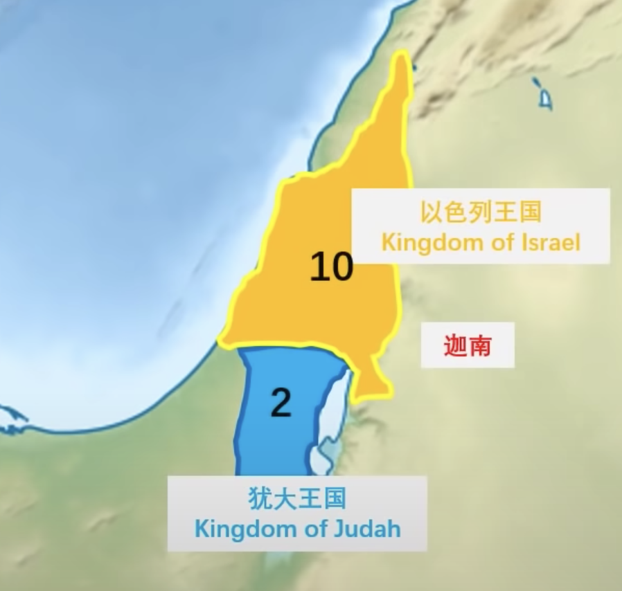
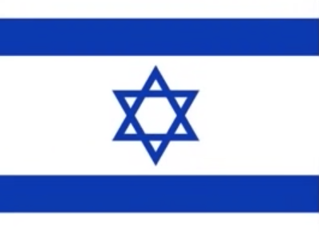
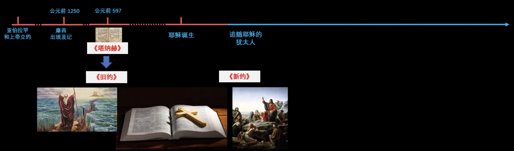
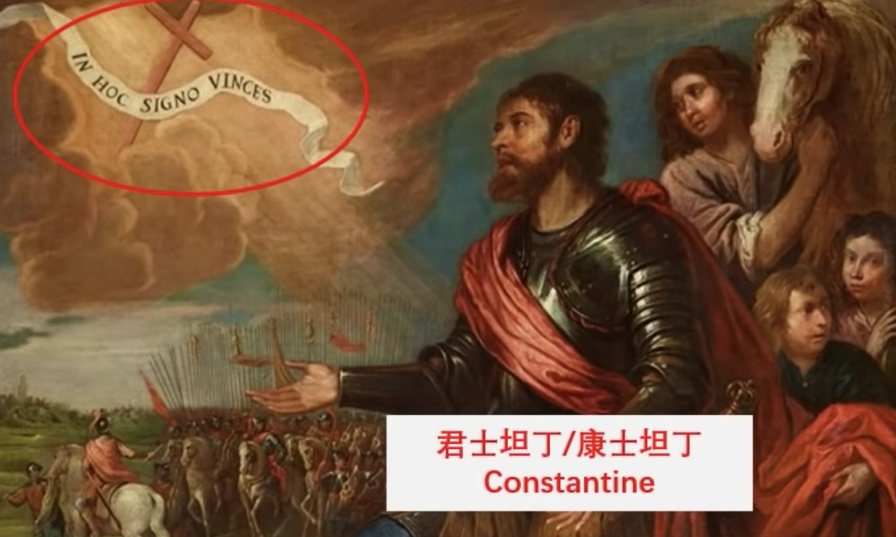

# 基督、犹太、伊斯兰教的关系

## 概述

心血来潮，想记一下这三个宗教的关系。

本文没有参考专业性质的书籍，内容均来自于 [用34分钟，解决困扰我多年的问题：基督，犹太，伊斯兰教的关系](https://www.youtube.com/watch?v=ncXCHdTFBEs)。

## 犹太人简史

这个章节探讨犹太人和犹太教的起源，以及以色列国的建立。

这是一个简单的时间线：

### 亚伯拉罕

亚伯拉罕是亚当夏娃的后代，生活在 Ur，然后去了 Haran，上帝引导亚伯拉罕到了 Canaan，并在 Canaan 建立了国度。

亚伯拉罕的后代 Jacob 和天使摔跤，天使为 Jacob 重新命名为 Iseral（以色列），Iseral 有 12 个孩子，这个群体被叫做 Israelites（以色列人），这就是现在以色列国的起源。

Iseral 的十二个儿子之一，约瑟被排挤到了埃及，并靠自己的解梦能力在埃及混的风生水起，成为了埃及的二把手。

Canaan 遇到了大饥荒，Iseral 带着部落投靠了约瑟，并在埃及定居，繁衍后代。

### 摩西

随着以色列人的增多，埃及人担心威胁到自己，因此开始奴役以色列人。

直到出现了一个名为`摩西`的以色列人，带着族人从埃及 Goshen 逃跑，到了西奈山。

摩西和上帝并在西奈山和上帝谈话，上帝颁布了：

- 十诫
- 律法

### 以色列联合王国

Iseral 的十二个儿子后代演变成了十二个部落：

**注意：**

- 上图中的犹大并不是背叛耶稣的犹大。

十二个部落联合起来建立了以色列联合王国，国王如下：

大卫国王在耶路撒冷建立了圣殿。

第五代国王时，以色列联合王国分裂了，变成了：

- 北边十个部落组成以色列王国
- 南部两个部落组成犹大王国

### 犹太人放逐

由于其他帝国的攻击，北边的以色列王国已经灭亡，南边的犹大王国则存活了下来。

犹大人作为以色列的主要分支，随着时间流逝，犹大人现在被叫做犹太人。

犹太人经常被其他国家打的四分五裂，多次被放逐。

### 复国以色列

犹太人在第二次世界大战后回到 Canaan 地区，并建立以色列国。

因为犹太人是大卫的后代，所以以色列的国旗是使用象征大卫的六芒星。

## 耶稣

## 基督教的发展

耶稣诞生后，相信耶稣的犹太人就是早起的犹太基督徒。“基督” 一词的含义就是“救世主”。

不相信耶稣的就是犹太教，犹太教一直在等待弥赛亚的出现。

### 圣经

圣经由两部分组成：

- 旧约，即塔纳赫，是上帝以前和子民的约定。
- 新约，即耶稣门徒记载的耶稣内容，是耶稣（也就是上帝）和子民新的约定。

### 普世教会

区别于犹太教，犹太教只传犹太人，不传外邦人。

基督教，不分人种，只要信耶稣即可，都能传。

基督教这具有普遍性，因此基督教的教会被称为普世教会。

### 国教

罗马帝国的信仰是多神教，从古希腊传承下来的，无法接受基督教，基督教传入欧洲时，最开始被罗马帝国判定为邪教。

康士坦丁使用十字架标记的盾牌打赢了关键的战争，因此开始信封基督教，皈依基督教（其实原因很复杂）。

自此，基督教开始合法化。

## 伊斯兰教的发展
