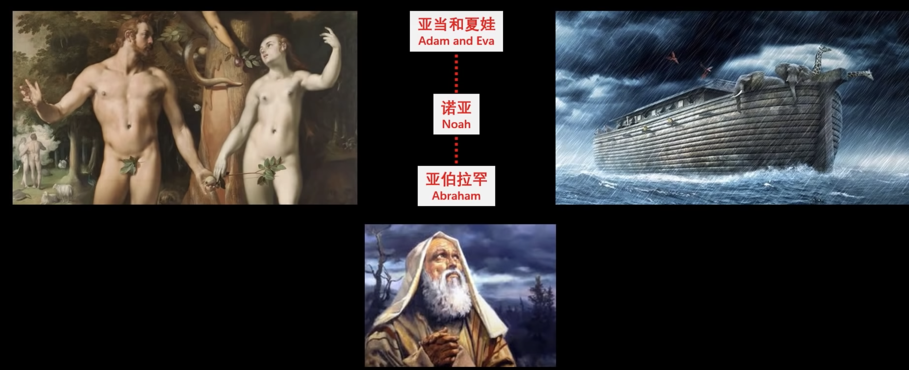
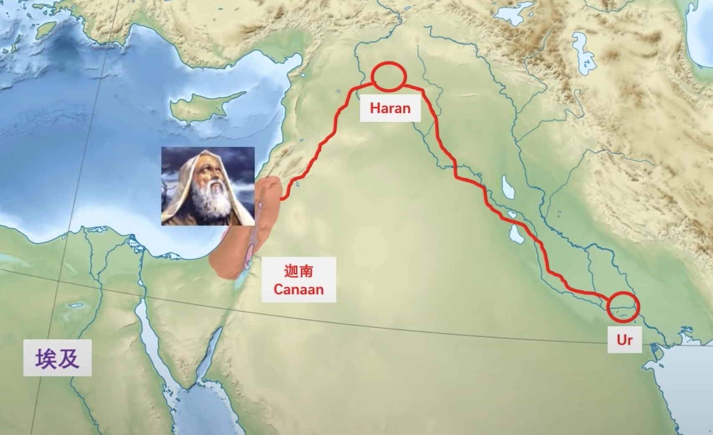
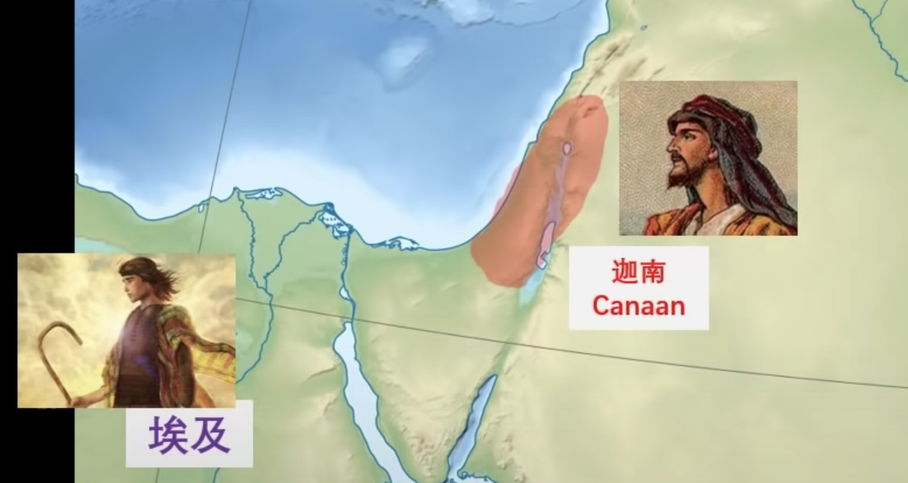
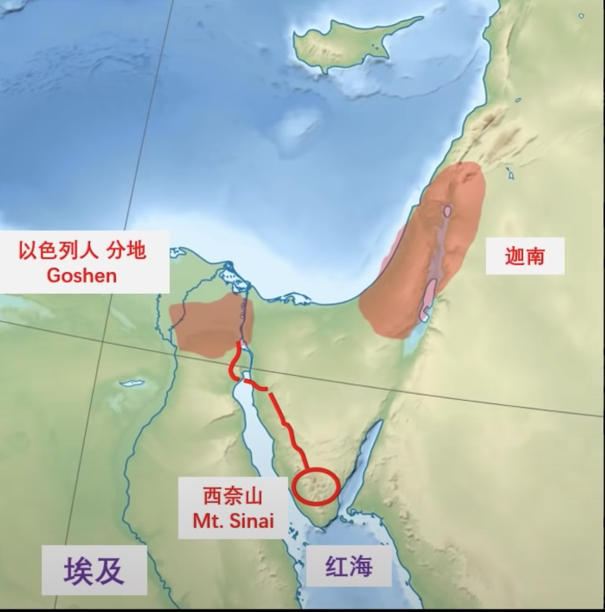
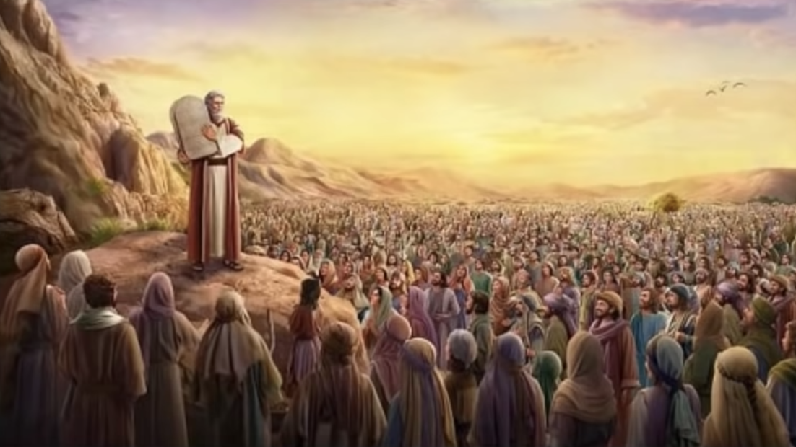

# 基督、犹太、伊斯兰教的关系

## 概述

心血来潮，想记一下这三个宗教的关系。

本文没有参考专业性质的书籍，内容均来自于 [用34分钟，解决困扰我多年的问题：基督，犹太，伊斯兰教的关系](https://www.youtube.com/watch?v=ncXCHdTFBEs)。

## 犹太人简史

亚伯拉罕是亚当夏娃的后代，生活在 Ur，然后去了 Haran，上帝引导亚伯拉罕到了 Canaan，并在 Canaan 建立了国度。

亚伯拉罕的后代 Jacob 和天使摔跤，天使为 Jacob 重新命名为 Iseral（以色列），Iseral 有 12 个孩子，这个群体被叫做 Israelites（以色列人），这就是现在以色列国的起源。

Iseral 的十二个儿子之一，约瑟被排挤到了埃及，并靠自己的解梦能力在埃及混的风生水起，成为了埃及的二把手。

Canaan 遇到了大饥荒，Iseral 带着部落投靠了约瑟，并在埃及定居，繁衍后代。

随着以色列人的增多，埃及人担心威胁到自己，因此开始奴役以色列人。

直到出现了一个名为`摩西`的以色列人，带着族人从埃及 Goshen 逃跑，到了西奈山。

摩西和上帝并在西奈山和上帝谈话，上帝颁布了：

- 十诫
- 律法

## 耶稣

## 基督教的发展

## 伊斯兰教的发展
