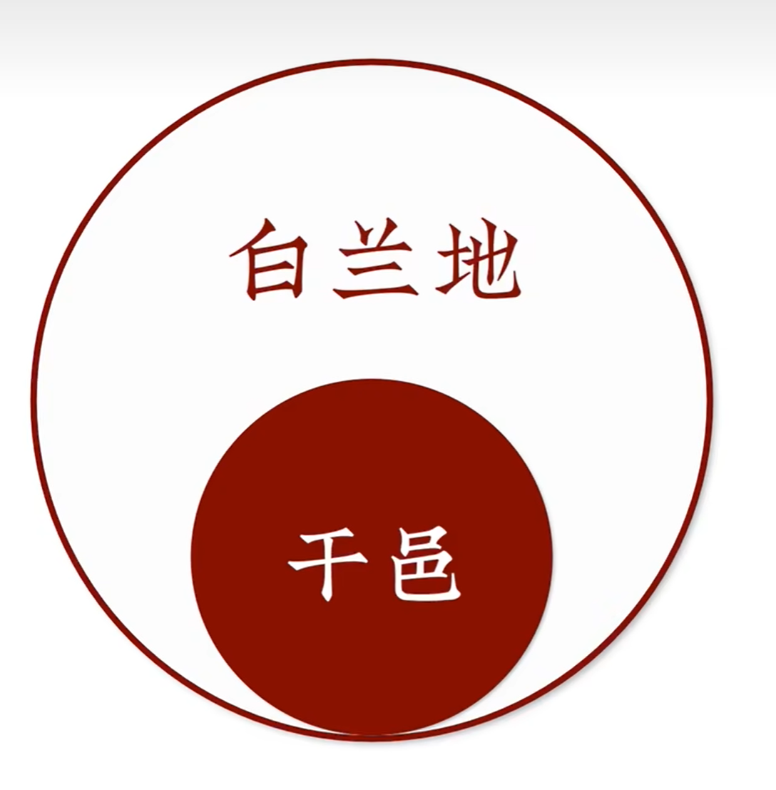
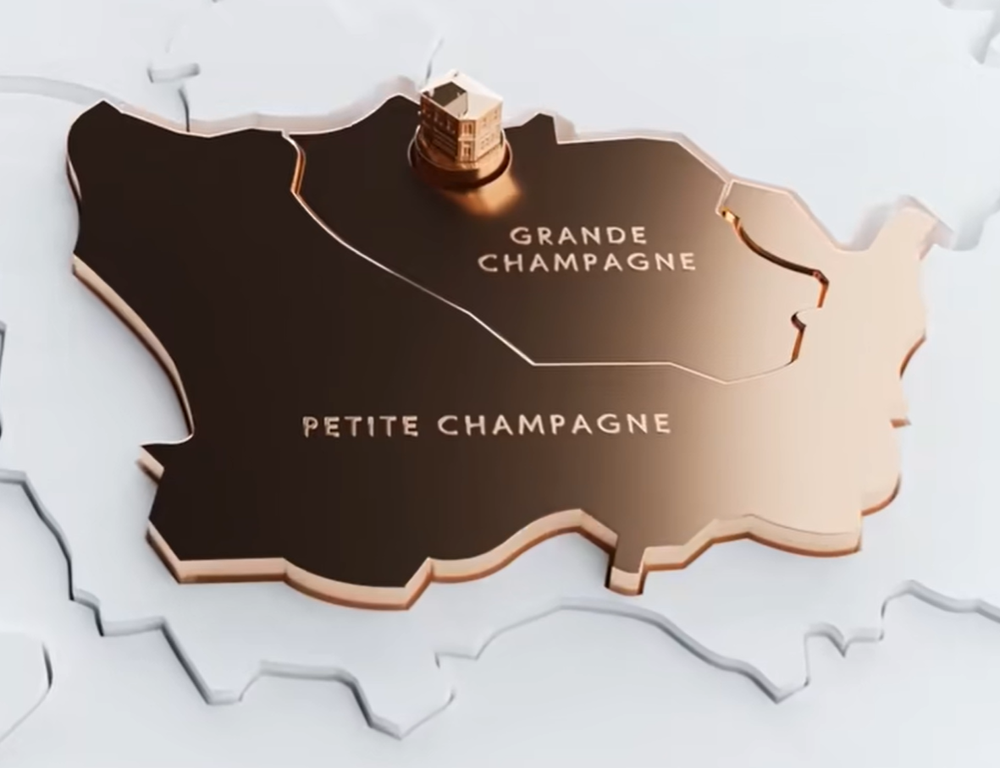

# 白兰地（Brandy）

## 概述

白兰地本质上来说，就是水果蒸馏的烈酒，常见的有这些水果：

- 葡萄
- 苹果
- 梨字

## 干邑

首先，需要充分认识到：

> 不是所有的白兰地都是干邑

干邑是白兰地的子集：

因为白兰地其实就是水果蒸馏酒，而干邑是在白兰地基础上有着更严格的要求：

- 必须用葡萄蒸馏，并且必须是法国香槟区的葡萄。
- 必须在铜制蒸馏器中进行二次蒸馏。
- 必须在橡木桶中进行陈酿至少两年。

干邑中，以人头马品牌对葡萄的品质最为苛刻，必须选择核心地带，大小香槟区的葡萄：

### 干邑等级

干邑中通常会有些常见的字母，例如 X.O，V.S.O.P 等，这些代表着干邑的等级，通常这个等级是陈年时间来表示。

干邑等级（由低到高）：

等级 | 全称| 描述 | 示例
-|-|-|-
V.S | Very Special | 陈年至少 2 年。最便宜的干邑，适合调酒。 | 轩尼诗新点。
V.S.O.P | Very Superior Old Pale | 陈年至少 4 年。 | 马爹利拱桥、轩尼诗 V 仔。
X.O | Extra Old | 陈年至少 10 年。甜、润、顺。 | 轩尼诗 XO。
X.X.O | Extra Extra Old | 陈年至少 14 年。| 轩尼诗百乐亭（PARADIS）。

### 干邑品牌

常见的品牌如下：

品牌 | 描述
-|-
轩尼诗（Hennessy） |
马爹利 |
人头马 |
拿破仑 |

## 参考材料

1. [常说的 VS、VSOP、XO 是什么意思？](https://zhuanlan.zhihu.com/p/110429450)
1. [白蘭地干邑 VS、VSOP、XO 的差別](https://blog.longwin.com.tw/2022/05/wine-brandy-cognac-vs-vsop-napoleon-xo-extra-2022/)
1. [VS、VSOP、XO 不同級數的干邑有何分別？](https://www.esquirehk.com/lifestyle/brandy-cognac-vs-vsop-napoleon-xo-extra)
1. [老男人的酒柜尽头，是轩尼诗【全系列】](https://www.bilibili.com/video/BV1HX4y1S716/?)