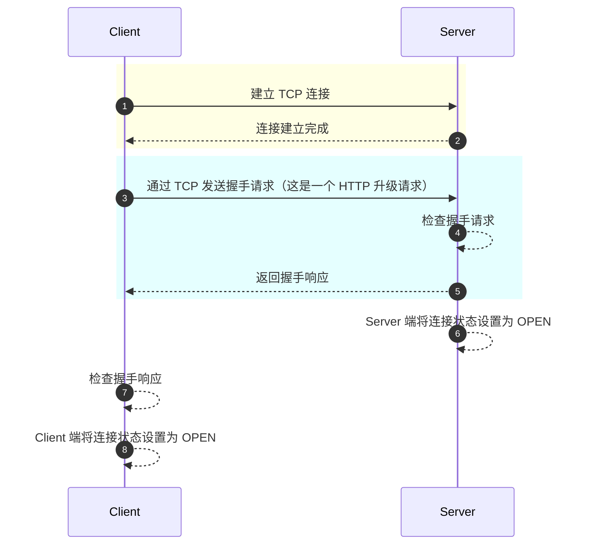
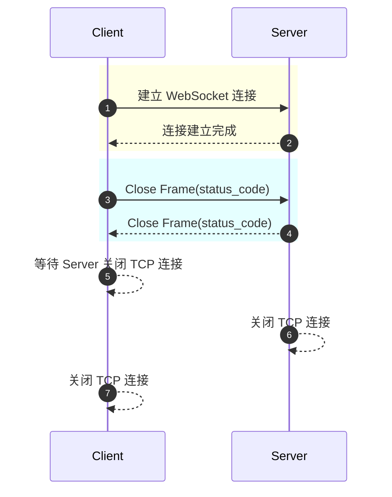
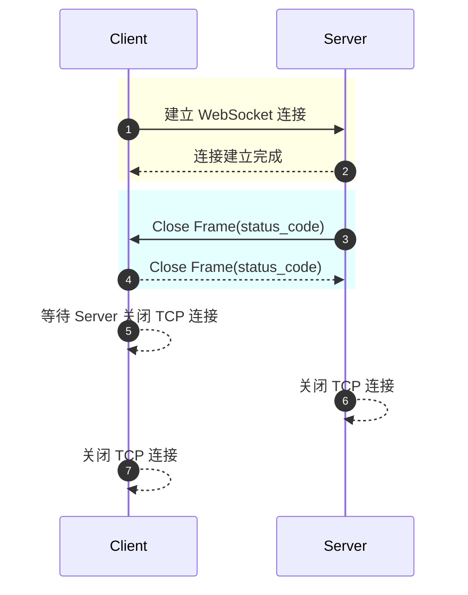
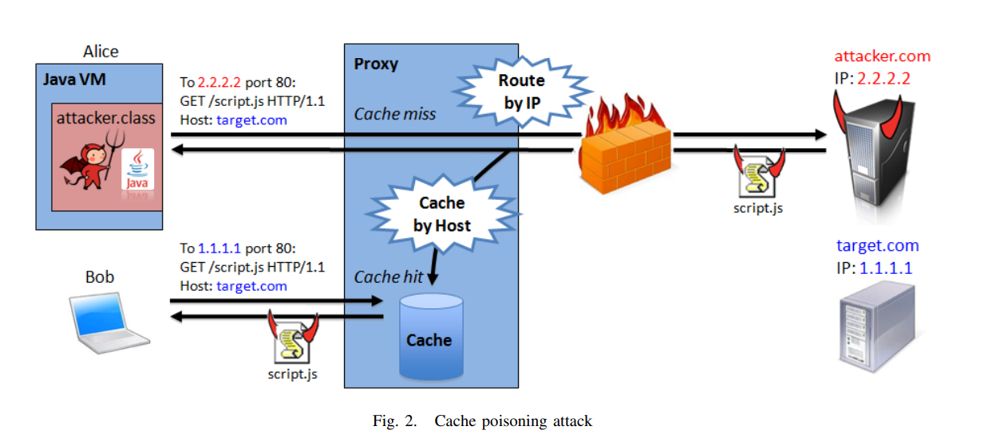

# WebSocket Protocol

<!-- TOC -->

- [WebSocket Protocol](#websocket-protocol)
    - [Overview](#overview)
    - [WebSocket URIs](#websocket-uris)
    - [Opening Handshake](#opening-handshake)
        - [Client Requirements](#client-requirements)
        - [Server-Side Requirements](#server-side-requirements)
        - [Multiple Versions](#multiple-versions)
    - [Data Framing](#data-framing)
        - [Base Framing Protocol](#base-framing-protocol)
        - [Fragmentation](#fragmentation)
        - [Control Frames](#control-frames)
        - [Data Frames](#data-frames)
    - [Sending and Receiving Data](#sending-and-receiving-data)
    - [Closing the Connection](#closing-the-connection)
        - [Close Defines](#close-defines)
        - [Abnormal Closures](#abnormal-closures)
        - [Normal Closure of Connections](#normal-closure-of-connections)
        - [Status Codes](#status-codes)
    - [Error Handling in UTF-8-Encoded Data](#error-handling-in-utf-8-encoded-data)
    - [Extensions](#extensions)
        - [Negotiating Extensions](#negotiating-extensions)
        - [Known Extensions](#known-extensions)
    - [Security Considerations](#security-considerations)
        - [Non-Browser Clients](#non-browser-clients)
        - [Origin Considerations](#origin-considerations)
        - [Attacks On Infrastructure](#attacks-on-infrastructure)
        - [WebSocket Client Authentication](#websocket-client-authentication)
        - [Connection Confidentiality and Integrity](#connection-confidentiality-and-integrity)
        - [Handling of Invalid Data](#handling-of-invalid-data)
        - [Use of SHA-1 by the WebSocket Handshake](#use-of-sha-1-by-the-websocket-handshake)
    - [References](#references)

<!-- /TOC -->

## Overview

本文主要是对 [The WebSocket Protocol](https://datatracker.ietf.org/doc/html/rfc6455) 的总结和梳理。

本文对 WebSocket 的背景，解决的问题不做阐述，本文主要是聚焦在 WebSocket 协议细节，流程，安全性方面的内容。

先看一下 WebSocket 握手流程：

- Client 握手请求：

  ```http
  GET /chat HTTP/1.1
  Host: server.example.com
  Upgrade: websocket
  Connection: Upgrade
  Sec-WebSocket-Key: dGhlIHNhbXBsZSBub25jZQ==
  Origin: http://example.com
  Sec-WebSocket-Protocol: chat, superchat
  Sec-WebSocket-Version: 13
  ```

- Server 握手响应：

  ```http
  HTTP/1.1 101 Switching Protocols
  Upgrade: websocket
  Connection: Upgrade
  Sec-WebSocket-Accept: s3pPLMBiTxaQ9kYGzzhZRbK+xOo=
  Sec-WebSocket-Protocol: chat
  ```

这里对一些头部进行解释：

- 上述 `Sec-WebSocket-Key` 由 Server 使用，并计算得出 `Sec-WebSocket-Accept`，Client 需要用相同的方式校验 Accept 和 Key 是否匹配。
  - Client 提供 `Sec-WebSocket-Key`，更方便 Server 校验 Client 是否真的支持 WebSocket，避免不小心和不支持 WebSocket 的 Client 建立了 WebSocket 连接。
  - Server 提供 `Sec-WebSocket-Accept` 目的是确保 Server 真的理解并支持 WebSocket，避免 Client 和一个非 WebSocket Server 建立了 WebSocket 连接。
  - 计算方式是公开的，这一操作并不保证任何安全性。
- 上述 `Sec-WebSocket-Version` 指定了 WebSocket 使用的协议，通常为 13，细节请参考 [Multiple Versions](#multiple-versions)。
- 上述 `Sec-WebSocket-Protocol` 指定了子协议，Client 通知 Server 期望使用的子协议，Server 根据自己的支持情况和优先级选择其中一个进行返回。
  - 子协议可以自定义，也可以从 [IANA WebSocket Subprotocol Name Registry](https://www.iana.org/assignments/websocket/websocket.xml#subprotocol-name) 中选择。
- WebSocket 还存在协议扩展头部 `Sec-WebSocket-Extensions`（上面没有给出），由 Client 提供，Server 根据自己的情况从中选择支持的返回（可以选择多个）。
  - Extensions 必须从 [IANA WebSocket Extension Name Registry](https://www.iana.org/assignments/websocket/websocket.xml#extension-name) 中选择（不能自定义）。

更多的关于 WebSocket 握手的信息请参考 [Opening Handshake](#opening-handshake)。

在握手成功以后，客户端和服务端传输的数据来回传输的数据单位，我们在规范中称为消息（Messages）。

在传输中，一条消息有一个或者多个 Frame 组成。也因此，Frame 的负载数据串联起来就是消息的数据：

```text
+--------------------------------------------------------------------+
|                           Single Message                           |
+--------------------------------------------------------------------+
|       Frame 1        |       Frame 2        |       Frame 3        |
+--------------------------------------------------------------------+
```

有关 Frame 的内容参考 [Data Framing](#data-framing)。

在 WebSocket 连接需要关闭时，需要使用 Closing Handshake，即关闭握手。WebSocket 任何一个 Endpoint 都可以发送 Close Frame，发起关闭握手，对端收到后需要发送一个相应的 Close Frame。更多关于 WebSocket 连接关闭的信息请参考 [Closing the Connection](#closing-the-connection)。

## WebSocket URIs

WebSocket 定义了两种 URI 方法 ws 和 wss，完整的 URI 由 ABNF 语法表示：

```text
ws-URI = "ws:" "//" host [ ":" port ] path [ "?" query ]
wss-URI = "wss:" "//" host [ ":" port ] path [ "?" query ]
```

对于端口，port 是可选的:

- "ws" 默认为 80
- "wss" 默认为 443

在 WebSocket URIs 中，Fragment 标识(#) 是没有意义的，并且禁止在 WebSocket URIs 中使用 #。

若使用 "#" 字符（不是表示 fragment），必须编码为 `%23`。

## Opening Handshake

无论是客户端还是服务器，最初连接的状态是 `CONNECTING`，在握手完成后，状态变为 `OPEN`。

连接大致流程如下：



### Client Requirements

从客户端视角来看，客户端需要通过 WebSocket URIs 提供 `host`, `port`, `resource name` 以及 `secure` 来进行连接 WebSocket 的建立。 

Client 必须要先打开 TCP 连接，然后发送握手请求，再读取 Server 的握手响应。

Client 建立 TCP 连接的要求：

- Client 使用的 WebSocket URI 的每个组成部分（`host`, `port`, `resource name` 和 `secure`）均有效。
- Client 和一个 IP 建立多个连接，必须是顺序的，即和同一个 IP 地址的连接最多只能有一个处于 CONNECTING 状态。多个域名解析出同一个 IP 仍然受次限制。
  - Client 需要将处于 CONNECTING 状态的连接维持在一个较小的数量范围内。
  - 这些限制是为了避免脚本建立大量的连接，进行 denial-of-service 攻击。
  - Client 不会限制 OPEN 状态的连接个数，若需要限制则有 Server 进行限制（超出范围 Server 进行连接关闭）。
- 如果 TCP 连接不能建立，WebSocket 连接必须立即终止，并停止任何尝试。
- 如果使用 `wss`，Client 必须在 TCP 连接上进行 TLS 握手，如果 TLS 握手失败，则 WebSocket 连接必须立即终止。

一旦 TCP 连接建立，Client 需要发送握手数据，握手请求是一个 HTTP 升级请求，它有这些要求：

- 握手请求必须是一个有效的 HTTP 请求。
- 握手请求必须使用 `GET` 方法，并且 HTTP 版本至少为 `1.1`。
- 握手请求必须包含 `Host` HTTP Header，它包含了 `host:port` 的信息，是连接对端的信息。
- 握手请求必须包含 `Upgrade` HTTP Header，取值必须为 `websocket`。
- 握手请求必须包含 `Connection` HTTP Header，取值必须为 `Upgrade`。
- 如果 Client 是一个浏览器，握手请求必须包含 `Origin` HTTP Header。非浏览器的 Client 也可能会包含这个 Header。该头部指示了 Client 运行的源。
- 握手请求必须包含 `Sec-WebSocket-Key` HTTP Header，取值是随机 16 字节的数据的 Base64。每个连接都需要生成一个新的随机数。
- 握手请求必须包含 `Sec-WebSocket-Version` HTTP Header，取值必须是 13。
- 握手请求可能包含 `Sec-WebSocket-Protocol` HTTP Header，该值标识 Client 希望使用的子协议，可以是多个子协议，它们以逗号进行分割。
- 握手请求可能包含 `Sec-WebSocket-Extensions` HTTP Header，该值标识 Client 希望进行的协议级别扩展，可以参考 [Extensions](#extensions)。
- 握手请求可能包含其他的 HTTP Header，例如 Cookie，Authorization 等。

握手请求发送后，Client 必须等待 Server 响应，当 Server 响应到来，Client 需要对响应进行校验：

- 响应的状态码通常是 101，若不是 101，则需要根据具体值进行处理，例如：
  - 401 需要 Client 提示用户提供身份
  - 3xx 进行重定向。
- 响应缺少 `Upgrade` HTTP Header，或者取值不为 `websocket`，Client 必须认为连接失败，并关闭连接。
- 响应缺少 `Connection` HTTP Header，或者取值不为 `Upgrade`，Client 必须认为连接失败，并关闭连接。
- 响应缺少 `Sec-WebSocket-Accept` HTTP Header，或者取值与请求中的 `Sec-WebSocket-Key` 计算不匹配，Client 必须认为连接失败，并关闭连接。
- 如果响应包含 `Sec-WebSocket-Extensions` 且使用了在请求中 `Sec-WebSocket-Extensions` 不包含的扩展，Client 必须认为连接失败，并关闭连接。
- 如果响应包含 `Sec-WebSocket-Protocol` 且使用了在请求中 `Sec-WebSocket-Protocol` 不包含的子协议，Client 必须认为连接失败，并关闭连接。

如果服务端的响应通过了上述的验证过程，那么 WebSocket 就已经建立连接了，并且 WebSocket 的连接状态也到了 OPEN 状态。

### Server-Side Requirements

从 Server 视角来看，Server 需要等待 Client 的 TCP 连接，并等待 Client 的握手请求，再对此进行响应。

当与 Client 建立 TCP 连接后，Server 认为 WebSocket 处于 CONNECTING 状态。

Server 解析 Client 的握手请求：

- 必须是一个版本大于 HTTP/1.1 的 GET 请求。
- 包含了 Host Header，其指出了 authority。
- 包含了 Upgrade Header，取值必须为 websocket。
- 包含了 Connection Header，取值必须为 Upgrade。
- 包含了 Sec-WebSocket-Key Header，这是一个 Base64 编码的值，解码后有 16 个字节。
- 包含了 Sec-WebSocket-Version Header，取值必须为 13。
- 可选的 Origin Header。缺少该字段时，会认为连接来自非浏览器的 Client。
- 可选的 Sec-WebSocket-Protocol Header，列出了 Client 希望使用的子协议，以优先级排序。
- 可选的 Sec-WebSocket-Extensions Header，列出了 Client 希望使用的扩展。
- 未知的 Header 选择忽略。

如果 Server 解析 Client 握手请求失败，Server 必须立即终止握手流程，并返回 HTTP 错误码（Server 并不会去关闭这个 TCP 连接，以便 Client 重新握手）。

Version 这是可以协商的，参考 [Multiple Versions](#multiple-versions)。

Server 解析 Client 握手请求成功后，可以发送响应了：

- 连接如果使用 TLS，则需要进行 TLS 握手，如果 TLS 握手失败，需要关闭连接（Server 看起来只有这种情况才会主动关闭 TCP 连接）。
- Server 可以对 Client 进行认证，不同认证返回 401。
- Server 可以使用 3xx 进行重定向。
- Server 构造以下信息：
  - `/origin/`
    - Client 的 `Origin Header` 提供，标识 Client 运行的源。
    - Server 可以使用这个信息来作为判断是否接受这个连接的参考。如果服务端没有过滤 Origin，那么他会接受任意 Origin 的连接。
  - `/key/`
    - Client 的 `Sec-WebSocket-Key` Header 提供，
    - Server 使用该值构造 Sec-WebSocket-Accept。
  - `/version/`
    - Client 的 `Sec-WebSocket-Version` Header 提供，标识 Client 建立 WebSocket 连接使用的协议版本。
    - Server 需要判断自己是否支持该版本，若不支持需要返回 `426 Upgrade Required`，同时返回 `Sec-WebSocket-Version` 标识自己支持的版本。
  - `/resource name/`
    - 标识 Server 提供的 Service。如果 Server 提供多个服务，则 Client 通过 resource name 来声明自己需要什么服务。
    - 如果 Client 请求的服务无效，Server 必须返回相应错误码。
  - `/subprotocol/`
    - 表示服务器使用的子协议，为 null 或者某一个单一值，选择的值来自于 Client 的 `Sec-WebSocket-Protocol`。
    - 如果 Server 不接受 Client 的 Protocol，或者 Client 没有传递 Protocol，则 Server 必须认为 subprotocol 为 null。
  - `/extensions/`
    - 表示 Server 准备使用的 Extensions 列表，选择的值来自于 Client 的 `Sec-WebSocket-Extensions`。
    - Client 未提供的值不得使用。
- Server 接收连接，则需要通过一个有效的 HTTP 响应返回以下信息：
  - 101 状态码，例如 `HTTP/1.1 101 Switching Protocols`。
  - Upgrade Header，取值为 `websocket`。
  - Connection Header，取值为 `Upgrade`。
  - Sec-WebSocket-Accept Header，取值为 b64(sha1(`/key/` + 258EAFA5-E914-47DA-95CA-C5AB0DC85B11))。
  - 可选的 Sec-WebSocket-Protocol Header，取值为 `/subprotocol/`。
  - 可选的 Sec-WebSocket-Extensions Header，取值为 `/extensions/`，可以返回多个。

如果 Server 完成这些步骤都没有问题，Server 会认为 WebSocket 连接已建立，并设置为 OPEN 状态。这个时刻开始，Server 可以发送和接收数据了。

### Multiple Versions

虽然通常使用 WebSocket 版本 13，但是这不是必须的，Client 和 Server 是可以进行版本协商的。

WebSocket 协议版本号和 RFC Draft 编号有所关系，但并不是一一对应，WebSocket 版本请参考 [WebSocket Version Number Registry](https://www.iana.org/assignments/websocket/websocket.xml#version-number)。

Client 可以通过 `Sec-WebSocket-Version` 告诉 Server 自己愿意使用的 WebSocket 版本（不一定必须使用版本 13）：

- 如果 Server 支持该版本，则服务器接收请求，完成连接建立。
- 如果 Server 不支持该版本，Server 返回 `Sec-WebSocket-Version` Header 来指示自己所支持的版本。
  - 如果 Client 支持其中之一，则 Client 应该选择其一重新发起握手请求（相同的 TCP 连接上）。

Client 发送自己期望使用的版本 25：

```text
GET /chat HTTP/1.1
Host: server.example.com
Upgrade: websocket
Connection: Upgrade
...
Sec-WebSocket-Version: 25
```

Server 不支持版本 25，并返回了自己支持的所有版本：

```text
HTTP/1.1 400 Bad Request
...
Sec-WebSocket-Version: 13, 8, 7

或者以多个 Version Header 返回

HTTP/1.1 400 Bad Request
...
Sec-WebSocket-Version: 13
Sec-WebSocket-Version: 8, 7
```

Client 选择一个合适的版本，重新发起一个握手请求：

```text
GET /chat HTTP/1.1
Host: server.example.com
Upgrade: websocket
Connection: Upgrade
...
Sec-WebSocket-Version: 13
```


## Data Framing

在 WebSocket 协议中，使用一系列的帧（Frame）来进行数据传输。

从安全的角度出发（参考 [Attacks On Infrastructure](#attacks-on-infrastructure)），Client 应该混淆 Frame 的数据（无论是否使用 TLS 都应该混淆数据），混淆的方式是使用 Masking-key 做 Mask 操作，但是 Server 发送的 Frame 一定不能进行 Mask。具体而言：

- Client 发送 Masked Frame，Server 收到一个 Unmasked Frame，必须要关闭连接。
- Server 发送 Unmasked Frame，Client 收到一个 Masked Frame，必须要关闭连接。

### Base Framing Protocol

数据帧协议结构：

```text
  0                   1                   2                   3
  0 1 2 3 4 5 6 7 8 9 0 1 2 3 4 5 6 7 8 9 0 1 2 3 4 5 6 7 8 9 0 1
 +-+-+-+-+-------+-+-------------+-------------------------------+
 |F|R|R|R| opcode|M| Payload len |    Extended payload length    |
 |I|S|S|S|  (4)  |A|     (7)     |             (16/64)           |
 |N|V|V|V|       |S|             |   (if payload len==126/127)   |
 | |1|2|3|       |K|             |                               |
 +-+-+-+-+-------+-+-------------+ - - - - - - - - - - - - - - - +
 |     Extended payload length continued, if payload len == 127  |
 + - - - - - - - - - - - - - - - +-------------------------------+
 |                               |Masking-key, if MASK set to 1  |
 +-------------------------------+-------------------------------+
 | Masking-key (continued)       |          Payload Data         |
 +-------------------------------- - - - - - - - - - - - - - - - +
 :                     Payload Data continued ...                :
 + - - - - - - - - - - - - - - - - - - - - - - - - - - - - - - - +
 |                     Payload Data continued ...                |
 +---------------------------------------------------------------+
```

数据帧中各部分的含义：

Field | Length | Description
-|-|-
FIN | 1 bits |  表示这是消息的最后一个片段。第一个片段也有可能是最后一个片段。
RSV1/RSV2/RSV3 | 3 bits | 必须设置为 0，除非扩展了非 0 值含义的扩展。
Opcode | 4 bits | Defines the interpretation of the "Payload data". opcode 含义请参考下一个表。
Mask | 1 bits | Mask 标志位，定义 Payload data 是否添加掩码。如果设置为1，那么 Mask Key 存在于 Masking-Key 部分。<br>All frames sent from client to server have this bit set to 1.
Payload length | 7 or 7+16 or 7+64 bits | The length of the "Payload data". <br>如果取值在 0-125 之间，则这就是 Payload data 的长度。<br>如果取值为 126，则后面两字节表示 Payload data 的长度。<br>如果取值为 127，则后面八字节表示 Payload data 的长度。
Masking-key | 0 or 32 bits | 如果 Mask 标识为 1，则 Masking-key 存在，且为 4 字节。否则 Masking-key 不存在。
Payload data | x + y bytes| Payload Data 包含两个部分：Extension data (x bytes) 和 Application data(y bytes)
Extension data | x bytes | ​ 除非在握手时协商过 Extension，否则 Extension data 长度为 0 bytes。
Application data | y bytes | 任意的应用数据，占用后面的剩余所有字节。

Opcode 的含义：

Opcode | Description
-|-
​ %x0 | 表示一个持续帧。消息被分片后，后续帧都的 opcode 均使用 0，表示这是一个持续帧。
​ %x1 | 表示一个 text 帧
​ %x2 | 表示一个 binary 帧
​ %x3-7 | 预留给以后的非控制帧
​ %x8 | 表示连接关闭
​ %x9 | 表示 ping
​ %xA | 表示 pong
​ %xB-F | 预留给以后的控制帧

Base Framing Protocol 的 ABNF 表示方式（虽然有点长，但确实是比较严谨的方式）：

```abnf
    ws-frame                = frame-fin           ; 1 bit in length
                              frame-rsv1          ; 1 bit in length
                              frame-rsv2          ; 1 bit in length
                              frame-rsv3          ; 1 bit in length
                              frame-opcode        ; 4 bits in length
                              frame-masked        ; 1 bit in length
                              frame-payload-length   ; either 7, 7+16,
                                                     ; or 7+64 bits in
                                                     ; length
                              [ frame-masking-key ]  ; 32 bits in length
                              frame-payload-data     ; n*8 bits in
                                                     ; length, where
                                                     ; n >= 0

    frame-fin               = %x0 ; more frames of this message follow
                            / %x1 ; final frame of this message
                                  ; 1 bit in length

    frame-rsv1              = %x0 / %x1
                              ; 1 bit in length, MUST be 0 unless
                              ; negotiated otherwise

    frame-rsv2              = %x0 / %x1
                              ; 1 bit in length, MUST be 0 unless
                              ; negotiated otherwise

    frame-rsv3              = %x0 / %x1
                              ; 1 bit in length, MUST be 0 unless
                              ; negotiated otherwise

    frame-opcode            = frame-opcode-non-control /
                              frame-opcode-control /
                              frame-opcode-cont

    frame-opcode-cont       = %x0 ; frame continuation

    frame-opcode-non-control= %x1 ; text frame
                            / %x2 ; binary frame
                            / %x3-7 ; 4 bits in length, reserved for further non-control frames

    frame-opcode-control    = %x8 ; connection close
                            / %x9 ; ping
                            / %xA ; pong
                            / %xB-F ; reserved for further control frames 4 bits in length

    frame-masked            = %x0 ; frame is not masked, no frame-masking-key
                            / %x1 ; frame is masked, frame-masking-key present 1 bit in length

    frame-payload-length    = ( %x00-7D )
                            / ( %x7E frame-payload-length-16 )
                            / ( %x7F frame-payload-length-63 )
                            ; 7, 7+16, or 7+64 bits in length, respectively

    frame-payload-length-16 = %x0000-FFFF ; 16 bits in length

    frame-payload-length-63 = %x0000000000000000-7FFFFFFFFFFFFFFF
                            ; 64 bits in length

    frame-masking-key       = 4( %x00-FF )
                              ; present only if frame-masked is 1
                              ; 32 bits in length

    frame-payload-data      = (frame-masked-extension-data
                               frame-masked-application-data)
                            ; when frame-masked is 1
                              / (frame-unmasked-extension-data
                                frame-unmasked-application-data)
                            ; when frame-masked is 0

    frame-masked-extension-data     = *( %x00-FF )
                            ; reserved for future extensibility
                            ; n*8 bits in length, where n >= 0

    frame-masked-application-data   = *( %x00-FF )
                            ; n*8 bits in length, where n >= 0

    frame-unmasked-extension-data   = *( %x00-FF )
                            ; reserved for future extensibility
                            ; n*8 bits in length, where n >= 0

    frame-unmasked-application-data = *( %x00-FF )
                            ; n*8 bits in length, where n >= 0

```

### Fragmentation

为了允许发送一个未知大小消息，而不必缓存消息，支持对消息进行分片。如果消息无法分片，则网络中的 Endpoint 就会涉及到对整个消息进行缓存。

因为 WebSocket 支持消息分片，所以 Server 或 Proxy 都可以选择一个合理的缓存区大小，当缓存已满，将分片写进网络中。

分片的另外一个原因，是为了让连接更好的多路复用，例如一个大消息的传输耗时可能较长，期望中间穿插一些控制信息。

**注意：**

- 上述提到对消息进行分片，消息可以理解为就是一次应用层的数据发送，也可以理解为单个大数据帧。

下面是分片的规则：

- 一个没有分片的消息，由 Single Frame 进行传输，且 `fin=1 & opcode>0`。
- 一个被分片的消息，由多个 Frame 组成，首个 Frame `fin=0 & opcode>0`，中间有 0 个或多个 Frame `fin=0 & opcode=0`，最后有一个 Frame `fin=1 & opcode=0`
  - 分片消息帧，等价于是单个大消息帧，分片消息的所有 Payload Data 串联起来才是真正的消息数据。
- 控制帧不能进行分片，并且控制帧可能穿插在分片的数据帧中。
- 分片必须顺序的传递，因为分片没有序号信息，使用 TCP 顺序传递分片，可以对此保证。
- 多个消息的分片不能彼此交织传输，因为分片没有标识属于什么消息，因此当前消息分片传完后，才会传递下一个分片的。
- Endpoint 必须可以处理消息分片中夹杂的控制帧。
- 发送端可以发送任意大小的消息。
- Client 和 Server 必须支持分片和未分片消息的处理。

从以上规则中可以看出，消息的所有的分片帧均是属于同一个类型，并由第一个帧的 opcode 声明。

这是一些消息分片的示例：

```text
没有分片的 text 数据帧:
+----------------------+
|       Frame 1        |
+----------------------+
|  fin = 1, opcode = 1 |
+----------------------+

没有分片的 binary 数据帧:
+----------------------+
|       Frame 1        |
+----------------------+
|  fin = 1, opcode = 2 |
+----------------------+

分片的 binary 数据帧:
+----------------------+----------------------+----------------------+
|       Frame 1        |       Frame 2        |       Frame 3        |
+----------------------+----------------------+----------------------+
|  fin = 0, opcode = 2 |  fin = 0, opcode = 0 |  fin = 1, opcode = 0 |
+----------------------+----------------------+----------------------+

中间穿插控制帧的 text 数据帧：
+----------------------+----------------------+----------------------+----------------------+
|       Frame 1        |       Frame 2        |       Frame 3        |       Frame 4        |
+----------------------+----------------------+----------------------+----------------------+
|  fin = 0, opcode = 2 |  fin = 0, opcode = 0 |  fin = x, opcode = 9 |  fin = 1, opcode = 0 |
+----------------------+----------------------+----------------------+----------------------+

Frame 3 中的 fin = x，以为着 fin 是什么不重要，框架（例如 tconnd）收到控制帧，就认为是一个单独的帧，不会参与数据重组。
```

### Control Frames

控制帧通过 opcode 进行标识，包括：

- 0x8 关闭
- 0x9 Ping
- 0xA Pong

opcode 的 0xB - 0xF 是为扩展控制帧类型而保留的范围。

所有控制帧的 Payload data 长度必须为 125，并且不得分段。控制帧可以穿插在数据帧分片中。

#### Close Frame

Close 帧包含 Application Data，用于标识连接关闭的原因。如果存在 Application Data，其组成是：

- 前两个字节是 unsigned char 的状态码。
- 随后是 UTF-8 编码的连接关闭原因。

**注意：**

- Endpoint 发送 Close Frame 后，不得再发送任何数据帧。
- Endpoint 收到 Close Frame 后，Endpoint 必须要响应一个 Close Frame（状态码和请求 Close Frame 的保持一致）。
- Endpoint 可以滞后发送 Close Frame 直到当前的数据帧被发送完。
- Endpoint 收到 Close Frame 后，如果继续发送数据，不保证对端会对数据进行处理。

当 Endpoint 发送并接收到 Close Frame 后，认为 WebSocket 已经断开连接，可以进行 TCP 连接的关闭了。

#### Ping Frame

Ping 帧的目的有两个：

- keepalive，保持连接活跃。
- 检查对端是否存活。

当一个 Endpoint 发送了 Ping 帧后，对端一定要通过 Pong 帧进行响应，并且应该尽可能快的响应。

在连接建立后，任何一个端点在任意时刻，都可能发 Ping 帧，Ping 帧也可能带有 Payload Data 数据，且 Pong 帧应该将数据原样返回。

Ping 帧通常不需要应用层关心，而且大部分浏览器都不会去发 Ping 帧，也没有暴露 Ping 帧发送接口给 Javascript 使用。关于这一点，请参考 StackOverflow 上的讨论：[Sending websocket ping/pong frame from browser](https://stackoverflow.com/questions/10585355/sending-websocket-ping-pong-frame-from-browser)。

很多 WebSocket 框架（例如 engin.io），会自己定义 Ping/Pong 协议，并且这些由框架定义的 Ping/Pong 是通过数据帧来传输。

#### Pong Frame

Pong 帧的目的由两个：

- 被动发送，响应 Ping 帧。
- 主动发送，keepalive，不要求对端响应。

其中，Pong 帧主要用于对 Ping 帧的响应，且应该具有和 Ping 帧相同的 Payload Data（其实就是类似于 Echo）。

如果 Endpoint 在响应 Pong 前收到了多个 Ping，则 Endpoint 可以只处理收到的最后一个 Ping。

### Data Frames

数据帧有两种，均通过 opcode 进行声明：

- 0x1 Text
- 0x2 Binary

opcode 的 0x3 - 0x7 是为扩展数据帧类型而保留的范围。

数据帧中可以携带应用数据和扩展数据，而 opcode 决定了如何去理解这些数据：

- Text，Payload Data 是一个文本字符串（包含了 Extensions Data），并由 UTF-8 进行编码。由于分片的原因，一个 Frame 中可能只包含部分有效的 UTF-8（在分片边缘被截断），但是分片重组数据后，整体应该是有效的 UTF-8 数据。
- Binary，Payload Data 是任意二进制数据，由应用层去处理和解释。

## Sending and Receiving Data

为了发送一个 WebSocket Message，Endpoint 需要进行以下操作：

1. Endpoint 需要确保 WebSocket 连接处于 OPEN 状态。
1. Endpoint 必须将数据封装为 Frame。如果发送的数据太大（或 Endpoint 开始发送数据时，数据并不完整），Endpoint 需要将其封装为多个 Frame。
1. 第一个 Frame 的 opcode 必须要指明是 text 还是 binary，以便接收方能够正确处理。
1. 最后一个 Frame 的 fin 必须为 1。
1. Client 发送数据必须 Mask。
1. 如果定义了 Extensions，则 Extensions 所涉及到的相关问题，也需要在这里进行考虑和操作。
1. 格式化的 Frame 必须通过底层网络连接（通常是 TCP）进行传输。

为了接受 WebSocket 数据，Endpoint 必须监听底层网络连接。

1. 输入的数据一定要进行 WebSocket Frame 解析。
1. 如果收到 Control Frame，需要参考 [Control Frames](#control-frames) 进行处理。
1. 如果收到 Data Frame，需要根据 opcode 进行处理（主要是针对 text 判断串联后的数据是否为有效的 UTF-8）。
1. 如果收到的是未分片的消息，则收到 Data Frame 就认为收到了整个消息。
1. 如果收到的是分片的消息，则需要将 Application data 进行串联。当收到 FIN 帧时，认为一个 Message 已经被完整收到了，接下来会是一个新的 Message。
1. Extensions 可能改变数据如何理解的方式。
1. Server 处理数据时，必须进行 Unmask 处理。

## Closing the Connection

WebSocket 建立在 TCP 基础上，其关闭是 TCP 连接关闭的补充，TCP 连接关闭是点对点的，WebSocket 连接关闭是端对端的。

如果是 Client 主动关闭 WebSocket 连接：



如果是 SERVER 主动关闭 WebSocket 连接：



### Close Defines

WebSocket RFC 对连接关闭过程做了定义和解释。

#### Close the WebSocket Connection

执行 `Close the WebSocket Connection`，Endpoint 需要将底层 TCP 连接关闭。Endpoint 会简单的关闭 TCP 连接以及 TLS 会话。

WebSocket 场景中，底层 TCP 连接的关闭是有要求的：

- 正常情况下是由 Server 进行 TCP 连接的关闭。
- 异常情况下（例如在一个合理的时间量后没有接收到服务器的 TCP Close），Client 也可以主动关闭 TCP 连接。

因此，对于正常情况：

- Server 执行 `Close the WebSocket Connection` 需要立即关闭 TCP 连接。
- Client 执行 `Close the WebSocket Connection` 应该等待 Server 关闭 TCP 连接。

用 Berkeley socket 示范 Endpoint 关闭 TCP 连接的操作：

```cpp
void ServerShutdownAndClose() {
  shutdown();
  // 等待对面准备好关闭连接
  while (recv() != 0) {}
  close(); 
}

void ClientWaitAndClose() {
  // 等待对面准备好关闭连接
  while (recv() != 0) {}
  close(); 
}
```

#### Start the WebSocket Closing Handshake

对于已建立的 WebSocket 连接，Endpoint 需要使用 Close Frame 发起关闭握手，并传递状态码和错误原因。

Endpoint 发送并接收到了 Close Frame，Endpoint 需要执行 [Close the WebSocket Connection](#close-the-websocket-connection)。

#### Fail the WebSocket Connection

某些算法和规范需要 Endpoint 来执行 `Fail the WebSocket Connection`。

任何执行该过程的 Endpoint 都必须执行 [Close the WebSocket Connection](#close-the-websocket-connection)，并且可以以适当的方式向用户报告问题（这对开发人员特别有用）。

如果在执行 `Fail the WebSocket Connection` 前，WebSocket 连接已经建立，Endpoint 应该发送一个 Close Frame。如果 Endpoint 认为对端无法接受 Close Frame，Endpoint 可以忽略 Close Frame 的发送。

除了上述提及的，以及应用层主动关闭，Client 都不应该去主动关闭连接。

### Abnormal Closures

WebSocket 连接异常关闭。

Client 主动关闭：

- 某些 WebSocket 协议的判断，尤其是在连接握手时，如果存在异常，要求 Client 执行 [Fail the WebSocket Connection](#fail-the-websocket-connection)。
- 任何使用底层 TCP 连接意外丢失，要求 Client 执行 [Fail the WebSocket Connection](#fail-the-websocket-connection)。
- 应用层 API 主动关闭连接的调用。

除了上面提到的原因外，Client 不应该主动关闭连接。

Server 主动关闭：

- 某些算法要求或推荐 Server 在连接握手期间中断 WebSocket 连接，要求 Server 执行 [Close the WebSocket Connection](#close-the-websocket-connection)。

### Normal Closure of Connections

Server 可以在任意时刻关闭 WebSocket 连接。Client 不应该随意关闭 WebSocket 连接。

任何一个 Endpoint 主动关闭连接都需要遵循 [Start the WebSocket Closing Handshake](#start-the-websocket-closing-handshake)。

### Status Codes

Close Frame 的状态码含义：

Code | Description
-|-
0-999 | 这个范围内的状态码都没有被使用。
1000 | 意味着正常的关闭，连接建立的目的已经达成，可以断开了。
1001 | 意味着 Endpoint 离开，例如 Server 停止了，或者 Web 页面关闭了。
1002 | 意味着 Endpoint 因为协议错误而终止连接。
1003 | 意味着 Endpoint 收到的数据类型错误而终止连接。
1004 | 保留，未使用。
1005 | 1005 is a reserved value and MUST NOT be set as a status code in a Close control frame by an endpoint.<br>It is designated for use in applications expecting a status code to indicate that no status code was actually present.
1006 | 1006 is a reserved value and MUST NOT be set as a status code in a Close control frame by an endpoint.<br>It is designated for use in applications expecting a status code to indicate that the connection was closed abnormally.
1007 | 意味着终端因为收到了类型不连续的消息导致的连接关闭。
1008 | 意味着 Endpoint 收到了违背策略消息而关闭连接。在没有更合适的状态码返回时，这是一个可以使用的通用状态码，若需要隐藏错误细节，也可以使用该状态码。
1009 | 意味着 Endpoint 收到的消息过大而无法处理。
1010 | 意味着 Client 期望与 Server 协商一个或多个 Extensions，但是 Server 没有返回 Extensions 进而导致连接关闭。
1011 | 意味着 Server 遇到了一个意外的条件，阻止 Server 完成这个请求，从而导致连接关闭（例如依赖的关键 Server 挂掉了）。
1015 | 1015 is a reserved value and MUST NOT be set as a status code in a Close control frame by an endpoint.<br>It is designated for use in applications expecting a status code to indicate that the connection was closed due to a failure to perform a TLS handshake.
1000-2999 | Status codes in the range 1000-2999 are reserved for definition by this protocol, its future revisions, and extensions specified in a permanent and readily available public specification.
3000-3999 | Status codes in the range 3000-3999 are reserved for use by libraries, frameworks, and applications.<br>These status codes are registered directly with IANA.  The interpretation of these codes is undefined by this protocol.
4000-4999 | 保留下来私用的，因此这些状态码不能被注册。


## Error Handling in UTF-8-Encoded Data

当 Endpoint 使用 UTF-8 解析字节流时，发现这不是一个 UTF-8 或者不是一个有效的 UTF-8，Endpoint 必须关闭 WebSocket 连接。

这一规则在开始握手时，或者后续的数据交换中均生效。

## Extensions

Extensions 为 WebSocket 提供更丰富的能力，并且是可插拔的。

WebSocket Client 可能会请求 Extensions，Server 可能会接受其中某些甚至全部的 Extensions。

Server 一定不能接受 Client 未请求的 Extensions。

Client 请求 Extensions 时还可以提供 Extensions Parameters。

### Negotiating Extensions

Client 通过 `Sec-WebSocket-Extensions` Header 来请求 Extensions，并且遵守 HTTP 的规则。

Sec-WebSocket-Extensions 需要符合以下 ABNF 语法：

```abnf
Sec-WebSocket-Extensions = extension-list
extension-list = 1#extension
extension = extension-token *( ";" extension-param )
extension-token = registered-token
registered-token = token
extension-param = token [ "=" (token | quoted-string) ]
    ;When using the quoted-string syntax variant, the value
    ;after quoted-string unescaping MUST conform to the
    ;'token' ABNF.
```

当 Client 或 Server 收到的 `Sec-WebSocket-Extensions` 不符合上面 ABNF 语法时，收到的一方应该立即关闭 WebSocket 连接。

可以使用多个 `Sec-WebSocket-Extensions` Headers 来提供多个 Extensions，例如：

```text
Sec-WebSocket-Extensions: foo
Sec-WebSocket-Extensions: bar; baz=2
```

也可以将其合并为一行：

```text
Sec-WebSocket-Extensions: foo, bar; baz=2
```

extension-token 是不能自定义，他们需要在 INAN 中注册过，参考 [Known Extensions](#known-extensions)。

需要注意的是，Extensions 的顺序是重要的：

- 多个扩展之间可以进行交互，并且他们在 Extensions 的文档总进行定义，但是有些扩展之间并没有定义交互方式。
- Client 提供的 Extensions 顺序是按 Client 希望使用的优先级进行排列的。
- Server 提供的 Extensions 列表代表实际用于连接的 Extensions。
- 如果 Extensions 会对数据或 Frame 进行修改，则认为修改的顺序应为 Server 提供的 Extensions 列表顺序。

例如 Server 响应了两个 Extensions：

```text
Sec-WebSocket-Extensions: foo, bar
```

两个 Extensions 都会对 data 进行操作，则 Client 和 Server 都应该操作的结果是：`bar(foo(data))`。

这是一个 Server 返回的可接受的 Extensions 示例：

```text
Sec-WebSocket-Extensions: deflate-stream
Sec-WebSocket-Extensions: mux; max-channels=4; flow-control, deflate-stream
Sec-WebSocket-Extensions: private-extension
```

每一个 Extension Parameters 的解释由该 Extension 提供。

### Known Extensions

Extensions 提供了为 WebSocket 协议附加其他能力的机制，WebSocket 的 RFC 文档并没有提供任何 Extensions。

在 [IANA WebSocket Subprotocol Name Registry](https://www.iana.org/assignments/websocket/websocket.xml#subprotocol-name) 中提供了当前注册的 Extensions。

**需要注意**

- 如果要使用 Extensions，则该 Extensions 必须已经在 INAN 注册了。

## Security Considerations

这里介绍了适用于 WebSocket 协议的安全注意事项。

### Non-Browser Clients

WebSocket 协议对于运行在可信任的应用（例如浏览器）中时，可以通过 Origin 头部来防止来自于其他 Origin 的恶意 Javascript 请求。

虽然 WebSocket 目的是为 Web 页面中使用，但是也可以直接被其他主机使用，这种情况下 Origin 是可以被伪造的，因此 Server 不能因为 Origin 正确就完全相信请求方。

准确的说，Server 不能相信任何输入是有效的。

### Origin Considerations

WebSocket Server 应该通过白名单机制以限制请求的 Origin，并针对不在白名单中的 Origin 在 HTTP 握手时就返回 403 Forbidden 状态码。

当不信任的 Javascript 运行在受信任的 Client （例如浏览器）中时，该保护是有效的。

这个方法的目的并不能阻止非浏览器的 Client 建立连接，而是确保受信任的浏览器下潜在的恶意 Javascript 请求连接受到限制。

### Attacks On Infrastructure

除了 WebSocket 的 Endpoint 会成为攻击的目标外，Web 基础设置（例如 Proxy）也可能成为攻击目标。

**攻击方式**

这种攻击的通用形式是 Attacker Client 和 Attacker Server 建立连接，并在此基础上发送类似于 WebSocket 握手的 HTTP Upgrade 请求，紧接着再这个 Upgraded 连接上发送 HTTP 请求数据（可以是对常用静态资源的 HTTP GET 请求）。

上述对于 Attacker Client 和 Attacker Server 而言已经是 WebSocket 连接了，但是很多 Proxy 并不理解，以为是 HTTP 连接，因此若用 WebSocket 发送请求和响应可能会被 Proxy 缓存。

Attacker Server 可能会返回一个自己定义的任意响应，并且这个响应会被缓存到部分中间代理，导致缓存毒化。更进一步，如果 Attacker 引诱其他认访问 Attacker Server，会导致缓存污染到更多的中间代理。

最终导致经过了中间代理的请求，会拿到 Attacker Server 构造的响应。

**问题解决**

上述攻击的前提条件是 Attacker 窃取用户 Client 使用 WebSocket 请求静态资源的数据，并且 Attacker 伪造这样的请求和响应，让 Attacker Server 对这个静态资源的响应缓存到 Proxy 上，进而导致用户 Client 使用 WebSocket 请求静态资源时拿到 Proxy 上被污染的缓存。

但如果用户 Client 通过 Mask 机制，可以保障对同一个资源发送完全不一样的 WebSocket Frame，让 Proxy 认为这样的请求没有被缓存过，因此不去使用被污染的缓存。

Attacker 即便窃取了用户 Client 被 Mask 的请求，也无法知道用户 Client 下次 Mask 的数据，因此 Attacker 无法去更新 Proxy 的缓存。

该手段核心是解决 Proxy 缓存污染，也正因如此，只需要 Client 进行 Mask 即可，Server 是不用 Mask 的。

**缓存污染**

这个安全考虑的核心问题是 Proxy 的缓存污染，可以参考 [What is the mask in a WebSocket frame?](https://stackoverflow.com/questions/14174184/what-is-the-mask-in-a-websocket-frame)。

HTTP 也存在类似的缓存污染问题，参考下图可以较好的说明 Proxy 缓存污染问题：



至于为什么 wss 中同样需要使用 Mask，或许是为了保持实现的统一性。对于这一问题，参考了来自 StackOverflow 中网友的猜想：

> I'm not sure about this one, but I suspect that it is meant to allow the parser to be connection agnostic and easier to write. In clear text, unmasked frames are a protocol error and result in a disconnection initiated by the server. Having the parser behave the same, regardless of the connection, allows us to separate the parser from the raw IO layer, making it connection agnostic and offering support for event based programming.

### WebSocket Client Authentication

WebSocket 协议并未规定 Server 在 WebSocket 握手期间对 Client 进行身份认证的方式。

WebSocket 可以使用通用 HTTP Server 采取的任何 Client 认证机制，例如 cookies，HTTP Authentication 或者 TLS 认证。

### Connection Confidentiality and Integrity

连接的机密性和一致性通过 TLS Layer 进行保障，即 `wss` scheme。

### Handling of Invalid Data

Client 和 Server 都应该校验输入数据是否有效。

当 Endpoint 面对无法理解的值，或者值违背了安全规范和标准，甚至在握手阶段 Endpoint 没有接收到一个有效的预期数据，Endpoint `可能`会关闭 TCP 连接。

- 如果无效的数据在 WebSocket 连接建立后出现，那么 Endpoint 应该发送 Close Frame 并带上一个合适的错误码。
- 如果无效数据在 WebSocket 握手中出现，Server 应该返回一个合适的 HTTP 状态码。

一个常见且通用的问题是使用错误的编码来发送 text 数据，即没有使用 UTF-8 来编码 text 的数据。

### Use of SHA-1 by the WebSocket Handshake

WebSocket 握手期间使用的 SHA-1 （构造 Key Accept）并不会依赖于 SHA-1 的任何安全属性，只是单纯的确认 Server 是否为一个有效的 WebSocket Server 而已。

## References

1. [The WebSocket Protocol](https://www.rfc-editor.org/rfc/rfc6455.html)
1. [WebSocket 协议 RFC 文档（全中文翻译）](https://juejin.cn/post/6844903779192569869)
1. [Protocol upgrade mechanism](https://developer.mozilla.org/en-US/docs/Web/HTTP/Protocol_upgrade_mechanism)
1. [What is the mask in a WebSocket frame?](https://stackoverflow.com/questions/14174184/what-is-the-mask-in-a-websocket-frame)
1. [Talking to Yourself for Fun and Profit](http://www.adambarth.com/papers/2011/huang-chen-barth-rescorla-jackson.pdf)
1. [How does websocket frame masking protect against cache poisoning?](https://security.stackexchange.com/questions/36930/how-does-websocket-frame-masking-protect-against-cache-poisoning)
1. [How Do Websockets Work?](https://sookocheff.com/post/networking/how-do-websockets-work/)
