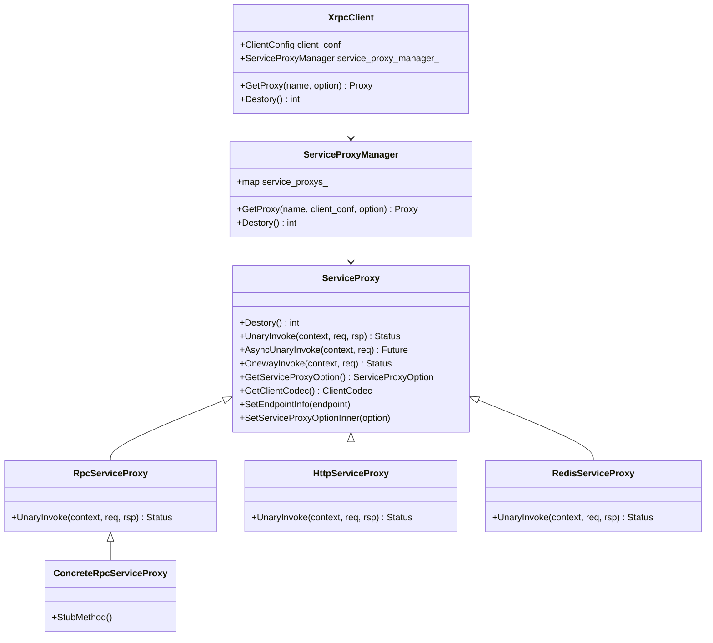

# XRPC Client

<!-- TOC -->

- [XRPC Client](#xrpc-client)
    - [Overview](#overview)
    - [Quick Start](#quick-start)
    - [UML Class Diagram](#uml-class-diagram)
    - [Xrpc Client](#xrpc-client)
    - [ServiceProxyManager](#serviceproxymanager)
    - [ServiceProxy](#serviceproxy)
        - [SetServiceProxyOptionInner](#setserviceproxyoptioninner)
        - [SetEndpointInfo](#setendpointinfo)
        - [Concrete ServiceProxy](#concrete-serviceproxy)
        - [RPC ServiceProxy](#rpc-serviceproxy)
    - [Sequence Diagram](#sequence-diagram)
    - [ClientContext](#clientcontext)

<!-- /TOC -->

## Overview

## Quick Start

## UML Class Diagram



## Xrpc Client

XrpcClient 类并不会做什么工作，主要是封装了对 ServiceProxyManager 的使用，用于应用层获得 ServiceProxy，请参考 [ServiceProxyManager](#serviceproxymanager) 和 [ServiceProxy](#serviceproxy)。

最重要的，也是最常用的方法就是 GetProxy，该方法用于获得 ServiceProxy：

```cpp
template <typename T>
std::shared_ptr<T> XrpcClient::GetProxy(const std::string& name, const ServiceProxyOption* option) {
  std::shared_ptr<T> proxy = service_proxy_manager_.GetProxy<T>(name, client_conf_, option);

  return proxy;
}
```

另外有个稍微重要一点的方法是 Destroy，进程结束前需要调用，用于回收资源：

```cpp
int XrpcClient::Destory() { return service_proxy_manager_.Destory(); }
```

## ServiceProxyManager

ServiceProxy 用于构建和缓存 ServiceProxy。

GetProxy 是其最重要的方，该方法可以直接使用 xrpc conf 中的配置去构造 ServiceProxy，也可以传入新配置，修改 xrpc conf 中的配置：

```cpp
template <typename T>
std::shared_ptr<T> ServiceProxyManager::GetProxy(const std::string& name, const ClientConfig& conf,
                                                 const ServiceProxyOption* option_ptr) {

  // 缓存中已经存在 service_proxy，直接返回
  if (service_proxys_.find(name) != service_proxys_.end()) {
    return std::static_pointer_cast<T>(service_proxys_[name]);
  }

  // 缓存不存在 service_proxy，构造新的
  std::shared_ptr<T> new_proxy(new T());

  // 通过默认值、client_config、传入的 option 去修改 ServiceProxy 的 Option
  std::shared_ptr<ServiceProxyOption> option = std::make_shared<ServiceProxyOption>();
  option->name = name;
  option->callee_name = option->callee_name.empty() ? name : option->callee_name;
  option->target = option->target.empty() ? name : option->target;

  // ================================ 设置 proxy 的配置，会做很多 Proxy 初始化工作 ================================
  new_proxy->SetServiceProxyOptionInner(option);
  // =========================================================================================================

  // 设置 proxy 的请求 Endpoint
  if (option->selector_name.compare("direct") == 0 ||
      option->selector_name.compare("domain") == 0) {
    new_proxy->SetEndpointInfo(option->target);
  }

  // 缓存 ServiceProxy
  service_proxys_[name] = std::static_pointer_cast<T>(new_proxy);

  return new_proxy;
}
```

其中 `new_proxy->SetServiceProxyOptionInner(option)` 很重要，绝大部分 ServiceProxy 工作都在该函数中完成，请参考 [SetServiceProxyOptionInner](#setserviceproxyoptioninner)。

另外有个重要工作是释放相关内存：

```cpp
int ServiceProxyManager::Destory() {
  for (auto it : service_proxys_) {
    it.second->Destory();
  }

  service_proxys_.clear();
  return 0;
}
```

## ServiceProxy

ServiceProxy 是应用请求 Server 的类，它为应用层暴露相应的方法去请求 Server。

ServiceProxy 是一个抽象类，对于请求不同的 Server 会有不同的 ServiceProxy 实现。

### SetServiceProxyOptionInner

由 ServiceProxyManager 调用，目的是初始化 ServiceProxy：

```cpp
void ServiceProxy::SetServiceProxyOptionInner(const std::shared_ptr<ServiceProxyOption>& option) {
  option_ = option;

  // 缓存 ServiceProxy 使用的 codec
  SetCodecNameInner(option->codec_name);
  // 缓存 client_transport
  SetFutureTransportNameInner(option_->future_transport_name);
  // 对 backup retires 的配置
  PrepareStatistics(option->name);

  // 设置目标服务的 ip:port 或 domain 或 name
  InitServiceNameInfo();

  // 注册 service filter 到 filter controller
  for (auto& filter_name : option->service_filters) {
    auto filter = FilterManager::GetInstance()->GetMessageClientFilter(filter_name);
    if (filter) {
      filter_controller_.AddMessageClientFilter(filter);
    }
  }

  // 注册 selector filter
  auto selector_filter = FilterManager::GetInstance()->GetMessageClientFilter(option_->selector_name);
  filter_controller_.AddMessageClientFilter(selector_filter);
}

void ServiceProxy::SetCodecNameInner(const std::string& codec_name) {
  auto codec_ = ClientCodecFactory::GetInstance()->Get(codec_name);
}

void ServiceProxy::InitServiceNameInfo() {
  if (option_->selector_name == "direct" || option_->selector_name == "domain") {
    service_name_ = option_->name;
  } else {
    service_name_ = option_->target;
  }
}
```

### SetEndpointInfo

ServiceProxyManager 在构造完 ServiceProxy 后，紧接着会通过 SetEndpointInfo 去设置请求的 Server Endpoint：

```cpp
void ServiceProxy::SetEndpointInfo(const std::string& endpoint_info) {
  RouterInfo info;
  // 将 endpoint_info 的所有 endpoint 信息解析为成 ip port 形式
  // endpoint_info: 127.0.0.1:80,localhost,9.104.12.4:443
  // 这里并不会解析 domain
  ConvertEndpointInfo(endpoint_info, info.info);
  info.name = service_name_;

  // 缓存 Endpoint 信息
  std::shared_ptr<Selector> selector = SelectorFactory::GetInstance()->Get(option_->selector_name);
  selector->SetEndpoints(&info);
}

void ConvertEndpointInfo(const std::string& ip_ports, std::vector<XrpcEndpointInfo>& vec_endpoint) {
  std::vector<std::string> vec = util::SplitString(ip_ports, ',');
  for (auto const& name : vec) {
    XrpcEndpointInfo endpoint;
    // name 可能是 domain 也可能是 ip:port, 此时还不会解析 domain
    if (util::ParseHostPort(name, endpoint.host, endpoint.port, endpoint.is_ipv6)) {
      vec_endpoint.push_back(std::move(endpoint));
    }
  }
}
```

### Concrete ServiceProxy

下面会列举常见的 ServiceProxy 实现。

#### RpcServiceProxy

RpcServiceProxy 是继承 ServicProxy 的抽象类。

#### Concrete RpcServiceProxy

虽然 RpcServiceProxy 封装了 RPC 网络调用，但是它没有将其通过桩的形式为应用层提供接口。

为了更方便应用层使用，Xrpc Protobuf Plugin 会通过 Protobuf 的 Rpc Service 声明去自动的生成继承于 RpcServiceProxy 的桩。

例如，存在一个 Protobuf：

```protobuf
syntax = "proto3";
  
package xrpc.test.helloworld;
  
service Greeter {
  rpc SayHello (HelloRequest) returns (HelloReply) {}
}

message HelloRequest {
   string req_msg = 1;
}
  
message HelloReply {
   string rsp_msg = 1;
}
```

Xrpc Protobuf Plugin 会自动生成下述代码：

```cpp
class GreeterServiceProxy: public xrpc::RpcServiceProxy {
public:
  GreeterServiceProxy() = default;
  ~GreeterServiceProxy() override = default;

  // 同步调用接口
  virtual xrpc::Status SayHello(const xrpc::ClientContextPtr& context,
                                const xrpc::test::helloworld::HelloRequest& request,
                                xrpc::test::helloworld::HelloReply* response) {
    context->SetXrpcFuncName(Greeter_method_names[0]);
    return UnaryInvoke<xrpc::test::helloworld::HelloRequest,
                       xrpc::test::helloworld::HelloReply>(context, request, response);
  }

  // 异步调用接口
  virtual xrpc::Future<xrpc::test::helloworld::HelloReply>
  AsyncSayHello(const xrpc::ClientContextPtr& context,
                const xrpc::test::helloworld::HelloRequest& request) {
    context->SetXrpcFuncName(Greeter_method_names[0]);
    return AsyncUnaryInvoke<xrpc::test::helloworld::HelloRequest,
                            xrpc::test::helloworld::HelloReply>(context, request);
  }

  // 单向调用，只发不收
  virtual xrpc::Status SayHello(const xrpc::ClientContextPtr& context,
                                const xrpc::test::helloworld::HelloRequest& request) {
    context->SetXrpcFuncName(Greeter_method_names[0]);
    return OnewayInvoke<xrpc::test::helloworld::HelloRequest>(context, request);
  }
};
```

通过上述代码可以很明显看出，Concrete RpcServiceProxy 目的是为了简化应用层调用。

### RPC ServiceProxy

## Sequence Diagram

## ClientContext

客户端上下文，每次调用都应该使用新的 ClientContext，对于框架而言，这是一个很重要的类。

```cpp
class ClientContext : public XrpcContext {
 public:
  ClientContext();
  explicit ClientContext(const ClientCodecPtr& client_codec);
  ~ClientContext() override;
  
  inline ProtocolPtr& GetRequest();
  inline ProtocolPtr& GetResponse();
  inline const Status& GetStatus();
  inline uint32_t GetRequestId();
  inline uint32_t GetTimeout();
  inline const std::string& GetCallerName();
  inline const std::string& GetCalleeName();
  inline const std::string& GetXrpcFuncName();
  inline const std::string& GetFuncName();
  inline uint32_t GetCallType();
  inline uint32_t GetMessageType();
  inline uint8_t GetEncodeType();   // 只支持 pb、flatbuffers、json、string 的类型，默认是 pb 的类型
  inline uint8_t GetEncodeDataType();   // 编码的数据结构类型 目前只支持pb message、flatbuffers 的类型
  inline uint8_t GetReqCompressType();
  inline uint8_t GetReqCompressLevel();
  inline uint8_t GetCompressType();     // 获取应答body的压缩类型
  inline const std::string& GetCodecName();

  void SetRequest(ProtocolPtr&& value);
  inline void SetResponse(ProtocolPtr&& value);
  inline void SetStatus(const Status& status);
  inline void SetRequestId(uint32_t value)
  inline void SetTimeout(uint32_t value);
  inline void SetCallerName(const std::string& value);
  inline void SetCalleeName(const std::string& value);
  inline void SetXrpcFuncName(const std::string& value);
  inline void SetFuncName(const std::string& value);
  inline void SetCallType(uint32_t value);
  inline void SetMessageType(uint32_t message_type);
  inline void SetEncodeType(uint8_t encode_type);
  inline void SetEncodeDataType(uint8_t encode_type);
  inline void SetReqCompressType(uint8_t compress_type);
  inline void SetReqCompressLevel(uint8_t compress_level);
  inline void SetCodecName(const std::string& value);


  inline uint16_t GetPort();
  inline const std::string& GetIp();

  inline void SetAddr(const std::string& ip, uint16_t port);  
  // 设置一组后端ip port，配合backup-request、重发等功能使用
  inline void SetMultiAddr(const std::vector<NodeAddr>& addrs);
  // 获取和设置当前请求后端被调服务的 ip 和 port
  // 用户不可调用，即使调用此方法设置了地址，仍然会被框架覆盖
  // 想自定义后端地址请使用SetAddr()
  inline void SetPort(uint16_t value);
  inline void SetIp(std::string&& value);
  // 判断 ip port 是否已经被用户设置
  inline bool AddrHasSet() { return naming_plugin_info_.addr_has_set; }


  // 设置和获取当前请求的Pb类型透传信息
  inline const google::protobuf::Map<std::string, std::string>& GetPbReqTransInfo();

  template <typename InputIt>
  void SetReqTransInfo(const InputIt& first, const InputIt& last);

  // 获取可修改的当前请求的Pb类型透传信息
  inline google::protobuf::Map<std::string, std::string>* GetMutablePbReqTransInfo();
  inline void AddReqTransInfo(const std::string& key, const std::string& value);

  // 获取响应的Pb类型透传信息
  inline const google::protobuf::Map<std::string, std::string>& GetPbRspTransInfo();
  template <typename InputIt>
  void SetRspTransInfo(const InputIt& first, const InputIt& last);
  inline void AddRspTransInfo(const std::string& key, const std::string& value);

  // 获取和设置当前请求访问名字服务的名字空间，北极星用
  inline const std::string& GetNamespace() const { return comm_extend_info_.name_space; }
  inline void SetNamespace(const std::string& value) { comm_extend_info_.name_space = value; }

  // 用于设置调用哪个set下的服务实例，框架内部使用
  inline const std::string& GetCalleeSetName();
  inline void SetCalleeSetName(const std::string& value);

  // 用于设置是否强制启用set调用，框架内部使用
  inline const bool GetEnableSetForce();
  inline void SetEnableSetForce(bool value);

  // 获取当前响应的包大小
  inline uint32_t GetResponseLength();

  // 获取和设置当前请求发送的时间
  inline uint64_t GetSendTimestamp() const { return basic_info_->begin_timestamp; }
  inline void SetSendTimestamp(uint64_t value) { basic_info_->begin_timestamp = value; }

  // 获取和设置当前请求访问名字服务的实例id，北极星用
  inline const std::string& GetInstanceId();
  inline void SetInstanceId(const std::string& value);

  // 获取和设置是否选择含unhealthy及熔断的路由节点
  inline bool const GetIncludeUnHealthyEndpoints();
  inline void SetIncludeUnHealthyEndpoints(bool flag);

  // 获取和设置当前访问服务实例的set名，内部使用，外部使用方不需要调用此接口
  inline const std::string& GetInstanceSetName();
  inline void SetInstanceSetName(const std::string& value);

  // 获取和设置当前访问实例的容器名，内部使用，外部使用方不需要调用此接口
  inline const std::string& GetContainerName();
  inline void SetContainerName(const std::string& value);

  // 使用http协议时, 设置自定义header；直接复用req_trans_info字段
  inline void SetHttpHeader(const std::string& h, const std::string& v);
  inline const std::string& GetHttpHeader(const std::string& h);

  // 设置当次请求使用重发
  // delay          重试延时
  // times          需要重试的节点个数，使用名字服务时会一次取到对应个数的后端地址
  // retry_policy   重试策略，默认选择backup-request
  void SetRetryInfo(uint32_t delay, int times = 2,
                    RetryInfo::RetryPolicy retry_policy = RetryInfo::RetryPolicy::BACKUP_REQUEST);
  inline RetryInfo* GetRetryInfo();

  // 返回当前请求是否需要重试
  inline bool NeedRetry();
  

 private:
  void FillReqeustProtocol();

 private:
  // 存放调用状态结果，尽量复用此字段，避免创建各种 Status
  Status status_;

  // 基础信息，如请求级别ip、port、唯一id等，可以直接给下层transport当做指针传递使用，避免重复拷贝
  BasicInfoPtr basic_info_ = nullptr;

  // 通用扩展信息，包括各个插件都需要使用的上报信息如容器名称、函数名称、实例名称等
  CommExtendInfo comm_extend_info_;

  NamingPluginInfo naming_plugin_info_;     // 名字服务插件信息，如set等信息等
  RetryInfo* retry_info_ = nullptr;         // 重试信息，如次数策略等
  std::string codec_name_ = "";             // 协议codec名字
  ProtocolPtr request_ = nullptr;           // 请求协议，如 XrpcRequestProtocolPtr
  ProtocolPtr response_ = nullptr;          // 响应协议，如 XrpcResponseProtocolPtr
};
```
