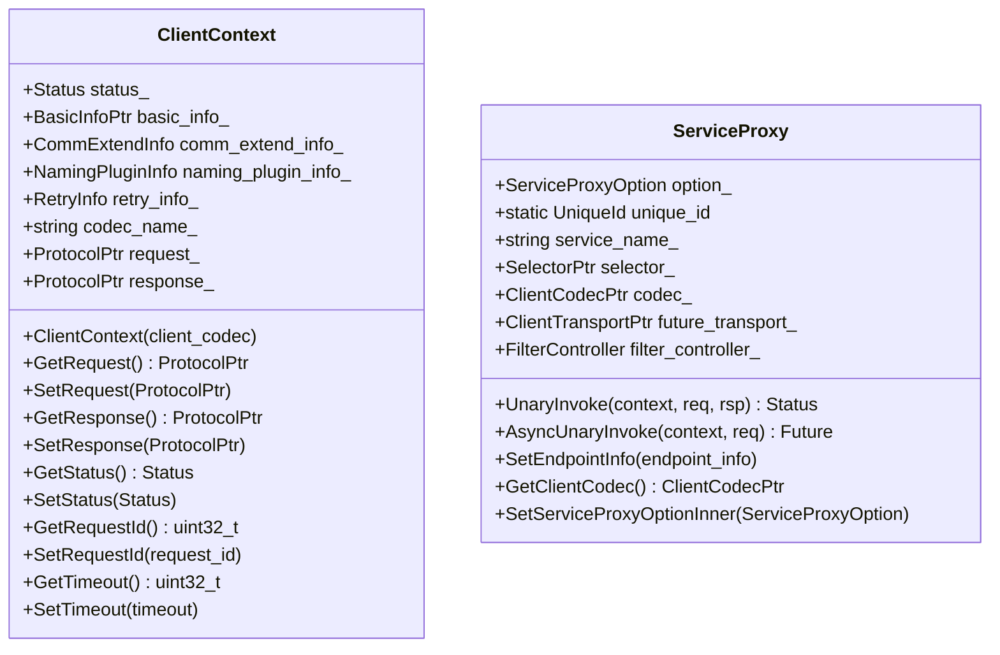

# XRPC Client

<!-- TOC -->

- [XRPC Client](#xrpc-client)
    - [Overview](#overview)
    - [Quick Start](#quick-start)
    - [UML Class Diagram](#uml-class-diagram)
    - [Sequence Diagram](#sequence-diagram)
    - [ClientContext](#clientcontext)

<!-- /TOC -->

## Overview

## Quick Start

## UML Class Diagram



## Sequence Diagram

## ClientContext

客户端上下文，每次调用都应该使用新的 ClientContext，对于框架而言，这是一个很重要的类。

```cpp
class ClientContext : public XrpcContext {
 public:
  ClientContext();
  explicit ClientContext(const ClientCodecPtr& client_codec);
  ~ClientContext() override;
  
  inline ProtocolPtr& GetRequest();
  inline ProtocolPtr& GetResponse();
  inline const Status& GetStatus();
  inline uint32_t GetRequestId();
  inline uint32_t GetTimeout();
  inline const std::string& GetCallerName();
  inline const std::string& GetCalleeName();
  inline const std::string& GetXrpcFuncName();
  inline const std::string& GetFuncName();
  inline uint32_t GetCallType();
  inline uint32_t GetMessageType();
  inline uint8_t GetEncodeType();   // 只支持 pb、flatbuffers、json、string 的类型，默认是 pb 的类型
  inline uint8_t GetEncodeDataType();   // 编码的数据结构类型 目前只支持pb message、flatbuffers 的类型
  inline uint8_t GetReqCompressType();
  inline uint8_t GetReqCompressLevel();
  inline uint8_t GetCompressType();     // 获取应答body的压缩类型
  inline const std::string& GetCodecName();

  void SetRequest(ProtocolPtr&& value);
  inline void SetResponse(ProtocolPtr&& value);
  inline void SetStatus(const Status& status);
  inline void SetRequestId(uint32_t value)
  inline void SetTimeout(uint32_t value);
  inline void SetCallerName(const std::string& value);
  inline void SetCalleeName(const std::string& value);
  inline void SetXrpcFuncName(const std::string& value);
  inline void SetFuncName(const std::string& value);
  inline void SetCallType(uint32_t value);
  inline void SetMessageType(uint32_t message_type);
  inline void SetEncodeType(uint8_t encode_type);
  inline void SetEncodeDataType(uint8_t encode_type);
  inline void SetReqCompressType(uint8_t compress_type);
  inline void SetReqCompressLevel(uint8_t compress_level);
  inline void SetCodecName(const std::string& value);


  inline uint16_t GetPort();
  inline const std::string& GetIp();

  inline void SetAddr(const std::string& ip, uint16_t port);  
  // 设置一组后端ip port，配合backup-request、重发等功能使用
  inline void SetMultiAddr(const std::vector<NodeAddr>& addrs);
  // 获取和设置当前请求后端被调服务的 ip 和 port
  // 用户不可调用，即使调用此方法设置了地址，仍然会被框架覆盖
  // 想自定义后端地址请使用SetAddr()
  inline void SetPort(uint16_t value);
  inline void SetIp(std::string&& value);
  // 判断 ip port 是否已经被用户设置
  inline bool AddrHasSet() { return naming_plugin_info_.addr_has_set; }


  // 设置和获取当前请求的Pb类型透传信息
  inline const google::protobuf::Map<std::string, std::string>& GetPbReqTransInfo();

  template <typename InputIt>
  void SetReqTransInfo(const InputIt& first, const InputIt& last);

  // 获取可修改的当前请求的Pb类型透传信息
  inline google::protobuf::Map<std::string, std::string>* GetMutablePbReqTransInfo();
  inline void AddReqTransInfo(const std::string& key, const std::string& value);

  // 获取响应的Pb类型透传信息
  inline const google::protobuf::Map<std::string, std::string>& GetPbRspTransInfo();
  template <typename InputIt>
  void SetRspTransInfo(const InputIt& first, const InputIt& last);
  inline void AddRspTransInfo(const std::string& key, const std::string& value);

  // 获取和设置当前请求访问名字服务的名字空间，北极星用
  inline const std::string& GetNamespace() const { return comm_extend_info_.name_space; }
  inline void SetNamespace(const std::string& value) { comm_extend_info_.name_space = value; }

  // 用于设置调用哪个set下的服务实例，框架内部使用
  inline const std::string& GetCalleeSetName();
  inline void SetCalleeSetName(const std::string& value);

  // 用于设置是否强制启用set调用，框架内部使用
  inline const bool GetEnableSetForce();
  inline void SetEnableSetForce(bool value);

  // 获取当前响应的包大小
  inline uint32_t GetResponseLength();

  // 获取和设置当前请求发送的时间
  inline uint64_t GetSendTimestamp() const { return basic_info_->begin_timestamp; }
  inline void SetSendTimestamp(uint64_t value) { basic_info_->begin_timestamp = value; }

  // 获取和设置当前请求访问名字服务的实例id，北极星用
  inline const std::string& GetInstanceId();
  inline void SetInstanceId(const std::string& value);

  // 获取和设置是否选择含unhealthy及熔断的路由节点
  inline bool const GetIncludeUnHealthyEndpoints();
  inline void SetIncludeUnHealthyEndpoints(bool flag);

  // 获取和设置当前访问服务实例的set名，内部使用，外部使用方不需要调用此接口
  inline const std::string& GetInstanceSetName();
  inline void SetInstanceSetName(const std::string& value);

  // 获取和设置当前访问实例的容器名，内部使用，外部使用方不需要调用此接口
  inline const std::string& GetContainerName();
  inline void SetContainerName(const std::string& value);

  // 使用http协议时, 设置自定义header；直接复用req_trans_info字段
  inline void SetHttpHeader(const std::string& h, const std::string& v);
  inline const std::string& GetHttpHeader(const std::string& h);

  // 设置当次请求使用重发
  // delay          重试延时
  // times          需要重试的节点个数，使用名字服务时会一次取到对应个数的后端地址
  // retry_policy   重试策略，默认选择backup-request
  void SetRetryInfo(uint32_t delay, int times = 2,
                    RetryInfo::RetryPolicy retry_policy = RetryInfo::RetryPolicy::BACKUP_REQUEST);
  inline RetryInfo* GetRetryInfo();

  // 返回当前请求是否需要重试
  inline bool NeedRetry();
  

 private:
  void FillReqeustProtocol();

 private:
  // 存放调用状态结果，尽量复用此字段，避免创建各种 Status
  Status status_;

  // 基础信息，如请求级别ip、port、唯一id等，可以直接给下层transport当做指针传递使用，避免重复拷贝
  BasicInfoPtr basic_info_ = nullptr;

  // 通用扩展信息，包括各个插件都需要使用的上报信息如容器名称、函数名称、实例名称等
  CommExtendInfo comm_extend_info_;

  NamingPluginInfo naming_plugin_info_;     // 名字服务插件信息，如set等信息等
  RetryInfo* retry_info_ = nullptr;         // 重试信息，如次数策略等
  std::string codec_name_ = "";             // 协议codec名字
  ProtocolPtr request_ = nullptr;           // 请求协议，如 XrpcRequestProtocolPtr
  ProtocolPtr response_ = nullptr;          // 响应协议，如 XrpcResponseProtocolPtr
};
```
