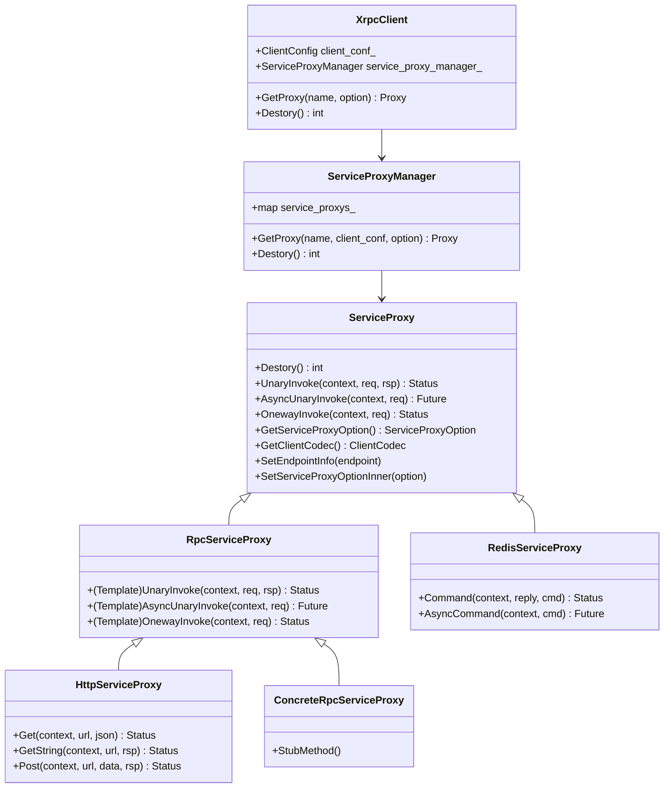

# XRPC Client

<!-- TOC -->

- [XRPC Client](#xrpc-client)
    - [Overview](#overview)
    - [Quick Start](#quick-start)
    - [UML Class Diagram](#uml-class-diagram)
    - [Sequence Diagram](#sequence-diagram)
        - [Request & Response Object](#request--response-object)
    - [Xrpc Client](#xrpc-client)
    - [ServiceProxyManager](#serviceproxymanager)
    - [ServiceProxy](#serviceproxy)
        - [SetServiceProxyOptionInner](#setserviceproxyoptioninner)
        - [SetEndpointInfo](#setendpointinfo)
        - [ProxyOptionToTransInfo](#proxyoptiontotransinfo)
        - [UnaryInvoke](#unaryinvoke)
        - [AsyncUnaryInvoke](#asyncunaryinvoke)
        - [FillClientContext](#fillclientcontext)
    - [ServiceProxyImpl](#serviceproxyimpl)
        - [RpcServiceProxy](#rpcserviceproxy)
        - [Concrete RpcServiceProxy](#concrete-rpcserviceproxy)
        - [HttpServiceProxy](#httpserviceproxy)
        - [RedisServiceProxy](#redisserviceproxy)
    - [ClientContext](#clientcontext)
        - [MakeClientContext](#makeclientcontext)
        - [ClientContext Constructor](#clientcontext-constructor)
        - [SetServiceProxyOption](#setserviceproxyoption)
    - [Appendix: ClientContext](#appendix-clientcontext)

<!-- /TOC -->

## Overview

## Quick Start

## UML Class Diagram



Client Context 是一个很重要的类，每次发起请求都应该新建一个 Client Context，该类包含了很多请求相关信息。

## Sequence Diagram

### Request & Response Object

Trpx Client 请求和响应涉及到对相关对象的转换和编码，这里做个简单的介绍。

Request & Response 对象有四个：

- Request 相关对象
  - 应用直接使用的 Request 对象（这里叫做 Application Request），例如 Protobuf Message 定义的对象，
  - Protocol Request 对象
  - 实际传输的 Binary Request
- Response 相关对象
  - 实际传输的 Binary Response
  - Protocol Response 对象
  - 应用层直接使用的 Response 对象（这里叫做 Application Response），例如 Protobuf Message 定义的对象，

对于 Request 对象之间的转换：

```text
+---------------------+
|                     |
| Application Request |
|                     |
+---------------------+
           |
           |
  codec->FillRequest()
           |
          \|/
+---------------------+
|                     |
|   Protocol Request  |
|                     |
+---------------------+
           |
           |
codec_->ZeroCopyEncode()
           |
          \|/
+---------------------+
|                     |
|    Binary Request   |
|                     |
+---------------------+
```

对于 Response 对象直接的转换：

```text
+----------------------+
|                      |
|    Binary Response   |
|                      |
+----------------------+
           |
           |
codec_->ZeroCopyDecode()
           |
          \|/
+----------------------+
|                      |
|   Protocol Response  |
|                      |
+----------------------+
           |
           |
  codec->FillResponse()
           |
          \|/
+----------------------+
|                      |
| Application Response |
|                      |
+----------------------+
```

更具体的请参考 Xrpc Plugin Codec 部分的内容。

## Xrpc Client

XrpcClient 类并不会做什么工作，主要是封装了对 ServiceProxyManager 的使用，用于应用层获得 ServiceProxy，请参考 [ServiceProxyManager](#serviceproxymanager) 和 [ServiceProxy](#serviceproxy)。

最重要的，也是最常用的方法就是 GetProxy，该方法用于获得 ServiceProxy：

```cpp
template <typename T>
std::shared_ptr<T> XrpcClient::GetProxy(const std::string& name, const ServiceProxyOption* option) {
  std::shared_ptr<T> proxy = service_proxy_manager_.GetProxy<T>(name, client_conf_, option);

  return proxy;
}
```

另外有个稍微重要一点的方法是 Destroy，进程结束前需要调用，用于回收资源：

```cpp
int XrpcClient::Destory() { return service_proxy_manager_.Destory(); }
```

## ServiceProxyManager

ServiceProxy 用于构建和缓存 ServiceProxy。

GetProxy 是其最重要的方，该方法可以直接使用 xrpc conf 中的配置去构造 ServiceProxy，也可以传入新配置，修改 xrpc conf 中的配置：

```cpp
template <typename T>
std::shared_ptr<T> ServiceProxyManager::GetProxy(const std::string& name, const ClientConfig& conf,
                                                 const ServiceProxyOption* option_ptr) {

  // 缓存中已经存在 service_proxy，直接返回
  if (service_proxys_.find(name) != service_proxys_.end()) {
    return std::static_pointer_cast<T>(service_proxys_[name]);
  }

  // 缓存不存在 service_proxy，构造新的
  std::shared_ptr<T> new_proxy(new T());

  // 通过默认值、client_config、传入的 option 去修改 ServiceProxy 的 Option
  std::shared_ptr<ServiceProxyOption> option = std::make_shared<ServiceProxyOption>();
  option->name = name;
  option->callee_name = option->callee_name.empty() ? name : option->callee_name;
  option->target = option->target.empty() ? name : option->target;

  // ================================ 设置 proxy 的配置，会做很多 Proxy 初始化工作 ================================
  new_proxy->SetServiceProxyOptionInner(option);
  // =========================================================================================================

  // 设置 proxy 的请求 Endpoint
  if (option->selector_name.compare("direct") == 0 ||
      option->selector_name.compare("domain") == 0) {
    new_proxy->SetEndpointInfo(option->target);
  }

  // 缓存 ServiceProxy
  service_proxys_[name] = std::static_pointer_cast<T>(new_proxy);

  return new_proxy;
}
```

其中 `new_proxy->SetServiceProxyOptionInner(option)` 很重要，绝大部分 ServiceProxy 工作都在该函数中完成，请参考 [SetServiceProxyOptionInner](#setserviceproxyoptioninner)。

另外有个重要工作是释放相关内存：

```cpp
int ServiceProxyManager::Destory() {
  for (auto it : service_proxys_) {
    it.second->Destory();
  }

  service_proxys_.clear();
  return 0;
}
```

## ServiceProxy

ServiceProxy 是应用请求 Server 的类，它为应用层暴露相应的方法去请求 Server。

对于请求不同的 Server 会有不同的 ServiceProxy 实现。

不过需要注意的是 ServiceProxy 的方法已经是完备了，子类一般不会去重写 ServiceProxy 的方法。

### SetServiceProxyOptionInner

由 ServiceProxyManager 调用，目的是初始化 ServiceProxy：

```cpp
void ServiceProxy::SetServiceProxyOptionInner(const std::shared_ptr<ServiceProxyOption>& option) {
  option_ = option;

  // 缓存 ServiceProxy 使用的 codec
  SetCodecNameInner(option->codec_name);
  // 初始化并设置 future_transport
  SetFutureTransportNameInner(option_->future_transport_name);
  // 对 backup retires 的配置
  PrepareStatistics(option->name);

  // 设置目标服务的 ip:port 或 domain 或 name
  InitServiceNameInfo();

  // 注册 service filter 到 filter controller
  for (auto& filter_name : option->service_filters) {
    auto filter = FilterManager::GetInstance()->GetMessageClientFilter(filter_name);
    if (filter) {
      filter_controller_.AddMessageClientFilter(filter);
    }
  }

  // 注册 selector filter
  auto selector_filter = FilterManager::GetInstance()->GetMessageClientFilter(option_->selector_name);
  filter_controller_.AddMessageClientFilter(selector_filter);
}

void ServiceProxy::SetCodecNameInner(const std::string& codec_name) {
  auto codec_ = ClientCodecFactory::GetInstance()->Get(codec_name);
}

void ServiceProxy::InitServiceNameInfo() {
  if (option_->selector_name == "direct" || option_->selector_name == "domain") {
    service_name_ = option_->name;
  } else {
    service_name_ = option_->target;
  }
}

void ServiceProxy::SetFutureTransportNameInner(const std::string& transport_name) {
  FutureTransport::Options option;
  ThreadModel* thread_model = ThreadModelManager::GetInstance()->GetThreadModel(
                                option_->threadmodel_type,
                                option_->threadmodel_instance_name);
  option.trans_info = ProxyOptionToTransInfo();
  option.thread_model = thread_model;
  future_transport_->Init(option);
}
```

其中 ProxyOptionToTransInfo 方法是比较重要的，它包含了 transport 的相关配置，对网络事件的回调处理，其中便包含了如何解析接收到的数据，如何分发响应处理 Task 等，请参考 [ProxyOptionToTransInfo](#proxyoptiontotransinfo) 。

### SetEndpointInfo

ServiceProxyManager 在构造完 ServiceProxy 后，紧接着会通过 SetEndpointInfo 去设置请求的 Server Endpoint：

```cpp
void ServiceProxy::SetEndpointInfo(const std::string& endpoint_info) {
  RouterInfo info;
  // 将 endpoint_info 的所有 endpoint 信息解析为成 ip port 形式
  // endpoint_info: 127.0.0.1:80,localhost,9.104.12.4:443
  // 这里并不会解析 domain
  ConvertEndpointInfo(endpoint_info, info.info);
  info.name = service_name_;

  // 缓存 Endpoint 信息
  std::shared_ptr<Selector> selector = SelectorFactory::GetInstance()->Get(option_->selector_name);
  selector->SetEndpoints(&info);
}

void ConvertEndpointInfo(const std::string& ip_ports, std::vector<XrpcEndpointInfo>& vec_endpoint) {
  std::vector<std::string> vec = util::SplitString(ip_ports, ',');
  for (auto const& name : vec) {
    XrpcEndpointInfo endpoint;
    // name 可能是 domain 也可能是 ip:port, 此时还不会解析 domain
    if (util::ParseHostPort(name, endpoint.host, endpoint.port, endpoint.is_ipv6)) {
      vec_endpoint.push_back(std::move(endpoint));
    }
  }
}
```

**注意：**

- 这里的 SetEndpointInfo 会设置 ServiceProxy 可以选择的所有 Endpoint。
- 最终请求时使用的 Endpoint 由 Naming 插件的 Filter 部分完成。

### ProxyOptionToTransInfo

该方法是用于初始化 future_transport 配置项，future_transport 是 ServiceProxy 实际负责网络处理的对象。

```cpp
TransInfo ServiceProxy::ProxyOptionToTransInfo() {
  TransInfo trans_info;

  // 配置 trans_info
  trans_info.conn_type = GetClientConnectType();
  trans_info.connection_idle_timeout = option_->idle_time;
  trans_info.max_conn_num = option_->max_conn_num;
  trans_info.max_packet_size = option_->max_packet_size;
  trans_info.merge_send_data_size = option_->merge_send_data_size;
  trans_info.recv_buffer_size = option_->recv_buffer_size;
  trans_info.is_complex_conn = option_->is_conn_complex;

  // 设置回调函数
  trans_info.conn_close_function = option_->proxy_callback.conn_close_function;
  trans_info.conn_establish_function = option_->proxy_callback.conn_establish_function;
  trans_info.msg_writedone_function = option_->proxy_callback.msg_writedone_function;
  trans_info.req_dispatch_function = option_->proxy_callback.req_dispatch_function;
  trans_info.rsp_dispatch_function = option_->proxy_callback.rsp_dispatch_function;
  trans_info.checker_function = option_->proxy_callback.checker_function;
  trans_info.rsp_decode_function = option_->proxy_callback.rsp_decode_funtion;

  auto thread_model = ThreadModelManager::GetInstance()->GetThreadModel(
                        option_->threadmodel_type,
                        option_->threadmodel_instance_name);

  // 默认回函数
  auto defualt_checker_function = [this](const ConnectionPtr& conn, NoncontiguousBuffer& in,
                                         std::deque<std::any>& out) -> int {
    return codec_->ZeroCopyCheck(conn, in, out);
  };


  auto defualt_rsp_decode_function = [this](std::any&& in, ProtocolPtr& out) -> bool {
    out = std::move(codec_->CreateResponsePtr());
    return codec_->ZeroCopyDecode(nullptr, std::move(in), out) ? true : false;
  };

  auto default_rsp_dispatch_function = [this, thread_model](Task* task) {
      auto* req_msg = static_cast<STransportReqMsg*>(task->task);
      auto client_extend_info = req_msg->extend_info->client_extend_info;

      // 请求发起线程为用户线程, 直接执行应答处理过程
      if (!client_extend_info.dispatch_info ||
          client_extend_info.dispatch_info->src_thread_id < 0) {
        task->handler(task);
      }

      int dst_thread_model_id = thread_model->GetThreadModelId();
      task->group_id = dst_thread_model_id;
      task->dst_thread_key = client_extend_info.dispatch_info->dst_thread_key;
      if (dst_thread_model_id == client_extend_info.dispatch_info->src_thread_model_id) {
        // 请求发起和处理的 threadmodel 相同，考虑回到发起请求的线程处理执行回调
        task->dst_thread_key = client_extend_info.dispatch_info->dst_thread_key < 0
                                    ? client_extend_info.dispatch_info->src_thread_id
                                    : client_extend_info.dispatch_info->dst_thread_key;
      }

      TaskResult result = thread_model->SubmitHandleTask(task);

      // 队列满时无法消费 task, 直接设置异常，用户设置的 dst_thread_key 不再生效
      if (result.ret == TaskRetCode::QUEUE_FULL) {
        auto& client_promise = client_extend_info.promise;
        Promise<STransportRspMsg>* promise = static_cast<Promise<STransportRspMsg>*>(client_promise);
        promise->SetException(CommonException("handle task queue is full, maybe overload",
                                              TaskRetCode::QUEUE_FULL));
      }
    };

  // 必需的回调函数不能为空
  if (!trans_info.checker_function) {
    trans_info.checker_function = defualt_checker_function;
  }

  if (!trans_info.rsp_decode_function) {
    trans_info.rsp_decode_function = defualt_rsp_decode_function;
  }

  if (!trans_info.rsp_dispatch_function) {
    trans_info.rsp_dispatch_function = default_rsp_dispatch_function;
  }

  trans_info.codec_name = codec_->Name();
  return trans_info;
}
```

### UnaryInvoke

ServiceProxy 最重要的就是发送数据了，其中 UnaryInvoke 是发送数据后同步等待响应，该方法包括：

- 超时检查
- 调用 transport 进行真正的数据通信
- AOP 埋点处理

```cpp
Status ServiceProxy::UnaryInvoke(const ClientContextPtr& context, const ProtocolPtr& req,
                                 ProtocolPtr& rsp) {
  // 超时检查
  if (CheckTimeout(context)) {
    return context->GetStatus();
  }

  // Transport 发送消息前埋点 返回 0 则不进行 Transport 发送
  if (RunFilters(FilterPoint::CLIENT_PRE_SEND_MSG, context) == 0) {
    UnaryTransportInvoke(context, req, rsp);
  }

  // transport接收消息后埋点
  RunFilters(FilterPoint::CLIENT_POST_RECV_MSG, context);
  return context->GetStatus();
}

void ServiceProxy::UnaryTransportInvoke(const ClientContextPtr& context, const ProtocolPtr& req,
                                        ProtocolPtr& rsp) {
  // 编码
  NoncontiguousBuffer req_msg_buf;
  codec_->ZeroCopyEncode(context, req, req_msg_buf);


  // 构造请求消息
  STransportReqMsg req_msg;
  req_msg.send_data = std::move(req_msg_buf);
  req_msg.basic_info = context->GetBasicInfo();
  req_msg.basic_info->begin_timestamp = xrpc::TimeProvider::GetNowMs();
  req_msg.extend_info.client_extend_info.retry_info = context->GetRetryInfo();


  STransportRspMsg rsp_msg;
  int ret = future_transport_->SendRecv(&req_msg, &rsp_msg);
  if (ret != 0) {
    std::string error("service name:");
    error += GetServiceName();
    error += ", transport name:";
    error += future_transport_->Name();
    error += ", sendrcv failed, ret:";
    error += std::to_string(ret);

    Status result;
    result.SetFrameworkRetCode(ret);
    result.SetErrorMessage(error);
    context->SetStatus(std::move(result));
    return;
  }

  rsp = std::any_cast<ProtocolPtr&&>(std::move(rsp_msg.msg));
}
```

可见，在发送数据的时候并没有选择对应的目标节点，该节点是设置在 context 的 BasicInfo 中的，通过 `req_msg.basic_info = context->GetBasicInfo()` 间接指定请求的目标节点。

### AsyncUnaryInvoke

这个是异步网络请求，通过 Promise Future 机制在获得响应时触发回调。

该方法和 UnaryInvoke 的行为基本类似，主要是超时检查，埋点等处理，只是异步化而已：

```cpp
Future<ProtocolPtr> ServiceProxy::AsyncUnaryInvoke(const ClientContextPtr& context,
                                                   const ProtocolPtr& req) {
  // 全链路超时检查，如果超时时间为 0 的话直接返回失败
  if (CheckTimeout(context)) {
    const Status& result = context->GetStatus();
    return MakeExceptionFuture<ProtocolPtr>(
        CommonException(result.ErrorMessage().c_str(), result.GetFrameworkRetCode()));
  }

  // transport 发送消息前埋点
  if (RunFilters(FilterPoint::CLIENT_PRE_SEND_MSG, context) == 0) {
    return AsyncUnaryTransportInvoke(context, req).Then([this, context](Future<ProtocolPtr>&& rsp) {
      // transport 发送消息后埋点
      RunFilters(FilterPoint::CLIENT_POST_RECV_MSG, context);
      return std::move(rsp);
    });
  }


  RunFilters(FilterPoint::CLIENT_POST_RECV_MSG, context);
  // 输出拦截器异常
  return MakeExceptionFuture<ProtocolPtr>(
      CommonException(context->GetStatus().ErrorMessage().c_str()));
}

// 目前异步调用方式固定为使用future transport,哪怕设置了spp或者fiber都无效
Future<ProtocolPtr> ServiceProxy::AsyncUnaryTransportInvoke(const ClientContextPtr& context,
                                                            const ProtocolPtr& req_protocol) {
  // 编码
  NoncontiguousBuffer req_msg_buf;
  codec_->ZeroCopyEncode(context, req_protocol, req_msg_buf);

  // 构造请求包
  STransportReqMsg* req_msg = new STransportReqMsg;
  req_msg->send_data = std::move(req_msg_buf);
  req_msg->basic_info = context->GetBasicInfo();
  req_msg->basic_info->begin_timestamp = xrpc::TimeProvider::GetNowMs();
  req_msg->extend_info.client_extend_info.retry_info = context->GetRetryInfo();

  return future_transport_->AsyncSendRecv(req_msg).Then(
      [context, req_msg, this](Future<STransportRspMsg>&& fut) mutable {
        if (!fut.is_ready()) {
          // 失败
          Exception ex = fut.GetException();
          std::string error("service name:");
          error += GetServiceName();
          error += ", transport name:";
          error += future_transport_->Name();
          error += ", ex:";
          error += ex.what();

          Status result;
          result.SetFrameworkRetCode(ex.GetExceptionCode());
          result.SetErrorMessage(error);
          context->SetStatus(std::move(result));
          return MakeExceptionFuture<ProtocolPtr>(ex);
        }

        // 成功
        auto rsp_msg = std::move(std::get<0>(fut.GetValue()));
        ProtocolPtr rsp = std::any_cast<ProtocolPtr&&>(std::move(rsp_msg.msg));
        return MakeReadyFuture<ProtocolPtr>(std::move(rsp));
      });
}
```

### FillClientContext

每个请求都会用 FillClientContext 对 ClientContext 进行配置，包括请求 Endpoint，Request ID 等等：

```cpp
void ServiceProxy::FillClientContext(const ClientContextPtr& context) {
  // 将 ServiceProxy option 参数设置到 context 中，供 selector filter 在路由选择时使用
  context->SetServiceProxyOption(option_.get());
  context->SetNamespace(option_->name_space);
  context->SetRequestId(unique_id.GenerateId());
  context->SetTimeout(option_->timeout);
  context->SetCodecName(option_->codec_name);
  context->SetCallerName(option_->caller_name);
  context->SetCalleeName(option_->callee_name);
}
```

FillClientContext 通常在 ServiceProxy 的继承类中进行调用，例如 [RpcServiceProxy UnaryInvoke](#RpcServiceProxy-UnaryInvoke)。

## ServiceProxyImpl

下面会列举常见的 ServiceProxy 实现，主要包括：

- 用于 XRPC 的 RpcServiceProxy
- 用于 Redis 的 RedisServiceProxy
- 用于 HTTP 的 HttpServiceProxy

### RpcServiceProxy

RpcServiceProxy 继承了 ServicProxy，提供了模版方法以更方便的方式去使用。

#### RpcServiceProxy SetEncode

```cpp
bool SetEncode(const ClientContextPtr& context) {
  serialization::DataType type;
  EncodeType encode_type;
  if constexpr (std::is_convertible_v<RequestMessage*, google::protobuf::Message*>) {
    type = serialization::kPbMessage;
    encode_type = EncodeType::PB;
  } else if constexpr (std::is_convertible_v<RequestMessage*, flatbuffers::xrpc::MessageFbs*>) {
    type = serialization::kFlatBuffers;
    encode_type = EncodeType::FLATBUFFER;
  } else if constexpr (std::is_convertible_v<RequestMessage*, rapidjson::Document*>) {
    type = serialization::kRapidJson;
    encode_type = EncodeType::JSON;
  } else if constexpr (std::is_convertible_v<RequestMessage*, std::string*>) {
    type = serialization::kStringNoop;
    encode_type = EncodeType::NOOP;
  } else {
    return false;
  }

  context->SetEncodeDataType(type);
  context->SetEncodeType(static_cast<uint16_t>(encode_type));
  return true;
}
```

#### RpcServiceProxy UnaryInvoke

RpcServiceProxy 提供模版方法 UnaryInvoke 去封装了父类 ServiceProxy 的 UnaryInvoke 的调用，两个目的：

- 方便传入任意类型的对象。
- 设置编码方式，RpcServiceProxy 并没有要求请求的消息格式一定为 Protobuf Message。

除此外，该方法也提供了埋点处理，Client Context 构造的能力：

```cpp
template <class RequestMessage, class ResponseMessage>
Status RpcServiceProxy::UnaryInvoke(const ClientContextPtr& context, const RequestMessage& req,
                                    ResponseMessage* rsp) {
  // 编码设置
  SetEncode<RequestMessage>(context)

  // 设置上下文context
  FillClientContext(context);

  // 设置未序列化的请求数据
  context->SetRequestData(const_cast<RequestMessage*>(&req));

  // RPC 调用前埋点
  if (RunFilters(FilterPoint::CLIENT_PRE_RPC_INVOKE, context) == 0) {
    UnaryInvokeImp<RequestMessage, ResponseMessage>(context, req, rsp);
    if (context->GetStatus().OK()) {
      // 设置反序列化后的响应数据
      context->SetResponseData(rsp);
    }
  }

  // RPC调用后埋点
  RunFilters(FilterPoint::CLIENT_POST_RPC_INVOKE, context);

  context->SetRequestData(nullptr);
  context->SetResponseData(nullptr);
  return context->GetStatus();
}

template <class RequestMessage, class ResponseMessage>
void RpcServiceProxy::UnaryInvokeImp(const ClientContextPtr& context, const RequestMessage& req,
                                     ResponseMessage* rsp) {
  const ProtocolPtr& req_protocol = context->GetRequest();

  if (!codec_->FillRequest(context, req_protocol,
                           reinterpret_cast<void*>(const_cast<RequestMessage*>(&req)))) {
    std::string error("service name:");
    error += GetServiceName();
    error += ", request fill body failed.";

    Status status;
    status.SetFrameworkRetCode(XrpcRetCode::XRPC_CLIENT_ENCODE_ERR);
    status.SetErrorMessage(error);

    context->SetStatus(std::move(status));
    return;
  }

  ProtocolPtr& rsp_protocol = context->GetResponse();

  // ServiceProxy 的 UnaryInvoke 调用，进行网络请求并等待响应
  Status unary_invoke_status = ServiceProxy::UnaryInvoke(context, req_protocol, rsp_protocol);

  if (!codec_->FillResponse(context, rsp_protocol, reinterpret_cast<void*>(rsp))) {
    std::string error("service name:");
    error += GetServiceName();
    error += ", response fill body failed.";

    if (context->GetStatus().OK()) {
      Status status;
      status.SetFrameworkRetCode(XrpcRetCode::XRPC_CLIENT_DECODE_ERR);
      status.SetErrorMessage(error);
      context->SetStatus(std::move(status));
    }
    return;
  }
}
```

#### RpcServiceProxy AsyncUnaryInvoke

类似 [RpcServiceProxy UnaryInvoke](#rpcserviceproxy-unaryinvoke)，但是 AsyncUnaryInvoke 为异步接口：

```cpp
template <class RequestMessage, class ResponseMessage>
Future<ResponseMessage> RpcServiceProxy::AsyncUnaryInvoke(const ClientContextPtr& context,
                                                          const RequestMessage& req) {
  SetEncode<RequestMessage>(context);

  // 设置上下文context
  FillClientContext(context);

  // 设置未序列化的请求数据
  context->SetRequestData(const_cast<RequestMessage*>(&req));

  // RPC调用前埋点
  if (RunFilters(FilterPoint::CLIENT_PRE_RPC_INVOKE, context) == 0) {
    context->SetRequestData(nullptr);
    return AsyncUnaryInvokeImp<RequestMessage, ResponseMessage>(context, req)
        .Then([this, context](Future<ResponseMessage>&& rsp) {
          // 设置反序列化后的响应数据
          if (rsp.is_ready()) {
            const ResponseMessage& rsp_msg = std::get<0>(rsp.GetConstValue());
            context->SetResponseData(const_cast<ResponseMessage*>(&rsp_msg));
          }

          // RPC调用结束埋点
          RunFilters(FilterPoint::CLIENT_POST_RPC_INVOKE, context);
          context->SetResponseData(nullptr);
          return std::move(rsp);
        });
  }

  RunFilters(FilterPoint::CLIENT_POST_RPC_INVOKE, context);

  const Status& result = context->GetStatus();
  context->SetRequestData(nullptr);
  return MakeExceptionFuture<ResponseMessage>(CommonException(result.ErrorMessage().c_str()));
}

template <class RequestMessage, class ResponseMessage>
Future<ResponseMessage> RpcServiceProxy::AsyncUnaryInvokeImp(const ClientContextPtr& context,
                                                             const RequestMessage& req) {
  ProtocolPtr& req_protocol = context->GetRequest();

  if (!codec_->FillRequest(context, req_protocol,
                           reinterpret_cast<void*>(const_cast<RequestMessage*>(&req)))) {
    std::string error("service name:");
    error += GetServiceName();
    error += ", request fill body failed.";

    Status status;
    status.SetFrameworkRetCode(XrpcRetCode::XRPC_CLIENT_ENCODE_ERR);
    status.SetErrorMessage(error);

    context->SetStatus(std::move(status));

    return MakeExceptionFuture<ResponseMessage>(CommonException(
        context->GetStatus().ErrorMessage().c_str(), XrpcRetCode::XRPC_CLIENT_ENCODE_ERR));
  }

  return ServiceProxy::AsyncUnaryInvoke(context, req_protocol)
      .Then([this, context](Future<ProtocolPtr>&& rsp_protocol) {
        if (rsp_protocol.is_failed()) {
          return MakeExceptionFuture<ResponseMessage>(rsp_protocol.GetException());
        }

        context->SetResponse(std::move(std::get<0>(rsp_protocol.GetValue())));

        ResponseMessage rsp_obj;
        void* raw_rsp = static_cast<void*>(&rsp_obj);

        if (!codec_->FillResponse(context, context->GetResponse(), raw_rsp)) {
          std::string error("service name:");
          error += GetServiceName();
          error += ", response fill body failed.";

          if (context->GetStatus().OK()) {
            Status status;
            status.SetFrameworkRetCode(XrpcRetCode::XRPC_CLIENT_DECODE_ERR);
            status.SetErrorMessage(error);
            context->SetStatus(std::move(status));
          }
          return MakeExceptionFuture<ResponseMessage>(
              CommonException(context->GetStatus().ErrorMessage().c_str()));
        }
        return MakeReadyFuture<ResponseMessage>(std::move(rsp_obj));
      });
}
```

### Concrete RpcServiceProxy

虽然 RpcServiceProxy 封装了 RPC 网络调用，但是它没有将其通过桩的形式为应用层提供接口。

为了更方便应用层使用，Xrpc Protobuf Plugin 会通过 Protobuf 的 Rpc Service 声明去自动的生成继承于 RpcServiceProxy 的桩。

例如，存在一个 Protobuf：

```protobuf
syntax = "proto3";
  
package xrpc.test.helloworld;
  
service Greeter {
  rpc SayHello (HelloRequest) returns (HelloReply) {}
}

message HelloRequest {
   string req_msg = 1;
}
  
message HelloReply {
   string rsp_msg = 1;
}
```

Xrpc Protobuf Plugin 会自动生成下述代码：

```cpp
class GreeterServiceProxy: public xrpc::RpcServiceProxy {
public:
  GreeterServiceProxy() = default;
  ~GreeterServiceProxy() override = default;

  // 同步调用接口
  virtual xrpc::Status SayHello(const xrpc::ClientContextPtr& context,
                                const xrpc::test::helloworld::HelloRequest& request,
                                xrpc::test::helloworld::HelloReply* response) {
    context->SetXrpcFuncName(Greeter_method_names[0]);
    return UnaryInvoke<xrpc::test::helloworld::HelloRequest,
                       xrpc::test::helloworld::HelloReply>(context, request, response);
  }

  // 异步调用接口
  virtual xrpc::Future<xrpc::test::helloworld::HelloReply>
  AsyncSayHello(const xrpc::ClientContextPtr& context,
                const xrpc::test::helloworld::HelloRequest& request) {
    context->SetXrpcFuncName(Greeter_method_names[0]);
    return AsyncUnaryInvoke<xrpc::test::helloworld::HelloRequest,
                            xrpc::test::helloworld::HelloReply>(context, request);
  }

  // 单向调用，只发不收
  virtual xrpc::Status SayHello(const xrpc::ClientContextPtr& context,
                                const xrpc::test::helloworld::HelloRequest& request) {
    context->SetXrpcFuncName(Greeter_method_names[0]);
    return OnewayInvoke<xrpc::test::helloworld::HelloRequest>(context, request);
  }
};
```

通过上述代码可以很明显看出，Concrete RpcServiceProxy 目的是为了简化应用层调用。

### HttpServiceProxy

HttpServiceProxy 继承于 RpcServiceProxy，用于使用 HTTP 协议请求和获取响应。

但是 HttpServiceProxy 由于设计的原因，缺陷较多，目前团队在改造，因此不做过多介绍。

### RedisServiceProxy

RedisServiceProxy 继承于 ServiceProxy，用于请求 Redis 并获取响应。

RedisServiceProxy 主要对外提供了两类方法：Command 和 AsyncCommand，这两类都是用于执行 redis 命令，但前者是同步等待响应，后者是异步等待响应。这两类在实现时都有很多 override 的函数，目的都是一样的，只是传参方式不同。

这里简单分析一下 Command 的实现：

```cpp
Status RedisServiceProxy::Command(const ClientContextPtr& context, Reply* rsp,
                                  const std::string& cmd) {
  Request req;

  req.do_RESP_ = false;
  req.params_.push_back(cmd);
  return UnaryInvoke<Request, Reply>(context, std::move(req), rsp);
}

// 提供埋点相关处理
template <class RequestMessage, class ResponseMessage>
Status RedisServiceProxy::UnaryInvoke(const ClientContextPtr& ctx, RequestMessage&& req,
                                      ResponseMessage* rsp) {
  // 设置上下文 context
  FillClientContext(ctx);

  // RPC 调用前埋点
  auto ret = filter_controller_.RunMessageClientFilters(FilterPoint::CLIENT_PRE_RPC_INVOKE, ctx);
  if (ret != FilterStatus::REJECT) {
    UnaryInvokeImp<RequestMessage, ResponseMessage>(ctx, std::move(req), rsp);
  }

  // RPC 调用后埋点
  filter_controller_.RunMessageClientFilters(FilterPoint::CLIENT_POST_RPC_INVOKE, ctx);
  return ctx->GetStatus();
}

template <class RequestMessage, class ResponseMessage>
void RedisServiceProxy::UnaryInvokeImp(const ClientContextPtr& context, RequestMessage&& req,
                                       ResponseMessage* rsp) {
  const ProtocolPtr& req_protocol = context->GetRequest();
  codec_->FillRequest(context, req_protocol, reinterpret_cast<void*>(&req))

  ProtocolPtr& rsp_protocol = context->GetResponse();

  Status status = ServiceProxy::UnaryInvoke(context, req_protocol, rsp_protocol);
  if (!status.OK()) {
    return;
  }

  codec_->FillResponse(context, rsp_protocol, reinterpret_cast<void*>(rsp))
}
```

## ClientContext

客户端上下文，每次调用都应该使用新的 ClientContext（通过 `xrpc::MakeClientContext(proxy)` 创建），例如：

```cpp
auto redis_proxy = client.GetProxy<xrpc::redis::RedisServiceProxy>("redis_server");

xrpc::redis::Reply reply;
auto status = redis_proxy->Command(xrpc::MakeClientContext(redis_proxy),
                                   &reply,
                                   std::move(xrpc::redis::cmdgen{}.get("key")));
```

### MakeClientContext

MakeClientContext 用于创建请求的上下文，需要注意的是，MakeClientContext 有两个，都比较重要：

1. 纯 Xrpc Client 使用 `MakeClientContext(ServiceProxyPtr& proxy)`。
1. Xrpc Server Handler 处理时需要发起请求，使用 `MakeClientContext(ServerContextPtr& ctx, ServiceProxyPtr& proxy)`。

对于第二种，它会结合 Server Context 构造 Client Context，主要包括：

- 需要透传的信息
- 计算请求链的超时情况。
- opentracing 处理。

分别看一下两种的实现，对于第一种：

```cpp
ClientContextPtr MakeClientContext(const ServiceProxyPtr& proxy) {
  return MakeRefCounted<ClientContext>(proxy->GetClientCodec());
}
```

很明显，只是使用 proxy 的 client_codec 来进行 Context 的构造。

对于第二种：

```cpp
ClientContextPtr MakeClientContext(const ServerContextPtr& ctx, const ServiceProxyPtr& prx) {
  ClientContextPtr client_ctx = MakeClientContext(prx);

  // 这个是透传信息，用于交给下一个 Server
  const auto& trans_info = ctx->GetPbReqTransInfo();
  client_ctx->SetReqTransInfo(trans_info.begin(), trans_info.end());

  client_ctx->SetMessageType(ctx->GetMessageType());
  client_ctx->SetCallerName(ctx->GetCalleeName());

  // 计算剩余的超时时间，并设置到 client context
  int64_t nowms = static_cast<int64_t>(xrpc::TimeProvider::GetNowMs());
  int64_t cost_time = nowms - ctx->GetRecvTimestamp();
  int64_t left_time = static_cast<int64_t>(ctx->GetTimeout()) - cost_time;
  client_ctx->SetTimeout(left_time);

  return client_ctx;
}
```

### ClientContext Constructor

`MakeClientContext` 只是快速构建 ClientContext 的方法，该方法中会调用 ClientContext 的构造函数，这里看看 ClientContext 构造时都做了什么：

```cpp
ClientContext::ClientContext(const ClientCodecPtr& client_codec) {
  basic_info_ = object_pool::GetRefCounted<BasicInfo>();
  request_ = client_codec->CreateRequestPtr();
}
```

ClientContext 会构造 codec 的 Protocol Request。

### SetServiceProxyOption

发送请求是，会通过 [FillClientContext](#fillclientcontext) 方法，为 ClientContext 进行相关初始化：

```cpp
void SetServiceProxyOption(ServiceProxyOption* option) {
  comm_extend_info_.service_proxy_option = option;
}
```

记录了 ServiceProxyOption，目的是在路由选择时使用。纵观 ServiceProxy 的代码，都没有路由选择的地方，因为路由选择是在 Naming 插件的 Filter 中完成的。

## Appendix: ClientContext

```cpp
class ClientContext : public XrpcContext {
 public:
  ClientContext();
  explicit ClientContext(const ClientCodecPtr& client_codec);
  ~ClientContext() override;
  
  inline ProtocolPtr& GetRequest();
  inline ProtocolPtr& GetResponse();
  inline const Status& GetStatus();
  inline uint32_t GetRequestId();
  inline uint32_t GetTimeout();
  inline const std::string& GetCallerName();
  inline const std::string& GetCalleeName();
  inline const std::string& GetXrpcFuncName();
  inline const std::string& GetFuncName();
  inline uint32_t GetCallType();
  inline uint32_t GetMessageType();
  inline uint8_t GetEncodeType();   // 只支持 pb、flatbuffers、json、string 的类型，默认是 pb 的类型
  inline uint8_t GetEncodeDataType();   // 编码的数据结构类型 目前只支持pb message、flatbuffers 的类型
  inline uint8_t GetReqCompressType();
  inline uint8_t GetReqCompressLevel();
  inline uint8_t GetCompressType();     // 获取应答body的压缩类型
  inline const std::string& GetCodecName();

  void SetRequest(ProtocolPtr&& value);
  inline void SetResponse(ProtocolPtr&& value);
  inline void SetStatus(const Status& status);
  inline void SetRequestId(uint32_t value)
  inline void SetTimeout(uint32_t value);
  inline void SetCallerName(const std::string& value);
  inline void SetCalleeName(const std::string& value);
  inline void SetXrpcFuncName(const std::string& value);
  inline void SetFuncName(const std::string& value);
  inline void SetCallType(uint32_t value);
  inline void SetMessageType(uint32_t message_type);
  inline void SetEncodeType(uint8_t encode_type);
  inline void SetEncodeDataType(uint8_t encode_type);
  inline void SetReqCompressType(uint8_t compress_type);
  inline void SetReqCompressLevel(uint8_t compress_level);
  inline void SetCodecName(const std::string& value);


  inline uint16_t GetPort();
  inline const std::string& GetIp();

  inline void SetAddr(const std::string& ip, uint16_t port);  
  // 设置一组后端ip port，配合backup-request、重发等功能使用
  inline void SetMultiAddr(const std::vector<NodeAddr>& addrs);
  // 获取和设置当前请求后端被调服务的 ip 和 port
  // 用户不可调用，即使调用此方法设置了地址，仍然会被框架覆盖
  // 想自定义后端地址请使用SetAddr()
  inline void SetPort(uint16_t value);
  inline void SetIp(std::string&& value);
  // 判断 ip port 是否已经被用户设置
  inline bool AddrHasSet() { return naming_plugin_info_.addr_has_set; }


  // 设置和获取当前请求的Pb类型透传信息
  inline const google::protobuf::Map<std::string, std::string>& GetPbReqTransInfo();

  template <typename InputIt>
  void SetReqTransInfo(const InputIt& first, const InputIt& last);

  // 获取可修改的当前请求的Pb类型透传信息
  inline google::protobuf::Map<std::string, std::string>* GetMutablePbReqTransInfo();
  inline void AddReqTransInfo(const std::string& key, const std::string& value);

  // 获取响应的Pb类型透传信息
  inline const google::protobuf::Map<std::string, std::string>& GetPbRspTransInfo();
  template <typename InputIt>
  void SetRspTransInfo(const InputIt& first, const InputIt& last);
  inline void AddRspTransInfo(const std::string& key, const std::string& value);

  // 获取和设置当前请求访问名字服务的名字空间，北极星用
  inline const std::string& GetNamespace() const { return comm_extend_info_.name_space; }
  inline void SetNamespace(const std::string& value) { comm_extend_info_.name_space = value; }

  // 用于设置调用哪个set下的服务实例，框架内部使用
  inline const std::string& GetCalleeSetName();
  inline void SetCalleeSetName(const std::string& value);

  // 用于设置是否强制启用set调用，框架内部使用
  inline const bool GetEnableSetForce();
  inline void SetEnableSetForce(bool value);

  // 获取当前响应的包大小
  inline uint32_t GetResponseLength();

  // 获取和设置当前请求发送的时间
  inline uint64_t GetSendTimestamp() const { return basic_info_->begin_timestamp; }
  inline void SetSendTimestamp(uint64_t value) { basic_info_->begin_timestamp = value; }

  // 获取和设置当前请求访问名字服务的实例id，北极星用
  inline const std::string& GetInstanceId();
  inline void SetInstanceId(const std::string& value);

  // 获取和设置是否选择含unhealthy及熔断的路由节点
  inline bool const GetIncludeUnHealthyEndpoints();
  inline void SetIncludeUnHealthyEndpoints(bool flag);

  // 获取和设置当前访问服务实例的set名，内部使用，外部使用方不需要调用此接口
  inline const std::string& GetInstanceSetName();
  inline void SetInstanceSetName(const std::string& value);

  // 获取和设置当前访问实例的容器名，内部使用，外部使用方不需要调用此接口
  inline const std::string& GetContainerName();
  inline void SetContainerName(const std::string& value);

  // 使用http协议时, 设置自定义header；直接复用req_trans_info字段
  inline void SetHttpHeader(const std::string& h, const std::string& v);
  inline const std::string& GetHttpHeader(const std::string& h);

  // 设置当次请求使用重发
  // delay          重试延时
  // times          需要重试的节点个数，使用名字服务时会一次取到对应个数的后端地址
  // retry_policy   重试策略，默认选择backup-request
  void SetRetryInfo(uint32_t delay, int times = 2,
                    RetryInfo::RetryPolicy retry_policy = RetryInfo::RetryPolicy::BACKUP_REQUEST);
  inline RetryInfo* GetRetryInfo();

  // 返回当前请求是否需要重试
  inline bool NeedRetry();
  

 private:
  void FillReqeustProtocol();

 private:
  // 存放调用状态结果，尽量复用此字段，避免创建各种 Status
  Status status_;

  // 基础信息，如请求级别ip、port、唯一id等，可以直接给下层transport当做指针传递使用，避免重复拷贝
  BasicInfoPtr basic_info_ = nullptr;

  // 通用扩展信息，包括各个插件都需要使用的上报信息如容器名称、函数名称、实例名称等
  CommExtendInfo comm_extend_info_;

  NamingPluginInfo naming_plugin_info_;     // 名字服务插件信息，如set等信息等
  RetryInfo* retry_info_ = nullptr;         // 重试信息，如次数策略等
  std::string codec_name_ = "";             // 协议codec名字
  ProtocolPtr request_ = nullptr;           // 请求协议，如 XrpcRequestProtocolPtr
  ProtocolPtr response_ = nullptr;          // 响应协议，如 XrpcResponseProtocolPtr
};
```
