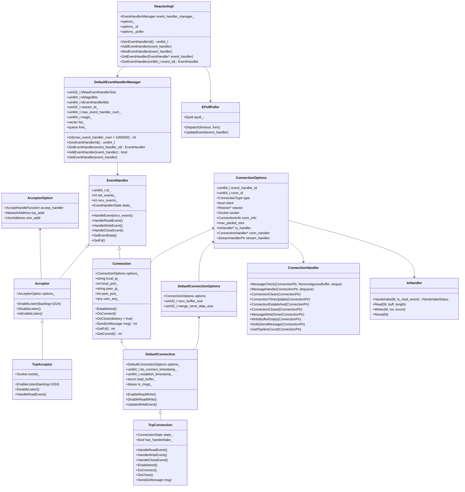
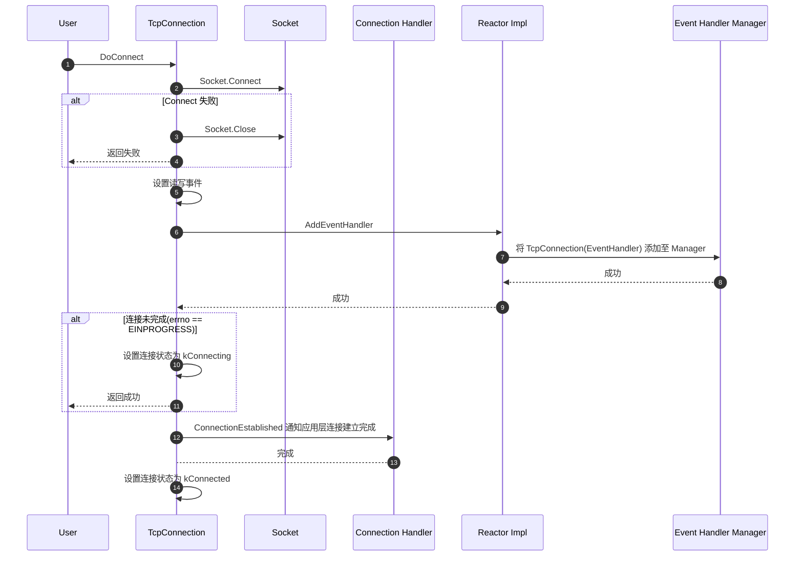
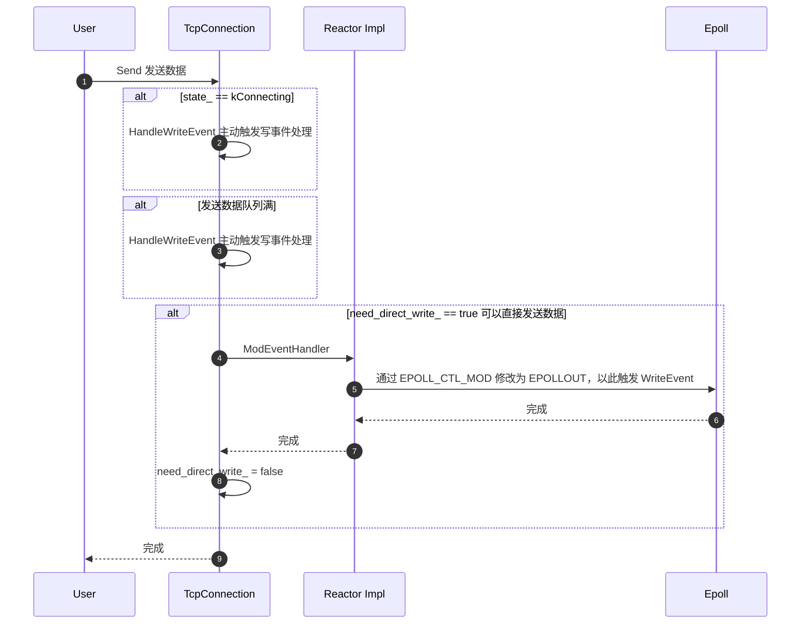
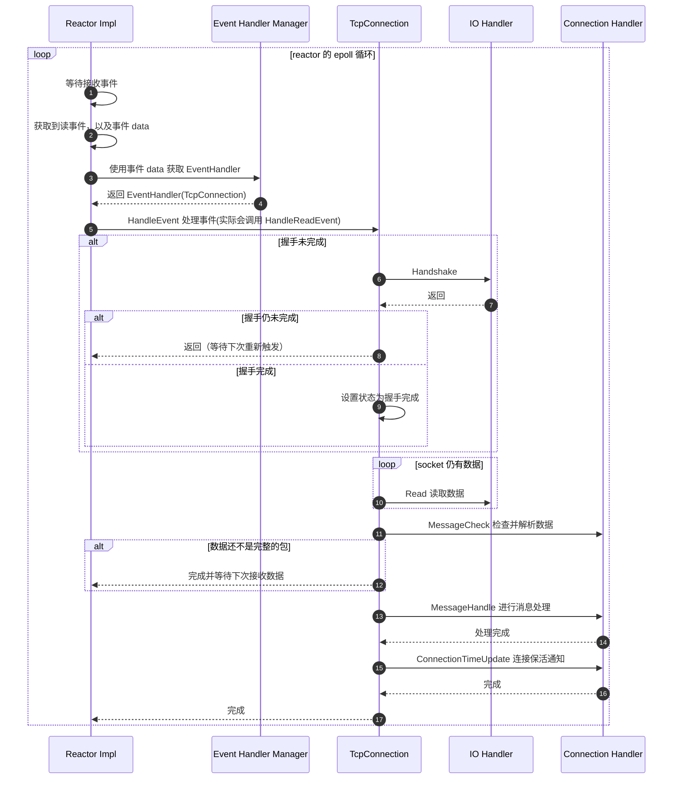
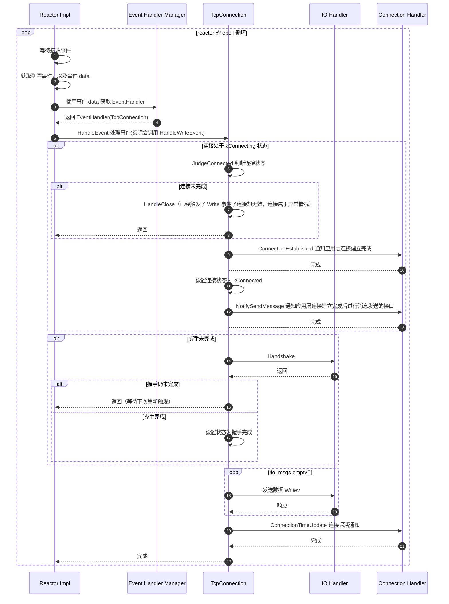
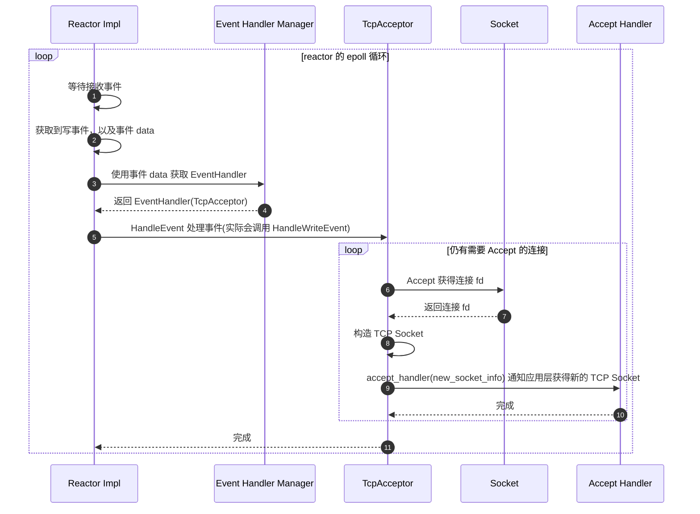

# Xrpc Network Model

<!-- TOC -->

- [Xrpc Network Model](#xrpc-network-model)
    - [Overview](#overview)
    - [Quick Start](#quick-start)
        - [Client Dmoe](#client-dmoe)
        - [Server Demo](#server-demo)
    - [UML Class Diagram](#uml-class-diagram)
    - [Sequence Diagram](#sequence-diagram)
        - [TcpConnection Connect](#tcpconnection-connect)
        - [TcpConnection Send](#tcpconnection-send)
        - [TcpConnection Read Event](#tcpconnection-read-event)
        - [TcpConnection Write Event](#tcpconnection-write-event)
        - [TcpAcceptor Read Event](#tcpacceptor-read-event)
    - [EventHandler](#eventhandler)
        - [Acceptor](#acceptor)
        - [Connection](#connection)
        - [EventHandler Initial](#eventhandler-initial)
    - [EventHandlerManager](#eventhandlermanager)
    - [Reactor](#reactor)
    - [Poller](#poller)
    - [Epoll](#epoll)
    - [Options](#options)
        - [Connection::Options](#connectionoptions)
        - [DefaultConnection::Options](#defaultconnectionoptions)
        - [Acceptor::Options](#acceptoroptions)

<!-- /TOC -->

## Overview

Xrpc Network Model 描述了 Xrpc 网络事件的处理方式、网络事件的抽象方式、网络模型和应用层的交互方式。

Xrpc Network Model 是运行在 Thread Model 的 IO Thread 上的，所有的网络事件都会向 IO Thread 中的 Reactor 进行事件注册，并由这些 Reactor 进行事件检测和调用。在 Linux 中 Xrpc Reactor 本质上是对 Epoll 处理的封装。

## Quick Start

我们通过两个示例来快速理解 Xrpc 的网络模型以及其对外暴露的接口。在实际 Xrpc 网络编程中，往往并不会直接使用网络模型的接口，而是使用 Xrpc 封装的 Transport 接口。

```cpp
void Test() {
  xrpc::ServerTransportImpl::Options server_transport_options;
  server_transport_options.thread_model_ = xrpc::ThreadModelManager::GetInstance()->GetDefaultThreadModel();
  xrpc::ServerTransportImpl server_transport(server_transport_options);

  // 构造 BindInfo
  xrpc::BindInfo info;
  info.is_ipv6 = false;
  info.socket_type = "net";
  info.ip = "0.0.0.0";
  info.port = 8899;
  info.network = "tcp";

  // 触发 Accept 回调，返回值决定了使用哪个 IO 线程的 Reactor 处理连接事件
  info.accept_function = [](const xrpc::AcceptConnectionInfo &info) {
    std::cout << "Accept Event..." << std::endl;
    return 0;
  };

  // 检查 Connection 收到的数据是否为一个完整的包
  info.checker_function = [](const xrpc::ConnectionPtr& conn, xrpc::NoncontiguousBuffer& in,
                             std::deque<std::any>& out) {
    std::cout << "Checker Event..." << std::endl;
    out.push_back(in);
    in.Clear();
    return xrpc::PacketChecker::PACKET_FULL;
  };

  // 对所接收到数据的处理
  info.msg_handle_function = [&server_transport](const xrpc::ConnectionPtr& conn,
                                                 std::deque<std::any>& msg) {
    std::cout << "Msg Handle Event..." << std::endl;

    auto it = msg.begin();
    while (it != msg.end()) {
      auto& buff = std::any_cast<xrpc::NoncontiguousBuffer&>(*it);

      // 构造响应
      xrpc::STransportRspMsg* rsp = new xrpc::STransportRspMsg();
      rsp->basic_info = xrpc::object_pool::GetRefCounted<xrpc::BasicInfo>();
      rsp->basic_info->connection_id = conn->GetConnId();
      rsp->basic_info->addr.ip = conn->GetPeerIp();
      rsp->basic_info->addr.port = conn->GetPeerPort();
      rsp->send_data = buff;

      server_transport.SendMsg(rsp);
      ++it;
    }

    return true;
  };

  // Listen
  server_transport.Bind(info);
  server_transport.Listen();

  // sleep
  auto promise = xrpc::Promise<bool>();
  auto fut = promise.get_future();
  fut.Wait();
}

int main() {
  xrpc::XrpcConfig::GetInstance()->Init("test_transport_server.yaml");
  xrpc::XrpcPlugin::GetInstance()->InitThreadModel();
  Test();
  xrpc::XrpcPlugin::GetInstance()->DestroyThreadModel();
}
```

### Client Dmoe

我们通过一个使用 Xrpc 的 Network Model 的接口来构造一个 HTTP 请求和响应来理解 Xrpc Client 的工作流程。

现假设存在一个 HTTP Server：

```sh
$ curl "http://127.0.0.1/ok" -H "Host:localhost" -v
* About to connect() to 127.0.0.1 port 80 (#0)
*   Trying 127.0.0.1...
* Connected to 127.0.0.1 (127.0.0.1) port 80 (#0)
> GET /ok HTTP/1.1
> User-Agent: curl/7.29.0
> Accept: */*
> Host:localhost
> 
< HTTP/1.1 200 OK
< Server: openresty/1.13.6.2
< Date: Thu, 06 May 2021 06:41:04 GMT
< Content-Type: text/plain
< Content-Length: 2
< Connection: keep-alive
< 
* Connection #0 to host 127.0.0.1 left intact
ok
```

我们使用 Xrpc Client Network Model 构造 HTTP 请求试图拿到 HTTP Response：

```cpp
#include <iostream>
#include <memory>
#include <string>
#include <thread>

#include "xrpc/client/xrpc_client.h"
#include "xrpc/runtime/iomodel/reactor/default/default_connection.h"
#include "xrpc/runtime/iomodel/reactor/default/tcp_connection.h"
#include "xrpc/common/config/xrpc_config.h"
#include "xrpc/common/future/future_utility.h"
#include "xrpc/common/xrpc_plugin.h"

// Connection 相关事件回调
class TestClientConnectionHandler : public xrpc::ConnectionHandler {
  // 建立连接后回调该接口
  void ConnectionEstablished(const xrpc::ConnectionPtr& conn) override {
    std::cout << "ConnectionEstablished" << std::endl;
  }

  // 接收到数据包后都会通过 MessageCheck 检查数据的完整性
  int MessageCheck(const xrpc::ConnectionPtr& conn, xrpc::NoncontiguousBuffer& in, std::deque<std::any>& out) override {
    std::cout << "MessageCheck data:" << std::endl;
    out.push_back(in);
    in.Clear();
    return xrpc::PacketChecker::PACKET_FULL;
  }

  // 对接收数据的处理，通过 MessageCheck 确认收到完整的 PACKET 才会调用
  bool MessageHandle(const xrpc::ConnectionPtr& conn, std::deque<std::any>& msg) override {
    std::cout << "=========== MessageHandle ===========" << std::endl;
    std::cout << "msg size:" << msg.size() << std::endl;
    int index = 0;
    auto it = msg.begin();
    while (it != msg.end()) {
      auto buff = std::any_cast<xrpc::NoncontiguousBuffer&&>(std::move(*it));
      std::cout << "[" << index << "] "
                << "TcpConnectionHandler Total buffer size:" << buff.ByteSize() << ", data:"
                << std::endl << xrpc::FlattenSlow(buff) << std::endl;

      ++it;
      ++index;
    }
    std::cout << "=====================================" << std::endl;
    return true;
  }

  // 连接关闭回调
  void ConnectionClosed(const xrpc::ConnectionPtr& conn) override {
    std::cout << "ConnectionClosed" << std::endl;
    conn->DoClose(true);
  }

  // 连接关闭完成后的回调，可能会对连接做一些清理、释放内存的工作
  void ConnectionClean(const xrpc::ConnectionPtr& conn) override {
    std::cout << "ConnectionClean" << std::endl;

    auto thread_model = xrpc::ThreadModelManager::GetInstance()->GetDefaultThreadModel();
    auto reactor = thread_model->GetIOThread(0)->GetIoModel()->GetReactor();
    reactor->SubmitTask([conn] { delete conn; });
  }

  // 发送完数据调用
  void MessageWriteDone(uint32_t seq_id) override {
    std::cout << "MessageWriteDone seq_id: " << seq_id << std::endl;
  }
};

void Test(xrpc::Reactor* reactor) {
  // 配置选项
  xrpc::DefaultConnection::Options options;
  options.options.event_handler_id = reactor->GenEventHandlerId();
  options.options.reactor = reactor;
  // options.options.type = xrpc::ConnectionType::TCP_SHORT;
  options.options.type = xrpc::ConnectionType::TCP_LONG;
  options.options.conn_id = 1;
  options.options.client = true;
  options.options.socket = xrpc::Socket::CreateTcpSocket(false);
  options.options.io_handler = new xrpc::DefaultIoHandler(options.options.socket.GetFd());

  auto conn_handler = new TestClientConnectionHandler();
  options.options.conn_handler = conn_handler;

  // Remote
  xrpc::ConnectionInfo connection_info;
  connection_info.remote_addr = xrpc::NetworkAddress("127.0.0.1:80");
  options.options.conn_info = std::move(connection_info);

  // 等待连接完成
  std::cout << "Connect ..." << std::endl;
  auto conn = new xrpc::TcpConnection(options);
  conn->DoConnect();
  usleep(500000);

  // 等待数据发送完成
  std::cout << "Send ..." << std::endl;
  std::string message;
  message += "GET /ok HTTP/1.1\r\n";
  message += "Host: localhost\r\n\r\n";
  xrpc::IoMessage io_message;
  io_message.buffer = xrpc::CreateBufferSlow(message.c_str(), message.size());
  conn->Send(std::move(io_message));
  usleep(500000);

  // 等待连接关闭完成
  // destory 为 true 时会在关闭完成时回调 ConnectionHandler::MessageHandle
  std::cout << "Close ..." << std::endl;
  static bool destory = true;
  conn->DoClose(destory);
  usleep(500000);
}

int main() {
  xrpc::XrpcConfig::GetInstance()->Init("test_network_client.yaml");
  xrpc::XrpcPlugin::GetInstance()->InitThreadModel();

  auto thread_model = xrpc::ThreadModelManager::GetInstance()->GetDefaultThreadModel();
  Test(thread_model->GetIOThread(0)->GetIoModel()->GetReactor());

  xrpc::XrpcPlugin::GetInstance()->DestroyThreadModel();
}
```

测试 Xrpc Client 请求：

```sh
$ ./bazel-bin/test/test/test_network_client --config=test_network_client.yaml 
Parse Config:test_network_client.yaml
create merge default thread model io_thread_num: 1
==== threadmodel_id: 0
==== iomodel_options.id: 0
==== worker_thread_options.id: 0
config path invalid: plugins 
create seperate default thread model io_thread_num: 1 handle_thread_num: 1
Connect ...
ConnectionEstablished
Send ...
MessageWriteDone seq_id: 13
MessageCheck
=========== MessageHandle ===========
msg size:1
[0] TcpConnectionHandler Total buffer size:155, data:
HTTP/1.1 200 OK
Server: openresty/1.13.6.2
Date: Thu, 06 May 2021 07:17:51 GMT
Content-Type: text/plain
Content-Length: 2
Connection: keep-alive

ok
=====================================
Close ...
ConnectionClosed
ConnectionClean
```

### Server Demo

我们再通过 Xrpc 的 Network Model 构造一个 Echo Demo Server 来理解 Xrpc Serve 的工作流程。

Xrpc Server 需要借助 TcpAcceptor 进行连接监听，再借助 TcpConnection 进行连接传输。

```cpp
#include <iostream>
#include <memory>
#include <string>
#include <thread>

#include "xrpc/client/xrpc_client.h"
#include "xrpc/runtime/iomodel/reactor/default/default_connection.h"
#include "xrpc/runtime/iomodel/reactor/default/tcp_connection.h"
#include "xrpc/common/config/xrpc_config.h"
#include "xrpc/common/future/future_utility.h"
#include "xrpc/common/xrpc_plugin.h"

// Connection 相关事件回调
class TestServerConnectionHandler : public xrpc::ConnectionHandler {
  // 建立连接后回调该接口
  void ConnectionEstablished(const xrpc::ConnectionPtr& conn) override {
    std::cout << "ConnectionEstablished" << std::endl;
  }

  // 接收到数据包后都会通过 MessageCheck 检查数据的完整性
  int MessageCheck(const xrpc::ConnectionPtr& conn, xrpc::NoncontiguousBuffer& in, std::deque<std::any>& out) override {
    std::cout << "MessageCheck data:" << std::endl;
    out.push_back(in);
    in.Clear();
    return xrpc::PacketChecker::PACKET_FULL;
  }

  // 对接收数据的处理，通过 MessageCheck 确认收到完整的 PACKET 才会调用
  bool MessageHandle(const xrpc::ConnectionPtr& conn, std::deque<std::any>& msg) override {
    xrpc::Connection* connection = const_cast<xrpc::Connection*>(conn);
    std::cout << "=========== MessageHandle ===========" << std::endl;
    std::cout << "msg size:" << msg.size() << std::endl;
    int index = 0;
    auto it = msg.begin();
    while (it != msg.end()) {
      auto buff = std::any_cast<xrpc::NoncontiguousBuffer&&>(std::move(*it));
      std::cout << "[" << index << "] "
                << "TcpConnectionHandler Total buffer size:" << buff.ByteSize() << ", data:"
                << std::endl << xrpc::FlattenSlow(buff) << std::endl;

      ++it;
      ++index;

      xrpc::IoMessage io_message;
      io_message.buffer = std::move(buff);
      connection->Send(std::move(io_message));
    }
    std::cout << "=====================================" << std::endl;
    return true;
  }

  // 连接关闭回调
  void ConnectionClosed(const xrpc::ConnectionPtr&) override {
    std::cout << "ConnectionClosed" << std::endl;
  }

  // 连接关闭完成后的回调，可能会对连接做一些清理、释放内存的工作
  void ConnectionClean(const xrpc::ConnectionPtr&) override {
    std::cout << "ConnectionClean" << std::endl;
    // 清理掉连接
    auto thread_model = xrpc::ThreadModelManager::GetInstance()->GetDefaultThreadModel();
    auto reactor = thread_model->GetIOThread(0)->GetIoModel()->GetReactor();
    reactor->SubmitTask([conn] { delete conn; });
  }

  // 发送完数据调用
  void MessageWriteDone(uint32_t seq_id) override {
    std::cout << "MessageWriteDone seq_id: " << seq_id << std::endl;
  }
};

void Test(xrpc::Reactor* reactor) {
  int server_port = 8899;

  xrpc::Acceptor::Options acceptor_options;
  acceptor_options.event_handler_id = reactor->GenEventHandlerId();
  acceptor_options.reactor = reactor;
  acceptor_options.tcp_addr = xrpc::NetworkAddress(server_port, false);

  // acceptor 接收到连接的处理
  acceptor_options.accept_handler = [=] (const xrpc::AcceptConnectionInfo &connection_info) {
    static uint64_t conn_id = 1;

    xrpc::DefaultConnection::Options options;
    options.options.event_handler_id = reactor->GenEventHandlerId();
    options.options.reactor = reactor;
    options.options.socket = connection_info.socket;
    options.options.conn_info = connection_info.conn_info;
    options.options.conn_handler = new TestServerConnectionHandler();
    options.options.conn_id = conn_id++;
    options.options.type = xrpc::ConnectionType::TCP_LONG;

    auto conn = new xrpc::TcpConnection(options);
    conn->Established();

    return true;
  };

  // 构造 acceptor 开始监听
  auto acceptor = std::make_shared<xrpc::TcpAcceptor>(acceptor_options);
  acceptor->EnableListen();

  // sleep
  auto promise = xrpc::Promise<bool>();
  auto fut = promise.get_future();
  fut.Wait();
}

int main() {
  xrpc::XrpcConfig::GetInstance()->Init("test_network_server.yaml");
  xrpc::XrpcPlugin::GetInstance()->InitThreadModel();

  auto thread_model = xrpc::ThreadModelManager::GetInstance()->GetDefaultThreadModel();
  Test(thread_model->GetIOThread(0)->GetIoModel()->GetReactor());

  xrpc::XrpcPlugin::GetInstance()->DestroyThreadModel();
}
```

启动 Server 后，可以使用 telnet 连接进行测试：

```sh
# 通过 telnet 连接
$ telnet 127.0.0.1 8899
Trying 127.0.0.1...
Connected to 127.0.0.1.
Escape character is '^]'.
123
123
3333
3333
4213
4213
^]
telnet> quit
```

**注意：**

- telnet 关闭连接需要先通过 `ctrl + ]` 进入命令面板，再输入 quit 退出。

## UML Class Diagram

在 Xrpc Reactor 网络模型中，以下角色是重要且会经常碰到的：

- ReactorImpl，映射到 Reactor 模式中的 Initiation Dispatcher。
- EPollPoller，映射到 Reactor 模式中的 Synchronous Event Demultiplexer。
- EventHandler，映射到 Reactor 模式中的 Event Handler。
  - Acceptor，映射到 Reactor 模式中的 Concrete Event Handler。
  - Connection，映射到 Reactor 模式中的 Concrete Event Handler。
- EventHandleManager：EventHandler 管理器，Reactor 依托于该对象管理 EventHandler。



## Sequence Diagram

这里展示了 TcpConnection 为主的网络动作和事件处理的时序图。

### TcpConnection Connect

应用使用 TcpConnection 建立连接的流程如下：



很明显，DoConnect 返回时连接可能并未建立完成，此时会在连接写事件触发时重新去判断连接是否建立，请参考 [TcpConnection Write Event](#tcpconnection-write-event)。

### TcpConnection Send

应用使用 TcpConnection 发送数据时，通常而言 TcpConnection 并非会立即进行数据的发送，而是在队列中进行缓存，在触发 Write Event 时才会将队列中的数据进行发送。对于 Write Event 的处理请参考 [TcpConnection Write Event](#tcpconnection-write-event)。



对于 need_direct_write_，通常是建立连接后或者是 WriteEvent 触发后就会设置为 true，这意味着 Send 会通过设置 fd 为 EPOLLOUT 来触发 HandleEvent。

### TcpConnection Read Event

Reactor 在得到 TCP 读事件时，会使用 TcpConnection 对其进行处理，具体逻辑如下：



### TcpConnection Write Event

Reactor 将 Write Event 交给 TcpConnection(EventHandler) 进行处理：



### TcpAcceptor Read Event

TcpAcceptor 用于监听 Socket，其 Read Event 的处理本质上就是 Accept 并构造一个 TCP Socket 返回给应用层，其时序图：



## EventHandler

EventHandler 是 Network Model 中最重要的类，所有的网络事件均抽象于该类，TCP、UDP 等等的实现均继承于该类，EventHandler 拥有如下属性：

```cpp
class EventHandler {
  enum EventHandlerState {
    CREATE = 0,
    MOD = 1,
    // DEL = 2,
    // SUPPRESS = 3,
  };

  // 事件类型
  enum EventType {
    READ_EVENT = 0x01,
    WRITE_EVENT = 0x02,
    CLOSE_EVENT = 0x04,
    MAX_EVENT = 0xff,
  };

 private:
  // eventhandler 的 id
  uint64_t id_;

  // 设置的事件
  int set_events_;

  // 接收的事件
  int recv_events_;

  // event_handler 的状态
  EventHandlerState state_;
};
```

上述 EventType 是事件类型，EventType 和具体实现网络的底层驱动有关，对于 Epoll 而言，EventType 和 Epoll 事件的映射关系请参考 [Poller](#poller)。

在 Reactor 中感知到了某个事件触发，会先获取 event_handler，然后调用 `HandleEvent` 处理事件，逻辑如下：

```cpp
[this](int recv_events, uint64_t event_data) {
  EventHandler* event_handler = GetEventHandler(event_data);

  if (event_handler) {
    event_handler->HandleEvent(recv_events);
  }
};
```

`event_data` 是什么，Reactor 又是如何根据 event_data 获得 EventHandler 的呢？

`event_data` 是在 Epoll 中和 fd 事件绑定在一起的数据，在事件触发后可以获得该数据，在 Xrpc 中都是将 EventHandler 的 Id 和 epoll 事件绑定在一起的，以便在事件触发后，根据该 Id 获取 EventHandler 进行事件的处理。

Reactor 中通过 `GetEventHandler(id)` 获取 EventHandler，该函数本质是去从 EventHandlerManager 中获取 EventHandler，也就是说 Id 和 EventHandler 的映射关系是维护在 EventHandlerManager 中的，关于 EventHandlerManager 请参考 [EventHandlerManager](#eventhandlermanager)。

```cpp
EventHandler* ReactorImpl::GetEventHandler(uint64_t event_id) {
  return event_handler_manager_->GetEventHandler(event_id);
}
```

通过调用 `EPollPoller::UpdateEvent` 方法，可以将 event_handler 中的事件注册至 Epoll，并和 fd 绑定在一起，在 Epoll 触发了相应的 fd 事件时，可以解析出 EventHandler 进行处理。关于 EpollPoller 的处理请参考 [Poller](#poller)，关于 Epoll 的处理请参考 [Epoll](#epoll)。

通过 `EventHandler::GetEventData` 方法可以获取到 EventHandler 的 Id（在 [Poller](#poller) 会用于在注册 Epoll 事件时绑定 Id）：

```cpp
uint64_t EventHandler::GetEventData() const {
  return id_;
}
```

在 `EventHandler::HandleEvent` 中会根据 recv_events 所触发的事件进行读、写、关闭的事件处理：

```cpp
void EventHandler::HandleEvent(int recv_events) {
  recv_events_ = recv_events;

  if (recv_events_ & EventType::READ_EVENT) {
    HandleReadEvent();
  }

  if (recv_events_ & EventType::WRITE_EVENT) {
    HandleWriteEvent();
  }

  if (recv_events_ & EventType::CLOSE_EVENT) {
    HandleCloseEvent();

    recv_events_ = 0;
    return;
  }

  recv_events_ = 0;
}
```

### Acceptor

Acceptor 主要用于 Server 监听来自 Client 的连接建立请求。Acceptor 是一个抽象，对于 TCP 的具体实现是 TcpAcceptor 类。

由于我们常用的是 TCP，因此这里仅分析 TcpAcceptor 的相关类和对象。先看一下 TcpAcceptro 的继承关系：

```text
TcpAcceptor ----|> Acceptor ----|> EventHandler
```

Acceptor 主要是维护了 `Acceptor::Options`，该配置非常重要，其中最重要的是告诉了 Acceptor:

- 包含一个处理网络事件的 Reactor。
- 在收到一个连接时如何通知应用层。

```cpp
class Acceptor : public EventHandler {
 public:
  struct Options {
    // ...

    // reactor
    Reactor* reactor;

    // 接收连接的方法
    AcceptHandleFunction accept_handler;

    //...
  };
};
```

而在 TcpAcceptor 中则实现了 TCP 连接建立的细节。

TcpAcceptor 的初始化包含了对监听 Socket 的设置：

```cpp
TcpAcceptor::TcpAcceptor(const Options& options)
    : Acceptor(options),
      socket_(Socket::CreateTcpSocket(options.tcp_addr.IsIpv6())) {

  socket_.SetReuseAddr();
  socket_.SetReusePort();
  socket_.Bind(options.tcp_addr);
}
```

在 TcpAcceptor 初始化完成后，就可以开启监听了：

```cpp
void TcpAcceptor::EnableListen(int backlog) {
  socket_.SetTcpNoDelay();
  socket_.SetNoCloseWait();
  socket_.SetBlock(false);
  socket_.SetKeepAlive();
  socket_.Listen(backlog);

  EnableEvent(EventHandler::EventType::READ_EVENT);

  options_.reactor->AddEventHandler(this);

  enable_ = true;
}
```

在接收到一个 TCP 连接时，会触发 HandleReadEvent，会把所有的连接都进行 Accept：

```cpp
void TcpAcceptor::HandleReadEvent() {
  while (true) {
    NetworkAddress peer_addr;
    int conn_fd = socket_.Accept(&peer_addr);
    if (conn_fd == 0) {
      break;
    }

    if (!options_.accept_handler) {
      // 没有应用层处理 Handler
      close(conn_fd);
    }

    AcceptConnectionInfo info;
    info.socket = Socket(conn_fd, socket_.GetDomain());
    info.conn_info.local_addr = options_.tcp_addr;
    info.conn_info.remote_addr = std::move(peer_addr);

    // 回调应用层，让应用层可以使用新连接进行请求收发
    if (!options_.accept_handler(info)) {
      close(conn_fd);
    }
  }
}
```

### Connection

Connection 是用于对连接的表示，这是一个大类，主要分为三个层次：

- Connection，直接继承 EventHandler，提供了 Connection 的基本信息，关联 Reactor，关联 IoHandler，关联 ConnectionHandler，关联 StreamHandler
- DefaultConnection，继承 Connection，提供了将网络事件添加至 Reactor 的实现
- TcpConnection/UdpTransceiver 等，继承 DefaultConnection

Connection 有四个重要的对象：

- Socket，是对网络 Socket 的抽象，包括 TCP、UDP、UDS。
- Reactor，Connection 上的事件均注册在该 Reactor 上。
- IoHandler，封装了对 socket 的 IO 操作。虽然 Socket 也封装了 IO 操作，但是在 TcpConnection 中，IO 操作都是交给 IoHandler 的。
- ConnectionHandler，Connection 处理了事件后，通过 ConnectionHandler 通知应用层如何处理。

由于我们常用的是 TCP，因此这里仅分析 Connection 中的 TcpConnection 相关类和对象。先看一下 TcpConnection 的继承关系：

```text
TcpConnection ----|> DefaultConnection ----|> Connection ----|> EventHandler
```

其中 Connection 只是一个连接的抽象，提供了相关属性和获取方法，没有实现任何逻辑。

其中 DefaultConnection 提供了如何将 Connection 的读写事件注册到 Reactor 中：

```cpp
void DefaultConnection::EnableReadWrite() {
  int events = EventHandler::EventType::READ_EVENT | EventHandler::EventType::WRITE_EVENT;

  // 将 events 设置到 EventHandler 的 set_events 中
  // Reactor 是通过 set_events 来进行事件的添加的
  EnableEvent(events);

  options_.options.reactor->AddEventHandler(this);
}
```

TcpConnection 实现了在 TCP 连接下的网络事件的处理方式，以及如何通知应用层。

TcpConnection 初始化时会设置 Socket 的相关属性：

```cpp
TcpConnection::TcpConnection(const Options& options)
    : DefaultConnection(options),
      state_(ConnectionState::kUnconnected),
      has_handeshake_(false),
      send_data_size_(0),
      need_direct_write_(false) {
  options_.options.socket.SetTcpNoDelay();
  options_.options.socket.SetCloseWaitDefault();
  options_.options.socket.SetBlock(false);
  options_.options.socket.SetKeepAlive();

  // 默认使用 DefaultIoHandler
  if (!options_.options.io_handler) {
    options_.options.io_handler = new DefaultIoHandler(options_.options.socket.GetFd());
  }
}
```

TcpConnection 创建连接流程请参考 [TcpConnection Connect](#tcpconnection-connect)，这里给出伪码：

```cpp
bool TcpConnection::DoConnect() {
  assert(state_ == ConnectionState::kUnconnected);

  ret = options_.options.socket.Connect(options_.options.conn_info.remote_addr);
  if (!ret) {
    options_.options.socket.Close();
    state_ = ConnectionState::kUnconnected;
    return false;
  }

  has_handeshake_ = false;
  EnableReadWrite();

  if (errno == EINPROGRESS) {
    // 还未连接完成 处于连接中
    state_ = ConnectionState::kConnecting;
    return true;
  }

  // 回调应用层方法 连接建立完成
  options_.options.conn_handler->ConnectionEstablished(this);
  state_ = ConnectionState::kConnected;
  return true;
}
```

TcpConnection 发送消息流程请参考 [TcpConnection Send](#tcpconnection-send)，这里给出伪码：

```cpp
int TcpConnection::Send(IoMessage&& msg) {
  if (state_ == ConnectionState::kUnconnected) {
    return -1;
  }

  // 缓存要发送的数据 等到可以发送数据时进行数据发送
  send_data_size_ += msg.buffer.ByteSize();
  io_msgs_.emplace_back(std::move(msg));

  // 如果处于连接中 主动触发 Write Event 尝试发送数据
  if (state_ == ConnectionState::kConnecting) {
    HandleWriteEvent();
    return 0;
  }

  // 握手没有完成返回 失败
  if (!has_handeshake_) {
    return -1;
  }

  // 数据过大 主动触发 Write Event 尝试发送数据
  if (send_data_size_ >= GetMergeSendDataSize() || io_msgs_.size() >= kSendDataMergeNum) {
    HandleWriteEvent();
    return 0;
  }

  if (need_direct_write_) {
    UpdateWriteEvent();
    need_direct_write_ = false;
  }

  return 0;
}
```

TcpConnection 处理读事件流程请参考 [TcpConnection Read Event](#tcpconnection-read-event)，这里给出伪码：

```cpp
void TcpConnection::HandleReadEvent() {
  if (state_ == ConnectionState::kUnconnected) {
    return;
  }

  auto io_handler = options_.options.io_handler;
  auto conn_handler = options_.options.conn_handler;
  auto socket = options_.options.socket;

  // 如果握手没有完成则需要握手
  // 是否需要握手是看使用的 IoHandler 是否需要握手
  // 例如 Redis TcpConnection 的 IoHandler 是需要握手的
  if (!has_handeshake_ && io_handler) {
    // 握手
    // 一次读操作可能并不会握手完成，这种情况会多次调用 io_handler 的 Handshake
    handshake_state = io_handler->Handshake(socket.GetFd(), true);

    if (handshake_state == IoHandler::HandshakeStatus::FAILED) {
      HandleClose();
      return;
    }

    // 握手还未完成 先返回 等待下次调用
    if (handshake_state != IoHandler::HandshakeStatus::SUCC) {
      return;
    }

    has_handeshake_ = true;
  }

  // 收发包
  while (true) {
    // 读数据
    size_t writable_size = read_buffer_.builder.SizeAvailable();
    int n = io_handler->Read(socket.GetFd(), read_buffer_.builder.data(), writable_size);
    if (n < 0) {
      if (errno != EAGAIN) {
        ret = -1;
      }
      break;
    }

    if (n == 0) {
      ret = -1;
      break;
    }

    // 在 read_buffer_ 中追加新数据
    read_buffer_.buffer.Append(read_buffer_.builder.Seal(n));
    if ((size_t)n < writable_size) {
      break;
    }
  }

  if (ret != 0) {
    // 收包异常
    HandleClose();
    return;
  }

  // 检查数据协议以及是否接收完整
  std::deque<std::any> data;
  int checker_ret = conn_handler->MessageCheck(this, read_buffer_.buffer, data);
  if (checker_ret == static_cast<int>(PacketChecker::PACKET_ERR)) {
    HandleClose();
    return;
  } else if (checker_ret != static_cast<int>(PacketChecker::PACKET_FULL)) {
    // 没有获取到完整的数据包
    // 退出等待再次回调
    return;
  }

  // 交给应用层处理完整的数据包
  bool flag = conn_handler->MessageHandle(this, data);
  if (!flag) {
    // 处理失败
    HandleClose();
  }

  // 连接保活时间更新
  conn_handler->ConnectionTimeUpdate(this);
}
```

TcpConnection 处理写事件流程请参考 [TcpConnection Write Event](#tcpconnection-write-event)，这里给出伪码：

```cpp
void TcpConnection::HandleWriteEvent() {
  // 前置检查，主要用于对连接完成和握手的检查
  if (PreCheckOnWrite() == false) {
    return;
  }

  // 获取消息 block 个数: send_msgs_size
  for (auto& msg : io_msgs_) {
    const auto& buffer = msg.buffer;
    send_msgs_size += buffer.size();
  }

  int index = 0;
  while (index < send_msgs_size) {
    int iov_index = 0;
    // 遍历所有的消息
    for (auto& msg : io_msgs_) {
      const auto& buf = msg.buffer;

      for (auto iter = buf.begin(); iter != buf.end() && iov_index < kSendDataMergeNum; ++iter) {
        iov[iov_index].iov_base = iter->data();
        iov[iov_index].iov_len = iter->size();
        total_size += iter->size();

        ++index;
        ++iov_index;
      }

      if (iov_index >= kSendDataMergeNum) {
        break;
      }
    }

    int n = io_handler->Writev(socket.GetFd(), iov, iov_index);
    if (n < 0) {
      if (errno != EAGAIN) {
        ret = -1;
      }
      need_direct_write_ = false;
      flag = false;
    } else {
      send_data_size_ -= n;
    }
  }

  // 发送数据失败
  if (ret != 0) {
    send_data_size_ = 0;
    HandleClose();
  }

  // 连接保活时间更新
  conn_handler->ConnectionTimeUpdate(this);
}

bool TcpConnection::PreCheckOnWrite() {
  if (state_ == ConnectionState::kUnconnected) {
    return false;
  }

  auto io_handler = options_.options.io_handler;
  auto conn_handler = options_.options.conn_handler;
  auto socket = options_.options.socket;

  // 判断连接是否建立
  if (state_ == ConnectionState::kConnecting) {
    if (JudgeConnected() != 0) {
      HandleClose();
      return false;
    }

    // 连接建立完成
    establish_timestamp_ = TimeProvider::GetNowMs();
    options_.options.conn_handler->ConnectionEstablished(this);
    state_ = ConnectionState::kConnected;
    need_direct_write_ = true;

    // 发送连接未成功之前，缓存在队列里的请求
    options_.options.conn_handler->NotifySendMessage(this);
  }

  // 判断握手是否完成
  if (!has_handeshake_ && io_handler) {
    handshake_state = io_handler->Handshake(socket.GetFd(), false);

    if (handshake_state == IoHandler::HandshakeStatus::FAILED) {
      HandleClose();
      return false;
    }

    // 握手还未完成 先返回 等待下次调用
    if (handshake_state != IoHandler::HandshakeStatus::SUCC) {
      return false;
    }
  }

  need_direct_write_ = true;

  // 无数据需要发送
  if (io_msgs_.size() == 0) {
    return false;
  }

  return true;
}
```

### EventHandler Initial

在 Xrpc 的应用中，TcpAcceptor 和 TcpConnection 是在什么时候进行初始化的呢？

对于 Xrpc 作为 Client 主动建立连接和 Xrpc 作为 Server 接收连接的处理是不太一样的：

- 对于 Xrpc Client 只需要对 TcpConnection 进行初始化。
- 对于 Xrpc Server 需要对 TcpAcceptor 进行初始化，也要在连接建立后对 TcpConnection 进行初始化。

用户其实很少直接使用 Network Model 提供的 TcpConnection 和 TcpAcceptor 进行编程，而是使用 Xrpc 的 Transport 系列的组件，Transport 封装了 Network Model 的相关接口，以便用户可以更方便的使用网络功能。对于 Xrpc 的 Transport 的细节请参考 [Xrpc Transport](../xrpc-transport/readme.md)，这里仅仅介绍 Xrpc Transport 是如何初始化 TcpAcceptor 和 TcpConnection 的。

在 Xrpc Client 中抽象出了 Connector 类，该类用于封装对于连接的创建、复用和管理，Xrpc Client 有两种 Connector：

- ConnPoolConnector，这是一种连接池方式和目标进行连接和通信 Connector
- ConnComplexConnector，这是一种连接复用方式和目标进行连接和通信的 Connector

无论是何种 Connector，均使用 `Connector::CreateTcpConnection` 构建 TcpConnection：

```cpp
DefaultConnection* Connector::CreateTcpConnection(uint64_t conn_id) {
  // 初始化 TCP Connection 的配置
  DefaultConnection* conn = nullptr;
  DefaultConnection::Options options = MakeConnectionOption(conn_id);

  // 构造 TCP Socket 以及进行 IO 处理的 IO Handler
  options.options.socket = Socket::CreateTcpSocket(options_.peer_addr.IsIpv6());
  options.options.io_handler = IoHandlerFactory::GetInstance()->Create(
      options.options.socket.GetFd(), *(options_.trans_info));

  // 构造 TcpConnection 并建立连接
  conn = new TcpConnection(options);
  conn->DoConnect();
  return conn;
}


DefaultConnection::Options Connector::MakeConnectionOption(uint64_t conn_id) {
  // 构造连接参数
  DefaultConnection::Options options;

  options.recv_buffer_size = options_.trans_info->recv_buffer_size;
  options.options.max_packet_size = options_.trans_info->max_packet_size;
  options.merge_send_data_size = options_.trans_info->merge_send_data_size;
  // 初始化 Event Handler ID，本质上是调用了 Event Handler Manager 的方法得到 ID
  options.options.event_handler_id = options_.io_model->GetReactor()->GenEventHandlerId();
  options.options.reactor = options_.io_model->GetReactor();
  options.options.type = options_.trans_info->conn_type;
  options.options.conn_id = conn_id;
  options.options.client = true;

  ConnectionInfo connection_info;
  connection_info.remote_addr = options_.peer_addr;
  options.options.conn_info = std::move(connection_info);

  // 设置连接相关事件触发时的回调
  auto* conn_handler = new FutureConnectionHandler(options_.trans_info);

  // TCP Connection 清理
  conn_handler->SetCleanFunc([this](const ConnectionPtr& conn) {
    this->ConnectionCleanFunction(conn);
  });

  // TCP Connection 对一个完整的数据包进行处理
  conn_handler->SetMsgHandleFunc([this](const ConnectionPtr& conn, std::deque<std::any>& data) {
    return this->MessageHandleFunction(conn, data);
  });

  // TCP Connection 建立 并且有缓存的发送数据
  conn_handler->SetNotifyMsgSendFunc([this](const ConnectionPtr& conn) {
    return this->NotifySendMsgFunction(conn);
  });

  // TCP Connection 保活事件
  conn_handler->SetTimeUpdateFunc([this](const ConnectionPtr& conn) {
    this->ActiveTimeUpdate(conn);
  });

  // Pipline 处理事件
  conn_handler->SetPipelineCountGetFunc([this](const ConnectionPtr conn) {
    return this->GetPipelineCount(conn);
  });

  // 其他的事件由 FutureConnectionHandler 实现
  // FutureConnectionHandler 回调实现又依赖于 options_.trans_info

  options.options.conn_handler = conn_handler;
  return options;
}
```

对于 Xrpc Server 使用了 `BindAdapter` 封装了 TcpAcceptor 的相关操作，通过 `BindAdapter::BindTcp` 对 TcpAcceptor 进行了初始化以及设置了收到新连接的处理逻辑：

```cpp
void BindAdapter::BindTcp() {
  auto ip = options_.bind_info.ip;
  auto port = options_.bind_info.port;
  auto ip_type = options_.bind_info.is_ipv6 ? NetworkAddress::IpType::ipv6 : NetworkAddress::IpType::ipv4;

  NetworkAddress addr(ip, port, ip_type);

  Acceptor::Options options;
  options.event_handler_id = options_.io_model->GetReactor()->GenEventHandlerId();
  options.reactor = options_.io_model->GetReactor();
  options.tcp_addr = addr;
  // 收到新连接后将连接信息提交给 ServerTransport 以构建新的 TcpConnection
  options.accept_handler = [this](const AcceptConnectionInfo& connection_info) {
    return this->options_.server_transport->AcceptConnection(connection_info);
  };
  acceptor_ = std::make_shared<TcpAcceptor>(options);
}
```

在 Xrpc Server 接收到一个新连接后，会将连接信息交给 ServerTransport 以构建 TcpConnection，后续就可以开始真正的数据传输了：

```cpp
bool ServerTransportImpl::AcceptConnection(const AcceptConnectionInfo& connection_info) {
  // 找到一个bind_adapter和对应的reactor
  index = connection_info.socket.GetFd() % bind_adapters_.size();
  auto* bind_adapter = bind_adapters_[index];
  auto* reactor = bind_adapter->GetOptions().io_model->GetReactor();

  reactor->SubmitTask([reactor, bind_adapter, connection_info] {
    uint64_t event_handler_id = reactor->GenEventHandlerId();
    uint64_t conn_id = bind_adapter->GetConnManager().GenConnectionId();
    const auto& bind_info = bind_adapter->GetOptions().bind_info;

    Connection::Options options;
    options.event_handler_id = event_handler_id;
    options.conn_id = conn_id;
    options.reactor = bind_adapter->GetOptions().io_model->GetReactor();
    options.socket = connection_info.socket;
    options.conn_info = connection_info.conn_info;
    options.max_packet_size = bind_info.max_packet_size;
    options.conn_handler = new DefaultConnectionHandler(bind_adapter);

    DefaultConnection::Options default_connection_options;
    default_connection_options.options.type = ConnectionType::TCP_LONG;
    default_connection_options.recv_buffer_size = bind_info.recv_buffer_size;
    default_connection_options.merge_send_data_size = bind_info.merge_send_data_size;

    options.io_handler =
        IoHandlerFactory::GetInstance()->Create(connection_info.socket.GetFd(), bind_info);

    default_connection_options.options = options;

    auto* conn = new TcpConnection(default_connection_options);
    bind_adapter->GetConnManager().AddConnection(conn);
    auto& connections_active_time = bind_adapter->GetConnectionActiveTime();
    connections_active_time[conn->GetConnId()] = xrpc::TimeProvider::GetNowMs();

    // 添加读写事件, 回调应用层通知请求建立成功
    conn->Established();
  });

  return true;
}
```

## EventHandlerManager

EventHandlerManager 用于维护 Reactor 中所有的 EventHandler，其包含最重要的两个职责是：

- 生成 EventHandler 的 Id。
- 使用 EventHandler 的 Id 查询 EventHandler。

`EventHandlerManager` 中只是实现了如何使用 Id 查询 EventHandler，以及部分生成 EventHandler Id 的逻辑，完整的逻辑其实是实现于 `DefaultEventHandlerManager` 类中的，主要是实现了如何存储空闲的 Id 以及如何申请和释放 Id。

EventHandlerManager 由 Reactor 进行控制，用户通过向 Reactor 添加事件处理时，都会由 Reactor 注册至 EventHandlerManager 中，请参考 [Reactor](#reactor)。

EventHandlerManager 生成的 Id 均是 64 bit，前 32 bit 是魔数 Magic，后 32 bit 是 EventHandler 在数组中的索引：

```text
+-----------------+-----------------+
|   High 32 Bits  |   Low 32 Bits   |
+-----------------+-----------------+
|      Magic      |   Array Index   |
+-----------------+-----------------+
```

使用魔数的目的是为了区分不同的 Reactor 实例的 EventHandler。

生成一个 EventHandlerId：

```cpp
uint64_t EventHandlerManager::GenEventHandlerId() {
  uint64_t uid = PopId();

  if (uid == 0) {
    return uid;
  }

  assert(uid > 0 && uid <= max_event_handler_num_);

  return magic_ | uid;
}

// magic_ 的生成方法
uint64_t EventHandlerManager::GenMagic(uint32_t reactor_id) {
  return kMagicBits & static_cast<uint64_t>(reactor_id) << 32;
}
```

添加和获取 EventHandler：

```cpp
bool EventHandlerManager::AddEventHandler(EventHandler *event_handler) {
  auto event_handler_id = event_handler->GetEventHandlerId();
  auto magic = kMagicBits & event_handler_id;
  auto uid = kEventHandlerBits & event_handler_id;

  assert(magic == magic_ && uid > 0 && uid <= max_event_handler_num_);

  if (list_[uid] != nullptr) {
    return false;
  }

  list_[uid] = event_handler;

  return true;
}

EventHandler *EventHandlerManager::GetEventHandler(uint64_t event_handler_id) {
  auto magic = kMagicBits & event_handler_id;
  auto uid = kEventHandlerBits & event_handler_id;

  assert(magic == magic_ && uid > 0 && uid <= max_event_handler_num_);

  return list_[uid];
}
```

## Reactor

Reactor 提供一个大循环持续监听触发的事件，并对事件进行处理：

```cpp
void ReactorImpl::Run() {
  // 事件处理逻辑
  Poller::EventHandleFunction event_handler_function = [this](int recv_events, uint64_t event_data) {
    EventHandler* event_handler = GetEventHandler(event_data);
    if (event_handler) {
      event_handler->HandleEvent(recv_events);
    }
  };

  while (!terminate_) {
    // timeout == 5ms
    options_.poller->Dispatch(Poller::kPollerTimeout, event_handler_function);
    // ...
  }
  // ...
}
```

上述 `options_.poller->Dispatch` 本质上是对 Epoll 的调用，请参考 [Poller](#poller) 和 [Epoll](#epoll)。

Reactor 提供了对 Event Handler 控制的方法，包括生成 Id，添加事件等：

```cpp
// 得到一个新的 Event Handler Id
uint64_t ReactorImpl::GenEventHandlerId() { return event_handler_manager_->GenEventHandlerId(); }

// 通过 Event Handler Id 获得对应的 Event Handler
EventHandler* ReactorImpl::GetEventHandler(uint64_t event_id) {
  return event_handler_manager_->GetEventHandler(event_id);
}

// 将 Event Handler 的事件添加至 Epoll
void ReactorImpl::AddEventHandler(EventHandler* event_handler) {
  event_handler_manager_->AddEventHandler(event_handler);

  options_.poller->UpdateEvent(event_handler);
}

// 将 Event Handler 的事件设置到 Epoll 中
void ReactorImpl::ModEventHandler(EventHandler* event_handler) {
  options_.poller->UpdateEvent(event_handler);
}

// 将 Event Handler 的事件从 Epoll 中移除
void ReactorImpl::DelEventHandler(EventHandler* event_handler) {
  event_handler_manager_->DelEventHandler(event_handler);

  options_.poller->UpdateEvent(event_handler);
}
```

## Poller

EpollPoller 是对 Epoll 使用的封装，EpollPoller 可以进行 Epoll 的等待，并将触发的事件逐一回调处理：

```cpp
void EPollPoller::Dispatch(int timeout, const EventHandleFunction& func) {
  int event_num = epoll_.Wait(timeout);

  for (int i = 0; i < event_num; ++i) {
    const epoll_event& ev = epoll_.Get(i);
    int recv_events = EventToEventType(ev.events);
    if (recv_events) {
      func(recv_events, ev.data.u64);
    }
  }
}
```

Reactor 通过 `EpollPoller::UpdateEvent` 接口向 Epoll 注册事件：

```cpp
// EpollPoller 更新 Handler 的逻辑
// event_handler->GetFd() 获得文件描述符
// event_handler->GetEventData() 获得 EventHandler 的 Id
void EPollPoller::UpdateEvent(EventHandler* event_handler) {
  EventHandler::EventHandlerState state = event_handler->GetState();
  if (state == EventHandler::EventHandlerState::CREATE) {
    uint32_t events = EventTypeToEvent(event_handler->GetSetEvents());

    epoll_.Add(event_handler->GetFd(), event_handler->GetEventData(), events);

    event_handler->SetState(EventHandler::EventHandlerState::MOD);
  } else {
    if (event_handler->HasSetEvent()) {
      uint32_t events = EventTypeToEvent(event_handler->GetSetEvents());

      epoll_.Mod(event_handler->GetFd(), event_handler->GetEventData(), events);
    } else {
      epoll_.Del(event_handler->GetFd(), event_handler->GetEventData(), 0);

      event_handler->SetState(EventHandler::EventHandlerState::CREATE);
    }
  }
}
```

Event Handler 的 EventType 和 Epoll 的 Event 之间的转换是在 EpollPoller 中的：

```cpp
uint32_t EPollPoller::EventTypeToEvent(int event_type) {
  uint32_t events = 0;

  if (event_type & EventHandler::EventType::READ_EVENT) {
    events |= EPOLLIN;
  }

  if (event_type & EventHandler::EventType::WRITE_EVENT) {
    events |= EPOLLOUT;
  }

  if (event_type & EventHandler::EventType::CLOSE_EVENT) {
    events |= EPOLLRDHUP;
  }

  return events;
}

int EPollPoller::EventToEventType(uint32_t events) {
  int recv_events = 0;

  if (events & EPOLLIN) {
    recv_events |= EventHandler::EventType::READ_EVENT;
  }

  if (events & EPOLLOUT) {
    recv_events |= EventHandler::EventType::WRITE_EVENT;
  }

  if (events & (EPOLLRDHUP | EPOLLERR | EPOLLHUP)) {
    recv_events |= EventHandler::EventType::CLOSE_EVENT;
  }

  return recv_events;
}
```

## Epoll

Xrpc 的 Epoll 对象是对 Linux epoll 使用的封装，使用 `Wait` 方法进行 epoll 等待：

```cpp
int Epoll::Wait(int millsecond) {
  return epoll_wait(epoll_fd_, events_, max_events_ + 1, millsecond);
}
```

Xrpc Epoll 对象提供了 Linux epoll 事件的控制：

```cpp
void Epoll::Add(int fd, uint64_t data, uint32_t event) {
  Ctrl(fd, data, event, EPOLL_CTL_ADD);
}

void Epoll::Mod(int fd, uint64_t data, uint32_t event) {
  Ctrl(fd, data, event, EPOLL_CTL_MOD);
}

void Epoll::Del(int fd, uint64_t data, uint32_t event) {
  Ctrl(fd, data, event, EPOLL_CTL_DEL);
}

void Epoll::Ctrl(int fd, uint64_t data, uint32_t events, int op) {
  struct epoll_event ev;
  ev.data.u64 = data;
  if (et_) {
    ev.events = events | EPOLLET;
  } else {
    ev.events = events;
  }

  epoll_ctl(epoll_fd_, op, fd, &ev);
}
```

很明显，Linux Epoll 使用水平触发还是边缘触发是由私有遍历 et_ 决定的，默认情况下，Xrpc 使用的 Epoll 为 边缘触发：

```cpp
class Epoll {
 public:
  explicit Epoll(uint32_t max_events = 10240, bool et = true);
};
```

## Options

Network Model 牵涉到的很多对象都有 Options，这些 Options 中包含了一些重要信息和对象，这里对 Options 进行了列举和梳理：

### Connection::Options

```cpp
class Connection : public EventHandler {
 public:
  struct Options {
    // 此Connection的的event_handler id
    uint64_t event_handler_id;

    // 此Connection的连接id，上层分配
    uint64_t conn_id;

    // 连接类型
    ConnectionType type;

    // 客户端还是服务端侧创建的连接
    bool client = false;

    // reactor
    Reactor* reactor = nullptr;

    // socket
    Socket socket;

    // conn info
    ConnectionInfo conn_info;

    // 连接允许的请求的最大包大小
    uint32_t max_packet_size = 10000000;

    // io收发包时，读写/握手相关操作的处理
    IoHandler* io_handler = nullptr;

    // 连接上相关的处理操作
    ConnectionHandler* conn_handler = nullptr;

    // 连接上流消息处理器
    StreamHandlerPtr stream_handler{nullptr};
  };
};
```

### DefaultConnection::Options

```cpp
class DefaultConnection : public Connection {
 public:
  struct Options {
    Connection::Options options;

    // // 此Connection的连接id，上层分配
    // uint64_t conn_id;

    // 接收数据时，每次分配内存buffer的大小
    uint32_t recv_buffer_size = 8192;

    // 合并发送数据的大小
    uint32_t merge_send_data_size = 8192;
  };
};
```

### Acceptor::Options

```cpp
class Acceptor : public EventHandler {
 public:
  struct Options {
    // 此Acceptor的event_handler id
    uint64_t event_handler_id;

    // reactor
    Reactor* reactor;

    // 接收连接的方法
    AcceptHandleFunction accept_handler;

    // tcp监听地址
    NetworkAddress tcp_addr;

    // unix监听地址
    UnixAddress unix_addr;
  };
};
```
