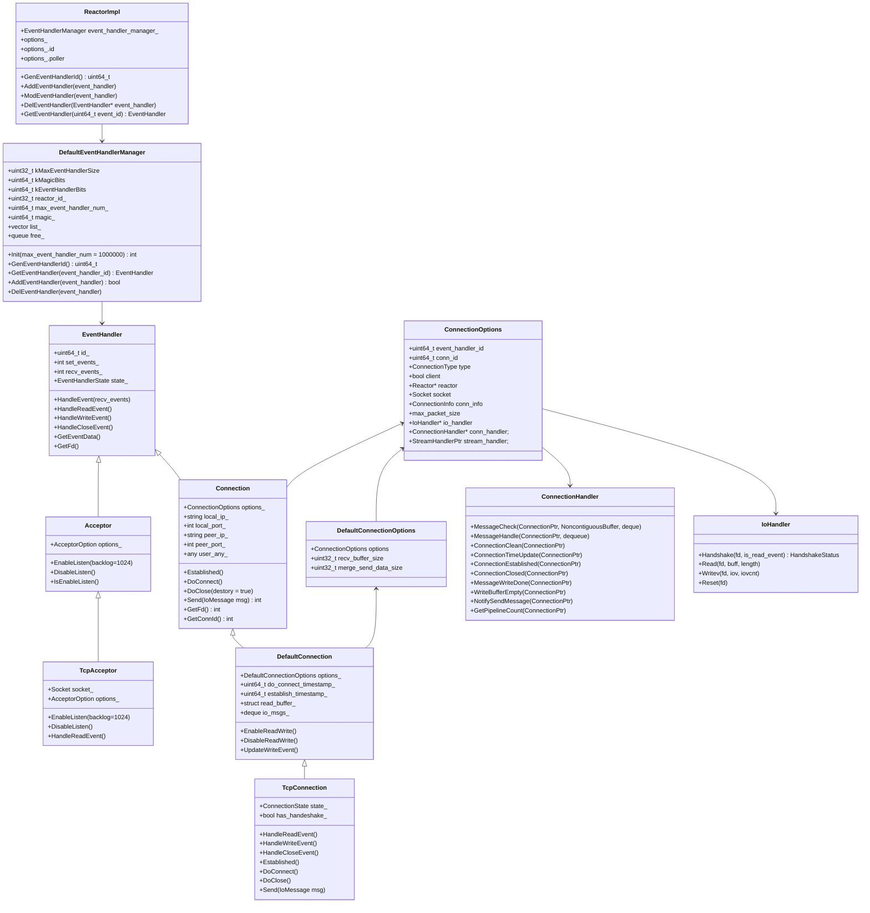

# Xrpc Network Model

<!-- TOC -->

- [Xrpc Network Model](#xrpc-network-model)
    - [Overview](#overview)
    - [Quick Start](#quick-start)
    - [UML Class Diagram](#uml-class-diagram)
    - [Sequence Diagram](#sequence-diagram)
        - [TcpConnection Connect](#tcpconnection-connect)
        - [TcpConnection Send](#tcpconnection-send)
        - [TcpConnection Read Event](#tcpconnection-read-event)
        - [TcpConnection Write Event](#tcpconnection-write-event)
    - [EventHandler](#eventhandler)
        - [Acceptor](#acceptor)
        - [Connection](#connection)
        - [Connection Initial](#connection-initial)
    - [EventHandlerManager](#eventhandlermanager)
    - [Reactor](#reactor)
    - [Poller](#poller)
    - [Epoll](#epoll)
    - [Options](#options)
    - [Connection::Options](#connectionoptions)

<!-- /TOC -->

## Overview

## Quick Start

## UML Class Diagram



## Sequence Diagram

这里展示了 TcpConnection 为主的网络动作和事件处理的时序图。

### TcpConnection Connect

```mermaid
sequenceDiagram
autonumber
```

### TcpConnection Send

### TcpConnection Read Event

### TcpConnection Write Event

## EventHandler

EventHandler 是 Network Model 中最重要的类，所有的网络事件均抽象于该类，TCP、UDP 等等的实现均继承于该类，EventHandler 拥有如下属性：

```cpp
class EventHandler {
  enum EventHandlerState {
    CREATE = 0,
    MOD = 1,
    // DEL = 2,
    // SUPPRESS = 3,
  };

  // 事件类型
  enum EventType {
    READ_EVENT = 0x01,
    WRITE_EVENT = 0x02,
    CLOSE_EVENT = 0x04,
    MAX_EVENT = 0xff,
  };

 private:
  // eventhandler 的 id
  uint64_t id_;

  // 设置的事件
  int set_events_;

  // 接收的事件
  int recv_events_;

  // event_handler 的状态
  EventHandlerState state_;
};
```

上述 EventType 是事件类型，EventType 和具体实现网络的底层驱动有关，对于 Epoll 而言，EventType 和 Epoll 事件的映射关系请参考 [Poller](#poller)。

在 Reactor 中感知到了某个事件触发，会先获取 event_handler，然后调用 `HandleEvent` 处理事件，逻辑如下：

```cpp
[this](int recv_events, uint64_t event_data) {
  EventHandler* event_handler = GetEventHandler(event_data);

  if (event_handler) {
    event_handler->HandleEvent(recv_events);
  }
};
```

`event_data` 是什么，Reactor 又是如何根据 event_data 获得 EventHandler 的呢？

`event_data` 是在 Epoll 中和 fd 事件绑定在一起的数据，在事件触发后可以获得该数据，在 Xrpc 中都是将 EventHandler 的 Id 和 epoll 事件绑定在一起的，以便在事件触发后，根据该 Id 获取 EventHandler 进行事件的处理。

Reactor 中通过 `GetEventHandler(id)` 获取 EventHandler，该函数本质是去从 EventHandlerManager 中获取 EventHandler，也就是说 Id 和 EventHandler 的映射关系是维护在 EventHandlerManager 中的，关于 EventHandlerManager 请参考 [EventHandlerManager](#eventhandlermanager)。

```cpp
EventHandler* ReactorImpl::GetEventHandler(uint64_t event_id) {
  return event_handler_manager_->GetEventHandler(event_id);
}
```

通过调用 `EPollPoller::UpdateEvent` 方法，可以将 event_handler 中的事件注册至 Epoll，并和 fd 绑定在一起，在 Epoll 触发了相应的 fd 事件时，可以解析出 EventHandler 进行处理。关于 EpollPoller 的处理请参考 [Poller](#poller)，关于 Epoll 的处理请参考 [Epoll](#epoll)。

通过 `EventHandler::GetEventData` 方法可以获取到 EventHandler 的 Id（在 [Poller](#poller) 会用于在注册 Epoll 事件时绑定 Id）：

```cpp
uint64_t EventHandler::GetEventData() const {
  return id_;
}
```

在 `EventHandler::HandleEvent` 中会根据 recv_events 所触发的事件进行读、写、关闭的事件处理：

```cpp
void EventHandler::HandleEvent(int recv_events) {
  recv_events_ = recv_events;

  if (recv_events_ & EventType::READ_EVENT) {
    HandleReadEvent();
  }

  if (recv_events_ & EventType::WRITE_EVENT) {
    HandleWriteEvent();
  }

  if (recv_events_ & EventType::CLOSE_EVENT) {
    HandleCloseEvent();

    recv_events_ = 0;
    return;
  }

  recv_events_ = 0;
}
```

### Acceptor

Acceptor 主要用于 Server 监听来自 Client 的连接建立请求。Acceptor 是一个抽象，对于 TCP 的具体实现是 TcpAcceptor 类。

由于我们常用的是 TCP，因此这里仅分析 TcpAcceptor 的相关类和对象。先看一下 TcpAcceptro 的继承关系：

```text
TcpAcceptor ----|> Acceptor ----|> EventHandler
```

Acceptor 主要是维护了 `Acceptor::Options`，该配置非常重要，其中最重要的是告诉了 Acceptor:

- 包含一个处理网络事件的 Reactor。
- 在收到一个连接时如何通知应用层。

```cpp
class Acceptor : public EventHandler {
 public:
  struct Options {
    // ...

    // reactor
    Reactor* reactor;

    // 接收连接的方法
    AcceptHandleFunction accept_handler;

    //...
  };
};
```

而在 TcpAcceptor 中则实现了 TCP 连接建立的细节。

TcpAcceptor 的初始化包含了对监听 Socket 的设置：

```cpp
TcpAcceptor::TcpAcceptor(const Options& options)
    : Acceptor(options),
      socket_(Socket::CreateTcpSocket(options.tcp_addr.IsIpv6())) {

  socket_.SetReuseAddr();
  socket_.SetReusePort();
  socket_.Bind(options.tcp_addr);
}
```

在 TcpAcceptor 初始化完成后，就可以开启监听了：

```cpp
void TcpAcceptor::EnableListen(int backlog) {
  socket_.SetTcpNoDelay();
  socket_.SetNoCloseWait();
  socket_.SetBlock(false);
  socket_.SetKeepAlive();
  socket_.Listen(backlog);

  EnableEvent(EventHandler::EventType::READ_EVENT);

  options_.reactor->AddEventHandler(this);

  enable_ = true;
}
```

在接收到一个 TCP 连接时，会触发 HandleReadEvent，会把所有的连接都进行 Accept：

```cpp
void TcpAcceptor::HandleReadEvent() {
  while (true) {
    NetworkAddress peer_addr;
    int conn_fd = socket_.Accept(&peer_addr);
    if (conn_fd == 0) {
      break;
    }

    if (!options_.accept_handler) {
      // 没有应用层处理 Handler
      close(conn_fd);
    }

    AcceptConnectionInfo info;
    info.socket = Socket(conn_fd, socket_.GetDomain());
    info.conn_info.local_addr = options_.tcp_addr;
    info.conn_info.remote_addr = std::move(peer_addr);

    // 回调应用层，让应用层可以使用新连接进行请求收发
    if (!options_.accept_handler(info)) {
      close(conn_fd);
    }
  }
}
```

### Connection

Connection 是用于对连接的表示，这是一个大类，主要分为三个层次：

- Connection，直接继承 EventHandler，提供了 Connection 的基本信息，关联 Reactor，关联 IoHandler，关联 ConnectionHandler，关联 StreamHandler
- DefaultConnection，继承 Connection，提供了将网络事件添加至 Reactor 的实现
- TcpConnection/UdpTransceiver 等，继承 DefaultConnection

Connection 有四个重要的对象：

- Socket，是对网络 Socket 的抽象，包括 TCP、UDP、UDS。
- Reactor，Connection 上的事件均注册在该 Reactor 上。
- IoHandler，封装了对 socket 的 IO 操作。虽然 Socket 也封装了 IO 操作，但是在 TcpConnection 中，IO 操作都是交给 IoHandler 的。
- ConnectionHandler，Connection 处理了事件后，通过 ConnectionHandler 通知应用层如何处理。

由于我们常用的是 TCP，因此这里仅分析 Connection 中的 TcpConnection 相关类和对象。先看一下 TcpConnection 的继承关系：

```text
TcpConnection ----|> DefaultConnection ----|> Connection ----|> EventHandler
```

其中 Connection 只是一个连接的抽象，提供了相关属性和获取方法，没有实现任何逻辑。

其中 DefaultConnection 提供了如何将 Connection 的读写事件注册到 Reactor 中：

```cpp
void DefaultConnection::EnableReadWrite() {
  int events = EventHandler::EventType::READ_EVENT | EventHandler::EventType::WRITE_EVENT;

  // 将 events 设置到 EventHandler 的 set_events 中
  // Reactor 是通过 set_events 来进行事件的添加的
  EnableEvent(events);

  options_.options.reactor->AddEventHandler(this);
}
```

TcpConnection 实现了在 TCP 连接下的网络事件的处理方式，以及如何通知应用层。

TcpConnection 初始化时会设置 Socket 的相关属性：

```cpp
TcpConnection::TcpConnection(const Options& options)
    : DefaultConnection(options),
      state_(ConnectionState::kUnconnected),
      has_handeshake_(false),
      send_data_size_(0),
      need_direct_write_(false) {
  options_.options.socket.SetTcpNoDelay();
  options_.options.socket.SetCloseWaitDefault();
  options_.options.socket.SetBlock(false);
  options_.options.socket.SetKeepAlive();

  // 默认使用 DefaultIoHandler
  if (!options_.options.io_handler) {
    options_.options.io_handler = new DefaultIoHandler(options_.options.socket.GetFd());
  }
}
```

TcpConnection 创建连接流程请参考 [TcpConnection Connect](#tcpconnection-connect)，这里给出伪码：

```cpp
bool TcpConnection::DoConnect() {
  assert(state_ == ConnectionState::kUnconnected);

  ret = options_.options.socket.Connect(options_.options.conn_info.remote_addr);
  if (!ret) {
    options_.options.socket.Close();
    state_ = ConnectionState::kUnconnected;
    return false;
  }

  has_handeshake_ = false;
  EnableReadWrite();

  if (errno == EINPROGRESS) {
    // 还未连接完成 处于连接中
    state_ = ConnectionState::kConnecting;
    return true;
  }

  // 回调应用层方法 连接建立完成
  options_.options.conn_handler->ConnectionEstablished(this);
  state_ = ConnectionState::kConnected;
  return true;
}
```

TcpConnection 发送消息流程请参考 [TcpConnection Send](#tcpconnection-send)，这里给出伪码：

```cpp
int TcpConnection::Send(IoMessage&& msg) {
  if (state_ == ConnectionState::kUnconnected) {
    return -1;
  }

  // 缓存要发送的数据 等到可以发送数据时进行数据发送
  send_data_size_ += msg.buffer.ByteSize();
  io_msgs_.emplace_back(std::move(msg));

  // 如果处于连接中 主动触发 Write Event 尝试发送数据
  if (state_ == ConnectionState::kConnecting) {
    HandleWriteEvent();
    return 0;
  }

  // 握手没有完成返回 失败
  if (!has_handeshake_) {
    return -1;
  }

  // 数据过大 主动触发 Write Event 尝试发送数据
  if (send_data_size_ >= GetMergeSendDataSize() || io_msgs_.size() >= kSendDataMergeNum) {
    HandleWriteEvent();
    return 0;
  }

  if (need_direct_write_) {
    UpdateWriteEvent();
    need_direct_write_ = false;
  }

  return 0;
}
```

TcpConnection 处理读事件流程请参考 [TcpConnection Read Event](#tcpconnection-read-event)，这里给出伪码：

```cpp
void TcpConnection::HandleReadEvent() {
  if (state_ == ConnectionState::kUnconnected) {
    return;
  }

  auto io_handler = options_.options.io_handler;
  auto conn_handler = options_.options.conn_handler;
  auto socket = options_.options.socket;

  // 如果握手没有完成则需要握手
  // 是否需要握手是看使用的 IoHandler 是否需要握手
  // 例如 Redis TcpConnection 的 IoHandler 是需要握手的
  if (!has_handeshake_ && io_handler) {
    // 握手
    // 一次读操作可能并不会握手完成，这种情况会多次调用 io_handler 的 Handshake
    handshake_state = io_handler->Handshake(socket.GetFd(), true);

    if (handshake_state == IoHandler::HandshakeStatus::FAILED) {
      HandleClose();
      return;
    }

    // 握手还未完成 先返回 等待下次调用
    if (handshake_state != IoHandler::HandshakeStatus::SUCC) {
      return;
    }

    has_handeshake_ = true;
  }

  // 收发包
  while (true) {
    // 读数据
    size_t writable_size = read_buffer_.builder.SizeAvailable();
    int n = io_handler->Read(socket.GetFd(), read_buffer_.builder.data(), writable_size);
    if (n < 0) {
      if (errno != EAGAIN) {
        ret = -1;
      }
      break;
    }

    if (n == 0) {
      ret = -1;
      break;
    }

    // 在 read_buffer_ 中追加新数据
    read_buffer_.buffer.Append(read_buffer_.builder.Seal(n));
    if ((size_t)n < writable_size) {
      break;
    }
  }

  if (ret != 0) {
    // 收包异常
    HandleClose();
    return;
  }

  // 检查数据协议以及是否接收完整
  std::deque<std::any> data;
  int checker_ret = conn_handler->MessageCheck(this, read_buffer_.buffer, data);
  if (checker_ret == static_cast<int>(PacketChecker::PACKET_ERR)) {
    HandleClose();
    return;
  } else if (checker_ret != static_cast<int>(PacketChecker::PACKET_FULL)) {
    // 没有获取到完整的数据包
    // 退出等待再次回调
    return;
  }

  // 交给应用层处理完整的数据包
  bool flag = conn_handler->MessageHandle(this, data);
  if (!flag) {
    // 处理失败
    HandleClose();
  }

  // 连接保活时间更新
  conn_handler->ConnectionTimeUpdate(this);
}
```

TcpConnection 处理写事件流程请参考 [TcpConnection Write Event](#tcpconnection-write-event)，这里给出伪码：

```cpp
void TcpConnection::HandleWriteEvent() {
  // 前置检查，主要用于对连接完成和握手的检查
  if (PreCheckOnWrite() == false) {
    return;
  }

  // 获取消息 block 个数: send_msgs_size
  for (auto& msg : io_msgs_) {
    const auto& buffer = msg.buffer;
    send_msgs_size += buffer.size();
  }

  int index = 0;
  while (index < send_msgs_size) {
    int iov_index = 0;
    // 遍历所有的消息
    for (auto& msg : io_msgs_) {
      const auto& buf = msg.buffer;

      for (auto iter = buf.begin(); iter != buf.end() && iov_index < kSendDataMergeNum; ++iter) {
        iov[iov_index].iov_base = iter->data();
        iov[iov_index].iov_len = iter->size();
        total_size += iter->size();

        ++index;
        ++iov_index;
      }

      if (iov_index >= kSendDataMergeNum) {
        break;
      }
    }

    int n = io_handler->Writev(socket.GetFd(), iov, iov_index);
    if (n < 0) {
      if (errno != EAGAIN) {
        ret = -1;
      }
      need_direct_write_ = false;
      flag = false;
    } else {
      send_data_size_ -= n;
    }
  }

  // 发送数据失败
  if (ret != 0) {
    send_data_size_ = 0;
    HandleClose();
  }

  // 连接保活时间更新
  conn_handler->ConnectionTimeUpdate(this);
}

bool TcpConnection::PreCheckOnWrite() {
  if (state_ == ConnectionState::kUnconnected) {
    return false;
  }

  auto io_handler = options_.options.io_handler;
  auto conn_handler = options_.options.conn_handler;
  auto socket = options_.options.socket;

  // 判断连接是否建立
  if (state_ == ConnectionState::kConnecting) {
    if (JudgeConnected() != 0) {
      HandleClose();
      return false;
    }

    // 连接建立完成
    establish_timestamp_ = TimeProvider::GetNowMs();
    options_.options.conn_handler->ConnectionEstablished(this);
    state_ = ConnectionState::kConnected;
    need_direct_write_ = true;

    // 发送连接未成功之前，缓存在队列里的请求
    options_.options.conn_handler->NotifySendMessage(this);
  }

  // 判断握手是否完成
  if (!has_handeshake_ && io_handler) {
    handshake_state = io_handler->Handshake(socket.GetFd(), false);

    if (handshake_state == IoHandler::HandshakeStatus::FAILED) {
      HandleClose();
      return false;
    }

    // 握手还未完成 先返回 等待下次调用
    if (handshake_state != IoHandler::HandshakeStatus::SUCC) {
      return false;
    }
  }

  need_direct_write_ = true;

  // 无数据需要发送
  if (io_msgs_.size() == 0) {
    return false;
  }

  return true;
}
```

### Connection Initial

TcpAcceptor 和 TcpConnection 是在什么时候进行初始化的呢？

## EventHandlerManager

EventHandlerManager 用于维护 Reactor 中所有的 EventHandler，其包含最重要的两个职责是：

- 生成 EventHandler 的 Id。
- 使用 EventHandler 的 Id 查询 EventHandler。

`EventHandlerManager` 中只是实现了如何使用 Id 查询 EventHandler，以及部分生成 EventHandler Id 的逻辑，完整的逻辑其实是实现于 `DefaultEventHandlerManager` 类中的，主要是实现了如何存储空闲的 Id 以及如何申请和释放 Id。

EventHandlerManager 由 Reactor 进行控制，用户通过向 Reactor 添加事件处理时，都会由 Reactor 注册至 EventHandlerManager 中，请参考 [Reactor](#reactor)。

EventHandlerManager 生成的 Id 均是 64 bit，前 32 bit 是魔数 Magic，后 32 bit 是 EventHandler 在数组中的索引：

```text
+-----------------+-----------------+
|   High 32 Bits  |   Low 32 Bits   |
+-----------------+-----------------+
|      Magic      |   Array Index   |
+-----------------+-----------------+
```

使用魔数的目的是为了区分不同的 Reactor 实例的 EventHandler。

生成一个 EventHandlerId：

```cpp
uint64_t EventHandlerManager::GenEventHandlerId() {
  uint64_t uid = PopId();

  if (uid == 0) {
    return uid;
  }

  assert(uid > 0 && uid <= max_event_handler_num_);

  return magic_ | uid;
}

// magic_ 的生成方法
uint64_t EventHandlerManager::GenMagic(uint32_t reactor_id) {
  return kMagicBits & static_cast<uint64_t>(reactor_id) << 32;
}
```

添加和获取 EventHandler：

```cpp
bool EventHandlerManager::AddEventHandler(EventHandler *event_handler) {
  auto event_handler_id = event_handler->GetEventHandlerId();
  auto magic = kMagicBits & event_handler_id;
  auto uid = kEventHandlerBits & event_handler_id;

  assert(magic == magic_ && uid > 0 && uid <= max_event_handler_num_);

  if (list_[uid] != nullptr) {
    return false;
  }

  list_[uid] = event_handler;

  return true;
}

EventHandler *EventHandlerManager::GetEventHandler(uint64_t event_handler_id) {
  auto magic = kMagicBits & event_handler_id;
  auto uid = kEventHandlerBits & event_handler_id;

  assert(magic == magic_ && uid > 0 && uid <= max_event_handler_num_);

  return list_[uid];
}
```

## Reactor

```cpp
uint64_t ReactorImpl::GenEventHandlerId() { return event_handler_manager_->GenEventHandlerId(); }

EventHandler* ReactorImpl::GetEventHandler(uint64_t event_id) {
  return event_handler_manager_->GetEventHandler(event_id);
}

void ReactorImpl::AddEventHandler(EventHandler* event_handler) {
  event_handler_manager_->AddEventHandler(event_handler);

  options_.poller->UpdateEvent(event_handler);
}

void ReactorImpl::ModEventHandler(EventHandler* event_handler) {
  options_.poller->UpdateEvent(event_handler);
}

void ReactorImpl::DelEventHandler(EventHandler* event_handler) {
  event_handler_manager_->DelEventHandler(event_handler);

  options_.poller->UpdateEvent(event_handler);
}
```

## Poller

```cpp
uint32_t EPollPoller::EventTypeToEvent(int event_type) {
  uint32_t events = 0;

  if (event_type & EventHandler::EventType::READ_EVENT) {
    events |= EPOLLIN;
  }

  if (event_type & EventHandler::EventType::WRITE_EVENT) {
    events |= EPOLLOUT;
  }

  if (event_type & EventHandler::EventType::CLOSE_EVENT) {
    events |= EPOLLRDHUP;
  }

  return events;
}

int EPollPoller::EventToEventType(uint32_t events) {
  int recv_events = 0;

  if (events & EPOLLIN) {
    recv_events |= EventHandler::EventType::READ_EVENT;
  }

  if (events & EPOLLOUT) {
    recv_events |= EventHandler::EventType::WRITE_EVENT;
  }

  if (events & (EPOLLRDHUP | EPOLLERR | EPOLLHUP)) {
    recv_events |= EventHandler::EventType::CLOSE_EVENT;
  }

  return recv_events;
}
```

```cpp
// EpollPoller 更新 Handler 的逻辑
// event_handler->GetFd() 获得文件描述符
// event_handler->GetEventData() 获得 EventHandler 的 Id
void EPollPoller::UpdateEvent(EventHandler* event_handler) {
  EventHandler::EventHandlerState state = event_handler->GetState();
  if (state == EventHandler::EventHandlerState::CREATE) {
    uint32_t events = EventTypeToEvent(event_handler->GetSetEvents());

    epoll_.Add(event_handler->GetFd(), event_handler->GetEventData(), events);

    event_handler->SetState(EventHandler::EventHandlerState::MOD);
  } else {
    if (event_handler->HasSetEvent()) {
      uint32_t events = EventTypeToEvent(event_handler->GetSetEvents());

      epoll_.Mod(event_handler->GetFd(), event_handler->GetEventData(), events);
    } else {
      epoll_.Del(event_handler->GetFd(), event_handler->GetEventData(), 0);

      event_handler->SetState(EventHandler::EventHandlerState::CREATE);
    }
  }
}
```

## Epoll

```cpp
void Epoll::Add(int fd, uint64_t data, uint32_t event) {
  Ctrl(fd, data, event, EPOLL_CTL_ADD);
}

void Epoll::Mod(int fd, uint64_t data, uint32_t event) {
  Ctrl(fd, data, event, EPOLL_CTL_MOD);
}

void Epoll::Del(int fd, uint64_t data, uint32_t event) {
  Ctrl(fd, data, event, EPOLL_CTL_DEL);
}

int Epoll::Wait(int millsecond) {
  return epoll_wait(epoll_fd_, events_, max_events_ + 1, millsecond);
}

void Epoll::Ctrl(int fd, uint64_t data, uint32_t events, int op) {
  struct epoll_event ev;
  ev.data.u64 = data;
  if (et_) {
    ev.events = events | EPOLLET;
  } else {
    ev.events = events;
  }

  epoll_ctl(epoll_fd_, op, fd, &ev);
}
```

## Options

## Connection::Options

```cpp
class Connection : public EventHandler {
 public:
  struct Options {
    // 此Connection的的event_handler id
    uint64_t event_handler_id;

    // 此Connection的连接id，上层分配
    uint64_t conn_id;

    // 连接类型
    ConnectionType type;

    // 客户端还是服务端侧创建的连接
    bool client = false;

    // reactor
    Reactor* reactor = nullptr;

    // socket
    Socket socket;

    // conn info
    ConnectionInfo conn_info;

    // 连接允许的请求的最大包大小
    uint32_t max_packet_size = 10000000;

    // io收发包时，读写/握手相关操作的处理
    IoHandler* io_handler = nullptr;

    // 连接上相关的处理操作
    ConnectionHandler* conn_handler = nullptr;

    // 连接上流消息处理器
    StreamHandlerPtr stream_handler{nullptr};
  };
};
```
