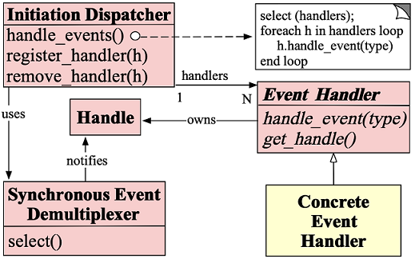
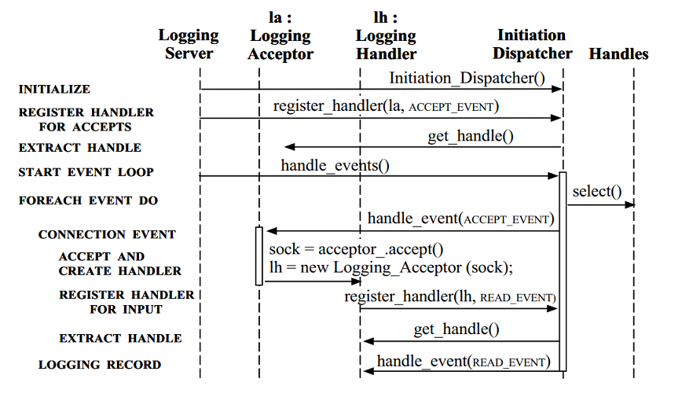
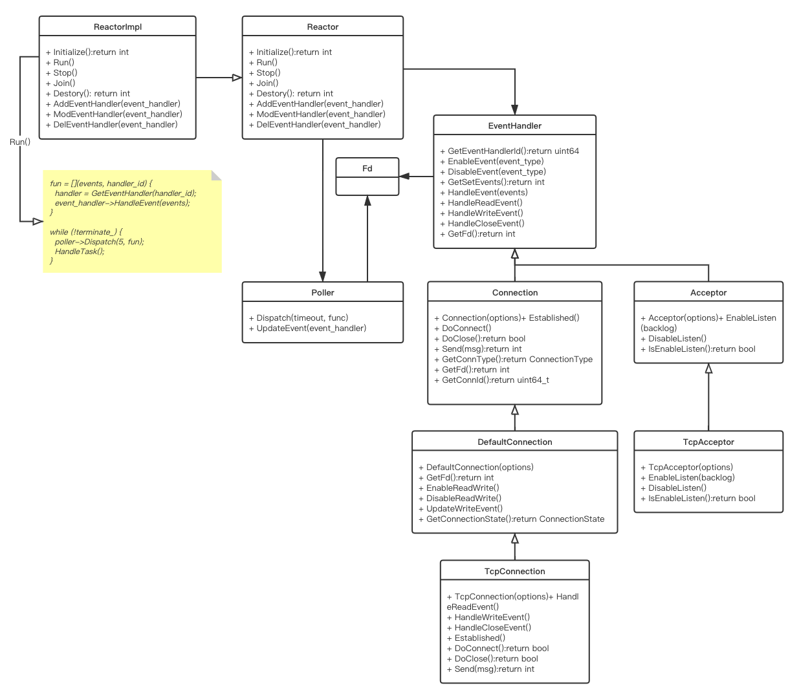
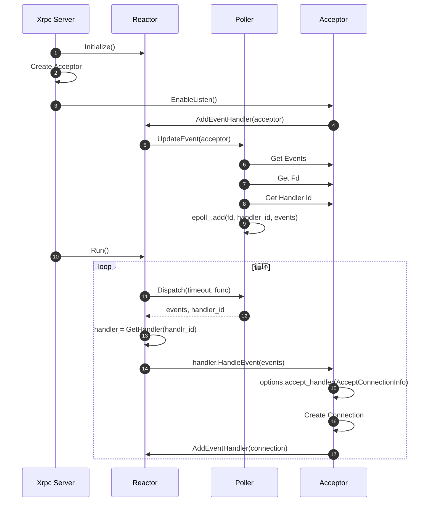
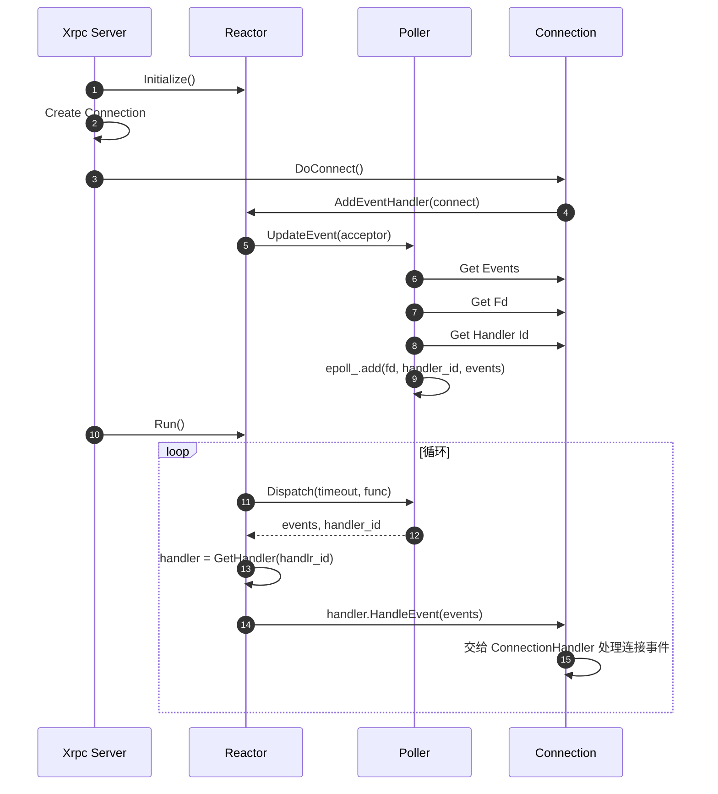

# XRPC Network Reactor

## Overview

Xrpc 的网络模型基于 Reactor Pattern 实现，对于 Reactor Pattern 的简介可以参考博文 [Reactor](/posts/reactor/readme.md)。

这里先简单展示一下 Reactor 的结构，后面章节主要展示 Xrpc Reactor 的实现关键点。

Xrpc Reactor 运行在 Xrpc 的 IO Thread 中，并且每个 IO 线程只会有一个 Reactor。

## Reactor Pattern

Reactor Pattern Roles：

Role | Description
-|-
Handles | 句柄，标识操作系统资源，例如：网络连接、打开的文件、定时器等等。Synchronous Event Demultiplexer 可以等待 `Handles` 发生事件。
Synchronous Event Demultiplexer | 组塞等待 Handles 集合上的事件发生，例如 Linux 的 `select()`, `epoll()`。
Initiation Dispatcher | 定义了一个可以注册、删除、分发 Event Handler 的接口。Synchronous Event Demultiplexer 检测到事件时，会由 `Initiation Dispatcher` 进行事件分发处理。
Event Handler | 提供了 Hook 接口，在事件发生时触发 Hook 进行处理。该对象是抽象表示，具体如何处理由 Concrete Event Handler 实现。
Concrete Event Handler | 实现 Event Handler 的 Hook 接口。将 `Concrete Event Handler` 注册到 Initiation Dispatcher 中，当 Event 发生，由 Initiation Dispatcher 回调 `Concrete Event Handler` 的 Hook 进行处理。

Reactor Pattern 类图如下：

下面是 Reactor Logging Server 示例的简单时序：

## Xrpc Reactor Roles

Xrpc 提供了相关的类来实现 Reactor Pattern，这些类和 Reactor Pattern 角色之间的关系如下：

Reactor Role | Xrpc Class
-|-
Handles | Fd(int)
Synchronous Event Demultiplexer | Poller / EPollPoller
Initiation Dispatcher | Reactor / ReactorImpl
Event Handler | EventHandler
Concrete Event Handler | TcpAcceptor / TcpConnection

Xrpc Reactor 类图如下：

## Xrpc Reactor Sequence Diagram

这个时序图为是对 Xrpc Reactor 的简单描述，只会在抽象类层面之间的调用关系进行描述。

Xrpc Server Acceptor 接收新连接的时序：

**注意：**

- Acceptor 接收到新连接时，交给 options 配置的 accept_handler 回调进行处理。
- 这里假设了回调中会创建新连接。

Xrpc 连接处理简单时序：

**注意：**

- Connection 上的相关事件会交给 ConnectionHandler 进行处理。
- 用户可以通过实现 ConnectionHandler 自定义连接事件处理方法。
