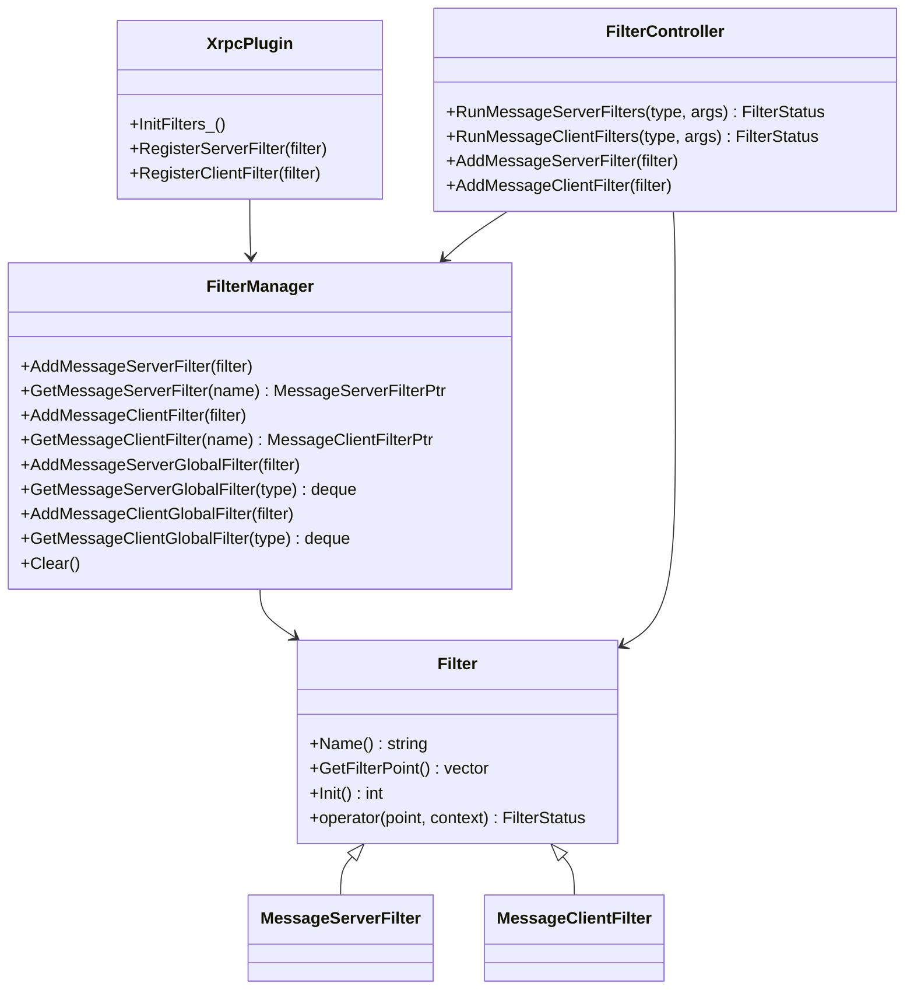

# Xrpc Filters

<!-- TOC -->

- [Xrpc Filters](#xrpc-filters)
    - [Overview](#overview)
    - [Quick Start](#quick-start)
    - [UML Class Diagram](#uml-class-diagram)
    - [Filter](#filter)
    - [XrpcPlugin](#xrpcplugin)
    - [FilterManager](#filtermanager)
    - [FilterController](#filtercontroller)

<!-- /TOC -->

## Overview

Filter 基于 AOP，也就是我们所说的面向切面编程。

AOP 的相关名词：

- 切面：即 Filter，它会定义了埋点以及实现方法。
- 切点：即埋点，即在特定的位置会触发相应的逻辑。

对于客户端：可以在`请求发起前`做一些事情，`收到响应后`做一些事情。

对于服务端：可以在`接收请求后`做一些事情，`发送响应前`做一些事情。

Xrpc 框架已经内嵌了一些 Filter 用户可以直接通过配置文件进行使用，也可以用户自定义 Filter（同样需要用户通过配置文件打开）。

Xrpc 中 Filter 存在两个概念：

- Service Filter，用于某个特定的 Service。
- Global Filter，用于所有的 Service。

在配置文件中将 Filter 配置到不同的位置决定了是 Global Filter 还是 Service Filter：

```yaml
client:
  filter:  # global filter
    - filter-name-1
    - filter-name-2
  service:
    - name: service-name-1
      filter:  # service filter
        - filter-name-3
        - filter-name-4
server:
  filter:  # global filter
    - filter-name-5
    - filter-name-6
  service:
    - name: service-name-2
      filter:  # service filter
        - filter-name-7
        - filter-name-8
```

Xrpc 中提供的埋点请参考 [Filter](#filter)。

## Quick Start

Xrpc 用户自定义并注册一个 Filter 非常简单：

- 继承 Filter 类进行实现
- 将 Filter 注册到 XrpcPlugins
- 在配置文件中写明使用的 Filter。

例如这里注册一个 test-filter：

```cpp
class TestFilter : public xrpc::MessageClientFilter {
 public:
  explicit TestFilter() {}

  ~TestFilter() override {}

  std::string Name() override { return "test-filter"; }

  std::vector<xrpc::FilterPoint> GetFilterPoint() override {
    std::vector<xrpc::FilterPoint> points = {xrpc::FilterPoint::CLIENT_PRE_SEND_MSG};
    return points;
  }

  void operator()(xrpc::FilterStatus& status, xrpc::FilterPoint point,
                  const xrpc::ClientContextPtr& context) override {
    std::cout << "========== test_filter =========" << std::endl;
  }
};
```

向 XrpcPlugins 中注册：

```cpp
xrpc::MessageClientFilterPtr p(new TestFilter());
xrpc::XrpcPlugin::GetInstance()->RegisterClientFilter(p);
```

在配置文件中声明为 Global Filter：

```yaml
client:
  filter:
    - test-filter
```

## UML Class Diagram



## Filter

Filter 有两个大类：

- 用于客户端的 MessageClientFilter
- 用于服务器的 MessageServerFilter

MessageClientFilter 和 MessageServerFilter 本质上没有区别，唯一区别在于 operator 传递的 context 类型不同。

```cpp
using MessageServerFilter = Filter<ServerContextPtr>;
using MessageClientFilter = Filter<ClientContextPtr>;
```

Filter 存在以下埋点：

```cpp
// 服务端filter埋点
enum class FilterPoint {
  SERVER_POST_CONN_ACCEPT = 0,  // 服务端连接接收后
  SERVER_POST_CONN_CLOSE = 1,   // 服务端连接关闭后

  CLIENT_POST_CONN_CONNECTED = 2,  // 客户端连接成功后
  CLIENT_POST_CONN_CLOSE = 3,      // 客户端连接关闭后

  SERVER_POST_RECV_MSG = 4,  // 服务端接收 rpc 请求消息后
  SERVER_PRE_SEND_MSG = 5,   // 服务端发送 rpc 请求响应前

  CLIENT_PRE_SEND_MSG = 6,   // 客户端发送 rpc 请求前
  CLIENT_POST_RECV_MSG = 7,  // 客户端接收 rpc 请求响应后

  SERVER_PRE_RPC_INVOKE = 8,   // 服务端 rpc 调用前
  SERVER_POST_RPC_INVOKE = 9,  // 服务端 rpc 调用后

  CLIENT_PRE_RPC_INVOKE = 10,   // 客户端 rpc 调用前
  CLIENT_POST_RPC_INVOKE = 11,  // 客户端 rpc 调用后

  FILTER_NUM = 12,  // 埋点数目
};
```

并且 Filter 可以输出以下状态：

```cpp
// filter状态
enum class FilterStatus {
  CONTINUE = 0,  // 继续下一个 filter
  REJECT = 1,    // 中断 filter 链的继续执行
  NOTFOUND = 2,  //
};
```

不同的切面对 Filter 执行完后的 status 处理是不同的，有些会直接忽略 status，有些会基于 status 判断是否立即终止处理。

最好直接在源码中搜 RunMessageServerFilters 和 RunMessageClientFilters 的调用情况，看对 status 的处理方式。

## XrpcPlugin

无论是 Xrpc 自带的 Filter 或是用户定义的 Filter 都需要通过 XrpcPlugin 进行注册。

对于 Xrpc 自带的 Filter，通过 `InitFilters_` 进行注册，这在 XrpcPlugin 初始化时自动调用：

```cpp
int XrpcPlugin::RegistryPlugins() {
  // ... 其他 Plugins 初始化

  InitFilters_();
  return 0;
}

int XrpcPlugin::InitFilters_() {
  // 注册 Server 和 Client Filter
  InitializeServerFilter_();
  InitializeClientFilter_();
  return 0;
}
```

上述代码中 `InitializeServerFilter_` 和 `InitializeClientFilter_` 会进行 Xrpc 框架自带 Filters 的注册。

用户定义的 Filter 直接使用 `RegisterServerFilter` 和 `RegisterClientFilter` 进行注册：

```cpp
int XrpcPlugin::RegisterClientFilter(const MessageClientFilterPtr& filter) {
  // 注册 Filter
  FilterManager::GetInstance()->AddMessageClientFilter(filter);

  std::vector<std::string> filters = XrpcConfig::GetInstance()->GetClientConfig().filters;
  if (std::find(filters.begin(), filters.end(), filter->Name()) != filters.end()) {
    FilterManager::GetInstance()->AddMessageClientGlobalFilter(filter);
  }

  return 0;
}

int XrpcPlugin::RegisterServerFilter(const MessageServerFilterPtr& filter) {
  // 注册 Filter
  FilterManager::GetInstance()->AddMessageServerFilter(filter);

  // 全局 Filter
  std::vector<std::string> filters = XrpcConfig::GetInstance()->GetServerConfig().filters;
  if (std::find(filters.begin(), filters.end(), filter->Name()) != filters.end()) {
    FilterManager::GetInstance()->AddMessageServerGlobalFilter(filter);
  }

  return 0;
}
```

Xrpc 自带 Filter 其实也是使用 RegisterClientFilter 和 RegisterServerFilter 进行注册。最终自带的 Filter 和用户自定义的 Filter 都会注册到 FilterManager 中。

**注意：**

- 通过 XrpcPlugin 注册后并不意味着 Filter 可用，还需要通过配置文件打开。

## FilterManager

Xrpc 提供了 FilterManager 类，用于管理注册的局部 Filter 和全局 Filter。FilterManager 并不会管理 Filter 的调用，具体的调用策略由 [FilterController](#filtercontroller) 控制。

FilterManager 并不深奥，其本质就是将 Filter 集中存储起来。

**注意：**

- 注册到 FilterManager 的局部 Filter 并不会被 FilterController 调用，这需要通过配置文件将局部 Filter 注册到 FilterController 中。
- 注册到 FilterManager 的全局 Filter 会被 FilterController 调用。

将 Service Filter 从 FilterManager 中移至 FilterController 这一行为主要是在 Service Adapter 进行初始化时：

```cpp
void ServiceAdapter::SetService(const ServicePtr& service) {
  // 其他 Service 的初始化

  // 根据 adapter 中的 filter 配置，注册 service 级别的 filter 到 filter controller
  for (auto& filter_name : option_.service_filters) {
    auto filter = FilterManager::GetInstance()->GetMessageServerFilter(filter_name);
    if (filter) {
      service->GetFilterController().AddMessageServerFilter(filter);
    }
  }
}
```

很明显，将 Service Filter 注册到 FilterController 有一个前提是必须在 FilterManager 中存在，因此需要的 Filter 必须通过 `XrpcPlugins::RegisterServerFilter` 或 `XrpcPlugins::RegisterClientFilter` 接口将其注册到 FilterManager 中。

## FilterController

FilterController 提供 Filter 的注册，并提供方法可以运行注册的 Filter。

RunMessageServerFilters 方法可以运行服务器在特定埋点的 Filter:

```cpp
template <typename... Args>
FilterStatus RunMessageServerFilters(FilterPoint type, Args&&... args) {
  FilterStatus status = FilterStatus::CONTINUE;
  // 先执行全局的 filter，再执行 service 级别的 filter
  auto& global_filters = FilterManager::GetInstance()->GetMessageServerGlobalFilter(type);
  for (auto& filter : global_filters) {
    filter->operator()(status, type, std::forward<Args>(args)...);
    if (status == FilterStatus::REJECT) {
      return status;
    }
  }

  auto& service_filters = server_filters_[static_cast<int>(type)];
  for (auto& filter : service_filters) {
    filter->operator()(status, type, std::forward<Args>(args)...);
    if (status == FilterStatus::REJECT) {
      return status;
    }
  }

  return status;
}
```

RunMessageClientFilters 是执行客户端特定埋点的 Filter，逻辑类似 RunMessageServerFilters。

**注意：**

- Global Filter 和 Service Filter 执行的先后顺序是可以配置的，并且默认情况下不同切面的先后顺序也是不同的，上述伪码中并未展现出这个特点。
