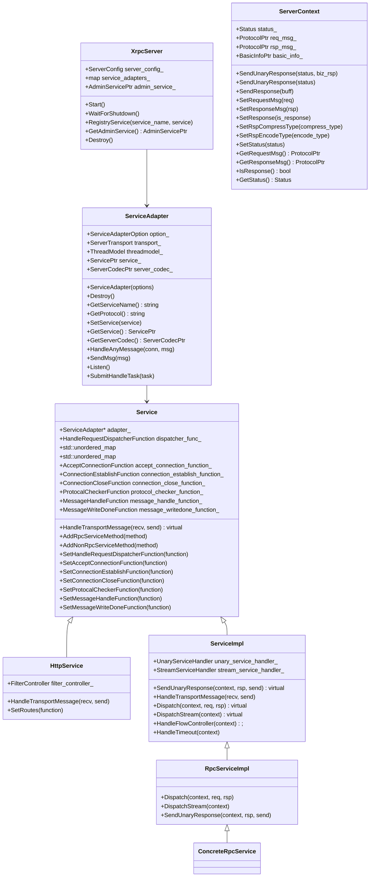

# XRPC Server

<!-- TOC -->

- [XRPC Server](#xrpc-server)
    - [Overview](#overview)
    - [Quick Start](#quick-start)
    - [UML Class Diagram](#uml-class-diagram)
    - [XrpcServer](#xrpcserver)
        - [XrpcServer Initial](#xrpcserver-initial)
    - [ServiceAdapter](#serviceadapter)
        - [HandleAnyMessage](#handleanymessage)
    - [Service](#service)
        - [ServiceImpl](#serviceimpl)
        - [RpcServiceImpl](#rpcserviceimpl)
        - [ConcreteRpcService](#concreterpcservice)
    - [UnaryServiceHandler](#unaryservicehandler)
    - [RpcMethodHandler](#rpcmethodhandler)
    - [ServerContext](#servercontext)
        - [Async Response](#async-response)

<!-- /TOC -->

## Overview

## Quick Start

## UML Class Diagram



## XrpcServer

### XrpcServer Initial

在 Xrpc App 中包含了一个 Xrpc Server，由 Xrpc App 对 Xrpc Server 进行初始化：

```cpp
void XrpcApp::Wait() {
  InitializeRuntime();

  // DestoryRuntime 会组塞
  DestoryRuntime();
}

void XrpcApp::InitializeRuntime() {
  // ...

  // 初始化服务端
  InitXrpcServer();

  // ...

  // server_ 开始监听
  server_->Start();
}

void XrpcApp::InitXrpcServer() {
  server_ = std::make_shared<XrpcServer>(XrpcConfig::GetInstance()->GetServerConfig());
}

void XrpcApp::DestoryRuntime() {
  server_->WaitForShutdown();
  Destory();

  // ...
}
```

## ServiceAdapter

### HandleAnyMessage

ServiceAdapter 提供了默认了对请求数据进行处理的方法，即 HandleAnyMessage，对于大多数 Service 都会使用该方法进行处理，例如 HTTP Service、XRPC Service。

HandleAnyMessage 回调是在 IO 线程触发的，为了不组塞 IO 线程，该函数会构建 task 并提交至 Handle 线程进行处理：

```cpp
bool ServiceAdapter::HandleAnyMessage(const ConnectionPtr& conn, std::deque<std::any>& msg) {
  // msg 是经过 checker_function 进行处理后的输出
  // msg 可能是解码的结构体，也可能是未解码的二进制数据，具体情况需要依赖 server_codec 的实现
  // http server codec 的 checker 会解码 这里拿到的是解码后的 http 结构体
  // rpc server codec 的 checker 不会解码 这里拿到的是底层二进制数据 并在 service HandleTransportMessage 中进行解码
  for (auto it = msg.begin(); it != msg.end(); ++it) {
    STransportReqMsg* req_msg = new STransportReqMsg();
    req_msg->basic_info = object_pool::GetRefCounted<BasicInfo>();
    req_msg->basic_info->connection_id = conn->GetConnId();
    req_msg->basic_info->connection_type = conn->GetConnType();
    req_msg->basic_info->fd = conn->GetFd();
    req_msg->basic_info->begin_timestamp = xrpc::TimeProvider::GetNowMs();
    req_msg->basic_info->addr.ip = conn->GetPeerIp();
    req_msg->basic_info->addr.port = conn->GetPeerPort();
    req_msg->msg = std::move(*it);

    Task* task = new Task;
    task->task_type = TaskType::TRANSPORT_REQUEST;
    task->task = req_msg;
    task->handler = [this](Task* task) {
      STransportReqMsg* req_msg = static_cast<STransportReqMsg*>(task->task);
      STransportRspMsg* send = nullptr;

      // 应用层处理
      this->service_->HandleTransportMessage(req_msg, &send);
      if (send) {
        this->transport_->SendMsg(send);
      }
    };

    // 如果用户配置了回调, 则根据用户回调获取线程id
    HandleRequestDispatcherFunction& dispatcher_ = service_->GetHandleRequestDispatcherFunction();
    if (dispatcher_) {
      task->dst_thread_key = dispatcher_(req_msg);
    }

    task->group_id = threadmodel_->GetThreadModelId();
    threadmodel_->SubmitHandleTask(task);
  }

  return true;
}
```

## Service

Xrpc 的 Service 由 [ServiceAdapter](#serviceadapter) 进行维护：

- 封装了如何处理请求的具体逻辑（但是实际的处理逻辑是交给 完成的）。
- 封装了如何返回上游响应（针对异步响应模式）。

### ServiceImpl

#### HandleTransportMessage

ServiceImpl::HandleTransportMessage 是 RpcService 和 NonRpcService 的统一消息处理入口：

```cpp
void ServiceImpl::HandleTransportMessage(STransportReqMsg* recv, STransportRspMsg** send) {
  // 尝试处理流式数据, 如果不是流式数据, 则走unary逻辑
  if (recv->basic_info->call_type == RpcCallType::BIDI_STREAM_CALL) {
    stream_service_handler_->HandleMessage(recv, std::move(recv->extend_info->metadata));
    return;
  }

  // 默认走unary逻辑
  unary_service_handler_->HandleMessage(recv, send);
}
```

`unary_service_handler_->HandleMessage()` 由 [UnaryServiceHandler](#unaryservicehandler) 进行处理，其中包括了上下文创建、Filter 执行、限流等处理，最重要的是分发请求到对应的 RPC Handler 执行。在 [UnaryServiceHandler](#unaryservicehandler) 中，最终会使用 [RpcServiceImpl](#rpcserviceimpl) 的 Dispatch 函数进行分发请求处理。

#### SendUnaryResponse

ServiceImpl::SendUnaryResponse 是 RpcService 和 NonRpcService 的统一消息（同步）回复函数：

```cpp
void ServiceImpl::SendUnaryResponse(const ServerContextPtr& context, ProtocolPtr& rsp,
                                    STransportRspMsg** send) {
  NoncontiguousBuffer send_data;

  // 将数据序列化为二进制数据
  adapter_->GetServerCodec()->ZeroCopyEncode(context, context->GetResponseMsg(), send_data);

  // 构造响应 Message
  *send = new STransportRspMsg();
  (*send)->basic_info = context->GetTransportBasicInfo();
  (*send)->send_data = std::move(send_data);
}
```

很明显，该函数并非进行实际的 IO 调用，而是构造一个 STransportRspMsg* send 消息体，该消息的实际发送是在 ServiceAdapter 的 HandleAnyMessage 构造的 task 中：

```cpp
bool ServiceAdapter::HandleAnyMessage(const ConnectionPtr& conn, std::deque<std::any>& msg) {
  Task* task = new Task;
  task->handler = [this](Task* task) {
    this->service_->HandleTransportMessage(req_msg, &send);

    // send 数据已经构造，则发送数据
    if (send) {
      this->transport_->SendMsg(send);
    }
  };
  
  threadmodel_->SubmitHandleTask(task);

  return true;
}
```

该函数请参考 [HandleAnyMessage](#handleanymessage)。

### RpcServiceImpl

RpcServiceImpl 是 RpcService 实现类，主要是实现如何将请求分发给对应的 RPC Handler 函数进行处理。

分发通过 Dispatch 进行实现，由 [UnaryServiceHandler](#unaryservicehandler) 调用：

```cpp
void RpcServiceImpl::Dispatch(const ServerContextPtr& context, const ProtocolPtr& req,
                              ProtocolPtr& rsp) {
  // rpc_service_methods 由 RpcServiceImpl 子类初始化时进行 methods 的注册
  const auto& rpc_service_methods = GeXRPCServiceMethod();

  // 根据 function name 找到 RPC Handler
  // name e.g. /xrpc.test.helloworld.Greeter/SayHello
  auto it = rpc_service_methods.find(context->GetFuncName());
  if (it == rpc_service_methods.end()) {
    context->GetStatus().SetFrameworkRetCode(xrpc::codec::ServerRetCode::NOT_FUN_ERROR);
    context->GetStatus().SetErrorMessage("not found");
    return;
  }

  NoncontiguousBuffer response_body;
  RpcMethodHandlerInterface* method_handler = it->second->GeXRPCMethodHandler();
  method_handler->Execute(context, req->GetNonContiguousProtocolBody(), response_body);

  // 同步响应，设置响应 Body
  if (context->IsResponse()) {
    rsp->SetNonContiguousProtocolBody(std::move(response_body));
  }

  return;
}
```

### ConcreteRpcService

ConcreteRpcService 是 RpcServiceImpl 的实现类，通常由 protobuf 编译生成，在该类中会进行 RPC Handler 的注册（通过 `AddRpcServiceMethod`）。

如果存在这样一个 protobuf：

```proto
syntax = "proto3";
  
package xrpc.test.helloworld;
  
service Greeter {
  rpc SayHello (HelloRequest) returns (HelloReply) {}
}

message HelloRequest {
   string req_msg = 1;
}
  
message HelloReply {
   string rsp_msg = 1;
}
```

在 Xrpc 编译后会转换成这样一个 ConcreteRpcService：

```cpp
//
// This file was generated by xrpc_cpp_plugin which is a self-defined pb compiler plugin, do not edit it!!!
// All rights reserved by Tencent Corporation
//

#include "test/helloworld/greeter.xrpc.pb.h"

#include <functional>
#include "xrpc/server/rpc_method_handler.h"
#include "xrpc/server/stream_rpc_method_handler.h"

namespace xrpc {
namespace test {
namespace helloworld {

static const char* Greeter_method_names[] = {
  "/xrpc.test.helloworld.Greeter/SayHello",
};

Greeter::Greeter() {
  auto rpc_func = std::bind(&Greeter::SayHello, this, std::placeholders::_1, std::placeholders::_2, std::placeholders::_3)
  auto rpc_handler = new xrpc::RpcMethodHandler<xrpc::test::helloworld::HelloRequest,
                                                xrpc::test::helloworld::HelloReply>(rpc_func);
  auto method = new xrpc::RpcServiceMethod(Greeter_method_names[0],
                                           xrpc::MethodType::UNARY,
                                           rpc_handler);
  AddRpcServiceMethod(method);
}

Greeter::~Greeter() {}

// 由用户进行重写
xrpc::Status Greeter::SayHello(xrpc::ServerContextPtr context,
                               const xrpc::test::helloworld::HelloRequest* request,
                               xrpc::test::helloworld::HelloReply* response) {
  return xrpc::Status(-1, "");
}
```

最终会由用户继承 ConcreteRpcService 并 overwrite 其中的 RPC Handler，例如：

```cpp
class GreeterServiceImpl final : public xrpc::test::helloworld::Greeter {
 public:
  GreeterServiceImpl();
  ~GreeterServiceImpl();
  xrpc::Status SayHello(xrpc::ServerContextPtr context,
                        const xrpc::test::helloworld::HelloRequest* request,
                        xrpc::test::helloworld::HelloReply* reply) override {
    return xrpc::Status(-1, "");
  }
};
```

## UnaryServiceHandler

进一步封装了如何处理请求消息，包括：

- 生成 Server 上下文
- 执行过滤器
- 流量控制
- 超时判断
- 分发请求到对应的 RPC Handler 函数处理

下面省略对异常的判断：

```cpp
void HandleMessage(STransportReqMsg* recv, STransportRspMsg** send) {
    auto* adapter = service_impl_->GetAdapter();

    // 创建上下文
    ServerContextPtr context = MakeRefCounted<ServerContext>(*recv);
    context->SetAdapter(adapter);

    // 上下文保存解码后的请求对象，实际是智能指针
    context->SetRequestMsg(adapter->GetServerCodec()->CreateRequestObject());
    context->SetResponseMsg(adapter->GetServerCodec()->CreateResponseObject());

    // 协议解码
    adapter->GetServerCodec()->ZeroCopyDecode(context, std::move(recv->msg), context->GetRequestMsg());

    // 设置当前请求真正的超时时间，协议所带的链路超时和所属service的消息超时两者之间的最小值
    context->SetRealTimeout();

    // 接收请求消息埋点，
    filter_controller_.RunMessageServerFilters(FilterPoint::SERVER_POST_RECV_MSG, context);

    // 流量控制
    service_impl_->HandleFlowController(context);

    // 超时判断
    service_impl_->HandleTimeout(context);

    // 请求消息分发处理
    service_impl_->Dispatch(context, context->GetRequestMsg(), context->GetResponseMsg());

    // 回包
    if (context->IsResponse()) {
      service_impl_->SendUnaryResponse(context, context->GetResponseMsg(), send);
    }
  }
```

## RpcMethodHandler

RpcMethodHandler 是对 RPC Handler 执行的代理，主要是针对数据进行序列化、编码、压缩等。可以参考 [ConcreteRpcService](#concreterpcservice)，在注册 RPC Handler 时，会包装一层 RpcMethodHandler。其最核心的部分就是 Execute 方法：

```cpp
void Execute(const ServerContextPtr& context,
             NoncontiguousBuffer&& req_body,
             NoncontiguousBuffer& rsp_body) override {

    // 传给 RPC Handler 进行处理的是栈上的变量，异步 RPC Handler 最好拷贝后再使用
    RequestType req;
    ResponseType rsp;

    // 解压缩
    auto decompress_type = context->GetCompressType();
    compressor::DecompressIfNeeded(decompress_type, req_body);

    // 反序列化
    uint32_t encode_type = context->GetEncodeType();
    ret = Deserialize(encode_type, &req_body, static_cast<void*>(&req));

    // 设置反序列化后的请求数据
    context->SetRequestData(&req);

    // rpc请求处理前的埋点
    filter_controller_.RunMessageServerFilters(FilterPoint::SERVER_PRE_RPC_INVOKE, context);

    auto status = func_(context, &req, &rsp);

    context->SetResponseData(&rsp);

    // 异步回包
    if (!context->IsResponse()) {
      return;
    }

    // rpc请求处理后的埋点
    filter_controller_.RunMessageServerFilters(FilterPoint::SERVER_POST_RPC_INVOKE, context);

    // 序列化
    Serialize(encode_type, static_cast<void*>(&rsp), rsp_body);

    // 压缩
    compressor::CompressIfNeeded(context->GetRspCompressType(), rsp_body,
                                 context->GetRspCompressLevel());
  }
```

## ServerContext

ServerContext 是个关键的类，提供了请求上下文的相关信息，包括：

- 底层信息结构 basic_info
- 支持同步/异步响应
- 设置响应编码方式
- 设置响应压缩方式

### Async Response

异步响应的第一步是需要设置 `is_response` 为 false：

```cpp
context->SetResponse(false);
```

如此，在 RPC Handler 调用结束的时候并不会立即回包，这在 `UnaryServiceHandler::HandleMessage` 进行的判断：

```cpp
void UnaryServiceHandler::HandleMessage(STransportReqMsg* recv, STransportRspMsg** send) {
  // 创建上下文
  ServerContextPtr context = MakeRefCounted<ServerContext>(*recv);

  // 超时、Filter 等等处理

  // 请求消息分发处理
  service_impl_->Dispatch(context, context->GetRequestMsg(), context->GetResponseMsg());

  // false 则不进行回包
  if (context->IsResponse()) {
    service_impl_->SendUnaryResponse(context, context->GetResponseMsg(), send);
  }
}
```

关于 SendunaryResponse 请参考 [SendunaryResponse](#sendunaryresponse)。

至此，可以使用两种方式来进行异步响应发起：

- SendUnaryResponse(status), 对于 RPC Service 只会返回一个 status 信息，对于 HTTP Service 会影响 HTTP Headers：

  ```cpp
  void ServerContext::SendUnaryResponse(const xrpc::Status& status) {
    status_ = status;
  
    // filter埋点控制器
    GetFilterController().RunMessageServerFilters(FilterPoint::SERVER_PRE_SEND_MSG, this);

    NoncontiguousBuffer send_data;

    // 编码
    adapter_->GetServerCodec()->ZeroCopyEncode(this, rsp_msg_, send_data);

    auto* send_msg = new STransportRspMsg();
    send_msg->basic_info = GetTransportBasicInfo();
    send_msg->send_data = std::move(send_data);

    SendTransportMsg(send_msg);
  }
  ```

- SendUnaryResponse(status, rsp)，对于 RPC Service 有效，用于设置响应的 protobuf：

  ```cpp
  // status 为接口调用的结果，biz_rsp 为业务层的数据对象
  template <typename T>
  void SendUnaryResponse(const xrpc::Status& status, const T& biz_rsp) {
    SetResponseData(&biz_rsp);

    // ...

    // protobuf 序列化
    void* rsp = static_cast<void*>(const_cast<T*>(&biz_rsp));
    NoncontiguousBuffer data;
    serialization->Serialize(type, rsp, &data);

    // 数据压缩
    auto compress_type = GetRspCompressType();
    compressor::CompressIfNeeded(compress_type, data, GetRspCompressLevel());

    // 设置响应 body
    rsp_msg_->SetNonContiguousProtocolBody(std::move(data));
    ProcessResponseStatus(true, status);
  }

  void ServerContext::ProcessResponseStatus(bool encode_ret, Status status) {
    GetFilterController().RunMessageServerFilters(FilterPoint::SERVER_POST_RPC_INVOKE, this);

    if (encode_ret) {
      SendUnaryResponse(status);
      return;
    }

    Status encode_status;
    if (adapter_->GetServerCodec() != nullptr) {
      encode_status.SetFrameworkRetCode(
          adapter_->GetServerCodec()->GetProtocolRetCode(xrpc::codec::ServerRetCode::ENCODE_ERROR));
    } else {
      encode_status.SetFrameworkRetCode(XrpcRetCode::XRPC_SERVER_ENCODE_ERR);
    }
    SendUnaryResponse(encode_status);
  }
  ```
