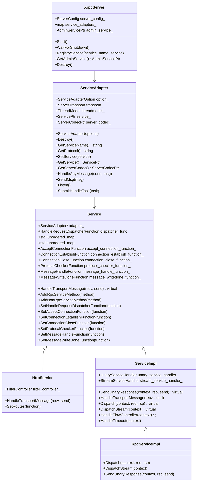

# XRPC Server

<!-- TOC -->

- [XRPC Server](#xrpc-server)
    - [Overview](#overview)
    - [Quick Start](#quick-start)
    - [UML Class Diagram](#uml-class-diagram)
    - [XrpcServer](#xrpcserver)
        - [XrpcServer Initial](#xrpcserver-initial)
    - [ServiceAdapter](#serviceadapter)
        - [HandleAnyMessage](#handleanymessage)

<!-- /TOC -->

## Overview

## Quick Start

## UML Class Diagram



## XrpcServer

### XrpcServer Initial

在 Xrpc App 中包含了一个 Xrpc Server，由 Xrpc App 对 Xrpc Server 进行初始化：

```cpp
void XrpcApp::Wait() {
  InitializeRuntime();

  // DestoryRuntime 会组塞
  DestoryRuntime();
}

void XrpcApp::InitializeRuntime() {
  // ...

  // 初始化服务端
  InitXrpcServer();

  // ...

  // server_ 开始监听
  server_->Start();
}

void XrpcApp::InitXrpcServer() {
  server_ = std::make_shared<XrpcServer>(XrpcConfig::GetInstance()->GetServerConfig());
}

void XrpcApp::DestoryRuntime() {
  server_->WaitForShutdown();
  Destory();

  // ...
}
```

## ServiceAdapter

### HandleAnyMessage

ServiceAdapter 提供了默认了对请求数据进行处理的方法，即 HandleAnyMessage，对于大多数 Service 都会使用该方法进行处理，例如 HTTP Service、XRPC Service。

HandleAnyMessage 回调是在 IO 线程触发的，为了不组塞 IO 线程，该函数会构建 task 并提交至 Handle 线程进行处理：

```cpp
bool ServiceAdapter::HandleAnyMessage(const ConnectionPtr& conn, std::deque<std::any>& msg) {
  for (auto it = msg.begin(); it != msg.end(); ++it) {
    STransportReqMsg* req_msg = new STransportReqMsg();
    req_msg->basic_info = object_pool::GetRefCounted<BasicInfo>();
    req_msg->basic_info->connection_id = conn->GetConnId();
    req_msg->basic_info->connection_type = conn->GetConnType();
    req_msg->basic_info->fd = conn->GetFd();
    req_msg->basic_info->begin_timestamp = xrpc::TimeProvider::GetNowMs();
    req_msg->basic_info->addr.ip = conn->GetPeerIp();
    req_msg->basic_info->addr.port = conn->GetPeerPort();
    req_msg->msg = std::move(*it);

    Task* task = new Task;
    task->task_type = TaskType::TRANSPORT_REQUEST;
    task->task = req_msg;
    task->handler = [this](Task* task) {
      STransportReqMsg* req_msg = static_cast<STransportReqMsg*>(task->task);
      STransportRspMsg* send = nullptr;

      // 应用层处理
      this->service_->HandleTransportMessage(req_msg, &send);
      if (send) {
        this->transport_->SendMsg(send);
      }
    };

    // 如果用户配置了回调, 则根据用户回调获取线程id
    HandleRequestDispatcherFunction& dispatcher_ = service_->GetHandleRequestDispatcherFunction();
    if (dispatcher_) {
      task->dst_thread_key = dispatcher_(req_msg);
    }

    task->group_id = threadmodel_->GetThreadModelId();
    threadmodel_->SubmitHandleTask(task);
  }

  return true;
}
```
