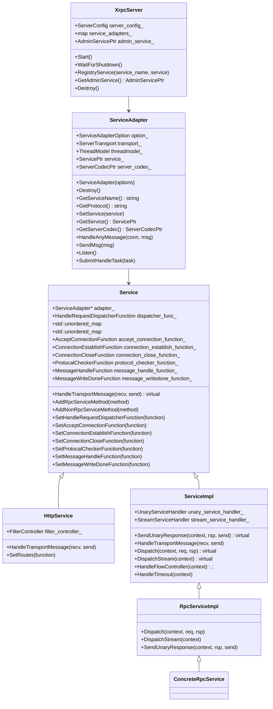

# XRPC Server

<!-- TOC -->

- [XRPC Server](#xrpc-server)
    - [Overview](#overview)
    - [Quick Start](#quick-start)
    - [UML Class Diagram](#uml-class-diagram)
    - [XrpcServer](#xrpcserver)
        - [XrpcServer Initial](#xrpcserver-initial)
    - [ServiceAdapter](#serviceadapter)
        - [HandleAnyMessage](#handleanymessage)
    - [Service](#service)
        - [ServiceImpl](#serviceimpl)
        - [RpcServiceImpl](#rpcserviceimpl)
        - [ConcreteRpcService](#concreterpcservice)
    - [UnaryServiceHandler](#unaryservicehandler)

<!-- /TOC -->

## Overview

## Quick Start

## UML Class Diagram



## XrpcServer

### XrpcServer Initial

在 Xrpc App 中包含了一个 Xrpc Server，由 Xrpc App 对 Xrpc Server 进行初始化：

```cpp
void XrpcApp::Wait() {
  InitializeRuntime();

  // DestoryRuntime 会组塞
  DestoryRuntime();
}

void XrpcApp::InitializeRuntime() {
  // ...

  // 初始化服务端
  InitXrpcServer();

  // ...

  // server_ 开始监听
  server_->Start();
}

void XrpcApp::InitXrpcServer() {
  server_ = std::make_shared<XrpcServer>(XrpcConfig::GetInstance()->GetServerConfig());
}

void XrpcApp::DestoryRuntime() {
  server_->WaitForShutdown();
  Destory();

  // ...
}
```

## ServiceAdapter

### HandleAnyMessage

ServiceAdapter 提供了默认了对请求数据进行处理的方法，即 HandleAnyMessage，对于大多数 Service 都会使用该方法进行处理，例如 HTTP Service、XRPC Service。

HandleAnyMessage 回调是在 IO 线程触发的，为了不组塞 IO 线程，该函数会构建 task 并提交至 Handle 线程进行处理：

```cpp
bool ServiceAdapter::HandleAnyMessage(const ConnectionPtr& conn, std::deque<std::any>& msg) {
  // msg 是经过 checker_function 进行处理后的输出
  // msg 可能是解码的结构体，也可能是未解码的二进制数据，具体情况需要依赖 server_codec 的实现
  // http server codec 的 checker 会解码 这里拿到的是解码后的 http 结构体
  // rpc server codec 的 checker 不会解码 这里拿到的是底层二进制数据 并在 service HandleTransportMessage 中进行解码
  for (auto it = msg.begin(); it != msg.end(); ++it) {
    STransportReqMsg* req_msg = new STransportReqMsg();
    req_msg->basic_info = object_pool::GetRefCounted<BasicInfo>();
    req_msg->basic_info->connection_id = conn->GetConnId();
    req_msg->basic_info->connection_type = conn->GetConnType();
    req_msg->basic_info->fd = conn->GetFd();
    req_msg->basic_info->begin_timestamp = xrpc::TimeProvider::GetNowMs();
    req_msg->basic_info->addr.ip = conn->GetPeerIp();
    req_msg->basic_info->addr.port = conn->GetPeerPort();
    req_msg->msg = std::move(*it);

    Task* task = new Task;
    task->task_type = TaskType::TRANSPORT_REQUEST;
    task->task = req_msg;
    task->handler = [this](Task* task) {
      STransportReqMsg* req_msg = static_cast<STransportReqMsg*>(task->task);
      STransportRspMsg* send = nullptr;

      // 应用层处理
      this->service_->HandleTransportMessage(req_msg, &send);
      if (send) {
        this->transport_->SendMsg(send);
      }
    };

    // 如果用户配置了回调, 则根据用户回调获取线程id
    HandleRequestDispatcherFunction& dispatcher_ = service_->GetHandleRequestDispatcherFunction();
    if (dispatcher_) {
      task->dst_thread_key = dispatcher_(req_msg);
    }

    task->group_id = threadmodel_->GetThreadModelId();
    threadmodel_->SubmitHandleTask(task);
  }

  return true;
}
```

## Service

Xrpc 的 Service 由 [ServiceAdapter](#serviceadapter) 进行维护：

- 封装了如何处理请求的具体逻辑（但是实际的处理逻辑是交给 完成的）。
- 封装了如何返回上游响应（针对异步响应模式）。

### ServiceImpl

```cpp
void ServiceImpl::HandleTransportMessage(STransportReqMsg* recv, STransportRspMsg** send) {
  // 尝试处理流式数据, 如果不是流式数据, 则走unary逻辑
  if (recv->basic_info->call_type == RpcCallType::BIDI_STREAM_CALL) {
    stream_service_handler_->HandleMessage(recv, std::move(recv->extend_info->metadata));
    return;
  }

  // 默认走unary逻辑
  unary_service_handler_->HandleMessage(recv, send);
}
```

`unary_service_handler_->HandleMessage()` 由 [UnaryServiceHandler](#unaryservicehandler) 进行处理，其中包括了上下文创建、Filter 执行、限流等处理，最重要的是分发请求到对应的 RPC Handler 执行。在 [UnaryServiceHandler](#unaryservicehandler) 中，最终会使用 [RpcServiceImpl](#rpcserviceimpl) 的 Dispatch 函数进行分发请求处理。

### RpcServiceImpl

RpcServiceImpl 是 RpcService 实现类，主要是实现如何将请求分发给对应的 RPC Handler 函数进行处理。

分发通过 Dispatch 进行实现，由 [UnaryServiceHandler](#unaryservicehandler) 调用：

```cpp
void RpcServiceImpl::Dispatch(const ServerContextPtr& context, const ProtocolPtr& req,
                              ProtocolPtr& rsp) {
  // rpc_service_methods 由 RpcServiceImpl 子类初始化时进行 methods 的注册
  const auto& rpc_service_methods = GetRpcServiceMethod();

  // 根据 function name 找到 RPC Handler
  // name e.g. /xrpc.test.helloworld.Greeter/SayHello
  auto it = rpc_service_methods.find(context->GetFuncName());
  if (it == rpc_service_methods.end()) {
    context->GetStatus().SetFrameworkRetCode(xrpc::codec::ServerRetCode::NOT_FUN_ERROR);
    context->GetStatus().SetErrorMessage("not found");
    return;
  }

  NoncontiguousBuffer response_body;
  RpcMethodHandlerInterface* method_handler = it->second->GetRpcMethodHandler();
  method_handler->Execute(context, req->GetNonContiguousProtocolBody(), response_body);

  // 同步响应，设置响应 Body
  if (context->IsResponse()) {
    rsp->SetNonContiguousProtocolBody(std::move(response_body));
  }

  return;
}
```

### ConcreteRpcService

ConcreteRpcService 是 RpcServiceImpl 的实现类，通常由 protobuf 编译生成，在该类中会进行 RPC Handler 的注册（通过 `AddRpcServiceMethod`）。

如果存在这样一个 protobuf：

```proto
syntax = "proto3";
  
package xrpc.test.helloworld;
  
service Greeter {
  rpc SayHello (HelloRequest) returns (HelloReply) {}
}

message HelloRequest {
   string req_msg = 1;
}
  
message HelloReply {
   string rsp_msg = 1;
}
```

在 Xrpc 编译后会转换成这样一个 ConcreteRpcService：

```cpp
//
// This file was generated by xrpc_cpp_plugin which is a self-defined pb compiler plugin, do not edit it!!!
// All rights reserved by Tencent Corporation
//

#include "test/helloworld/greeter.xrpc.pb.h"

#include <functional>
#include "xrpc/server/rpc_method_handler.h"
#include "xrpc/server/stream_rpc_method_handler.h"

namespace xrpc {
namespace test {
namespace helloworld {

static const char* Greeter_method_names[] = {
  "/xrpc.test.helloworld.Greeter/SayHello",
};

Greeter::Greeter() {
  auto rpc_func = std::bind(&Greeter::SayHello, this, std::placeholders::_1, std::placeholders::_2, std::placeholders::_3)
  auto rpc_handler = new xrpc::RpcMethodHandler<xrpc::test::helloworld::HelloRequest, xrpc::test::helloworld::HelloReply>(rpc_func);
  auto method = new xrpc::RpcServiceMethod(Greeter_method_names[0],
                                           xrpc::MethodType::UNARY,
                                           rpc_handler);
  AddRpcServiceMethod(method);
}

Greeter::~Greeter() {}

// 由用户进行重写
xrpc::Status Greeter::SayHello(xrpc::ServerContextPtr context,
                               const xrpc::test::helloworld::HelloRequest* request,
                               xrpc::test::helloworld::HelloReply* response) {
  return xrpc::Status(-1, "");
}
```

最终会由用户继承 ConcreteRpcService 并 overwrite 其中的 RPC Handler，例如：

```cpp
class GreeterServiceImpl final : public xrpc::test::helloworld::Greeter {
 public:
  GreeterServiceImpl();
  ~GreeterServiceImpl();
  xrpc::Status SayHello(xrpc::ServerContextPtr context,
                        const xrpc::test::helloworld::HelloRequest* request,
                        xrpc::test::helloworld::HelloReply* reply) override {
    return xrpc::Status(-1, "");
  }
};
```

## UnaryServiceHandler

进一步封装了如何处理请求消息，包括：

- 生成 Server 上下文
- 执行过滤器
- 流量控制
- 超时判断
- 分发请求到对应的 RPC Handler 函数处理

下面省略对异常的判断：

```cpp
void HandleMessage(STransportReqMsg* recv, STransportRspMsg** send) {
    auto* adapter = service_impl_->GetAdapter();

    // 创建上下文
    ServerContextPtr context = MakeRefCounted<ServerContext>(*recv);
    context->SetAdapter(adapter);

    // 上下文保存解码后的请求对象，实际是智能指针
    context->SetRequestMsg(adapter->GetServerCodec()->CreateRequestObject());
    context->SetResponseMsg(adapter->GetServerCodec()->CreateResponseObject());

    // 协议解码
    adapter->GetServerCodec()->ZeroCopyDecode(context, std::move(recv->msg), context->GetRequestMsg());

    // 设置当前请求真正的超时时间，协议所带的链路超时和所属service的消息超时两者之间的最小值
    context->SetRealTimeout();

    // 接收请求消息埋点，
    filter_controller_.RunMessageServerFilters(FilterPoint::SERVER_POST_RECV_MSG, context);

    // 流量控制
    service_impl_->HandleFlowController(context);

    // 超时判断
    service_impl_->HandleTimeout(context);

    // 请求消息分发处理
    service_impl_->Dispatch(context, context->GetRequestMsg(), context->GetResponseMsg());

    // 回包
    if (context->IsResponse()) {
      service_impl_->SendUnaryResponse(context, context->GetResponseMsg(), send);
    }
  }
```
