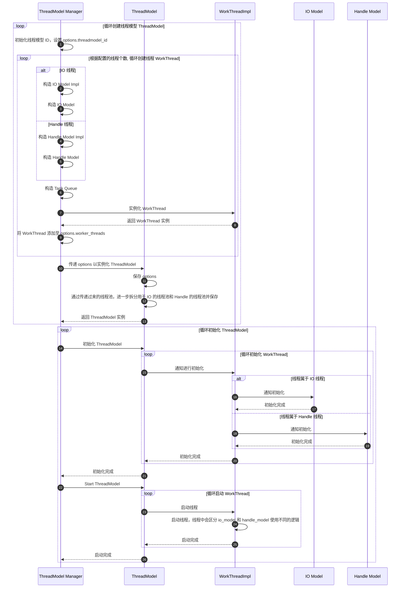
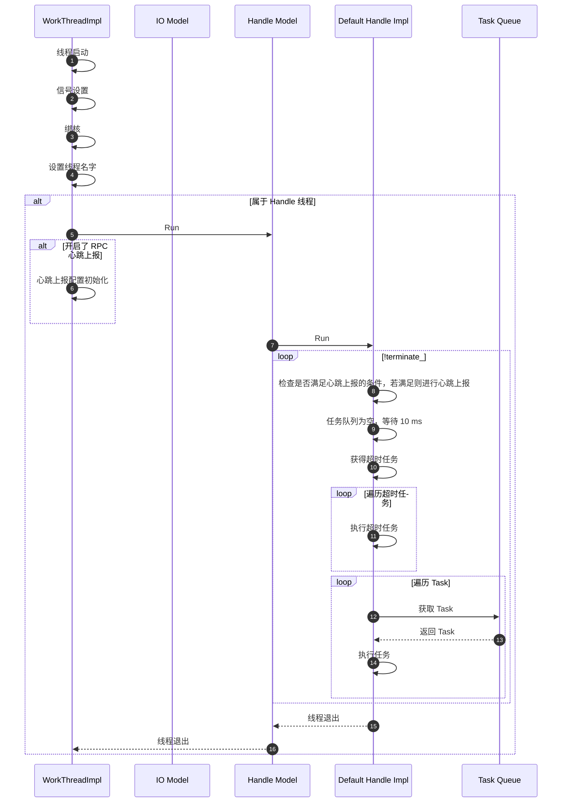
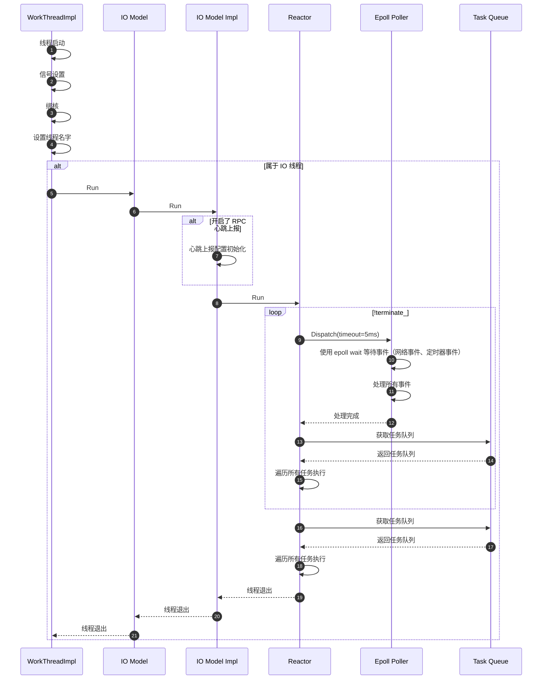
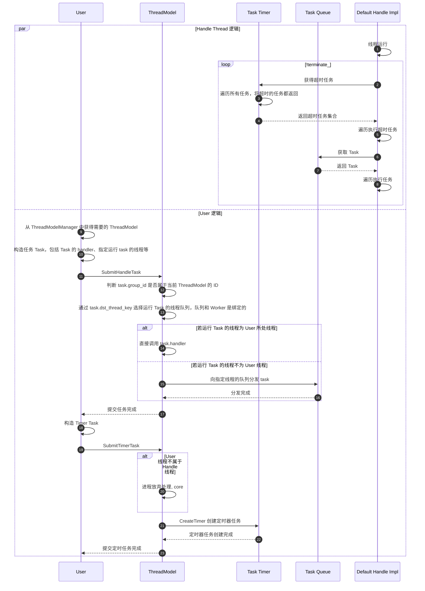
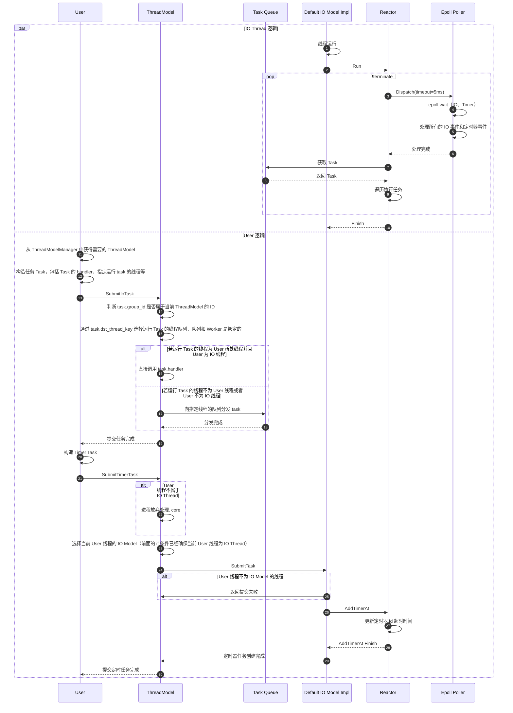
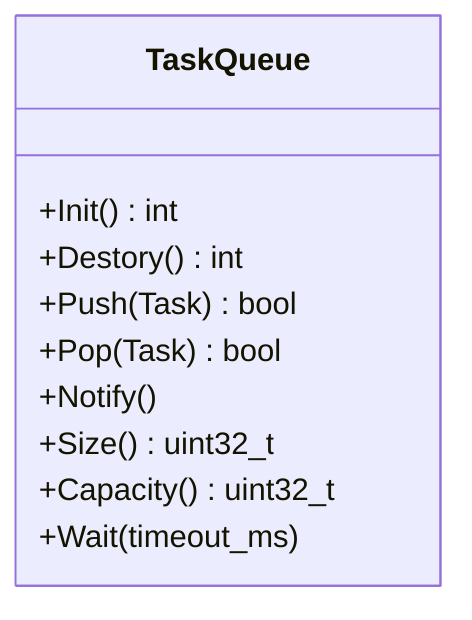

# Xrpc Thread Model

<!-- TOC -->

- [Xrpc Thread Model](#xrpc-thread-model)
    - [Overview](#overview)
    - [Quick Start](#quick-start)
    - [UML Class Diagram](#uml-class-diagram)
    - [Sequence Diagram](#sequence-diagram)
        - [Initial Sequence Diagram](#initial-sequence-diagram)
        - [Handle Thread Run Sequence Diagram](#handle-thread-run-sequence-diagram)
        - [IO Thread Run Sequence Diagram](#io-thread-run-sequence-diagram)
        - [Handle Thread Task Sequence Diagram](#handle-thread-task-sequence-diagram)
        - [IO Thread Task Sequence Diagram](#io-thread-task-sequence-diagram)
    - [Thread Model Initial](#thread-model-initial)
        - [Server Initial](#server-initial)
        - [Client Initial](#client-initial)
    - [Task](#task)
        - [Task Queue](#task-queue)
    - [Timer Task](#timer-task)
        - [Handle Thread Timer](#handle-thread-timer)
        - [IO Thread Timer](#io-thread-timer)
    - [ThreadModelManager](#threadmodelmanager)
        - [Defualt Thread Model](#defualt-thread-model)
    - [ThreadModel](#threadmodel)
    - [WorkThread](#workthread)
    - [Options](#options)
        - [ThreadModel::Options](#threadmodeloptions)
        - [WorkerThreadImpl::Options](#workerthreadimploptions)
        - [DefaultIoModelImpl::Options](#defaultiomodelimploptions)
        - [HandleModel::Options](#handlemodeloptions)

<!-- /TOC -->

## Overview

XRPC 框架支持的线程模型是很多的，但是由于种种原因，这里仅分析了 XRPC 的异步线程模型。

一个 XRPC 应用中可以使用多个不同类型的线程模型，每个类型的线程模型又可以初始化多个实例，但通常而言，我们只需要确定使用的线程模型类型，以及一个对应的线程模型实例即可。

线程模型的类型有三种：

- default，异步回调的线程模型，可以结合 [future](future.md) 使用。
- fiber，协程模型，本文不会提及。
- spp，另一种协程模型，本文不会提及。

defualt 线程模型又分为两种处理方式：

- seperate，IO 线程和 Handle 线程分离，IO 线程处理网络事件，Handle 线程处理具体的业务。
- merge，IO 线程和 Handle 线程合并，每个线程都能处理网络事件和业务的线程。

## Quick Start

Default 线程模型本质上就是一个线程池，通过一个提交 Task 至线程模型的 Demo，可以直观的了解到 XRPC 线程池交互方式。

线程模型配置：

```yaml
global:
  threadmodel:
    default:
      - instance_name: default_instance
        io_handle_type: seperate
        io_thread_num: 8
        handle_thread_num: 10
```

提交一个 Task 到线程模型中运行：

```c++
// 通过线程模型的类型和名称获得线程模型
// xrpc::ThreadModelType threadmodel_type = xrpc::ThreadModelType::DEFAULT;
// std::string threadmodel_instance_name = "default_instance";
// auto thread_model = ThreadModelManager::GetInstance()->GetThreadModel(threadmodel_type, threadmodel_instance_name);
auto thread_model = xrpc::ThreadModelManager::GetInstance()->GetDefaultThreadModel();

// 构建一个任务
xrpc::Task* task = new xrpc::Task();
task->group_id = thread_model->GetThreadModelId();      // 线程模型 ID
task->task_type = TaskType::TRANSPORT_REQUEST;          // 任务的类型
task->dst_thread_key = -1;
task->handler = [](Task* task) mutable {
    std::cout << "hello world" << std::endl;
};

xrpc::TaskResult result = thread_model->SubmitHandleTask(task);
```

提交一个 Period Timer Task 到线程模型中运行：

```c++
auto thread_model = xrpc::ThreadModelManager::GetInstance()->GetDefaultThreadModel();
xrpc::TimerTaskInfo* timer_task_info = new xrpc::TimerTaskInfo();
timer_task_info->cancel = false;
timer_task_info->expiration = xrpc::TimeProvider::GetNowMs() + 1000;
timer_task_info->interval = 5000;     // ms
timer_task_info->executor = [=]() {
    auto tid = std::this_thread::get_id();
    std::cout << "tid:" << tid << std::endl;
};

xrpc::Task* timer_task = new xrpc::Task;
timer_task->group_id = thread_model->GetThreadModelId();
timer_task->task_type = xrpc::TaskType::TIMER;
timer_task->task = reinterpret_cast<void*>(timer_task_info);
timer_task->handler = nullptr;
thread_model->SubmitTimerTask(timer_task);
```

若提交 Timer Task 的线程并非 ThreadModel 的线程，则需要包装一个在 ThreadModel 中运行的 Task，再在该 Task 中提交 Timer Task，如下所示：

```c++
auto thread_model = xrpc::ThreadModelManager::GetInstance()->GetDefaultThreadModel();
xrpc::Task* task = new xrpc::Task;
task->group_id = thread_model->GetThreadModelId();
task->task_type = xrpc::TaskType::TRANSPORT_REQUEST;
task->handler = [=](xrpc::Task* task) {
    xrpc::TimerTaskInfo* timer_task_info = new xrpc::TimerTaskInfo();
    timer_task_info->cancel = false;
    timer_task_info->expiration = xrpc::TimeProvider::GetNowMs() + 1000;
    timer_task_info->interval = 5000;     // ms
    timer_task_info->executor = [=]() {
        auto tid = std::this_thread::get_id();
        std::cout << "tid:" << tid << std::endl;
    };

    xrpc::Task* timer_task = new xrpc::Task;
    timer_task->group_id = thread_model->GetThreadModelId();
    timer_task->task_type = xrpc::TaskType::TIMER;
    timer_task->task = reinterpret_cast<void*>(timer_task_info);
    timer_task->handler = nullptr;
    thread_model->SubmitTimerTask(timer_task);
};

// 用 Thread Model Task 包装 Timer Task
// 这是因为 xrpc 框架要求提交 Timer Task 的线程必须属于 XRPC Thread Model 的线程
thread_model->SubmitHandleTask(task);
```

通过为 xrpc 配置多个 ThreadModel 实例，可以初始化多个线程池，这样可以将任务运行的线程池进行分离，例如下述 yaml 文件提供了 `default_instance` 和 `test` 两个 ThreadModel 实例。

```yaml
global:
  threadmodel:
    default:
      - instance_name: default_instance
        io_handle_type: seperate
        io_thread_num: 8
        handle_thread_num: 10
      - instance_name: test
        io_handle_type: seperate
        io_thread_num: 0
        handle_thread_num: 1
```

可以在业务代码中获得指定实例的 ThreadModel，并提交 Task：

```cpp
xrpc::ThreadModelType threadmodel_type = xrpc::ThreadModelType::DEFAULT;
std::string threadmodel_instance_name = "test";
auto thread_model = ThreadModelManager::GetInstance()->GetThreadModel(threadmodel_type, threadmodel_instance_name);

// 构建一个任务
xrpc::Task* task = new xrpc::Task();
task->group_id = thread_model->GetThreadModelId();      // 线程模型 ID
task->task_type = TaskType::TRANSPORT_REQUEST;          // 任务的类型
task->dst_thread_key = -1;
task->handler = [](Task* task) mutable {
    std::cout << "hello world" << std::endl;
};

xrpc::TaskResult result = thread_model->SubmitHandleTask(task);
```

## UML Class Diagram

线程模型中涉及到的对象是非常多的，XRPC 对线程模型进行了层层抽象与封装。

XRPC Thread Model 涉及到如下对象：

- ThreadModelManger，线程模型管理，根据配置可以初始化多个 ThreadModel 实例
- ThreadModel，线程模型，本质上就是线程池，管理了多个 WorkThread
- WorkerThread，线程抽象累
  - WorkerThreadImpl，线程实现，负责线程的启动
  - WorkerThreadImplOptions，线程配置，管理 IoModel 和 HandleModel
- HandleModel，IO 模型
  - HandleModelOptions，Handle 线程配置，管理 Handle 对象
  - Handle，Handle 线程逻辑抽象
  - DefaultSeperateHandleImpl，Handle 线程逻辑实现
- IoModel，IO 模型
  - IoModelOptions，IO 线程配置，管理 IoModelImplBase 对象
  - IoModelImplBase，IO 线程逻辑抽象
  - DefaultIoModelImpl，IO 线程逻辑实现

```mermaid
classDiagram

    ThreadModelManger "1" --> "1..*" ThreadModel
    ThreadModel "1" --> "1..*" WorkerThread
    WorkerThread <|-- WorkerThreadImpl
    WorkerThreadImpl --> WorkerThreadImplOptions

    WorkerThreadImplOptions --> HandleModel
    WorkerThreadImplOptions --> IoModel

    HandleModel --> HandleModelOptions
    HandleModelOptions --> Handle
    Handle <|-- DefaultSeperateHandleImpl

    IoModel --> IoModelOptions
    IoModelOptions --> IoModelImplBase
    IoModelImplBase <|-- DefaultIoModelImpl
    DefaultIoModelImpl --> DefaultIoModelImplOptions
    DefaultIoModelImplOptions --> ReactorImpl


    class ThreadModelManger {
        +std::map<std::string, ThreadModel> threadmodel_instances_
        +ThreadModel default_threadmodel_instance_
        +GetDefaultThreadModel() ThreadModel
        +GetThreadModel(type, instance_name) ThreadModel
    }

    class ThreadModel {
        +std::vector<WorkerThread> io_threads_
        +std::vector<WorkerThread> handle_threads_
        +Start()
        +Stop()
        +Join()
        +Destory() int
        +SubmitIoTask(ask) TaskResult
        +SubmitHandleTask(task) TaskResult
        +SubmitTimerTask(task) TaskResult
    }

    class WorkerThread {
        +Start()
        +Stop()
        +Join()
        +Destory()
        +GetIoModel() IoModel
        +GetHandleModel() HandleModel
    }

    class WorkerThreadImpl {
        +WorkerThreadImplOptions options_
        +Start()
        +Stop()
        +Join()
        +Destory()
        +GetIoModel() IoModel
        +GetHandleModel() HandleModel
    }

    class WorkerThreadImplOptions {
        +Role role
        +IoModel io_model
        +HandleModel handle_model
    }

    class HandleModel {
        +HandleModelOptions options_
        +TaskQueue task_queue_
        +HeartbeatStat heartbeat_stat_
        +Run()
        +Stop()
        +Join()
        +Destory() int
        +CreateTimer(task) int
        +CancelTimer(timer_id) int
        +SubmitTask(task) TaskResult
    }

    class HandleModelOptions {
        +string instance_name
        +Handle handle
    }

    class Handle {
        +Run()
        +Stop()
        +Join()
        +Destory() int
        +HeartBeat()
        +CreateTimer(task) int
        +CancelTimer(timer_id) int
        +SubmitTask(task) TaskResult
    }

    class DefaultSeperateHandleImpl {
        +Run()
        +Stop()
        +Join()
        +Destory() int
        +HeartBeat()
        +CreateTimer(task) int
        +CancelTimer(timer_id) int
        +SubmitTask(task) TaskResult
    }

    class IoModel {
        +IoModelOptions options_
        +Run()
        +Stop()
        +Join()
        +Destory() int
        +SubmitTask(task) TaskResult
    }

    class IoModelOptions {
        +IoModelImplBase io_model_impl
    }

    class IoModelImplBase {
        +Run()
        +Stop()
        +Join()
        +Destory() int
        +SubmitTask(task) TaskResult
    }

    class DefaultIoModelImpl {
        +string instance_name
        +Reactor reactor
        +HeartbeatStat heartbeat_stat_
        +TaskQueue task_queue_
        +Run()
        +Stop()
        +Join()
        +Destory() int
        +SubmitTask(task) TaskResult
    }

    class DefaultIoModelImplOptions {
        +string instance_name
        +Reactor reactor
    }

    class ReactorImpl {
        +std::vector<Task> tasks_
        +TimerQueue timer_queue_
        +EventHandlerManager event_handler_manager_
        +AddTimerAt(expiration, interval, executor) uint32_t
        +AddTimerAfter(expiration, interval, executor) uint32_t
        +CancelTimer(timer_id)
        +SubmitTask(Task&& task)
        +Initialize() int
        +Run()
        +Stop()
        +Join()
        +Destory() int
        +GenEventHandlerId() uint64_t
        +AddEventHandler(EventHandler event_handler)
        +ModEventHandler(EventHandler event_handler)
        +DelEventHandler(EventHandler event_handler)
    }
```



**注意：**

- IoModel 没有 CreateTimer 方法，是因为其通过 SubmitTask 实现了提交定时器任务（在 Task 中配置定时器信息）。
- 上述仅列出了类中重要和常用的遍历和方法，并非是全部。
- IoModel 依赖了 Reactor，这部分会在 [Network Model](../xrpc-network-model/readme.md) 中详细描述。
- 每个 Thread 都有个独立的任务队列。
- ReactorImpl 有自己的任务队列，可以直接给 Reactor 提交 Task，而不经由 IoModel。

## Sequence Diagram

这里会展示 ThreadModel 相关的初始化、交互时序图。

### Initial Sequence Diagram

这里展示了 ThreadModelManager 如何对 ThreadModel 及相关对象初始化的流程：



在 WorkThreadImpl 中实现了线程的启动，对于 IO 类型的线程和 Handle 类型的线程处理方式是不同的：

```cpp
void WorkerThreadImpl::Run() {
  // 信号处理注册 ...

  // 核绑定 ...

  // 替换线程的名字 ...

  if (options_.role == WorkerThread::Role::IO ||
      options_.role == WorkerThread::Role::IO_HANDLE) {
    options_.io_model->Run();
  } else {
    options_.handle_model->Run();
  }
}
```

### Handle Thread Run Sequence Diagram

Handle 线程是 Seperate 模式的工作线程，主要是：

- 心跳上报（若配置开启）
- 处理任务



### IO Thread Run Sequence Diagram

IO 线程存在于 Seperate 和 Merge 两种工作模式中，其运行时序图如下所示：



### Handle Thread Task Sequence Diagram

这里显示 Handle Thread 处理任务以及定时器任务的时序图。

为了简化时序图的复杂度，这里我省略掉了一些代理对象，心跳逻辑，仅展示核心流程。



User 通过和 ThreadModel 交互可以将 Task 交给 Handle Impl，那 User 如何获取 ThreadModel 呢？使用 `GetThreadModel` 或 `GetDefaultThreadModel` 即可：

```cpp
auto thread_model = ThreadModelManager::GetInstance()->GetThreadModel("default", "default_instance");
// 等价于
auto thread_model = ThreadModelManager::GetInstance()->GetDefaultThreadModel();
```

细节请参考 [ThreadModelManager](#threadmodelmanager)。

### IO Thread Task Sequence Diagram

IO 线程处理方式和 Handle 处理方式的差别是巨大的，原因是：

- IO Thread 除了处理普通 Task 外，还需要处理网络相关的任务
- IO Thread 需要处理网络事件
- IO Thread 的 Timer Task 使用 Epoll + Timer FD 的方式实现（Handle Thread 的 Timer Task 使用定期检查的方式实现）

对于 IO 线程的网络事件处理更详细的内容，请参考 [Network Model](../xrpc-network-model/readme.md)。



## Thread Model Initial

从上面时序图我们已经可以看到线程模型整个流程，那么线程模型是什么时候初始化的，进而推动 XRPC 线程运作的呢？

虽然 XRPC Server 和 XRPC Client 的 Thread Model 初始化触发方式是不一样的，但是其本质都是一致的：通过 XRPC Plugin 进行初始化。

```cpp
int XrpcPlugin::RegistryPlugins() {

  InitCompress_();

  InitSerialization_();

  // ===========================================================
  // ================= INITIAL Thread Model ====================
  // ===========================================================
  InitThreadModel_();

  InitCodec_();

  InitNaming_();

  InitConfig_();

  InitMetrics_();

  InitLogging_();

  InitSsl_();

  InitAuth_();

  InitFilters_();

  InitStreamHandler_();

  return 0;
}

int XrpcPlugin::InitThreadModel_() {
  // ===========================================================
  // ================= INITIAL Thread Model ====================
  // ===========================================================
  int ret = ThreadModelManager::GetInstance()->Init();

  assert(ret == 0);

  return 0;
}
```

但是 XRPC Server 和 Client 触发 Plugin 的 RegisterPlugins 方法的时机是不一样的。

### Server Initial

XRPC Server 在 Server 的启动时就会自动调用 RegisterPlugins。

```cpp
int main() {
  // app is XrpcApp
  app.Main(argc, argv);
  app.Wait();
}

void XrpcApp::Wait() {
  InitializeRuntime();

  // blocking in this function
  DestoryRuntime();

  DestoryFrameworkRuntime();
  TimeProvider::Destory();
}

void XrpcApp::InitializeRuntime() {
  // ...
  InitPlugins();
  // ...

  server_->Start();
}

void XrpcApp::InitPlugins() { XrpcPlugin::GetInstance()->RegistryPlugins(); }
```

### Client Initial

XRPC Client 分两种情况讨论：

- 在 XRPC Server 中，因为 XRPC Server 初始化时已经初始化 Thread Model 了，所以这种情况下不用额外再作任何初始化。
- 纯 XRPC Client，需要手动触发。

```cpp
int main(int argc, char *argv[]) {
  // 初始化配置文件，文件内容可以为空
  xrpc::XrpcConfig::GetInstance()->Init("test_client.yaml");

  // =====================================================
  // 初始化 ThreadModel 插件，这里会触发 ThreadModel 的初始化
  // =====================================================
  xrpc::XrpcPlugin::GetInstance()->InitThreadModel();

  // do something

  //  注销插件
  xrpc::XrpcPlugin::GetInstance()->DestroyThreadModel();
}
```

## Task

线程池使用任务进行驱动，这里是对任务的定义：

```cpp
// 任务类型
using TaskHandler = std::function<void(Task*)>;

enum class TaskType {
  FINISH,                       // 结束任务，这是一个特殊的任务，用于通知线程池结束
  TRANSPORT_REQUEST,            // 网络请求任务
  TRANSPORT_RESPONSE,           // 网络响应任务
  TIMER,                        // 定时器任务
};

struct Task {
  TaskType task_type;           // 任务类型

  void* task;                   // 和 Task 绑定的上下文指针，便于 Task 执行时获取上下文信息

  TaskHandler handler;          // Task 的执行 Handler, TaskHandler = std::function<void(Task*)>;

  int group_id;                 // 线程模型 ID

  int dst_thread_key = -1;      // 分发 Task 到哪个线程中运行，这个是线程的索引（并非线程 ID），-1 则随机分发。
};
```

构造一个 Task：

```cpp
xrpc::Task* task = new xrpc::Task();
task->group_id = thread_model->GetThreadModelId();      // 线程模型 ID
task->task_type = TaskType::TRANSPORT_REQUEST;          // 任务的类型
task->dst_thread_key = -1;                              // 随机选择一个 Worker 执行 Task
task->handler = [](Task* task) mutable {
    std::cout << "hello world" << std::endl;
};
```

Task.dst_thread_key 指定了执行 Task 的线程，其取值并非为线程 ID，而是在 ThreadModel 中的线程数组索引（IO 和 Handle 的线程数组是独立的，索引也是独立的），取值为 -1 时会通过轮询的方式投递 Task 到线程。

若希望始终线程 1 执行 Task：

```cpp
xrpc::Task* task = new xrpc::Task();
task->group_id = thread_model->GetThreadModelId();      // 线程模型 ID
task->task_type = TaskType::TRANSPORT_REQUEST;          // 任务的类型
task->dst_thread_key = 0;
```

若期 Task 由当前线程自己运行，则可以通过如下设置：

```cpp
xrpc::Task* task = new xrpc::Task();
task->group_id = thread_model->GetThreadModelId();      // 线程模型 ID
task->task_type = TaskType::TRANSPORT_REQUEST;          // 任务的类型
task->dst_thread_key = WorkerThread::GetCurrentWorkerThread()->Id() & 0xFFFF;
```

可以看到这里 `Id() & 0xFFFF`，这是因为 `GetCurrentWorkerThread()->Id()` 高 16 bit 为 ThreadModel ID，低 16 bit 才是线程在 ThreadModel 的索引，我们这里应该使用低 16 bit，具体请参考 [WorkThread](#workthread)。

### Task Queue

提交一个 Task 给线程执行，本质上是提交给 Task Queue 进行缓存，线程会在空闲的时候从 Task Queue 中获取 Task 运行。

每个线程都有自己的一个 Task Queue，因此当给特定的 Task Queue 投递 Task 时，实际上就指定了运行该 Task 的线程：

```txt
                                     +------------+               +---------------+
                         +-------->  | Task Queue | <--- Pull --- | Worker Thread |
                         |           +------------+               +---------------+
                         |
+----------+             |           +------------+               +---------------+
|   User   | --- Submit -+-------->  | Task Queue | <--- Pull --- | Worker Thread |
+----------+             |           +------------+               +---------------+
                         |
                         |           +------------+               +---------------+
                         +---------> | Task Queue | <--- Pull --- | Worker Thread |
                                     +------------+               +---------------+
```

Task Queue 提供的接口如下：



IO Thread 和 Handle Thread 使用的 Task Queue 实例是不一样的：

- Handle Thread 使用 DefaultNotifierTaskQueue
- IO Thread 使用 EventFdNotifierTaskQueue

对于 DefaultNotifierTaskQueue 而言，提供了以下能力：

- 提供了无锁队列 LockFreeQueue。
- 提供了所有 Handle 线程共享的一个 Task Queue 即 share_task_queue，在 `task.dst_thread_key < 0` 时，task 会被投递到 share_task_queue。
- 提供了 ThreadLockNotifier，运行线程任务时 Wait 挂起，也可以在 Push 新 Task 时去唤醒线程。

对于 EventFdNotifierTaskQueue 而言，提供以下能力：

- 提供了无锁队列 LockFreeQueue。
- 提供 EventFdNotifier，可以将 epoll wait 的等待唤醒（原理是 epoll 挂载一个并非用于网络事件的 fd，通过给该 fd 写数据进行唤醒）。

  ```cpp
  void EventFdNotifier::WakeUp() {
    uint64_t value = 1;

    ssize_t n = write(fd_, &value, sizeof(value));

    assert(n == sizeof(n));
  }
  ```

- 在 TaskQueue 唤醒时自动对 Task 进行处理。

  ```cpp
  EventFdNotifierTaskQueue::EventFdNotifierTaskQueue(const Options& options)
        : options_(options) {
    int ret = task_queue_.Init(options_.queue_size);
    assert(ret == LockFreeQueue<Task*>::RT_OK);

    Reactor* reactor = options_.io_model->GetReactor();
    Notifier::Options notifier_options;
    notifier_options.event_handler_id = reactor->GenEventHandlerId();
    notifier_options.reactor = reactor;
    // 唤醒时进行处理
    notifier_options.wakeup_function = [this]() {
      Task *task = nullptr;

      while (this->Pop(&task)) {
      if (task->task_type != TaskType::FINISH) {
        task->handler(task);
      }
      delete task;
      task = nullptr;
      }
    };

    notifier_ = new EventFdNotifier(notifier_options);
  }
  ```

## Timer Task

对一个 Task 添加了 Timer 信息后，该 Task 便成为了 Timer Task，可以提交给 ThreadModel 并在特定的时间执行。

Timer Task 的信息如下：

```cpp
struct TimerTaskInfo {
  // 是否取消
  bool cancel = false;

  // 毫秒
  uint64_t expiration;

  // 重复执行间隔，为0不重复执行
  uint64_t interval;

  // 定时任务执行体
  TimerExecutor executor;

  // timer id, 取消定时任务时使用
  uint32_t timer_id;
};
```

当 TimerTaskInfo 放到 task->task ，并且设置 task->task_type 为 `xrpc::TaskType::TIMER` 时，task 便成为了 Timer Task，这是一个创建 Timer Task 的示例：

```cpp
xrpc::TimerTaskInfo* timer_task_info = new xrpc::TimerTaskInfo();
timer_task_info->cancel = false;
timer_task_info->expiration = xrpc::TimeProvider::GetNowMs() + 1000;
timer_task_info->interval = 5000;     // ms
timer_task_info->executor = [=]() {
    auto tid = std::this_thread::get_id();
    std::cout << "tid:" << tid << std::endl;
};

xrpc::Task* timer_task = new xrpc::Task;
timer_task->group_id = thread_model->GetThreadModelId();
timer_task->task_type = xrpc::TaskType::TIMER;
timer_task->task = reinterpret_cast<void*>(timer_task_info);
timer_task->handler = nullptr;      // task->handler 可以忽略，实际的执行逻辑在 timer_task->task->executor 中
```

IO Thread 和 Handle Thread 实现 Timer 的差别是较大的：

- 对于 Handle Thread，提供 TaskTimer 以处理定时任务。
- 对于 IO Thread，提供 TimerQueue 以处理定时任务。

他们最大的区别在于提交给 Thread 的接口以及超时检测机制：

- 接口不统一可能是因为历史遗留所致。
- 超时检测机制，在 Handle Thread 中为轮询，在 IO Thread 为 epoll。

### Handle Thread Timer

Handle Thread 的 Time Task 提交是一个区别于其他 Task 的接口 `CreateTimer`：

```cpp
int DefaultSeperateHandleImpl::CreateTimer(Task* task) {
  return task_timer_.CreateTimer(task);
}
```

Handle Thread 的 Timer 通过 TaskTimer 实现，对于 TaskTimer 中的超时事件感知是通过在 Handle Thread 中轮询检查实现的：

```cpp
void DefaultSeperateHandleImpl::Run() {
  while (!terminate_) {

    if (task_queue_->Size() == 0) {
      task_queue_->Wait(10);
    }

    // 获取超时的任务
    auto timeout_tasks = task_timer_.GetExpireTasks();
    for (auto task : timeout_tasks) {
      TimerTaskInfo* timer_task_info = reinterpret_cast<TimerTaskInfo*>(task->task);
      timer_task_info->executor();
    }

    while (true) {
      // ... 处理 Task Queue
    }
  }
}
```

### IO Thread Timer

IO Thread 的 Timer 通过 TimerQueue 实现，而 TimerQueue 是继承于 EventHandler，也就是作为一个事件处理存在。

IO Thread 的 Timer Task 提交和普通 Task 的提交是完全一致的，框架会根据 task->task 的信息判断是否为 Timer Task，若为 Timer Task 则提交值 TimerQueue：

```cpp
void DefaultIoModelImpl::SubmitTask(Task* task) {
  if (task->task_type != TaskType::TIMER) {
    // ... 添加至 Task Queue
  }

  std::thread::id tid = std::this_thread::get_id();
  auto* timer_task_info = static_cast<TimerTaskInfo*>(task->task);

  // 要求添加 Task 的线程和执行 Task 的线程是一致的
  if (tid != tid_) {
    return;
  }

  if (timer_task_info->cancel) {
      options_.reactor->CancelTimer(timer_task_info->timer_id);
  }

  uint32_t timer_id = options_.reactor->AddTimerAt(timer_task_info->expiration,
                                                   timer_task_info->interval,
                                                   std::move(timer_task_info->executor));
  result.result = reinterpret_cast<void*>(timer_id);
}
```

从上述交互中可以看到 IO Thread 没有直接控制 TimerQueue，这是因为 TimerQueue 在 reactor 中：

```cpp
uint32_t ReactorImpl::AddTimerAt(uint64_t expiration, uint64_t interval, TimerExecutor&& executor) {
  return timer_queue_->AddTimerAt(expiration, interval, std::move(executor));
}
```

TimerQueue 会生成 timer fd，并挂载到 epoll 上，等待 epoll 触发：

```cpp
void TimerQueue::EnableTimerEvent() {
    EnableEvent(EventType::READ_EVENT);
    options_.reactor->AddEventHandler(this);
}

void TimerQueue::HandleReadEvent() {
  auto now = TimeProvider::GetNowMs();
  auto expire_tasks = task_timer_.GetExpireTasks();
  for (auto task : expire_tasks) {
    TimerTaskInfo* timer_task_info = reinterpret_cast<TimerTaskInfo*>(task->task);
    timer_task_info->executor();
  }
  UpdateTimerFd(task_timer_.NextExpiration(), true);
}
```

## ThreadModelManager

ThreadModelManager 用于管理 ThreadModel，而 ThreadModel 本质上就是线程池，可以参考 [ThreadModel](#threadmodel)。

ThreadModelManager 的工作是非常重要的，所有的 ThreadModel 及其涉及到的组件初始化均在 ThreadModelManager 完成，在初始化了所有的对象后会把对象传递给 ThreadModel 进行管理，包括但不限于：

- 初始化线程逻辑处理对象
- 初始化线程的 Task Queue
- 初始化 Reactor
- 初始化各种 options
- 初始化 IO Model/Handle Model
- 初始化线程

ThreadModelManager 另外一个重要的事情就是如何存储 ThreadModel，可以参考如下示例：

```cpp
class ThreadModelManager {
 public:
  ThreadModel* GetThreadModel(ThreadModelType type, const std::string& instance_name) {
    ThreadModel* thread_model = nullptr;
    if (type == ThreadModelType::DEFAULT) {
        return threadmodel_instances_[instance_name];
    } else {
        // 目前写死
        return fiber_threadmodel_instance_;
    }
    return thread_model;
  }

 private:
  std::unordered_map<std::string, ThreadModel*> threadmodel_instances_;
};
```

其中 threadmodel_instances_ 的 key 就是 threadmodel 的名称，是 yaml 配置文件中的 `global.threadmodel.default[x].instance_name`。

### Defualt Thread Model

Default Thread Model 指的是 ThreadModelType 为 Default，且 instance_name 为 `default_instance` 的 ThreadModel。

通过如下两种方式可以获得 Default Thread Model：

```cpp
ThreadModelManager::GetThreadModel(ThreadModelType::DEFAULT, "defualt_instance");
ThreadModelManager::GetDefaultThreadModel();
```

若在 yaml 文件中没有配置 `ThreadModelType::DEFAULT, "defualt_instance"` 的 Thread Model，则框架会自动创建，并且属性为：

```cpp
DefaultThreadModelInstanceConfig default_threadmodel_instance_config;
default_threadmodel_instance_config.instance_name = "default_instance";
default_threadmodel_instance_config.io_handle_type = "merge";
default_threadmodel_instance_config.io_thread_num = 1;
default_threadmodel_instance_config.handle_thread_num = 0;
```

## ThreadModel

ThreadModel 本质上在 default 模式下就是线程池，但线程池中的线程对象的构建并非在 ThreadModel 中，而是在 ThreadModelManager 中。

ThreadModel 的重要属性有：

- ThreadModel id，该 ID 用于区分不同的 ThreadModel 实例，取值从 0 开始递增。在 ThreadModelManager 中初始化该 ID：

  ```cpp
  // std::atomic<uint16_t> gen_threadmodel_id_;
  uint16_t threadmodel_id = gen_threadmodel_id_.fetch_add(1, std::memory_order_relaxed);
  ```

- IO 线程集合与 Handle 线程集合。

ThreadModel 构造时会根据传入的线程池集合类型，划分为 IO Threads 和 Handle Threads 进行存储：

```cpp
ThreadModel::ThreadModel(Options&& options) : options_(std::move(options)) {
  for (auto& worker_thread : options_.worker_threads) {
    if (worker_thread->GetRole() == WorkerThread::Role::IO ||
        worker_thread->GetRole() == WorkerThread::Role::IO_HANDLE) {
      io_threads_.push_back(worker_thread.get());
    } else if (worker_thread->GetRole() == WorkerThread::Role::HANDLE) {
      handle_threads_.push_back(worker_thread.get());
    } else {
      assert(false);
    }
  }
}
```

ThreadModel 代理了线程池中所有线程对象的初始化、启动、停止、等待等相关操作：

```cpp
int ThreadModel::Initialize() {
  for (auto& worker_thread : options_.worker_threads) {
    worker_thread->Initialize();
  }

  return 0;
}

void ThreadModel::Start() {
  for (auto& worker_thread : options_.worker_threads) {
    worker_thread->Start();
  }
}

void ThreadModel::Stop() {
  for (auto& worker_thread : options_.worker_threads) {
    worker_thread->Stop();
  }
}

void ThreadModel::Join() {
  for (auto& worker_thread : options_.worker_threads) {
    worker_thread->Join();
  }
}

int ThreadModel::Destory() {
  for (auto& worker_thread : options_.worker_threads) {
    worker_thread->Destory();
  }

  return 0;
}
```

ThreadModel 对于应用代码而言，最重要的就是提交任务以及创建定时任务。

对于 IO Task 和 Handle Task 是通过不同的方法进行提交的，IO Task 的提交接口是：`SubmitIoTask`。

```cpp
TaskResult ThreadModel::SubmitIoTask(Task* task) {
  // task->group_id 一定要等于线程模型 ID
  assert(task && task->group_id == options_.threadmodel_id);

  WorkerThread* current = WorkerThread::GetCurrentWorkerThread();
  // 若 Task 提交线程非 xrpc IO 线程，则提交给相应的 IO 线程
  if (!current || current->GetRole() == WorkerThread::Role::HANDLE) {
    uint16_t id = 0;
    if (task->dst_thread_key < 0) {
      thread_local static uint16_t index = 0;
      id = index++ % io_threads_.size();
    } else {
      id = task->dst_thread_key % io_threads_.size();
    }

    return io_threads_[id]->GetIoModel()->SubmitTask(task);
  }

  // 若没有指定运行线程，则本 IO 线程执行 Task
  uint16_t id = task->dst_thread_key < 0
              ? current->Id()   // 本应该求 & 0xFFFF，但因为 id 为 uint16_t 所以不用求 & 0xFFFF
              : task->dst_thread_key % io_threads_.size()

  // 若目标 IO Thread 就是提交 Task 的线程，直接运行
  uint32_t thread_id = ((task->group_id << 16) + id);
  if (current->Id() == thread_id) {
    task->handler(task);
    delete task;
    return kIgnoreTaskResult;
  }

  // 提交给指定 Task 的线程
  return io_threads_[id]->GetIoModel()->SubmitTask(task);
}
```

Handle Task 的提交接口是：`SubmitHandleTask`。

```cpp
TaskResult ThreadModel::SubmitHandleTask(Task* task) {
  assert(task && task->group_id == options_.threadmodel_id);

  thread_local static uint16_t index = 0;

  // sepearete 模型
  if (handle_threads_.size() > 0) {
    uint16_t id = 0;
    if (task->dst_thread_key < 0) {
      id = index++ % handle_threads_.size();
    } else {
      id = task->dst_thread_key % handle_threads_.size();
    }

    // 提交线程不属于 Handle 线程
    WorkerThread* current = WorkerThread::GetCurrentWorkerThread();
    if (!current || current->GetRole() != WorkerThread::Role::HANDLE) {
      return handle_threads_[id]->GetHandleModel()->SubmitTask(task);
    }

    // 如果提交线程就是分发目标 直接运行
    if (current->Id() & 0xFFFF == id) {
      task->handler(task);
      delete task;
      return kIgnoreTaskResult;
    }

    return handle_threads_[id]->GetHandleModel()->SubmitTask(task);
  }
  
  // merge 模型
  WorkerThread* current = WorkerThread::GetCurrentWorkerThread();
  // 不属于 xrpc 线程 直接提交至 xrpc IO 线程
  if (!current) {
      uint16_t id = index++ % io_threads_.size();
      return io_threads_[id]->GetHandleModel()->SubmitTask(task);
  }

  // 分发线程未指定 则自己运行
  if (task->dst_thread_key < 0) {
    task->handler(task);
    delete task;
    return kIgnoreTaskResult;
  }

  // 分发线程就是自己 直接运行
  uint16_t id = task->dst_thread_key % io_threads_.size();
  uint32_t thread_id = ((task->group_id << 16) + id);
  if (current->Id() == thread_id) {
      task->handler(task);
      delete task;
      task = nullptr;
  }

  return io_threads_[id]->GetHandleModel()->SubmitTask(task);
}
```

Timer Task 的提交接口是：`SubmitTimerTask`：

```cpp
TaskResult ThreadModel::SubmitTimerTask(Task* task) {
  assert(task && task->group_id == options_.threadmodel_id);

  TaskResult result;

  // seperate 模型
  if (handle_threads_.size() > 0) {
    // 不属于 xrpc 线程 或者提交线程非 Handle 线程 直接 core
    WorkerThread* current = WorkerThread::GetCurrentWorkerThread();
    if (!current || current->GetRole() != WorkerThread::Role::HANDLE) {
      assert(false);
    }
    result.ret = current->GetHandleModel()->CreateTimer(task);
    return result
  }
  
  // merge 模型 不属于 xrpc 线程直接 core
  WorkerThread* current = WorkerThread::GetCurrentWorkerThread();
  if (!current) {
    assert(false);
  }
  return current->GetIoModel()->SubmitTask(task);
}
```

## WorkThread

WorkThread 是一个抽象类，在 xrpc 中 WorkThreadImpl 是其实现。

WorkThread 存在着需要我们关注的属性：

- Role，线程角色：

  ```cpp
  enum class Role {
    IO = 0x01,
    HANDLE = 0x10,
    IO_HANDLE = 0x11,   // merge 模型使用
  };
  ```

- WorkThread 逻辑 ID，该 ID 重要的原因是负责了 Task 到指定线程的分发。
  - WorkThread 逻辑 ID 组成格式如下：

    ```text
    +-----------------+-----------------+
    |   High 16 Bits  |   Low 16 Bits   |
    +-----------------+-----------------+
    | ThreadModel ID  |  Threads Index  |
    +-----------------+-----------------+
    ```

    - 其中 ThreadModel ID 从 0 开始， 请参考 [ThreadModel](#threadmodel)。
    - 其中 Threads Index 是 WorkThread 在 ThreadModel 线程池中的索引编号。

  - 该 ID 在 ThreadManager 中进行初始化：

    ```cpp
    for () {
      // ...
      WorkerThreadImpl::Options worker_thread_options;
      worker_thread_options.id = ((threadmodel_id << 16) + i);
      // ...
      auto worker_thread = std::make_unique<WorkerThreadImpl>(std::move(worker_thread_options));
      thread_model_options.worker_threads.emplace_back(std::move(worker_thread));
    }
    ```
  
  - 线程对象：`std::unique_ptr<std::thread> thread_`。

WorkThreadImpl 的初始化会根据 Role 对 IoModel 和 HandleModel 进行初始化：

```cpp
int WorkerThreadImpl::Initialize() {
  if (options_.role == WorkerThread::Role::IO ||
      options_.role == WorkerThread::Role::IO_HANDLE) {
    return options_.io_model->Initialize();
  }

  return options_.handle_model->Initialize();
}
```

WorkThreadImpl 代理了 `std::thread` 的启动、关闭等行为：

```cpp
int WorkerThreadImpl::Initialize() {
  if (options_.role == WorkerThread::Role::IO ||
      options_.role == WorkerThread::Role::IO_HANDLE) {
    return options_.io_model->Initialize();
  }

  return options_.handle_model->Initialize();
}

void WorkerThreadImpl::Start() {
  // 线程执行 Run 方法
  thread_ = std::make_unique<std::thread>([this]() {
    this->Run();
  });
}

void WorkerThreadImpl::Stop() {
  if (thread_) {
    if (options_.role == WorkerThread::Role::IO ||
        options_.role == WorkerThread::Role::IO_HANDLE) {
      options_.io_model->Stop();
    } else {
      options_.handle_model->Stop();
    }

    thread_->join();
    thread_.reset();
  }
}

void WorkerThreadImpl::Join() {
  if (thread_) {
    thread_->join();
    thread_.reset();
  }
}

int WorkerThreadImpl::Destory() {
  if (options_.role == WorkerThread::Role::IO ||
      options_.role == WorkerThread::Role::IO_HANDLE) {
    options_.io_model->Destory();
  } else {
    options_.handle_model->Destory();
  }

  return 0;
}
```

WorkThread 在线程中的逻辑：

```cpp
void WorkerThreadImpl::Run() {
  sigset_t signal_mask;
  sigemptyset(&signal_mask);
  sigaddset(&signal_mask, SIGPIPE);
  pthread_sigmask(SIG_BLOCK, &signal_mask, NULL);


  // 是否开启绑核，默认开启
  if (XrpcConfig::GetInstance()->GetGlobalConfig().enable_bind_core) {
    auto bind_ret = BindCoreManager::BindCore();
  }

  WorkerThread::SetCurrentWorkerThread(this);

  // 替换线程的名字，top时可以看到具体线程的名字
  std::string thread_name("");
  if (options_.role == WorkerThread::Role::IO ||
      options_.role == WorkerThread::Role::IO_HANDLE) {
    thread_name += "iothread_";
    thread_name += std::to_string(options_.id);
  } else {
    thread_name += "handlethread_";
    thread_name += std::to_string(options_.id);
  }

  prctl(PR_SET_NAME, thread_name.c_str(), NULL, NULL, NULL);

  if (options_.role == WorkerThread::Role::IO ||
      options_.role == WorkerThread::Role::IO_HANDLE) {
    options_.io_model->Run();
  } else {
    options_.handle_model->Run();
  }
}
```

## Options

XRPC 中存在非常多的配置，这里将 Thread Model 涉及到的 Options 进行梳理。

需要注意的，下面所有的 Options，均是在 ThreadModelManager 中进行初始化和设置的，直接传递给相关的对象进行使用。

### ThreadModel::Options

`ThreadModel::Options` 是 ThreadModel 的配置，主要是告知 ThreadModel 其模型 ID，以及线程池。

```cpp
class ThreadModel {
 public:
  struct Options {
    uint16_t threadmodel_id;                                        // 当前线程模型实例的唯一id
    std::vector<std::unique_ptr<WorkerThread>> worker_threads;      // 线程集合
  };
};
```

### WorkerThreadImpl::Options

`WorkerThreadImpl::Options` 是线程的工作配置，最重要的是指定了其线程类型，以及实际执行的逻辑的 io_model 和 handle_model。

```cpp
class WorkerThread {
 public:
  // 线程角色
  enum class Role {
    IO = 0x01,
    HANDLE = 0x10,
    IO_HANDLE = 0x11,
  };
};

class WorkerThreadImpl : public WorkerThread {
 public:
  struct Options {
    // 当前工作线程的工作角色，决定使用 IO 线程还是 Handle 线程处理
    WorkerThread::Role role;

    // 当前工作线程的逻辑 id，在 ThreadModelManager 进行相关线程初始化的时候设置
    // id = ((threadmodel_id << 16) + i);
    uint32_t id;

    // IO 线程处理对象
    std::unique_ptr<IoModel> io_model;

    // Handle 线程处理对象
    std::unique_ptr<HandleModel> handle_model;
  };
};
```

### DefaultIoModelImpl::Options

`DefaultIoModelImpl::Options` 是 IO Model 的配置，最重要的是其包装的 Reactor，这是 IO 线程进行网络操作的核心对象。

```cpp
class DefaultIoModelImpl : public IoModelImplBase {
 public:
  struct Options {
    // 每个 iomodel会 在具体线程模型里的某一个工作线程运行
    // 因此，此逻辑 id 需要与其绑定的工作线程 id 一致
    uint32_t id;

    // 所属线程模型的instance_name
    std::string instance_name;

    // iomodel默认采用reactor模型实现
    std::unique_ptr<Reactor> reactor;
  };
};
```

### HandleModel::Options

```cpp
class HandleModel {
 public:
  struct Options {
    // 每个 handlemodel 会在具体线程模型里的某一个工作线程运行
    // 因此，此 id 需要与其绑定的工作线程 id 一致
    uint32_t id{0};

    // 所属线程模型的 instance_name
    std::string instance_name;

    // handle 模型具体实现对象
    std::unique_ptr<Handle> handle;
  };
}
```
