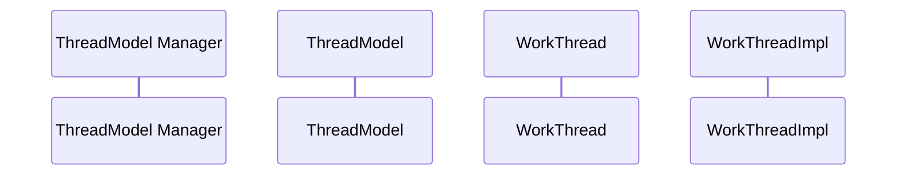

# XRPC Thread Model

<!-- TOC -->

- [XRPC Thread Model](#xrpc-thread-model)
    - [Overview](#overview)
    - [Quick Start](#quick-start)
    - [Structure](#structure)
    - [Sequence Diagram](#sequence-diagram)
    - [Thread Model Initial](#thread-model-initial)
        - [Server Initial](#server-initial)
        - [Client Initial](#client-initial)
    - [Task](#task)

<!-- /TOC -->

## Overview

XRPC 框架支持的线程模型是很多的，但是由于种种原因，这里仅分析了 XRPC 的异步线程模型。

一个 XRPC 应用中可以使用多个不同类型的线程模型，每个类型的线程模型又可以初始化多个实例，但通常而言，我们只需要确定使用的线程模型类型，以及一个对应的线程模型实例即可。

线程模型的类型有三种：

- default，异步回调的线程模型，可以结合 [future](future.md) 使用。
- fiber，协程模型，本文不会提及。
- spp，另一种协程模型，本文不会提及。

## Quick Start

Default 线程模型本质上就是一个线程池，通过一个提交 Task 至线程模型的 Demo，可以直观的了解到 XRPC 线程池交互方式。

线程模型配置：

```yaml
global:
  local_ip: 127.0.0.1
  threadmodel:
    default:
      - instance_name: default_instance
        io_handle_type: seperate
        io_thread_num: 8
        handle_thread_num: 10
```

提交一个 Task 到线程模型中运行：

```c++
// 通过线程模型的类型和名称获得线程模型
std::string threadmodel_type = "default";                       // default 是默认线程模型
std::string threadmodel_instance_name = "default_instance";     // default_instance 是线程模型的名字，线程模型的名字在 yaml 文件的 global 中定义
auto thread_model = ThreadModelManager::GetInstance()->GetThreadModel("default", "default_instance");

// 构建一个任务
Task* task = new Task();
task->group_id = thread_model->GetThreadModelId();      // 线程模型 ID
task->task_type = TaskType::TRANSPORT_REQUEST;          // 任务的类型
task->dst_thread_key = -1;                              // 随机选择一个 Worker 执行 Task
task->handler = [](Task* task) mutable {
    std::cout << "hello world" << std::endl;
};

TaskResult result = thread_model->SubmitHandleTask(task);
```

## Structure

线程模型中涉及到的对象是非常多的，XRPC 对线程模型进行了层层抽象与封装。

XRPC Thread Model 涉及到如下对象：

- ThreadModelManager，线程模型管理器，可以拥有多个 ThreadModel。
- ThreadModel，线程模型，一个线程模型管理了一个线程池，线程池中的对象是 WorkThread。
- WorkThread，对线程的抽象，该对象并不实际负责处理逻辑，而是交由 WorkThradImpl 完成处理逻辑。
  - WorkThradImpl，负责线程的初始化、启动、销毁等逻辑，对任务的处理交由 io_model 或 handle_model 完成。
- HandleModel，Handle 线程处理对象，负责定时任务、队列任务的循环处理。
- IoModel，IO 线程处理对象，除了对定时任务、队列中任务进行处理外，还负责重要的调度 Reactor 处理网络事件。


## Sequence Diagram



## Thread Model Initial

从上面时序图我们已经可以看到线程模型整个流程，那么线程模型是什么时候初始化的，进而推动 XRPC 线程运作的呢？

虽然 XRPC Server 和 XRPC Client 的 Thread Model 初始化触发方式是不一样的，但是其本质都是一致的：通过 XRPC Plugin 进行初始化：

```cpp
int XrpcPlugin::RegistryPlugins() {

  InitCompress_();

  InitSerialization_();

  // ===========================================================
  // ================= INITIAL Thread Model ====================
  // ===========================================================
  InitThreadModel_();

  InitCodec_();

  InitNaming_();

  InitConfig_();

  InitMetrics_();

  InitLogging_();

  InitSsl_();

  InitAuth_();

  InitFilters_();

  InitStreamHandler_();

  return 0;
}

int XrpcPlugin::InitThreadModel_() {
  // ===========================================================
  // ================= INITIAL Thread Model ====================
  // ===========================================================
  int ret = ThreadModelManager::GetInstance()->Init();

  assert(ret == 0);

  return 0;
}
```

但是 XRPC Server 和 Client 触发 Plugin 的 RegisterPlugins 方法的时机是不一样的。

### Server Initial

XRPC Server 在 Server 的启动时就会自动调用 RegisterPlugins。

```cpp
int main() {
  // app is XrpcApp
  app.Main(argc, argv);
  app.Wait();
}

void XrpcApp::Wait() {
  InitializeRuntime();

  // blocking in this function
  DestoryRuntime();

  DestoryFrameworkRuntime();
  TimeProvider::Destory();
}

void XrpcApp::InitializeRuntime() {
  // ...
  InitPlugins();
  // ...

  server_->Start();
}

void XrpcApp::InitPlugins() { XrpcPlugin::GetInstance()->RegistryPlugins(); }
```

### Client Initial

XRPC Client 分两种情况讨论：

- 由 XRPC Server 中运行的 Client，因为 XRPC Server 初始化时已经初始化 Thread Model 了，所以这种情况下不用额外再作任何初始化。
- 纯 XRPC Client，需要手动触发。

```cpp
int main(int argc, char *argv[]) {
  // Initial...

  // 获取客户端配置
  xrpc::ClientConfig client_config = xrpc::XrpcConfig::GetInstance()->GetClientConfig();

  // 创建客户端对象
  xrpc::XrpcClient client(client_config);

  // =======================================
  // 初始化插件，这里会触发 ThreadModel 的初始化
  // =======================================
  xrpc::XrpcPlugin::GetInstance()->RegistryPlugins();

  // do something

  //  注销插件
  xrpc::XrpcPlugin::GetInstance()->UnregistryPlugins();
}
```

## Task

线程池使用任务进行驱动，这里是对任务的定义：

```cpp
// 任务类型
using TaskHandler = std::function<void(Task*)>;

enum class TaskType {
  FINISH,                       // 结束任务，这是一个特殊的任务，用于通知线程池结束
  TRANSPORT_REQUEST,            // 网络请求任务
  TRANSPORT_RESPONSE,           // 网络响应任务
  TIMER,                        // 定时器任务
};

struct Task {
  TaskType task_type;           // 任务类型

  void* task;                   // 和 Task 绑定的上下文指针，便于 Task 执行时获取上下文信息

  TaskHandler handler;          // Task 的执行 Handler, TaskHandler = std::function<void(Task*)>;

  int group_id;                 // 线程模型 ID

  int dst_thread_key = -1;      // 分发 Task 到哪个线程中运行，这个是线程的索引（并非线程 ID），-1 则随机分发。
};
```
