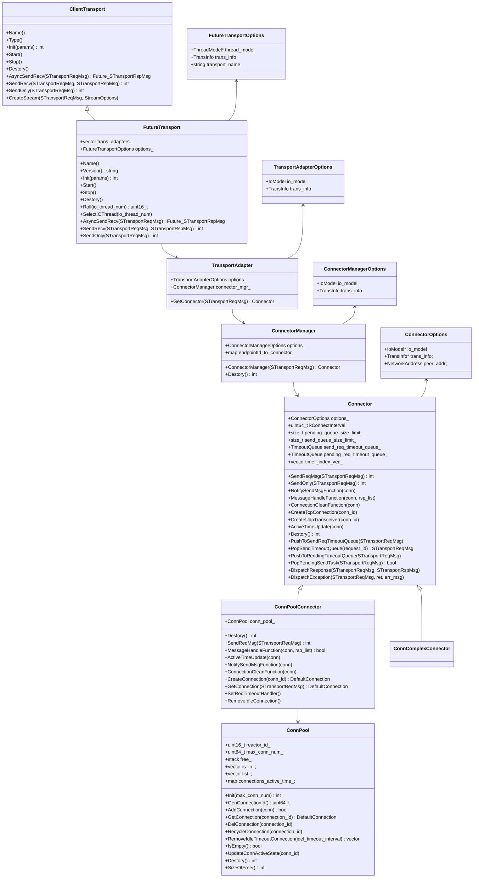

# Xrpc Client Transport

<!-- TOC -->

- [Xrpc Client Transport](#xrpc-client-transport)
    - [Overview](#overview)
    - [Quick Start](#quick-start)
    - [UML Class Diagram](#uml-class-diagram)
    - [Sequence Diagram](#sequence-diagram)
    - [Client Transport](#client-transport)
        - [FutureTransport Initial](#futuretransport-initial)
        - [Async Send Impl](#async-send-impl)
        - [Sync Send Impl](#sync-send-impl)
        - [SendOnly](#sendonly)
        - [Backup Request](#backup-request)
    - [TransportAdapter](#transportadapter)
    - [ConnectorManager](#connectormanager)
    - [Connector](#connector)
        - [ConnPoolConnector](#connpoolconnector)
        - [ConnComplexConnector](#conncomplexconnector)
    - [IO Handler](#io-handler)
    - [Retry](#retry)
    - [STransportReqMsg](#stransportreqmsg)
    - [Options](#options)
        - [FutureTransport::Options](#futuretransportoptions)
        - [TransInfo](#transinfo)

<!-- /TOC -->

## Overview

## Quick Start

## UML Class Diagram



## Sequence Diagram

## Client Transport

`ClientTransport` 是一个抽象类，指定了开发者使用的一系列接口以便开发者可以更简单的使用 Xrpc Network。

Xrpc 的 Transport 实现均是使用的 `FutureTransport`，这里主要针对该类进行阐述。

FutureTransport 也并非直接实现 Network 相关逻辑，其主要职责是：

- 封装 TransportAdapter 的网络操作，请参考 [TransportAdapter](#transportadapter)。
- 提供同步和异步调用。
- 构造 IO 请求的 Task。
- 完善请求 STransportReqMsg 信息，例如为请求记录源线程。

### FutureTransport Initial

```cpp
```

### Async Send Impl

发送异步请求使用的是 AsyncSendRecv 接口，参数要求为 [STransportReqMsg](#stransportreqmsg)。

```cpp
Future<STransportRspMsg> FutureTransport::AsyncSendRecv(STransportReqMsg* msg) {
  assert(msg->extend_info);
  
  // ... backup request 逻辑 省略

  // 选择执行网络操作的 IO 线程
  uint16_t id = SelectTransportAdapter(msg);
  return AsyncSendRecvImp(msg, id);
}
```

发起 AsyncSendRecv 请求的线程构建 Request Task ，并提交给 IO Thread 执行 Request Task，那么 FutureTransport 是如何选择运行 Request Task 的 IO Thread 呢？这就是根据 `SelectTransportAdapter` 进行选择的：

```cpp
uint16_t FutureTransport::SelectTransportAdapter(STransportReqMsg* msg) {
  auto* current_thread = WorkerThread::GetCurrentWorkerThread();

  // 非 Xrpc Thread 线程发起请求，轮询其中一个 IO 线程进行处理
  if (!current_thread) {
    msg->extend_info->client_extend_info.dispatch_info->src_thread_id = -1;
    return SelectIOThread(trans_adapters_.size()); 
  }

  msg->extend_info->client_extend_info.dispatch_info->src_thread_model_id = current_thread->GroupId();
  msg->extend_info->client_extend_info.dispatch_info->src_thread_id = GetLogicId(current_thread);

  // 请求由 Xrpc IO Thread 发起，则直接选择线程自己的 ID 返回，即自己处理这个 Request Task
  if (current_thread->GetRole() != WorkerThread::Role::HANDLE) {
    return GetLogicId(current_thread);
  }

  // 请求由 Xrpc Handle Thread 发起，则轮询其中一个 IO 线程进行处理
  return SelectIOThread(trans_adapters_.size());
}

uint16_t FutureTransport::SelectIOThread(const uint16_t io_thread_num) {
  // 自定义了 Request Task 的分发方式，则交给自定义方法处理
  if (options_.trans_info.req_dispatch_function) {
    return options_.trans_info.req_dispatch_function(io_thread_num);
  }

  // 默认进行轮询
  return Roll(io_thread_num);
}

uint16_t FutureTransport::Roll(const uint16_t io_thread_num) {
  uint16_t index = io_index_++ % io_thread_num;
  return index;
}
```

这里通过 `msg->extend_info->client_extend_info.dispatch_info->src_thread_id` 记录了发起线程的 ID，这是为了方便后面处理响应时，将其交给发起线程进行处理（虽然这种处理方式并不一定合理）。

应用层感知 Request Task 是否收到回包处理依赖于 Promise Future 模式，在 `AsyncSendRecvImp` 实现中将会生成 Promise，并返回 Future：

```cpp
Future<STransportRspMsg> FutureTransport::AsyncSendRecvImp(STransportReqMsg* msg,
                                                           const uint16_t id) {

  // 构造 Promise 和 Future
  auto promise_ptr = new Promise<STransportRspMsg>();
  auto fut = promise_ptr->get_future();

  // 记录 Promise 在 Message 中，处理响应时会使用 Promise
  msg->extend_info->client_extend_info.promise = promise_ptr;

  auto ret = SendRequest(msg, id, XrpcCallType::XRPC_UNARY_CALL);

  // 队列满时直接返回异常
  if (ret == TaskRetCode::QUEUE_FULL) {
    return MakeExceptionFuture<STransportRspMsg>(
        CommonException("io task queue is full, maybe overload", TaskRetCode::QUEUE_FULL));
  }

  return fut;
}
```

在 `SendRequest` 中会进行 Task 的构造以及 Task 的提交，Task 具体会依赖于 TransportAdapter 进行网络请求的发送。这里构造 Task 时会使用先前通过 `SelectTransportAdapter` 得到的线程 ID，设置 `task->dst_thread_key`，以分发 Task 到对应的 IO 线程：

```cpp
int FutureTransport::SendRequest(STransportReqMsg* msg, uint16_t id, XrpcCallType call_type) {
  Task* task = CreateTransportRequestTask(msg, id, call_type);
  TaskResult result = options_.thread_model->SubmitIoTask(task);
  return result.ret;
}

Task* FutureTransport::CreateTransportRequestTask(STransportReqMsg* msg, const uint16_t id,
                                                  XrpcCallType call_type) {
  Task* task = new Task();
  task->task_type = TaskType::TRANSPORT_REQUEST;
  task->task = msg;
  task->dst_thread_key = id;
  task->group_id = options_.thread_model->GetThreadModelId();

  // 设置对应的handler
  auto trans_adapter = trans_adapters_[id];

  task->handler = [trans_adapter, msg, call_type = std::move(call_type)](Task* task) mutable {
    switch (call_type) {
      case XrpcCallType::XRPC_UNARY_CALL:
        trans_adapter->GetConnector(msg)->SendReqMsg(msg);
        break;
      case XrpcCallType::XRPC_ONEWAY_CALL:
        trans_adapter->GetConnector(msg)->SendOnly(msg);
        delete msg;
        break;
      default:
        assert(0 && "No support yet");
        break;
    }
  };

  return task;
}
```

### Sync Send Impl

Transport 的同步调用是基于其异步接口实现的，主要依赖于 `future.Wait()` 机制：

```cpp
int FutureTransport::SendRecv(STransportReqMsg* req_msg, STransportRspMsg* rsp_msg) {
  auto fut = AsyncSendRecv(req_msg);

  // 等待处理超时
  if (!fut.Wait(req_msg->basic_info->timeout)) {
    return -1;
  }

  // 处理失败 直接返回 -1
  if (!fut.is_ready()) {
    return -1;
  }

  // 处理成功
  rsp_msg->msg = std::move(std::get<0>(fut.GetValue()).msg);
  return 0;
}
```

### SendOnly

FutureTransport 支持只发送数据而忽略对响应的等待，这可能在某些 UDP 的场景中较为常见。本质上是忽略对 promise 来实现：

```cpp
int FutureTransport::SendOnly(STransportReqMsg* msg) {
  uint16_t id = SelectIOThread(trans_adapters_.size());
  return SendRequest(msg, id, XrpcCallType::XRPC_ONEWAY_CALL);
}
```

### Backup Request

有时为了保证可用性和低时延，需要同时访问两路服务，哪个先返回就取哪个，Xrpc 的实现策略是：

> 设置一个合理的resend time，当一个请求在resend time内超时或失败了，再发送第二个请求，然后取先返回的结果。这也是bRPC backup request的实现方式。

在 FutureTransport 若信息配置了 Backup Request 则会使用该逻辑：

```cpp
Future<STransportRspMsg> FutureTransport::AsyncSendRecv(STransportReqMsg* msg) {
  assert(msg->extend_info);
  auto retry_info = msg->extend_info->client_extend_info.retry_info;
  if (retry_info && retry_info->retry_policy == RetryInfo::RetryPolicy::BACKUP_REQUEST) {
    return AsyncSendRecvForBackupRequest(msg);
  }

  // ...
}

// 下面的代码忽略了非常多的细节
Future<STransportRspMsg> FutureTransport::AsyncSendRecvForBackupRequest(STransportReqMsg* msg) {
  auto& client_extend_info = msg->extend_info->client_extend_info;

  // 创建用于通知应用层的 promise/future
  auto promise_ptr = new Promise<STransportRspMsg>();
  auto fut = promise_ptr->get_future();

  // 设置第一个请求的 promise 和回调
  client_extend_info.promise = new Promise<STransportRspMsg>();
  auto fut_first = client_extend_info.promise->get_future();

  // 设置 backup promise 根据 First Promise 的情况判断 backup resend 是否发送
  client_extend_info.backup_promise = new Promise<bool>();
  auto backup_fut = client_extend_info.backup_promise->get_future();
  backup_fut.Then([=](Future<bool>&& fut) mutable {

    // 正常请求成功，直接返回
    if (fut.is_ready()) {
      // 触发应用层 future 回调
      promise_ptr->SetValue(fut_first.GetValue());
      return MakeReadyFuture<>();
    }

    // 失败，执行 resend 逻辑
    std::vector<Future<STransportRspMsg>> vecs;
    vecs.emplace_back(std::move(fut_first));  // fut_first直接放入

    // 必须在同一个 io 线程中发送数据
    uint16_t new_id = SelectTransportAdapter(msg, id);

    // 从第一个 backup 地址开始，故 i = 1
    auto& retry_info = msg->extend_info->client_extend_info.retry_info;
    for (int i = 1; i < retry_info->back_addr.size(); i++) {
      auto new_fut = AsyncSendRecvImp(msg, new_id)
                         .Then([new_msg, retry_info](Future<STransportRspMsg>&& fut) {
                           return std::move(fut);
                         });

      vecs.emplace_back(std::move(new_fut));
    }

    return WhenAnyWithoutException(vecs.begin(), vecs.end())
        .Then([=](Future<size_t, std::tuple<STransportRspMsg>>&& fut) {
          // 通知应用层 future 回调
          if (fut.is_ready()) {
            promise_ptr->SetValue(std::move(std::get<1>(result)));
          } else {
            promise_ptr->SetException(fut.GetException());
          }
          return MakeReadyFuture<>();
        });
  });

  // 发起请求
  uint16_t id = SelectTransportAdapter(msg);
  int ret = SendRequest(msg, id, XrpcCallType::XRPC_UNARY_CALL);
  return fut;
}
```

在 Connector 中会负责通过设置 backup_promise 以发起重试，细节请参考 [Connector](#connector)。

## TransportAdapter

TransportAdapter 封装了 ConnectorManager 的相关操作，每个 IO 线程都有独立的 TransportAdapter。

有多少 IO 线程就有多少 TransportAdapter，该对象在 FutureTransport 中进行初始化，并且数组维护在 FutureTransport 中。数组下标和 IO 线程的线程 ID 是一一对应的（此线程 ID 并非 Linux 线程 ID，而是 Xrpc 为线程赋予的）：

```cpp
int FutureTransport::Init(const std::any& params) {
  Options options = std::any_cast<const FutureTransport::Options&>(params);
  options_ = options;

  // 根据 IO 线程数初始化 trans_adapters_
  for (auto& io_thread : options_.thread_model->GetWorkerThreads(WorkerThread::Role::IO)) {
    TransportAdapter::Options transport_adapter_option;
    transport_adapter_option.io_model = io_thread->GetIoModel();
    transport_adapter_option.trans_info = &(options_.trans_info);

    trans_adapters_.emplace_back(new TransportAdapter(std::move(transport_adapter_option)));
  }

  return 0;
}
```

显而易见，`trans_adapters[i]` 是第 i 个 IO 线程的 trans_adatpter。

TransportAdapter 很简单，就是代理了 ConnectorManager 的相关动作，最核心的动作就是获得 Connector。

```cpp
Connector* TransportAdapter::GetConnector(STransportReqMsg* req_msg) {
  return connector_mgr_->GetConnector(req_msg);
}
```

TransportAdapterOptions 没啥用，Connector 都记录了这些信息的。

## ConnectorManager

ConnectorManager 用于管理 Connector，而 Connector 是真正负责封装网络操作的对象。

ConnectorManager 会根据配置初始化连接复用类型的 Connector 或连接池类型的 Connector。

ConnectorManager 建立的 Connector 池和远程端点关联在一起：

```text
endpointId_to_connector_[{conn_type}:{ip}:{port}] = Connector
```

ConnectorManager 中的 Connector 属于懒加载，在用到时才会去进行初始化：

```cpp
Connector* ConnectorManager::GetConnector(STransportReqMsg* req_msg) {
  size_t len = 64;
  std::string endpointId = Foramt("{type}:{ip}:{port}",
                                  options_.trans_info->conn_type,
                                  req_msg->basic_info->addr.ip,
                                  req_msg->basic_info->addr.port);

  // Connector 已经存在，直接返回并使用
  auto it = endpointId_to_connector_.find(endpointId);
  if (it != endpointId_to_connector_.end()) {
    return it->second;
  }

  // 指定是连接复用还是连接池模式,创建对应连接模式的Connector
  Connector::Options connector_options;
  connector_options.io_model = options_.io_model;
  connector_options.trans_info = options_.trans_info;
  connector_options.peer_addr = NetworkAddress(std::string_view(req_msg->basic_info->addr.ip),
                                               req_msg->basic_info->addr.port,
                                               NetworkAddress::IpType::ipv4);

  Connector* newConnector = nullptr;
  if (connector_options.trans_info->conn_type == ConnectionType::UDP) {
    // UDP
    newConnector = new UdpConnector(connector_options);
  } else if (options_.trans_info->is_complex_conn) {
    // TCP 连接复用模式
    newConnector = new ConnComplexConnector(connector_options);
  } else {
    // TCP 连接池模式
    newConnector = new ConnPoolConnector(connector_options);
  }

  endpointId_to_connector_[endpointId] = newConnector;
  return newConnector;
}
```

## Connector

Connector 作为抽象类实现了核心网络逻辑，包括：

- 创建 TCP/UDP 连接的逻辑
- 将请求的上下文进行保存
- 网络请求逻辑
- 分发网络响应的处理 Task

Connector 的子类 ConnComplexConnector 和 ConnPoolConnector 主要是实现：

- 如何选择发起请求的连接
- 如何构造连接的 conn_id
- 如何构造请求的 request_id
- 如何处理请求的响应

对于 Connector 创建 TCP 连接的逻辑，会由子类根据自己的策略调用构建 Connector。

创建连接的核心是构造 Connection Options，设置连接的处理回调，并建立连接：

```cpp
DefaultConnection* Connector::CreateTcpConnection(uint64_t conn_id) {
  // 设置连接参数以及连接相关事件的回调
  DefaultConnection::Options options = MakeConnectionOption(conn_id);

  // 设置连接的 Socket
  options.options.socket = Socket::CreateTcpSocket(options_.peer_addr.IsIpv6());

  // 设置连接的 IO Handler，IO Handler 是如何使用 fd 进行相关 io 操作的封装
  options.options.io_handler = IoHandlerFactory::GetInstance()->Create(options.options.socket.GetFd(),
                                                                       *(options_.trans_info));

  DefaultConnection* conn = new TcpConnection(options);
  conn->DoConnect();

  return conn;
}

DefaultConnection::Options Connector::MakeConnectionOption(uint64_t conn_id) {
  // 构造连接参数
  DefaultConnection::Options options;
  // Connection::Options options;
  options.recv_buffer_size = options_.trans_info->recv_buffer_size;
  options.options.max_packet_size = options_.trans_info->max_packet_size;
  options.merge_send_data_size = options_.trans_info->merge_send_data_size;
  options.options.event_handler_id = options_.io_model->GetReactor()->GenEventHandlerId();
  options.options.reactor = options_.io_model->GetReactor();
  options.options.type = options_.trans_info->conn_type;
  options.options.conn_id = conn_id;
  options.options.client = true;

  // 客户端ConnectionInfo只需要对端的IP/Port这些信息
  ConnectionInfo connection_info;
  connection_info.remote_addr = options_.peer_addr;
  options.options.conn_info = std::move(connection_info);

  // 设置 function
  // trans_info 里本身就包含了很多回调处理，例如检查响应是否为完整的 Packet 等
  auto* conn_handler = new FutureConnectionHandler(options_.trans_info);

  conn_handler->SetNotifyMsgSendFunc([this](const ConnectionPtr& conn) { return this->NotifySendMsgFunction(conn); });
  conn_handler->SetCleanFunc([this](const ConnectionPtr& conn) { this->ConnectionCleanFunction(conn); });
  conn_handler->SetTimeUpdateFunc([this](const ConnectionPtr& conn) { this->ActiveTimeUpdate(conn); });
  conn_handler->SetPipelineCountGetFunc([this](const ConnectionPtr conn) { return this->GetPipelineCount(conn); });

  conn_handler->SetMsgHandleFunc([this](const ConnectionPtr& conn, std::deque<std::any>& data) {
    // MessageHandleFunction 由 Connector 的子类实现
    return this->MessageHandleFunction(conn, data);
  });

  options.options.conn_handler = conn_handler;

  return options;
}
```

对于请求上下文的保存，这也是由子类进行调用，上下文保存所需要的 request_id 也由子类根据自的策略生成。需要注意的是，上下文有两种：

- 正常发起请求，请求的上下文会进行保存，并且具备超时时间：

  ```cpp
  void Connector::PushToSendReqTimeoutQueue(STransportReqMsg* req_msg) {
    // req_msg 就是请求上下文，需要保存
  
    // 上下文空间满了，分发异常作为请求的响应
    if (send_req_timeout_queue_->Size() > send_queue_size_limit_) {
      DispatchException(req_msg, XrpcRetCode::XRPC_CLIENT_INVOKE_TIMEOUT_ERR, "Client Overload in Send Queue");
      return;
    }
  
    // 超时时间计算，如果为backup request请求的话，取 resend timeout
    auto& client_extend_info = req_msg->extend_info->client_extend_info;
    int64_t timeout = client_extend_info.retry_info && client_extend_info.backup_promise
                          ? client_extend_info.retry_info->delay
                          : req_msg->basic_info->timeout;
    // 加上起始时刻
    timeout += req_msg->basic_info->begin_timestamp;
  
    // 添加上下文到内存 request_id 就是 req_msg->basic_info->seq_id
    send_req_timeout_queue_->Push(req_msg, req_msg->basic_info->seq_id, timeout, false);
  }
  
  STransportReqMsg* Connector::PopSendTimeoutQueue(uint32_t request_id) {
    // 根据 request_id 获得请求上下文
    STransportReqMsg* msg = nullptr;
    send_req_timeout_queue_->Erase(request_id, msg);
    return msg;
  }
  ```

- 由于连接正在建立，上下文会存放到 Pending 队列中，并且具备超时时间：

  ```cpp
  void Connector::PushToPendingTimeoutQueue(STransportReqMsg* req_msg) {
    if (pending_req_timeout_queue_->Size() > pending_queue_size_limit_) {
      DispatchException(req_msg, XrpcRetCode::XRPC_CLIENT_INVOKE_TIMEOUT_ERR, "Client Overload in Pending Queue");
      return;
    }
  
    // 超时时间计算，如果为backup request请求的话，取resend timeout
    assert(req_msg->extend_info);
    auto& client_extend_info = req_msg->extend_info->client_extend_info;
    int64_t timeout = client_extend_info.retry_info && client_extend_info.backup_promise
                          ? client_extend_info.retry_info->delay
                          : req_msg->basic_info->timeout;
    // 加上起始时刻
    timeout += req_msg->basic_info->begin_timestamp;
  
    pending_req_timeout_queue_->Push(req_msg, req_msg->basic_info->seq_id, timeout, false);
  }
  
  bool Connector::PopPendingSendTask(STransportReqMsg** req_msg) {
    if (pending_req_timeout_queue_->GetSend(*req_msg)) {
      pending_req_timeout_queue_->PopSend(true);
      return true;
    }
    return false;
  }
  ```

发送请求，核心就是用 conn->Send 的方法进行发送：

```cpp
int Connector::DoSend(STransportReqMsg* req_msg, Connection* conn) {
  IoMessage message;
  message.buffer = std::move(req_msg->send_data);
  message.seq_id = req_msg->basic_info->seq_id;
  int ret = conn->Send(std::move(message));
  if (ret != 0) {
    std::string error = "network send error, peer addr:";
    error += options_.peer_addr.ToString();
    PopSendTimeoutQueue(req_msg->basic_info->seq_id);
    DispatchException(req_msg, XrpcRetCode::XRPC_CLIENT_NETWORK_ERR, std::move(error));
  }
  return ret;
}

int Connector::SendOnly(STransportReqMsg* req_msg) {
  auto* conn = GetConnection(req_msg);
  if (conn) {
    IoMessage message;
    // default tcp connection 下只需要设置 data 字段
    assert(req_msg);
    message.buffer = std::move(req_msg->send_data);
    message.seq_id = req_msg->basic_info->seq_id;
    return conn->Send(std::move(message));
  }
  return -1;
}
```

当请求存在响应时，会将响应处理打包为一个 Task，并分发给相应线程进行处理，核心逻辑是：

- 使用 trans_info 中设置的 task 分发函数，将 task 分发给线程
- task 通过设置 promise 来通知 future 回调

```cpp
void Connector::DispatchResponse(STransportReqMsg* req_msg, STransportRspMsg&& rsp_msg) {
  // 这里的响应处理是设置构造一个task，其中 handler 为 promise 设置 value，然后提交到业务 HandleModel 的 task 队列中
  Task* task = new Task();
  task->task_type = TaskType::TRANSPORT_RESPONSE;
  task->task = req_msg;
  // 设置对应的handler
  task->handler = [req_msg, rsp_msg = std::move(rsp_msg)](Task* task) mutable {
    auto promise = req_msg->extend_info->client_extend_info.promise;

    // 设置 promise 触发 future 的回调
    promise->SetValue(std::move(rsp_msg));

    // 首个请求成功，直接取消resend回调，结束调用
    auto backup_promise = req_msg->extend_info->client_extend_info.backup_promise;
    if (backup_promise) {
      NotifyBackupRequestOver(backup_promise);
    }
  };

  // 执行上层设置的 rsp_dispatch_function，实现 Task 的分发
  options_.trans_info->rsp_dispatch_function(task);
}
```

响应如果失败，也会进行分发，触发 future 回调：

```cpp
void Connector::DispatchException(STransportReqMsg* req_msg, int ret, std::string&& err_msg) {
  // 这里的响应处理是设置构造一个task，其中handler为promise设置value，然后提交到业务HandleModel的task队列中
  Task* task = new Task();
  task->task_type = TaskType::TRANSPORT_RESPONSE;
  task->task = req_msg;
  // 设置对应的handler
  task->handler = [req_msg, ret, msg = std::move(err_msg)](Task* task) mutable {
    // 如果存在 backup 则触发 backup 的请求
    auto backup_promise = req_msg->extend_info->client_extend_info.backup_promise;
    if (backup_promise) {
      Exception ex(CommonException("Invoke failed", XRPC_INVOKE_UNKNOWN_ERR));
      NotifyBackupRequestResend(ex, req_msg->extend_info->client_extend_info.backup_promise);
    }

    // promise 失败
    auto promise = req_msg->extend_info->client_extend_info.promise;
    promise->SetException(ex);
  };

  // 执行上层设置的rsp_dispatch_function，实现Task的分发
  options_.trans_info->rsp_dispatch_function(task);
}
```

### ConnPoolConnector

ConnPoolConnector 是连接池 Connector，其包含了一组连接，并通过连接池进行并发网络请求。ConnPoolConnector 建立时会注册两个定时器：

1. 用于清理空闲连接的定时器。即连接长时间没有网络事件会自动关闭连接。
1. 用于检查

```cpp
ConnPoolConnector::ConnPoolConnector(const Options& options)
    : Connector(options), conn_pool_(options.io_model->GetReactor()->Id()) {
  conn_pool_.Init(options_.trans_info->max_conn_num);

  // 注册空闲连接清理定时任务，每秒执行 1 词
  uint32_t timer_index = options_.io_model->GetReactor()->AddTimerAfter(0, 10000, [this]() { this->RemoveIdleConnection(); });
  timer_index_vec_.push_back(timer_index);

  // 注册请求队列超时检测定时任务(包括已发送和 pending 中的请求)
  // 每十秒执行一次
  timer_index = options_.io_model->GetReactor()->AddTimerAfter(0, 10, [this]() { this->SetReqTimeoutHandler(); });
  timer_index_vec_.push_back(timer_index);
}

void ConnPoolConnector::RemoveIdleConnection() {
  // 从连接池中获得满足空闲时间条件的连接
  auto conn_vec = conn_pool_.RemoveIdleTimeoutConnection(options_.trans_info->connection_idle_timeout);
  for (auto conn : conn_vec) {
    // 判断连接是否还有请求在等待应答，避免因 timeout 长于空闲连接超时时间而误删连接
    if (!send_req_timeout_queue_->IsInQueue(conn->GetConnId() & kConnIdMask)) {
      conn->DoClose();
    }
  }
}

void ConnPoolConnector::SetReqTimeoutHandler() {
  STransportReqMsg* msg = nullptr;

  // send_req_timeout_queue_ 是发送中但未收到响应的队列，这也是存放的请求上下文
  // 每次迭代出一个超时的请求超时下文
  while (send_req_timeout_queue_->Timeout(msg)) {

    // 如果存在 backup promise 则触发 backup 请求的发送
    if (msg->extend_info->client_extend_info.backup_promise) {
      Exception ex(CommonException("Resend timeout", XRPC_CLIENT_INVOKE_TIMEOUT_ERR));
      Connector::NotifyBackupRequestResend(ex, msg->extend_info->client_extend_info.backup_promise);

      // 把请求包重新放回队列:需要重新设置超时时间
      msg->basic_info->timeout -= msg->extend_info->client_extend_info.retry_info->delay;
      PushToSendReqTimeoutQueue(msg);
      continue;
    }

    // 派发超时响应
    std::string error = "Future invoke timeout peeraddr= " + options_.peer_addr.ToString();
    DispatchException(msg, XrpcRetCode::XRPC_CLIENT_INVOKE_TIMEOUT_ERR, std::move(error));

    // 连接池模式下，请求超时，需要关闭连接(避免响应串包)
    // 如果继续用这个连接发数据，收到的响应可能是之前请求的，但是之前请求的上下文已经因为超时而删除
    conn_pool_.GetConnection(msg->basic_info->connection_id)->DoClose();
  }

  // pending_req_timeout_queue_ 是由于连接未建立完成导致无法发送数据而将数据缓存的队列
  // 每次迭代出一个超时的请求超时下文
  while (pending_req_timeout_queue_->Timeout(msg)) {
    // 如果存在 backup promise 则触发 backup 请求的发送
    if (msg->extend_info->client_extend_info.backup_promise) {
      Exception ex(CommonException("Resend pending timeout", XRPC_CLIENT_INVOKE_TIMEOUT_ERR));
      Connector::NotifyBackupRequestResend(ex, msg->extend_info->client_extend_info.backup_promise);

      // 把请求包重新放回队列:需要重新设置超时时间
      msg->basic_info->timeout -= msg->extend_info->client_extend_info.retry_info->delay;
      PushToPendingTimeoutQueue(msg);
      continue;
    }

    // 派发超时响应
    DispatchException(msg, XrpcRetCode::XRPC_CLIENT_INVOKE_TIMEOUT_ERR, "Future invoke timeout before send");
    // 连接池模式下，请求超时，因为 pending 队列中的请求并没有发送出去，所以不需要将 pending 队列中的连接关闭
  }
}
```

ConnPoolConnector 最核心的逻辑之一是数据发送，其关键点是：

- 请求上下文的 id 是连接 ID，这是自然的，因为一个连接同一时间只会发送一个请求。
- 发送数据时，若连接池中没有可用的连接会创建一个新的连接。
- 如果连接池已经耗尽，无法创建新的连接，请求会缓存在 pending_req_timeout_queue_ 队列中，等待存在可用连接时发送。

```cpp
int ConnPoolConnector::SendReqMsg(STransportReqMsg* req_msg) {
  // 连接达到上限且全部分配,放到 pending 队列
  DefaultConnection* conn = GetConnection(req_msg);
  if (!conn) {
    PushToPendingTimeoutQueue(req_msg);
    return 0;
  }

  // 连接始终无法建立成功，将连接关掉
  if (conn->GetConnectionState() == DefaultConnection::ConnectionState::kConnecting &&
        kConnectInterval + conn->GetDoConnectTimestamp() < TimeProvider::GetNowMs()) {
      ushToPendingTimeoutQueue(req_msg);
      conn->DoClose();  // 触发清理操作
      return 0;
  }


  // 使用连接 ID 作为请求上下文的 ID
  req_msg->basic_info->connection_id = conn->GetConnId();
  req_msg->basic_info->seq_id = (conn->GetConnId() & kConnIdMask);

  // 连接可用，直接发到请求超时队列中
  PushToSendReqTimeoutQueue(req_msg);
  return DoSend(req_msg, conn);
}

DefaultConnection* ConnPoolConnector::GetConnection(STransportReqMsg* req_msg) {
  // 连接 ID 用尽，直接返回 nullptr
  uint64_t conn_id = conn_pool_.GenConnectionId();
  if (conn_id == 0) {
    return nullptr;
  }

  // 根据连接 ID 获得连接
  DefaultConnection* conn = conn_pool_.GetConnection(conn_id);
  if (conn != nullptr) {
    return conn;
  }

  // 连接 ID 对应的连接为空 则创建连接
  conn = CreateConnection(conn_id);
  if (conn->GetConnectionState() == TcpConnection::ConnectionState::kUnconnected) {
    // 连接创建失败
    conn_pool_.DelConnection(conn_id);
    return nullptr;
  }

  conn_pool_.AddConnection(conn);
  return conn;
}
```

ConnPoolConnector 的另一个核心逻辑是处理请求的响应，其关键点是：

- 解析响应。
- 获取请求上下文进行处理。
- 分发响应 Task 处理。
- 处理完响应 Task 分发后会直接取 pending_req_timeout_queue_ 中的消息进行发送。
- 若连接没有其他事物需要处理，则将其回收至连接池中。

```cpp
bool ConnPoolConnector::MessageHandleFunction(const ConnectionPtr& conn,
                                              std::deque<std::any>& rsp_list) {
  // 迭代所有响应消息
  for (auto&& rsp_buf : rsp_list) {
    // 解析响应到 rsp_protocol
    ProtocolPtr rsp_protocol;
    bool ret = options_.trans_info->rsp_decode_function(std::move(rsp_buf), rsp_protocol);

    // 通过 connection id 获得请求上下文
    uint32_t request_id = (conn->GetConnId() & kConnIdMask);
    STransportReqMsg* msg = PopSendTimeoutQueue(request_id);

    // 由于某些原因导致请求上下文不存在，直接调过对响应的处理
    if (!msg) {
      continue;
    }

    // 解析响应失败
    if (!ret) {
      std::string error = "Decode Failed peeraddr= " + options_.peer_addr.ToString();
      DispatchException(msg, XrpcRetCode::XRPC_CLIENT_DECODE_ERR, std::move(error));
      conn->DoClose();
      continue;
    }

    // 分发响应
    STransportRspMsg rsp_msg;
    rsp_msg.msg = std::move(rsp_protocol);
    DispatchResponse(msg, std::move(rsp_msg));
  }

  // 发送 Pending 队列中的连接
  // 如果 Pending 为空，将连接归还到连接池
  if (!SendPendingMsg(conn)) conn_pool_.RecycleConnection(conn->GetConnId());
  return true;
}

bool ConnPoolConnector::SendPendingMsg(ConnectionPtr conn) {

  // 如果不存在 pending 的请求 直接返回
  STransportReqMsg* req_msg = nullptr;
  if (!PopPendingSendTask(&req_msg)) {
    return false;
  }

  // 连接复用模式下，发送之前需要将请求的 request_id 设置为连接 id
  req_msg->basic_info->connection_id = conn->GetConnId();
  req_msg->basic_info->seq_id = (conn->GetConnId() & kConnIdMask);
  // 连接可用之后，把pending超时队列中的请求，移到请求超时队列中,并发送
  PushToSendReqTimeoutQueue(req_msg);

  // 使用Connection发送请求
  DoSend(req_msg, conn);

  return true;
}
```

连接保活事件会更新相关连接的活跃状态：

```cpp
void ActiveTimeUpdate(Connection* conn) override {
  conn_pool_.UpdateConnActiveState(conn->GetConnId());
}
```

#### ConnPool

ConnPool 对于 ConnPoolConnector 是一个很重要的类，连接 ID 的构建、连接保活、连接池维护都是依赖于该类。

ConnPool 初始化时会先明确连接池大小，并初始化连接序号，魔数 Magic：

```cpp
// 默认连接池大小时 10w 连接
ConnPool::ConnPool(uint16_t reactor_id) : reactor_id_(reactor_id), max_conn_num_(100000), magic_(GenMagic(reactor_id)) {
  Init(max_conn_num_);
}

// 连接池通常会由外层主动调用 Init 重新进行一次构造
void ConnPool::Init(uint32_t max_conn_num) {
  if (!free_.empty()) {
    std::stack<uint64_t> empty;
    std::swap(free_, empty);
  }

  // list 建立了连接序号和连接的映射
  list_.clear();
  list_.resize(max_conn_num + 1);

  // is_in_ 标识连接序号是否在连接池中
  // is_in_[i] == true 标识序号 i 的连接在连接池中，未使用
  is_in_.clear();
  is_in_.resize(max_conn_num + 1);

  for (uint64_t i = 1; i <= max_conn_num; ++i) {
    list_[i] = nullptr;
    free_.push(i);
    is_in_[i] = true;
  }

  max_conn_num_ = max_conn_num;
}
```

需要注意的时，连接 ID 并非连接序号，而是关联了一个魔数，这是用于将不同 Reactor 的连接 ID 进行隔离，连接 ID 是一个 48 Bit 的结构：

```text
+---------------------------------------+
|                48 Bit                 |
+-------------------+-------------------+
|    High 16 Bit    |    Low 32 Bit     |
+-------------------+-------------------+
| Magic(reactor_id) | Magic(reactor_id) |
+-------------------+-------------------+
```

生成连接 ID，向连接池中添加一个连接：

```cpp
uint64_t ConnPool::GenConnectionId() {
  // 连接池中的连接序号耗尽
  if (free_.empty()) {
    return 0;
  }

  uint64_t uid = free_.top();
  free_.pop();

  // 连接处于使用中
  is_in_[uid] = false;

  // 构造连接 ID
  return magic_ | uid;
}

bool ConnPool::AddConnection(DefaultConnection* conn) {
  auto connection_id = conn->GetConnId();
  auto magic = 0x0000FFFF00000000 & connection_id;
  auto uid = 0x00000000FFFFFFFF & connection_id;

  assert(magic == magic_ && uid > 0 && uid <= max_conn_num_);

  // 序号对应的连接已经存在，不能添加，失败
  if (list_[uid] != nullptr) {
    return false;
  }

  // 序号对应的连接保存，记录连接活跃时间
  list_[uid] = conn;
  connections_active_time_[uid] = TimeProvider::GetNowMs();
  return true;
}

DefaultConnection* ConnPool::GetConnection(uint64_t connection_id) {
  auto magic = 0x0000FFFF00000000 & connection_id;
  auto uid = 0x00000000FFFFFFFF & connection_id;

  assert(magic == magic_ && uid > 0 && uid <= max_conn_num_);
  return list_[uid];
}

// 连接清理或者连接创建失败都会把连接从池中删除，连接 ID 归还连接池
void ConnPool::DelConnection(uint64_t connection_id) {
  auto magic = 0x0000FFFF00000000 & connection_id;
  auto uid = 0x00000000FFFFFFFF & connection_id;

  assert(magic == magic_ && uid > 0 && uid <= max_conn_num_);

  list_[uid] = nullptr;

  // 连接序号不在池中，归还序号
  if (!is_in_[uid]) {
    free_.push(uid);
    is_in_[uid] = true;
  }

  // 连接活跃时间记录中剔除
  auto it = connections_active_time_.find(uid);
  if (it != connections_active_time_.end()) {
    connections_active_time_.erase(it);
  }
}
```

当连接使用完需要归还连接序号给连接池，方便下次再使用该连接：

```cpp
void ConnPool::RecycleConnection(uint64_t connection_id) {
  auto magic = 0x0000FFFF00000000 & connection_id;
  auto uid = 0x00000000FFFFFFFF & connection_id;

  assert(magic == magic_ && uid > 0 && uid <= max_conn_num_);

  if (!is_in_[uid]) {
    is_in_[uid] = true;
    free_.push(uid);
  }
}
```

当发生了网络事件，会触发保活事件，让 ConnPool 刷新时间：

```cpp
void ConnPool::UpdateConnActiveState(uint64_t conn_id) {
  auto magic = 0x0000FFFF00000000 & conn_id;
  auto uid = 0x00000000FFFFFFFF & conn_id;

  assert(magic == magic_ && uid > 0 && uid <= max_conn_num_);

  auto it = connections_active_time_.find(uid);
  if (it != connections_active_time_.end()) it->second = TimeProvider::GetNowMs();
}
```

每秒会遍历 connections_active_time_，找出空闲超时的连接：

```cpp
std::vector<DefaultConnection*> ConnPool::RemoveIdleTimeoutConnection(uint64_t idel_timeout_interval) {
  uint64_t now = TimeProvider::GetNowMs();

  std::vector<DefaultConnection*> conn_to_del;
  auto it = connections_active_time_.begin();
  while (it != connections_active_time_.end()) {
    if (now > it->second && now - it->second >= idel_timeout_interval) {
      conn_to_del.push_back(list_[it->first]);
    }
    it++;
  }
  return conn_to_del;
}
```

### ConnComplexConnector

## IO Handler

## Retry

## STransportReqMsg

## Options

### FutureTransport::Options

```cpp
class FutureTransport : public ClientTransport {
 public:
  struct Options {
    // FutureTransport 绑定到一个 ThreadModel 上，该 ThreadModel 负责该 Transport 的所有任务
    ThreadModel* thread_model;

    // Transport 的深度配置，包括连接数、连接类型、网络包分发策略、网络事件处理等
    TransInfo trans_info;

    // Transport 的名称
    std::string transport_name;
  };
};
```

### TransInfo

```cpp
struct TransInfo {
 public:
  // 请求派发到哪个io线程发送，业务可自定义注册
  using ReqDispatchFunction = std::function<uint16_t(const uint16_t io_thread_num)>;

  // 应答派发到handle线程策略指定，业务可自定义注册
  using RspDispatchFunction = std::function<void(Task* task)>;

  // 应答解码
  using RspDecodeFunction = std::function<bool(std::any&& in, ProtocolPtr& out)>;

  // 连接类型
  ConnectionType conn_type;

  // 请求是否要求使用连接复用模式
  bool is_complex_conn = true;

  // 连接允许的请求的最大包大小
  uint32_t max_packet_size = 10000000;

  // 接收数据时，每次分配内存buffer的大小
  uint32_t recv_buffer_size = 8192;

  // 合并发送数据的大小
  uint32_t merge_send_data_size = 1024;

  // 连接池模式下最大活跃连接数
  uint32_t max_conn_num = 64;

  // 空闲连接超时
  uint32_t connection_idle_timeout = 50000;

  // 连接建立用户回调
  ConnectionEstablishFunction conn_establish_function = nullptr;

  // 连接关闭用户回调
  ConnectionCloseFunction conn_close_function = nullptr;

  // 数据包完整性校验操作
  ProtocalCheckerFunction checker_function = nullptr;

  // 请求发送成功后用户回调
  MessageWriteDoneFunction msg_writedone_function = nullptr;

  // 回包解码
  RspDecodeFunction rsp_decode_function = nullptr;

  // 请求包发到哪个io线程策略指定，业务可自定义注册
  ReqDispatchFunction req_dispatch_function = nullptr;

  // 应答派发到handle线程策略指定，业务可自定义注册
  RspDispatchFunction rsp_dispatch_function = nullptr;

  // redis鉴权配置信息
  RedisClientConf redis_conf;

  // Set SSL/TLS options and context for client.
#ifdef BUILD_INCLUDE_SSL
  // Option of ssl context: certificate and key and ciphers were stored in.
  ssl::SslClientSslOptionsPtr ssl_options{nullptr};
  // Context of ssl
  ssl::SslContextPtr ssl_ctx{nullptr};
#endif

  // 连接上传输应用数据协议名称, 例如: xrpc, 当前用于流式场景
  std::string codec_name{};
};
```
