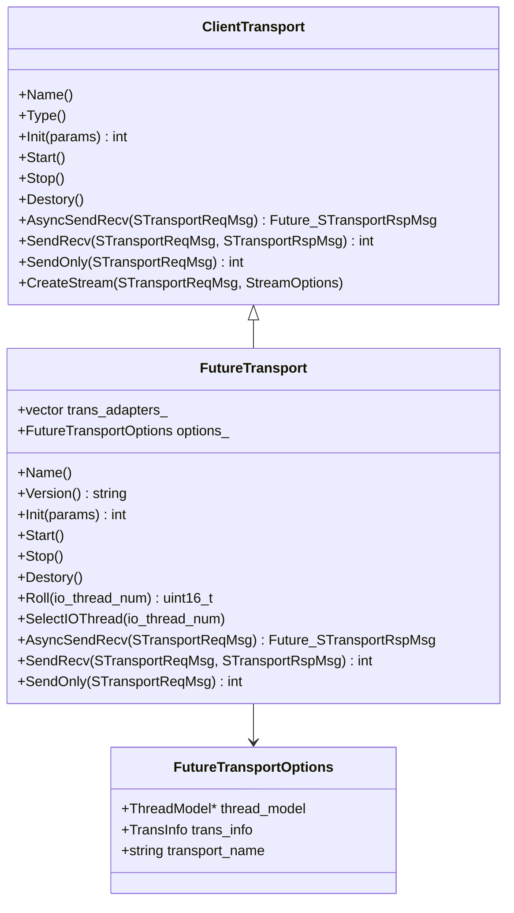

# Xrpc Client Transport

<!-- TOC -->

- [Xrpc Client Transport](#xrpc-client-transport)
    - [Overview](#overview)
    - [Quick Start](#quick-start)
    - [UML Class Diagram](#uml-class-diagram)
    - [Sequence Diagram](#sequence-diagram)
    - [Client Transport](#client-transport)
        - [FutureTransport Initial](#futuretransport-initial)
        - [Async Send Impl](#async-send-impl)
        - [Sync Send Impl](#sync-send-impl)
        - [SendOnly](#sendonly)
        - [Backup Request](#backup-request)
    - [TransportAdapter](#transportadapter)
    - [Connector](#connector)
        - [ConnComplexConnector](#conncomplexconnector)
        - [ConnPoolConnector](#connpoolconnector)
    - [IO Handler](#io-handler)
    - [Retry](#retry)
    - [STransportReqMsg](#stransportreqmsg)
    - [Options](#options)
        - [FutureTransport::Options](#futuretransportoptions)
        - [TransInfo](#transinfo)

<!-- /TOC -->

## Overview

## Quick Start

## UML Class Diagram



## Sequence Diagram

## Client Transport

`ClientTransport` 是一个抽象类，指定了开发者使用的一系列接口以便开发者可以更简单的使用 Xrpc Network。

Xrpc 的 Transport 实现均是使用的 `FutureTransport`，这里主要针对该类进行阐述。

FutureTransport 也并非直接实现 Network 相关逻辑，其主要职责是：

- 封装 TransportAdapter 的网络操作，请参考 [TransportAdapter](#transportadapter)。
- 提供同步和异步调用。
- 构造 IO 请求的 Task。
- 完善请求 STransportReqMsg 信息，例如为请求记录源线程。

### FutureTransport Initial

```cpp
```

### Async Send Impl

发送异步请求使用的是 AsyncSendRecv 接口，参数要求为 [STransportReqMsg](#stransportreqmsg)。

```cpp
Future<STransportRspMsg> FutureTransport::AsyncSendRecv(STransportReqMsg* msg) {
  assert(msg->extend_info);
  
  // ... backup request 逻辑 省略

  // 选择执行网络操作的 IO 线程
  uint16_t id = SelectTransportAdapter(msg);
  return AsyncSendRecvImp(msg, id);
}
```

发起 AsyncSendRecv 请求的线程构建 Request Task ，并提交给 IO Thread 执行 Request Task，那么 FutureTransport 是如何选择运行 Request Task 的 IO Thread 呢？这就是根据 `SelectTransportAdapter` 进行选择的：

```cpp
uint16_t FutureTransport::SelectTransportAdapter(STransportReqMsg* msg) {
  auto* current_thread = WorkerThread::GetCurrentWorkerThread();

  // 非 Xrpc Thread 线程发起请求，轮询其中一个 IO 线程进行处理
  if (!current_thread) {
    msg->extend_info->client_extend_info.dispatch_info->src_thread_id = -1;
    return SelectIOThread(trans_adapters_.size()); 
  }

  msg->extend_info->client_extend_info.dispatch_info->src_thread_model_id = current_thread->GroupId();
  msg->extend_info->client_extend_info.dispatch_info->src_thread_id = GetLogicId(current_thread);

  // 请求由 Xrpc IO Thread 发起，则直接选择线程自己的 ID 返回，即自己处理这个 Request Task
  if (current_thread->GetRole() != WorkerThread::Role::HANDLE) {
    return GetLogicId(current_thread);
  }

  // 请求由 Xrpc Handle Thread 发起，则轮询其中一个 IO 线程进行处理
  return SelectIOThread(trans_adapters_.size());
}

uint16_t FutureTransport::SelectIOThread(const uint16_t io_thread_num) {
  // 自定义了 Request Task 的分发方式，则交给自定义方法处理
  if (options_.trans_info.req_dispatch_function) {
    return options_.trans_info.req_dispatch_function(io_thread_num);
  }

  // 默认进行轮询
  return Roll(io_thread_num);
}

uint16_t FutureTransport::Roll(const uint16_t io_thread_num) {
  uint16_t index = io_index_++ % io_thread_num;
  return index;
}
```

这里通过 `msg->extend_info->client_extend_info.dispatch_info->src_thread_id` 记录了发起线程的 ID，这是为了方便后面处理响应时，将其交给发起线程进行处理（虽然这种处理方式并不一定合理）。

应用层感知 Request Task 是否收到回包处理依赖于 Promise Future 模式，在 `AsyncSendRecvImp` 实现中将会生成 Promise，并返回 Future：

```cpp
Future<STransportRspMsg> FutureTransport::AsyncSendRecvImp(STransportReqMsg* msg,
                                                           const uint16_t id) {

  // 构造 Promise 和 Future
  auto promise_ptr = new Promise<STransportRspMsg>();
  auto fut = promise_ptr->get_future();

  // 记录 Promise 在 Message 中，处理响应时会使用 Promise
  msg->extend_info->client_extend_info.promise = promise_ptr;

  auto ret = SendRequest(msg, id, XrpcCallType::XRPC_UNARY_CALL);

  // 队列满时直接返回异常
  if (ret == TaskRetCode::QUEUE_FULL) {
    return MakeExceptionFuture<STransportRspMsg>(
        CommonException("io task queue is full, maybe overload", TaskRetCode::QUEUE_FULL));
  }

  return fut;
}
```

在 `SendRequest` 中会进行 Task 的构造以及 Task 的提交，Task 具体会依赖于 TransportAdapter 进行网络请求的发送。这里构造 Task 时会使用先前通过 `SelectTransportAdapter` 得到的线程 ID，设置 `task->dst_thread_key`，以分发 Task 到对应的 IO 线程：

```cpp
int FutureTransport::SendRequest(STransportReqMsg* msg, uint16_t id, XrpcCallType call_type) {
  Task* task = CreateTransportRequestTask(msg, id, call_type);
  TaskResult result = options_.thread_model->SubmitIoTask(task);
  return result.ret;
}

Task* FutureTransport::CreateTransportRequestTask(STransportReqMsg* msg, const uint16_t id,
                                                  XrpcCallType call_type) {
  Task* task = new Task();
  task->task_type = TaskType::TRANSPORT_REQUEST;
  task->task = msg;
  task->dst_thread_key = id;
  task->group_id = options_.thread_model->GetThreadModelId();

  // 设置对应的handler
  auto trans_adapter = trans_adapters_[id];

  task->handler = [trans_adapter, msg, call_type = std::move(call_type)](Task* task) mutable {
    switch (call_type) {
      case XrpcCallType::XRPC_UNARY_CALL:
        trans_adapter->GetConnector(msg)->SendReqMsg(msg);
        break;
      case XrpcCallType::XRPC_ONEWAY_CALL:
        trans_adapter->GetConnector(msg)->SendOnly(msg);
        delete msg;
        break;
      default:
        assert(0 && "No support yet");
        break;
    }
  };

  return task;
}
```

### Sync Send Impl

Transport 的同步调用是基于其异步接口实现的，主要依赖于 `future.Wait()` 机制：

```cpp
int FutureTransport::SendRecv(STransportReqMsg* req_msg, STransportRspMsg* rsp_msg) {
  auto fut = AsyncSendRecv(req_msg);

  // 等待处理超时
  if (!fut.Wait(req_msg->basic_info->timeout)) {
    return -1;
  }

  // 处理失败 直接返回 -1
  if (!fut.is_ready()) {
    return -1;
  }

  // 处理成功
  rsp_msg->msg = std::move(std::get<0>(fut.GetValue()).msg);
  return 0;
}
```

### SendOnly

FutureTransport 支持只发送数据而忽略对响应的等待，这可能在某些 UDP 的场景中较为常见。本质上是忽略对 promise 来实现：

```cpp
int FutureTransport::SendOnly(STransportReqMsg* msg) {
  uint16_t id = SelectIOThread(trans_adapters_.size());
  return SendRequest(msg, id, XrpcCallType::XRPC_ONEWAY_CALL);
}
```

### Backup Request

有时为了保证可用性和低时延，需要同时访问两路服务，哪个先返回就取哪个，Xrpc 的实现策略是：

> 设置一个合理的resend time，当一个请求在resend time内超时或失败了，再发送第二个请求，然后取先返回的结果。这也是bRPC backup request的实现方式。

在 FutureTransport 若信息配置了 Backup Request 则会使用该逻辑：

```cpp
Future<STransportRspMsg> FutureTransport::AsyncSendRecv(STransportReqMsg* msg) {
  assert(msg->extend_info);
  auto retry_info = msg->extend_info->client_extend_info.retry_info;
  if (retry_info && retry_info->retry_policy == RetryInfo::RetryPolicy::BACKUP_REQUEST) {
    return AsyncSendRecvForBackupRequest(msg);
  }

  // ...
}

// 下面的代码忽略了非常多的细节
Future<STransportRspMsg> FutureTransport::AsyncSendRecvForBackupRequest(STransportReqMsg* msg) {
  auto& client_extend_info = msg->extend_info->client_extend_info;

  // 创建用于通知应用层的 promise/future
  auto promise_ptr = new Promise<STransportRspMsg>();
  auto fut = promise_ptr->get_future();

  // 设置第一个请求的 promise 和回调
  client_extend_info.promise = new Promise<STransportRspMsg>();
  auto fut_first = client_extend_info.promise->get_future();

  // 设置 backup promise 根据 First Promise 的情况判断 backup resend 是否发送
  client_extend_info.backup_promise = new Promise<bool>();
  auto backup_fut = client_extend_info.backup_promise->get_future();
  backup_fut.Then([=](Future<bool>&& fut) mutable {

    // 正常请求成功，直接返回
    if (fut.is_ready()) {
      // 触发应用层 future 回调
      promise_ptr->SetValue(fut_first.GetValue());
      return MakeReadyFuture<>();
    }

    // 失败，执行 resend 逻辑
    std::vector<Future<STransportRspMsg>> vecs;
    vecs.emplace_back(std::move(fut_first));  // fut_first直接放入

    // 必须在同一个 io 线程中发送数据
    uint16_t new_id = SelectTransportAdapter(msg, id);

    // 从第一个 backup 地址开始，故 i = 1
    auto& retry_info = msg->extend_info->client_extend_info.retry_info;
    for (int i = 1; i < retry_info->back_addr.size(); i++) {
      auto new_fut = AsyncSendRecvImp(msg, new_id)
                         .Then([new_msg, retry_info](Future<STransportRspMsg>&& fut) {
                           return std::move(fut);
                         });

      vecs.emplace_back(std::move(new_fut));
    }

    return WhenAnyWithoutException(vecs.begin(), vecs.end())
        .Then([=](Future<size_t, std::tuple<STransportRspMsg>>&& fut) {
          // 通知应用层 future 回调
          if (fut.is_ready()) {
            promise_ptr->SetValue(std::move(std::get<1>(result)));
          } else {
            promise_ptr->SetException(fut.GetException());
          }
          return MakeReadyFuture<>();
        });
  });

  // 发起请求
  uint16_t id = SelectTransportAdapter(msg);
  int ret = SendRequest(msg, id, XrpcCallType::XRPC_UNARY_CALL);
  return fut;
}
```

在 Connector 中会负责通过设置 backup_promise 以发起重试，细节请参考 [Connector](#connector)。

## TransportAdapter

每个 IO 线程都有独立的 TransportAdapter，该对象封装了在线程上。

很显然，有多少 IO 线程就有多少 TransportAdapter，该对象在 FutureTransport 中进行初始化，并且数组维护在 FutureTransport 中。数组下标和 IO 线程的线程 ID 是一一对应的（此线程 ID 并非 Linux 线程 ID，而是 Xrpc 为线程赋予的）。

## Connector

### ConnComplexConnector

### ConnPoolConnector

## IO Handler

## Retry

## STransportReqMsg

## Options

### FutureTransport::Options

```cpp
class FutureTransport : public ClientTransport {
 public:
  struct Options {
    // FutureTransport 绑定到一个 ThreadModel 上，该 ThreadModel 负责该 Transport 的所有任务
    ThreadModel* thread_model;

    // Transport 的深度配置，包括连接数、连接类型、网络包分发策略、网络事件处理等
    TransInfo trans_info;

    // Transport 的名称
    std::string transport_name;
  };
};
```

### TransInfo

```cpp
struct TransInfo {
 public:
  // 请求派发到哪个io线程发送，业务可自定义注册
  using ReqDispatchFunction = std::function<uint16_t(const uint16_t io_thread_num)>;

  // 应答派发到handle线程策略指定，业务可自定义注册
  using RspDispatchFunction = std::function<void(Task* task)>;

  // 应答解码
  using RspDecodeFunction = std::function<bool(std::any&& in, ProtocolPtr& out)>;

  // 连接类型
  ConnectionType conn_type;

  // 请求是否要求使用连接复用模式
  bool is_complex_conn = true;

  // 连接允许的请求的最大包大小
  uint32_t max_packet_size = 10000000;

  // 接收数据时，每次分配内存buffer的大小
  uint32_t recv_buffer_size = 8192;

  // 合并发送数据的大小
  uint32_t merge_send_data_size = 1024;

  // 连接池模式下最大活跃连接数
  uint32_t max_conn_num = 64;

  // 空闲连接超时
  uint32_t connection_idle_timeout = 50000;

  // 连接建立用户回调
  ConnectionEstablishFunction conn_establish_function = nullptr;

  // 连接关闭用户回调
  ConnectionCloseFunction conn_close_function = nullptr;

  // 数据包完整性校验操作
  ProtocalCheckerFunction checker_function = nullptr;

  // 请求发送成功后用户回调
  MessageWriteDoneFunction msg_writedone_function = nullptr;

  // 回包解码
  RspDecodeFunction rsp_decode_function = nullptr;

  // 请求包发到哪个io线程策略指定，业务可自定义注册
  ReqDispatchFunction req_dispatch_function = nullptr;

  // 应答派发到handle线程策略指定，业务可自定义注册
  RspDispatchFunction rsp_dispatch_function = nullptr;

  // redis鉴权配置信息
  RedisClientConf redis_conf;

  // Set SSL/TLS options and context for client.
#ifdef BUILD_INCLUDE_SSL
  // Option of ssl context: certificate and key and ciphers were stored in.
  ssl::SslClientSslOptionsPtr ssl_options{nullptr};
  // Context of ssl
  ssl::SslContextPtr ssl_ctx{nullptr};
#endif

  // 连接上传输应用数据协议名称, 例如: xrpc, 当前用于流式场景
  std::string codec_name{};
};
```
