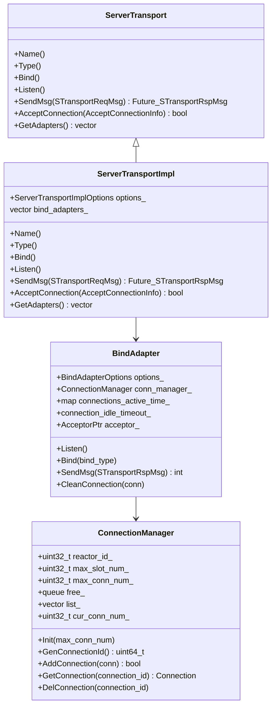

# Xrpc Server Transport

<!-- TOC -->

- [Xrpc Server Transport](#xrpc-server-transport)
    - [Overview](#overview)
    - [Quick Start](#quick-start)
    - [UML Class Diagram](#uml-class-diagram)
    - [Sequence Diagram](#sequence-diagram)
    - [Server Transport](#server-transport)
        - [ServerTransport Initial](#servertransport-initial)
    - [BindAdapter](#bindadapter)
    - [ConnectionManager](#connectionmanager)
    - [Options](#options)

<!-- /TOC -->

## Overview

## Quick Start

## UML Class Diagram

## Sequence Diagram

## Server Transport

### ServerTransport Initial

## BindAdapter

## ConnectionManager

## Options
