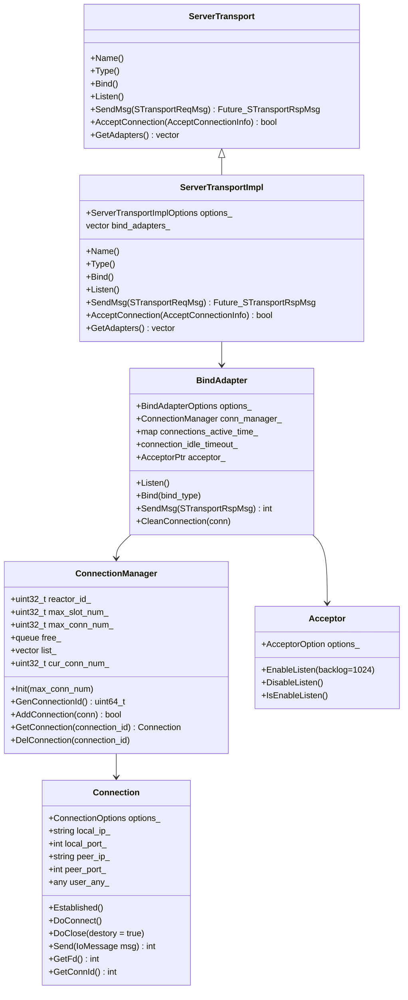

# Xrpc Server Transport

<!-- TOC -->

- [Xrpc Server Transport](#xrpc-server-transport)
    - [Overview](#overview)
    - [Quick Start](#quick-start)
    - [UML Class Diagram](#uml-class-diagram)
    - [Sequence Diagram](#sequence-diagram)
    - [ServerTransport](#servertransport)
        - [ServerTransport Bind](#servertransport-bind)
        - [ServerTransport Listen](#servertransport-listen)
        - [ServerTransport Accept](#servertransport-accept)
        - [ServerTransport Send](#servertransport-send)
        - [ServerTransport Initial](#servertransport-initial)
    - [BindAdapter](#bindadapter)
        - [BindAdapter Init](#bindadapter-init)
        - [BindAdapter Bind](#bindadapter-bind)
        - [BindAdapter Listen](#bindadapter-listen)
        - [BindAdapter Connection Closed And Clean](#bindadapter-connection-closed-and-clean)
        - [BindAdapter RemoveIdleConnection](#bindadapter-removeidleconnection)
        - [BindAdapter Send](#bindadapter-send)
    - [DefaultConnectionHandler](#defaultconnectionhandler)
    - [ConnectionManager](#connectionmanager)
    - [Options](#options)
        - [BindInfo](#bindinfo)
        - [BindAdapter::Options](#bindadapteroptions)

<!-- /TOC -->

## Overview

Server Transport 封装了 Network Model 的接口，尤其是 TcpAcceptor，以提供稳定可靠 Server。用户可以使用 Server Transport 自定义一个 Server。

Server Transport 的主要职责是：

- 封装了对于 Server IP 和 Port 监听的接口。
- 提供了简单的方式自定义了相关事件回调。
- 提供了多个线程监使用相同监听端口的能力。
- 提供了对客户端进行回包的能力。

## Quick Start

我们通过构造使用 Server Transport 构造一个 TCP Echo Server 来简述 Server Transport 的接口和基本理念。

```cpp
void Test() {
  xrpc::ServerTransportImpl::Options server_transport_options;
  server_transport_options.thread_model_ = xrpc::ThreadModelManager::GetInstance()->GetDefaultThreadModel();
  xrpc::ServerTransportImpl server_transport(server_transport_options);

  // 构造 BindInfo
  xrpc::BindInfo info;
  info.is_ipv6 = false;
  info.socket_type = "net";
  info.ip = "0.0.0.0";
  info.port = 8899;
  info.network = "tcp";

  // 触发 Accept 回调，返回值决定了使用哪个 IO 线程的 Reactor 处理连接事件
  info.accept_function = [](const xrpc::AcceptConnectionInfo &info) {
    std::cout << "Accept Event..." << std::endl;
    return 0;
  };

  // 检查 Connection 收到的数据是否为一个完整的包
  info.checker_function = [](const xrpc::ConnectionPtr& conn, xrpc::NoncontiguousBuffer& in,
                             std::deque<std::any>& out) {
    std::cout << "Checker Event..." << std::endl;
    out.push_back(in);
    in.Clear();
    return xrpc::PacketChecker::PACKET_FULL;
  };

  // 对所接收到数据的处理
  info.msg_handle_function = [&server_transport](const xrpc::ConnectionPtr& conn,
                                                 std::deque<std::any>& msg) {
    std::cout << "Msg Handle Event..." << std::endl;

    auto it = msg.begin();
    while (it != msg.end()) {
      auto& buff = std::any_cast<xrpc::NoncontiguousBuffer&>(*it);

      // 构造响应
      xrpc::STransportRspMsg* rsp = new xrpc::STransportRspMsg();
      rsp->basic_info = xrpc::object_pool::GetRefCounted<xrpc::BasicInfo>();
      rsp->basic_info->connection_id = conn->GetConnId();
      rsp->basic_info->addr.ip = conn->GetPeerIp();
      rsp->basic_info->addr.port = conn->GetPeerPort();
      rsp->send_data = buff;

      server_transport.SendMsg(rsp);
      ++it;
    }

    return true;
  };

  // Listen
  server_transport.Bind(info);
  server_transport.Listen();

  // sleep
  auto promise = xrpc::Promise<bool>();
  auto fut = promise.get_future();
  fut.Wait();
}

int main() {
  xrpc::XrpcConfig::GetInstance()->Init("test_transport_server.yaml");
  xrpc::XrpcPlugin::GetInstance()->InitThreadModel();
  Test();
  xrpc::XrpcPlugin::GetInstance()->DestroyThreadModel();
}
```

## UML Class Diagram



## Sequence Diagram

这里显示 Xrpc Server 如何监听并构造一个连接：


## ServerTransport

`ServerTransport` 的实现类是 `ServerTransportImpl`，该类的作用主要是：

- 提供监听接口
- 封装了向 Client 响应数据的接口
- 支持多线程进行监听
- 自动构造连接处理网络数据，通过 BindInfo 的相关回调对网络数据进行处理

### ServerTransport Bind

通过 [BindInfo](#bindinfo) 参数告诉 `ServerTransport` 监听的 IP 和端口，并且会在每个 IO 线程都构造 BindAdapter，以支持在多个 IO 线程进行监听（Socket 使用了 REUSEPORT 特性）：

```cpp
void ServerTransportImpl::Bind(const BindInfo& bind_info) {
  // 根据用户设置的监听线程个数, 绑定socket
  for (auto* io_thread : options_.thread_model_->GetWorkerThreads(WorkerThread::Role::IO)) {
    BindAdapter::Options bind_adapter_option;
    bind_adapter_option.thread_id = io_thread->Id();
    bind_adapter_option.thread_model = options_.thread_model_;
    bind_adapter_option.io_model = io_thread->GetIoModel();
    bind_adapter_option.bind_info = bind_info;
    bind_adapter_option.server_transport = this;

    auto* bind_adapter = new BindAdapter(bind_adapter_option);
    bind_adapter->Init();
    bind_adapters_.emplace_back(bind_adapter);
  }
}
```

### ServerTransport Listen

在 ServerTransport 通过 Bind 将监听信息绑定后，可以通过 `Listen()` 接口开启监听，这里只给出 TCP 监听的伪代码：

```cpp
void ServerTransportImpl::Listen() {
  const auto& bind_info = bind_adapters_[0]->GetOptions().bind_info;
  const std::string& socket_type = bind_info.socket_type;

  if (socket_type != "unix" && socket_type != "local" && network == "tcp") {
    ListenTcp(bind_info);
  }
}

void ServerTransportImpl::ListenTcp(const BindInfo& bind_info) {
  // 对于tcp, 根据用户的配置来设置监听线程数量
  uint32_t count = 0;
  uint32_t accept_num = std::min(uint32_t(bind_adapters_.size()), bind_info.accept_thread_num);
  for (auto* adapter : bind_adapters_) {
    adapter->Bind(xrpc::BindAdapter::BindType::Tcp);
    adapter->Listen();
    if (++count >= accept_num) {
      break;
    }
  }
}
```

### ServerTransport Accept

ServerTransport 提供了在连接 Accept 后进行处理的回调 `AcceptConnection`，ServerTransport 会利用这个回调进一步通知应用层，并且创建连接进行数据处理：

- 维护连接的线程并非一定是监听到 Accept 事件的线程

```cpp
bool ServerTransportImpl::AcceptConnection(const AcceptConnectionInfo& connection_info) {
  // 找到一个 bind_adapter 和对应的 reactor
  const auto& common_bind_info = bind_adapters_[0]->GetOptions().bind_info;
  int index = common_bind_info.accept_function
            ? common_bind_info.accept_function(connection_info
            : connection_info.socket.GetFd() % bind_adapters_.size();

  // 将连接交给任意一个 IO 线程维护连接
  auto* reactor = bind_adapters_[index]->GetOptions().io_model->GetReactor();
  reactor->SubmitTask([reactor, bind_adapter, connection_info] {
    uint64_t event_handler_id = reactor->GenEventHandlerId();
    uint64_t conn_id = bind_adapter->GetConnManager().GenConnectionId();
    if (event_handler_id == 0 || conn_id == 0) {
      close(connection_info.socket.GetFd());
      return;
    }

    const auto& bind_info = bind_adapter->GetOptions().bind_info;

    Connection::Options options;
    options.event_handler_id = event_handler_id;
    options.conn_id = conn_id;
    options.reactor = bind_adapter->GetOptions().io_model->GetReactor();
    options.socket = connection_info.socket;
    options.conn_info = connection_info.conn_info;
    options.max_packet_size = bind_info.max_packet_size;
    options.conn_handler = new DefaultConnectionHandler(bind_adapter);

    DefaultConnection::Options default_connection_options;
    default_connection_options.options.type = ConnectionType::TCP_LONG;
    default_connection_options.recv_buffer_size = bind_info.recv_buffer_size;
    default_connection_options.merge_send_data_size = bind_info.merge_send_data_size;

    options.io_handler =
        IoHandlerFactory::GetInstance()->Create(connection_info.socket.GetFd(), bind_info);

    default_connection_options.options = options;

    auto* conn = new TcpConnection(default_connection_options);
    bind_adapter->GetConnManager().AddConnection(conn);
    auto& connections_active_time = bind_adapter->GetConnectionActiveTime();
    connections_active_time[conn->GetConnId()] = xrpc::TimeProvider::GetNowMs();
    conn->Established();
  });

  return true;
}
```

### ServerTransport Send

ServerTransport 的 Send 用于向 Client 发送响应数据的，这里选择 Connection ID 所在 IO 线程的 BindAdapter 进行数据发送：

```cpp
void ServerTransportImpl::SendMsg(STransportRspMsg* msg) {
  assert(msg->basic_info);
  uint64_t connection_id = msg->basic_info->connection_id;
  int io_thread_index = (0x0000FFFF00000000 & connection_id) >> 32;
  bind_adapters_[io_thread_index]->SendMsg(msg);
}
```

### ServerTransport Initial

ServiceTransport 的初始化交给了 ServiceAdapter 完成。

Xrpc Server 支持同时存在多个 Service，每个 Service 有自己的监听端口，并且一个 ServiceAdapter 就代表了一个 Service，自然每个 ServiceAdapter 会拥有一个 ServiceTransport 进行监听以及接收数据并处理：

```cpp
int XrpcServer::Initialize() {
  // 初始化业务service
  InitializeServiceAdapter();

  // ... 心跳和统计配置
  return 0;
}

void XrpcServer::InitializeServiceAdapter() {
  // 根据框架配置中 server 配置中的 service 配置信息，初始化 service 的相关信息
  auto service_it = server_config_.services_config.begin();
  while (service_it != server_config_.services_config.end()) {
    ServiceAdapterOption option;
    option.service_name = (*service_it).service_name;
    option.socket_type = (*service_it).socket_type;
    option.network = (*service_it).network;
    option.ip = (*service_it).ip;
    option.is_ipv6 = (option.ip.find(':') != std::string::npos);
    option.port = (*service_it).port;
    option.unix_path = (*service_it).unix_path;
    option.protocol = (*service_it).protocol;
    option.queue_timeout = (*service_it).queue_timeout;
    option.idle_time = (*service_it).idle_time;
    option.timeout = (*service_it).timeout;
    option.disable_request_timeout = (*service_it).disable_request_timeout;
    option.max_conn_num = (*service_it).max_conn_num;
    option.max_packet_size =
        ((*service_it).max_packet_size > 0) ? (*service_it).max_packet_size : 10000000;
    option.recv_buffer_size =
        ((*service_it).recv_buffer_size > 0) ? (*service_it).recv_buffer_size : 8192;
    option.merge_send_data_size =
        ((*service_it).merge_send_data_size > 0) ? (*service_it).merge_send_data_size : 8192;
    option.transport_plugin_name = (*service_it).transport_plugin_name;
    option.threadmodel_type = (*service_it).threadmodel_type;
    option.threadmodel_instance_name = (*service_it).threadmodel_instance_name;
    option.accept_thread_num = (*service_it).accept_thread_num;
    // Set SSL/TLS config for server
    option.ssl_config = service_it->ssl_config;

    ServiceAdapterPtr service_adapter(new ServiceAdapter(option));
    service_adapters_[(*service_it).service_name] = service_adapter;
    ++service_it;
  }
}

// 注册 Service 的时候会去初始化 ServerTransport
void XrpcServer::RegistryService(const std::string &service_name, ServicePtr &service) {
  auto service_adapter_it = service_adapters_.find(service_name);
  if (service_adapter_it != service_adapters_.end()) {
    service_adapter_it->second->SetService(service);
    service->SetAdapter(service_adapter_it->second.get());
  }
}

void ServiceAdapter::SetService(const ServicePtr& service) {
  service_ = service;

  xrpc::BindInfo bind_info;
  bind_info.socket_type = option_.socket_type;
  bind_info.ip = option_.ip;
  bind_info.is_ipv6 = option_.is_ipv6;
  bind_info.port = option_.port;
  bind_info.network = option_.network;
  bind_info.unix_path = option_.unix_path;
  bind_info.protocol = option_.protocol;
  bind_info.idle_time = option_.idle_time;
  bind_info.max_conn_num = option_.max_conn_num;
  bind_info.max_packet_size = option_.max_packet_size;
  bind_info.recv_buffer_size = option_.recv_buffer_size;
  bind_info.merge_send_data_size = option_.merge_send_data_size;

  bind_info.accept_thread_num = option_.accept_thread_num;

  bind_info.accept_function = service_->GetAcceptConnectionFunction();
  bind_info.conn_establish_function = service_->GetConnectionEstablishFunction();
  bind_info.conn_close_function = service_->GetConnectionCloseFunction();
  bind_info.msg_writedone_function = service_->GetMessageWriteDoneFunction();
  bind_info.checker_function = service_->GetProtocalCheckerFunction();
  bind_info.msg_handle_function = service_->GetMessageHandleFunction();

  if (!bind_info.checker_function) {
    bind_info.checker_function = std::bind(&ServerCodec::ZeroCopyCheck, server_codec_.get(),
                                           std::placeholders::_1,
                                           std::placeholders::_2,
                                           std::placeholders::_3);
  }

  if (!bind_info.msg_handle_function) {
    bind_info.msg_handle_function = std::bind(&ServiceAdapter::HandleFiberMessage, this,
                                              std::placeholders::_1,
                                              std::placeholders::_2);
  }

  xrpc::ServerTransportImpl::Options options;
  options.thread_model_ = threadmodel_;
  transport_ = std::make_unique<ServerTransportImpl>(options);
  transport_->Bind(bind_info);
}
```

在初始化后，可以调用 Xrpc Server 的 Start 接口开始监听：

```cpp
void XrpcServer::Start() {
  for (const auto &iter : service_adapters_) {
    iter.second->Listen();
  }
}

void ServiceAdapter::Listen() {
  transport_->Listen();
}
```

## BindAdapter

BindAdapter 是为每个 Reactor IO 线程提供监听 Socket 实现的重要类：

BindAdapter 类似于 Xrpc Client 中的 TransportAdapter，一个 BindAdapter 服务与一个 IO 线程。

BindAdapter 和 IO 线程的关系映射维护在 [ServerTransport](#servertransport) 中，即 `bind_adapters_[i]` 表示第 i 个 IO 线程所使用的 BindAdapter。

### BindAdapter Init

在 ServerTransport 的 Bind 中进行初始化，并且进行配置的保存，创建连接池：

```cpp
BindAdapter::BindAdapter(const Options& options)
    : options_(options), conn_manager_(options_.io_model->GetReactor()->Id()) {}

void BindAdapter::Init() {
  connection_idle_timeout_ = options_.bind_info.idle_time;

  // conn_manager_初始化
  conn_manager_.Init(options_.bind_info.max_conn_num);

  // 注册空闲连接清理定时任务, 默认检查周期1s
  auto* reactor = options_.io_model->GetReactor();
  auto* adapter = this;
  Reactor::Task task = [reactor, adapter] {
    reactor->AddTimerAfter(0, 1000, [adapter]() { adapter->RemoveIdleConnection(); });
  };
  reactor->SubmitTask(std::move(task));
}
```

### BindAdapter Bind

BindAdapter Bind 主要是生成 Acceptor 的配置 Options，其还未开始监听。

```cpp
void BindAdapter::Bind(BindType bind_type) {
  if (bind_type == BindType::Tcp) {
    BindTcp();
    return;
  }

  // ...
}

void BindAdapter::BindTcp() {
  NetworkAddress addr(
      options_.bind_info.ip, options_.bind_info.port,
      options_.bind_info.is_ipv6 ? NetworkAddress::IpType::ipv6 : NetworkAddress::IpType::ipv4);

  Acceptor::Options options;
  options.event_handler_id = options_.io_model->GetReactor()->GenEventHandlerId();
  options.reactor = options_.io_model->GetReactor();
  options.tcp_addr = addr;
  options.accept_handler = [this](const AcceptConnectionInfo& connection_info) {
    return this->options_.server_transport->AcceptConnection(connection_info);
  };
  acceptor_ = std::make_shared<TcpAcceptor>(options);
}
```

### BindAdapter Listen

通过提交 Task 的形式来打开监听。

```cpp
void BindAdapter::Listen() {
  if (acceptor_ != nullptr) {
    Reactor::Task task = [this] { acceptor_->EnableListen(); };
    options_.io_model->GetReactor()->SubmitTask(std::move(task));
  }
}
```

### BindAdapter Connection Closed And Clean

BindAdapter 会自动创建连接，并且通过其 DelConnection 和 CleanConnection 来感知到连接到关闭，并进行相关资源的回收：

```cpp
void BindAdapter::DelConnection(ConnectionPtr conn) {
  auto* reactor = options_.io_model->GetReactor();
  if (!reactor) {
    return;
  }

  // 检测到关闭后，同时发起连接的关闭，避免仅一方关闭
  conn->DoClose(true);
}

void BindAdapter::CleanConnection(ConnectionPtr conn) {
  auto* reactor = options_.io_model->GetReactor();
  if (!reactor) {
    return;
  }

  // 向连接池回收连接，清理连接资源
  conn_manager_.DelConnection(conn->GetConnId());
  connections_active_time_.erase(conn->GetConnId());
  reactor->SubmitTask([conn] { delete conn; });
}
```

### BindAdapter RemoveIdleConnection

BindAdapter  RemoveIdleConnection 可以对不活跃的连接进行关闭：

```cpp
void BindAdapter::RemoveIdleConnection() {
  if (connection_idle_timeout_ == 0) {
    return;
  }

  uint64_t now = TimeProvider::GetNowMs();
  std::vector<uint64_t> remove_connections;
  for (auto& it : connections_active_time_) {
    auto connection_id = it.first;
    auto active_time = it.second;
    if (now > active_time && now - active_time >= connection_idle_timeout_) {
      remove_connections.push_back(connection_id);
    }
  }

  if (remove_connections.empty()) {
    return;
  }

  for (uint64_t connection_id : remove_connections) {
    ConnectionPtr conn = conn_manager_.GetConnection(connection_id);
    if (conn) {
      DelConnection(conn);
    }
  }
}
```

### BindAdapter Send

BindAdapter 可以根据 SeqMsg 的 connection_id 得到连接 ID，并使用该连接 ID 发送数据，需要注意的是，这是用来发送响应：

```cpp
int BindAdapter::SendMsg(STransportRspMsg* msg) {
  Task* task = new Task;
  task->task_type = TaskType::TRANSPORT_RESPONSE;
  task->dst_thread_key = options_.thread_id;
  task->task = msg;
  task->handler = [this](Task* task) {
    auto* msg = static_cast<STransportRspMsg*>(task->task);
    IoMessage message;
    message.ip = msg->basic_info->addr.ip;
    message.port = msg->basic_info->addr.port;
    message.buffer = std::move(msg->send_data);

    Connection* conn = conn_manager_.GetConnection(msg->basic_info->connection_id);
    conn->Send(std::move(message));
  };

  task->group_id = options_.thread_model->GetThreadModelId();
  TaskResult result = options_.thread_model->SubmitIoTask(task);
  return 0;
}
```

## DefaultConnectionHandler

ServerTransport 在创建一个连接后，会设置连接的事件回调 Handler 为 `DefaultConnectionHandler`，其提供实现主要是实现了：

- 处理连接关闭事件的清理工作
- 处理连接保活事件
- 除了上述两个事件外，其他事件都会进一步回调 `BindInfo` 中的函数

```cpp
class DefaultConnectionHandler : public ConnectionHandler {
 public:
  explicit DefaultConnectionHandler(BindAdapter* bind_adapter) : bind_adapter_(bind_adapter) {}
  ~DefaultConnectionHandler() {}

  // 连接相关的资源清理接口
  void ConnectionClean(const ConnectionPtr& conn) override { bind_adapter_->CleanConnection(conn); }

  // 连接保活的时间更新接口
  void ConnectionTimeUpdate(const ConnectionPtr& conn) override {
    auto& connections_active_time = bind_adapter_->GetConnectionActiveTime();
    connections_active_time[conn->GetConnId()] = xrpc::TimeProvider::GetNowMs();
  }

  // 消息协议的完整性检测接口
  int MessageCheck(const ConnectionPtr& conn, NoncontiguousBuffer& in,
                   std::deque<std::any>& out) override {
    return bind_adapter_->GetOptions().bind_info.checker_function(conn, in, out);
  }

  // 消息协议处理接口
  bool MessageHandle(const ConnectionPtr& conn, std::deque<std::any>& msg) override {
    return bind_adapter_->GetOptions().bind_info.msg_handle_function(conn, msg);
  }

  // 连接建立成功后的处理接口
  void ConnectionEstablished(const ConnectionPtr& conn) override {
    bind_adapter_->GetOptions().bind_info.conn_establish_function(conn);
  }

  // 连接关闭后的处理接口
  void ConnectionClosed(const ConnectionPtr& conn) override {
    bind_adapter_->GetOptions().bind_info.conn_close_function(conn);
  }

  void MessageWriteDone(uint32_t seq_id) override {
    // 目前ConnectionPtr参数暂不可用，传参为nullptr；IoMessage参数只有seq_id可用
    IoMessage message;
    message.ip = seq_id;
    bind_adapter_->GetOptions().bind_info.msg_writedone_function(nullptr, std::move(message));
  }

 private:
  BindAdapter* bind_adapter_;
};
```

## ConnectionManager

ConnectionManager 是一个连接池，用于管理 BindAdapter 接收到的连接。

BindAdapter 接收到一个连接时，需要通过 GenConnectionId 赋予该连接一个 Connection ID：

```cpp
uint64_t ConnectionManager::GenConnectionId() {
  // 管理连接数超过限制（用户定义），返回失败
  if (cur_conn_num_ >= max_conn_num_) {
    return 0;
  }

  // 管理连接数超过最大限制（系统定义，写死的），返回失败
  if (free_.empty()) {
    return 0;
  }

  uint64_t uid = free_.front();
  free_.pop();
  return magic_ | uid;
}
```

当 BindAdapter 添加一个连接后，需要通过 AddConnection 接口告知 ConnectionManager：

```cpp
bool ConnectionManager::AddConnection(Connection* conn) {
  auto connection_id = conn->GetConnId();
  auto uid = 0x00000000FFFFFFFF & connection_id;

  if (list_[uid] != nullptr) {
    return false;
  }

  list_[uid] = conn;

  ++cur_conn_num_;
  return true;
}
```

当一个连接关闭的时候，需要将其从 ConnectionManager 中剔除，通过 `DelConnection` 接口完成：

```cpp
void ConnectionManager::DelConnection(uint64_t connection_id) {
  auto uid = 0x00000000FFFFFFFF & connection_id;
  list_[uid] = nullptr;
  free_.push(uid);
  --cur_conn_num_;
}
```

## Options

配置项

### BindInfo

BindInfo 对于 Xrpc Server 而言是非常重要的类，它告诉了 Xrpc Server：

- 监听的 ip 和端口
- server 的相关配置，如超时事件，缓存大小等
- 提供了 Acceptor 接收连接的回调，以及各种 Connection 的事件回调

```cpp
struct BindInfo {
  // socket_type 决定是否使用 Unix Socket
  std::string socket_type;

  // 监听的 ip 和端口
  std::string ip;
  bool is_ipv6;
  int port;

  // network 决定使用 TCP 或是 UDP
  std::string network;
  std::string unix_path;
  std::string protocol;
  uint32_t max_packet_size = 10000000;
  uint32_t recv_buffer_size = 8192;
  uint32_t max_conn_num = 10000;
  uint32_t idle_time = 60000;
  uint32_t merge_send_data_size = 1024;

  // 用于监听的线程个数
  uint32_t accept_thread_num = 1;

  // user defined callbacks
  AcceptConnectionFunction accept_function = nullptr;

  // 连接建立的回调
  ConnectionEstablishFunction conn_establish_function = nullptr;

  // 连接关闭的回调
  ConnectionCloseFunction conn_close_function = nullptr;

  // 检查消息是否完整的回调，处理沾包拆包
  ProtocalCheckerFunction checker_function = nullptr;

  // 接收到的应用层数据进行处理的回调
  MessageHandleFunction msg_handle_function = nullptr;

  // 数据发送完成后的回调
  MessageWriteDoneFunction msg_writedone_function = nullptr;
};
```

### BindAdapter::Options

```cpp
class BindAdapter {
 public:
  struct Options {
    uint16_t thread_id;
    ThreadModel* thread_model;
    IoModel* io_model;
    BindInfo bind_info;
    ServerTransportImpl* server_transport;
  };
};
```
