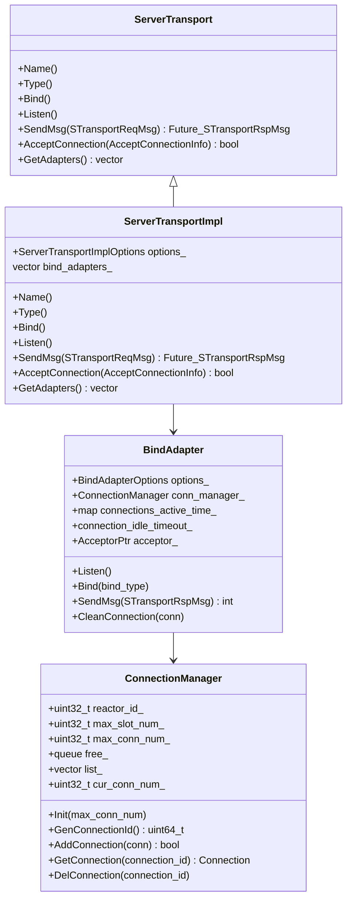

# Xrpc Server Transport

<!-- TOC -->

- [Xrpc Server Transport](#xrpc-server-transport)
    - [Overview](#overview)
    - [Quick Start](#quick-start)
    - [UML Class Diagram](#uml-class-diagram)
    - [Sequence Diagram](#sequence-diagram)
    - [ServerTransport](#servertransport)
        - [ServerTransport Bind](#servertransport-bind)
        - [ServerTransport Listen](#servertransport-listen)
        - [ServerTransport Accept](#servertransport-accept)
        - [ServerTransport Send](#servertransport-send)
        - [ServerTransport Initial](#servertransport-initial)
    - [BindAdapter](#bindadapter)
        - [BindAdapter Init](#bindadapter-init)
        - [BindAdapter Bind](#bindadapter-bind)
        - [BindAdapter Listen](#bindadapter-listen)
        - [BindAdapter Connection Closed And Clean](#bindadapter-connection-closed-and-clean)
        - [BindAdapter RemoveIdleConnection](#bindadapter-removeidleconnection)
        - [BindAdapter Send](#bindadapter-send)
    - [ConnectionManager](#connectionmanager)
    - [Options](#options)
        - [BindInfo](#bindinfo)

<!-- /TOC -->

## Overview

## Quick Start

## UML Class Diagram



## Sequence Diagram

## ServerTransport

`ServerTransport` 的实现类是 `ServerTransportImpl`，该类的作用主要是：

- 封装了便于使用的监听接口
- 封装了数据发送接口
- 支持多线程进行监听
- 自动构造连接处理网络数据，通过 BindInfo 的相关回调对网络数据进行处理

### ServerTransport Bind

通过 [BindInfo](#bindinfo) 参数告诉 `ServerTransport` 监听的 IP 和端口，并且会在每个 IO 线程都构造 BindAdapter，以支持在多个 IO 线程进行监听（Socket 使用了 REUSEPORT 特性）：

```cpp
void ServerTransportImpl::Bind(const BindInfo& bind_info) {
  // 根据用户设置的监听线程个数, 绑定socket
  for (auto* io_thread : options_.thread_model_->GetWorkerThreads(WorkerThread::Role::IO)) {
    BindAdapter::Options bind_adapter_option;
    bind_adapter_option.thread_id = io_thread->Id();
    bind_adapter_option.thread_model = options_.thread_model_;
    bind_adapter_option.io_model = io_thread->GetIoModel();
    bind_adapter_option.bind_info = bind_info;
    bind_adapter_option.server_transport = this;

    auto* bind_adapter = new BindAdapter(bind_adapter_option);
    bind_adapter->Init();
    bind_adapters_.emplace_back(bind_adapter);
  }
}
```

### ServerTransport Listen

在 ServerTransport 通过 Bind 将监听信息绑定后，可以通过 `Listen()` 接口开启监听，这里只给出 TCP 监听的伪代码：

```cpp
void ServerTransportImpl::Listen() {
  const auto& bind_info = bind_adapters_[0]->GetOptions().bind_info;
  const std::string& socket_type = bind_info.socket_type;

  if (socket_type != "unix" && socket_type != "local" && network == "tcp") {
    ListenTcp(bind_info);
  }
}

void ServerTransportImpl::ListenTcp(const BindInfo& bind_info) {
  // 对于tcp, 根据用户的配置来设置监听线程数量
  uint32_t count = 0;
  uint32_t accept_num = std::min(uint32_t(bind_adapters_.size()), bind_info.accept_thread_num);
  for (auto* adapter : bind_adapters_) {
    adapter->Bind(xrpc::BindAdapter::BindType::Tcp);
    adapter->Listen();
    if (++count >= accept_num) {
      break;
    }
  }
}
```

### ServerTransport Accept

ServerTransport 提供了在连接 Accept 后进行处理的回调 `AcceptConnection`，ServerTransport 会利用这个回调进一步通知应用层，并且创建连接进行数据处理：

- 维护连接的线程并非一定是监听到 Accept 事件的线程

```cpp
bool ServerTransportImpl::AcceptConnection(const AcceptConnectionInfo& connection_info) {
  // 找到一个 bind_adapter 和对应的 reactor
  const auto& common_bind_info = bind_adapters_[0]->GetOptions().bind_info;
  int index = common_bind_info.accept_function
            ? common_bind_info.accept_function(connection_info
            : connection_info.socket.GetFd() % bind_adapters_.size();

  // 将连接交给任意一个 IO 线程维护连接
  auto* reactor = bind_adapters_[index]->GetOptions().io_model->GetReactor();
  reactor->SubmitTask([reactor, bind_adapter, connection_info] {
    uint64_t event_handler_id = reactor->GenEventHandlerId();
    uint64_t conn_id = bind_adapter->GetConnManager().GenConnectionId();
    if (event_handler_id == 0 || conn_id == 0) {
      close(connection_info.socket.GetFd());
      return;
    }

    const auto& bind_info = bind_adapter->GetOptions().bind_info;

    Connection::Options options;
    options.event_handler_id = event_handler_id;
    options.conn_id = conn_id;
    options.reactor = bind_adapter->GetOptions().io_model->GetReactor();
    options.socket = connection_info.socket;
    options.conn_info = connection_info.conn_info;
    options.max_packet_size = bind_info.max_packet_size;
    options.conn_handler = new DefaultConnectionHandler(bind_adapter);

    DefaultConnection::Options default_connection_options;
    default_connection_options.options.type = ConnectionType::TCP_LONG;
    default_connection_options.recv_buffer_size = bind_info.recv_buffer_size;
    default_connection_options.merge_send_data_size = bind_info.merge_send_data_size;

    options.io_handler =
        IoHandlerFactory::GetInstance()->Create(connection_info.socket.GetFd(), bind_info);

    default_connection_options.options = options;

    auto* conn = new TcpConnection(default_connection_options);
    bind_adapter->GetConnManager().AddConnection(conn);
    auto& connections_active_time = bind_adapter->GetConnectionActiveTime();
    connections_active_time[conn->GetConnId()] = xrpc::TimeProvider::GetNowMs();
    conn->Established();
  });

  return true;
}
```

### ServerTransport Send

ServerTransport 的 Send 会将数据的发送交给 BindAdapter 类负责，本质上是在随机 IO 线程上使用连接 ID 的连接发数据。

```cpp
void ServerTransportImpl::SendMsg(STransportRspMsg* msg) {
  assert(msg->basic_info);
  uint64_t connection_id = msg->basic_info->connection_id;
  int io_thread_index = (0x0000FFFF00000000 & connection_id) >> 32;
  bind_adapters_[io_thread_index]->SendMsg(msg);
}
```

### ServerTransport Initial

## BindAdapter

BindAdapter 是为每个 Reactor IO 线程提供监听 Socket 实现的重要类：

BindAdapter 类似于 Xrpc Client 中的 TransportAdapter，一个 BindAdapter 服务与一个 IO 线程。

BindAdapter 和 IO 线程的关系映射维护在 [ServerTransport](#servertransport) 中，即 `bind_adapters_[i]` 表示第 i 个 IO 线程所使用的 BindAdapter。

### BindAdapter Init

在 ServerTransport 的 Bind 中进行初始化，并且进行配置的保存，创建连接池：

```cpp
BindAdapter::BindAdapter(const Options& options)
    : options_(options), conn_manager_(options_.io_model->GetReactor()->Id()) {}

void BindAdapter::Init() {
  connection_idle_timeout_ = options_.bind_info.idle_time;

  // conn_manager_初始化
  conn_manager_.Init(options_.bind_info.max_conn_num);

  // 注册空闲连接清理定时任务, 默认检查周期1s
  auto* reactor = options_.io_model->GetReactor();
  auto* adapter = this;
  Reactor::Task task = [reactor, adapter] {
    reactor->AddTimerAfter(0, 1000, [adapter]() { adapter->RemoveIdleConnection(); });
  };
  reactor->SubmitTask(std::move(task));
}
```

### BindAdapter Bind

BindAdapter Bind 主要是生成 Acceptor 的配置 Options，其还未开始监听。

```cpp
void BindAdapter::Bind(BindType bind_type) {
  if (bind_type == BindType::Tcp) {
    BindTcp();
    return;
  }

  // ...
}

void BindAdapter::BindTcp() {
  NetworkAddress addr(
      options_.bind_info.ip, options_.bind_info.port,
      options_.bind_info.is_ipv6 ? NetworkAddress::IpType::ipv6 : NetworkAddress::IpType::ipv4);

  Acceptor::Options options;
  options.event_handler_id = options_.io_model->GetReactor()->GenEventHandlerId();
  options.reactor = options_.io_model->GetReactor();
  options.tcp_addr = addr;
  options.accept_handler = [this](const AcceptConnectionInfo& connection_info) {
    return this->options_.server_transport->AcceptConnection(connection_info);
  };
  acceptor_ = std::make_shared<TcpAcceptor>(options);
}
```

### BindAdapter Listen

通过提交 Task 的形式来打开监听。

```cpp
void BindAdapter::Listen() {
  if (acceptor_ != nullptr) {
    Reactor::Task task = [this] { acceptor_->EnableListen(); };
    options_.io_model->GetReactor()->SubmitTask(std::move(task));
  }
}
```

### BindAdapter Connection Closed And Clean

BindAdapter 会自动创建连接，并且通过其 DelConnection 和 CleanConnection 来感知到连接到关闭，并进行相关资源的回收：

```cpp
void BindAdapter::DelConnection(ConnectionPtr conn) {
  auto* reactor = options_.io_model->GetReactor();
  if (!reactor) {
    return;
  }

  // 检测到关闭后，同时发起连接的关闭，避免仅一方关闭
  conn->DoClose(true);
}

void BindAdapter::CleanConnection(ConnectionPtr conn) {
  auto* reactor = options_.io_model->GetReactor();
  if (!reactor) {
    return;
  }

  // 向连接池回收连接，清理连接资源
  conn_manager_.DelConnection(conn->GetConnId());
  connections_active_time_.erase(conn->GetConnId());
  reactor->SubmitTask([conn] { delete conn; });
}
```

### BindAdapter RemoveIdleConnection

BindAdapter  RemoveIdleConnection 可以对不活跃的连接进行关闭：

```cpp
void BindAdapter::RemoveIdleConnection() {
  if (connection_idle_timeout_ == 0) {
    return;
  }

  uint64_t now = TimeProvider::GetNowMs();
  std::vector<uint64_t> remove_connections;
  for (auto& it : connections_active_time_) {
    auto connection_id = it.first;
    auto active_time = it.second;
    if (now > active_time && now - active_time >= connection_idle_timeout_) {
      remove_connections.push_back(connection_id);
    }
  }

  if (remove_connections.empty()) {
    return;
  }

  for (uint64_t connection_id : remove_connections) {
    ConnectionPtr conn = conn_manager_.GetConnection(connection_id);
    if (conn) {
      DelConnection(conn);
    }
  }
}
```

### BindAdapter Send

BindAdapter 可以根据 SeqMsg 的 connection_id 得到连接 ID，并使用该连接 ID 发起sing求：

```cpp
int BindAdapter::SendMsg(STransportRspMsg* msg) {
  Task* task = new Task;
  task->task_type = TaskType::TRANSPORT_RESPONSE;
  task->dst_thread_key = options_.thread_id;
  task->task = msg;

  task->handler = [this](Task* task) {
    auto* msg = static_cast<STransportRspMsg*>(task->task);
    Connection* conn = conn_manager_.GetConnection(msg->basic_info->connection_id);
    if (conn) {
      IoMessage message;
      message.ip = msg->basic_info->addr.ip;
      message.port = msg->basic_info->addr.port;
      message.buffer = std::move(msg->send_data);

      conn->Send(std::move(message));
    }

    delete msg;
    msg = nullptr;
  };
  task->group_id = options_.thread_model->GetThreadModelId();
  TaskResult result = options_.thread_model->SubmitIoTask(task);
  if (result.ret == TaskRetCode::QUEUE_FULL) {
    delete msg;
    msg = nullptr;
    return -1;
  }

  return 0;
}
```

## ConnectionManager

## Options

### BindInfo

BindInfo 对于 Xrpc Server 而言是非常重要的类，它告诉了 Xrpc Server：

- 监听的 ip 和端口
- server 的相关配置，如超时事件，缓存大小等
- 提供了 Acceptor 接收连接的回调，以及各种 Connection 的事件回调

```cpp
struct BindInfo {
  // socket_type 决定是否使用 Unix Socket
  std::string socket_type;

  // 监听的 ip 和端口
  std::string ip;
  bool is_ipv6;
  int port;

  // network 决定使用 TCP 或是 UDP
  std::string network;
  std::string unix_path;
  std::string protocol;
  uint32_t max_packet_size = 10000000;
  uint32_t recv_buffer_size = 8192;
  uint32_t max_conn_num = 10000;
  uint32_t idle_time = 60000;
  uint32_t merge_send_data_size = 1024;

  // 用于监听的线程个数
  uint32_t accept_thread_num = 1;

  // user defined callbacks
  AcceptConnectionFunction accept_function = nullptr;

  // 连接建立的回调
  ConnectionEstablishFunction conn_establish_function = nullptr;

  // 连接关闭的回调
  ConnectionCloseFunction conn_close_function = nullptr;

  // 检查消息是否完整的回调，处理沾包拆包
  ProtocalCheckerFunction checker_function = nullptr;

  // 接收到的应用层数据进行处理的回调
  MessageHandleFunction msg_handle_function = nullptr;

  // 数据发送完成后的回调
  MessageWriteDoneFunction msg_writedone_function = nullptr;
};
```
